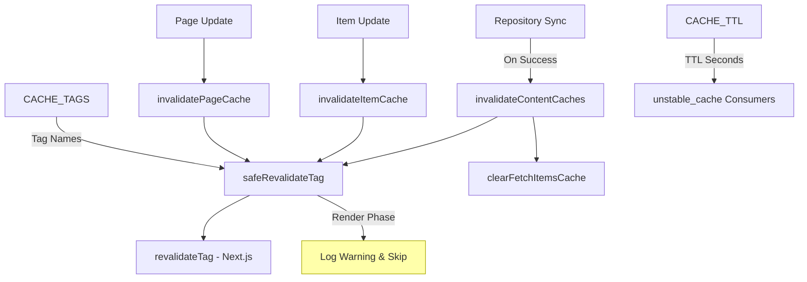
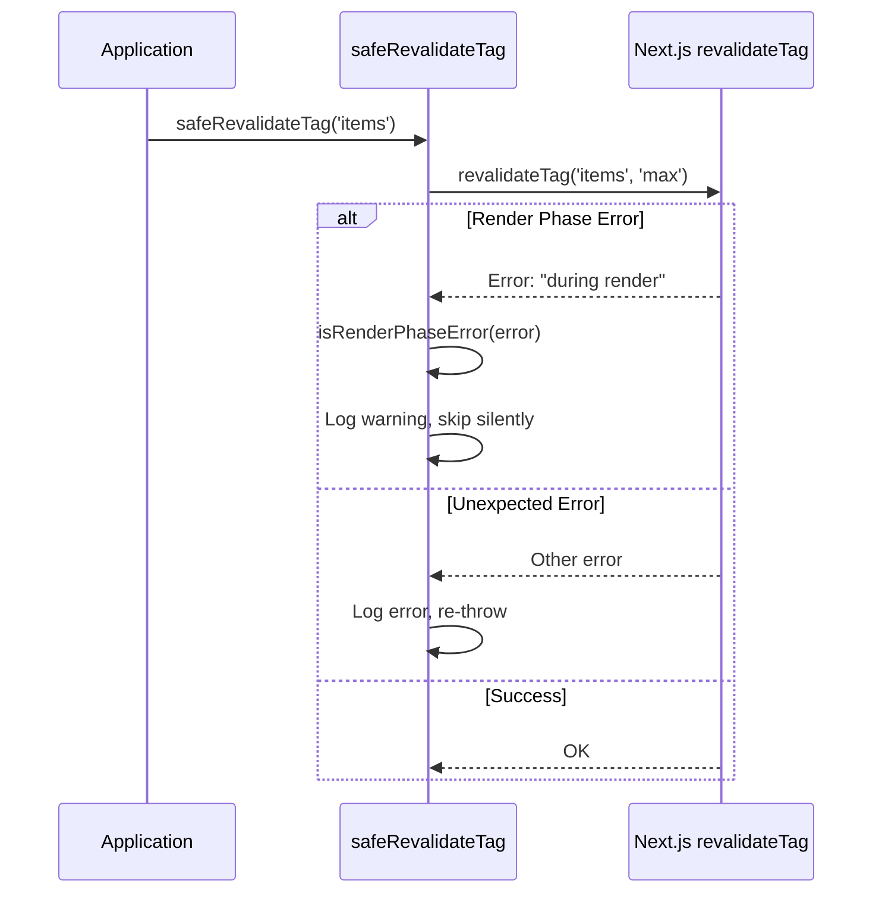
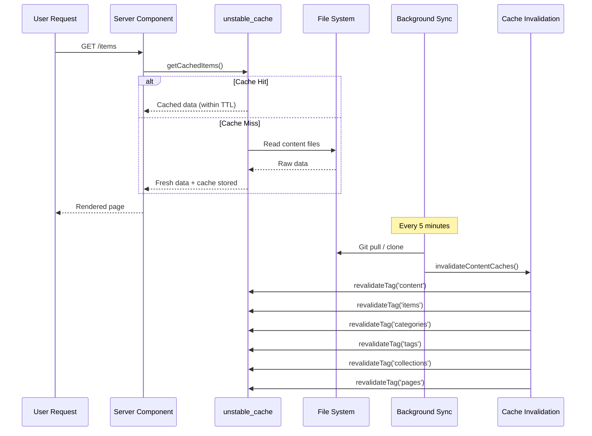

# Модуль аннулирования кэша

Модуль аннулирования кэша (`template/lib/cache-config.ts` и `template/lib/cache-invalidation.ts`) предоставляет централизованную систему тегов кэша и функции аннулирования для Next.js `unstable_cache` и `revalidateTag`. Это гарантирует, что кэши контента будут правильно признаны недействительными после синхронизации репозитория, одновременно корректно обрабатывая ограничения на этапе рендеринга Next.js.

## Обзор архитектуры



## Исходные файлы

|Файл|Описание|
|------|-------------|
|`lib/cache-config.ts`|Кэшируйте константы TTL и определения тегов.|
|`lib/cache-invalidation.ts`|Функции аннулирования с безопасностью на этапе рендеринга|

## Конфигурация TTL кэша

Все значения TTL указаны в **секундах** и используются с Next.js `unstable_cache`:

```typescript
const CACHE_TTL = {
  CONTENT: 600,   // 10 minutes -- content listings
  ITEM: 600,      // 10 minutes -- individual items
  CONFIG: 600,    // 10 minutes -- site configuration
  PAGES: 600,     // 10 minutes -- static pages
} as const;
```

### Использование с `unstable_cache`

```typescript
import { unstable_cache } from 'next/cache';
import { CACHE_TTL, CACHE_TAGS } from '@/lib/cache-config';

const getCachedItems = unstable_cache(
  async () => fetchAllItems(),
  ['items-list'],
  {
    revalidate: CACHE_TTL.CONTENT,
    tags: [CACHE_TAGS.CONTENT, CACHE_TAGS.ITEMS],
  }
);
```

## Теги кэша

Теги используются с `revalidateTag()` для выборочной аннулирования кешей.

### Статические теги

|Константа тега|Значение|Описание|
|-------------|-------|-------------|
|`CACHE_TAGS.CONTENT`|`'content'`|Главный тег – делает недействительными все кэши контента.|
|`CACHE_TAGS.ITEMS`|`'items'`|Коллекция всех предметов|
|`CACHE_TAGS.CATEGORIES`|`'categories'`|Все категории|
|`CACHE_TAGS.TAGS`|`'tags'`|Все теги|
|`CACHE_TAGS.COLLECTIONS`|`'collections'`|Все коллекции|
|`CACHE_TAGS.CONFIG`|`'config'`|Конфигурация сайта|
|`CACHE_TAGS.PAGES`|`'pages'`|Все статические страницы|

### Динамические теги (функции)

|Функция тега|Пример вывода|Описание|
|-------------|---------------|-------------|
|`CACHE_TAGS.ITEM(slug)`|`'item:my-tool'`|Конкретный элемент по пулю|
|`CACHE_TAGS.PAGE(slug)`|`'page:about'`|Конкретная страница по слагу|
|`CACHE_TAGS.ITEMS_LOCALE(locale)`|`'items:en'`|Элементы, отфильтрованные по локали|
|`CACHE_TAGS.CATEGORIES_LOCALE(locale)`|`'categories:fr'`|Категории по локали|
|`CACHE_TAGS.TAGS_LOCALE(locale)`|`'tags:de'`|Теги по локали|
|`CACHE_TAGS.COLLECTIONS_LOCALE(locale)`|`'collections:es'`|Коллекции по локали|

### Пример: кэширование с учетом локали

```typescript
import { CACHE_TAGS, CACHE_TTL } from '@/lib/cache-config';

const getCachedItemsByLocale = unstable_cache(
  async (locale: string) => fetchItemsByLocale(locale),
  ['items-by-locale'],
  {
    revalidate: CACHE_TTL.CONTENT,
    tags: [CACHE_TAGS.ITEMS, CACHE_TAGS.ITEMS_LOCALE('en')],
  }
);
```

## Функции аннулирования

### `invalidateContentCaches(): Promise<void>`

Делает недействительными **все** кеши, связанные с содержимым. Вызывается после успешного завершения синхронизации репозитория.

```typescript
import { invalidateContentCaches } from '@/lib/cache-invalidation';

// After successful repository sync
await performSync();
await invalidateContentCaches();
```

**Делает недействительными эти теги:**
- `CONTENT`, `ITEMS`, `CATEGORIES`, `TAGS`, `COLLECTIONS`, `PAGES`
- Также очищает кэш `fetchItems` в памяти через `clearFetchItemsCache()`

### `invalidateItemCache(slug: string): Promise<void>`

Делает недействительным кэш для одного элемента.

```typescript
import { invalidateItemCache } from '@/lib/cache-invalidation';

await invalidateItemCache('my-saas-tool');
// Revalidates tag: 'item:my-saas-tool'
```

### `invalidatePageCache(slug: string): Promise<void>`

Делает недействительным кеш для одной статической страницы.

```typescript
import { invalidatePageCache } from '@/lib/cache-invalidation';

await invalidatePageCache('about');
// Revalidates tag: 'page:about'
```

## Безопасность на этапе рендеринга

Next.js не допускает `revalidateTag()` на этапе рендеринга серверных компонентов. Модуль обрабатывает это с помощью оболочки `safeRevalidateTag`.

### Как это работает



### Шаблоны обнаружения ошибок

Функция `isRenderPhaseError` проверяет несколько шаблонов на устойчивость к изменениям сообщений об ошибках Next.js:

- `"during render"` -- Текущее сообщение Next.js
- `"render phase"` -- Альтернативная формулировка
- `"revalidate"` + `"render"` -- присутствуют оба ключевых слова.
- `"unsupported"` + `"render"` -- Проверка комбинации

## Блок-схема кэша


