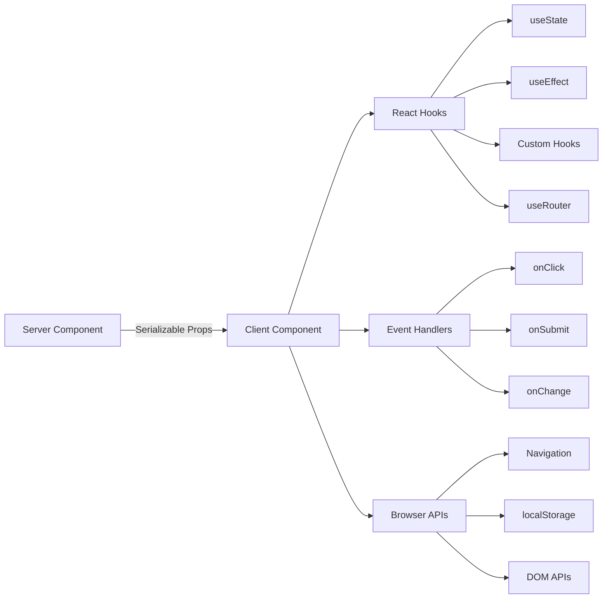

# Шаблоны клиентских компонентов

## Обзор

Клиентские компоненты в шаблоне Ever Works — это интерактивные «острова», которые обрабатывают пользовательские события, управляют локальным состоянием и интегрируются с API-интерфейсами браузера. Они идентифицируются директивой `"use client"` в верхней части файла и используются выборочно там, где требуется интерактивность.

## Архитектура



## Исходные файлы

|Файл|Узор|
|------|---------|
|`template/app/[locale]/admin/page.tsx`|Минимальная оболочка клиента, делегирующая компоненту|
|`template/app/not-found.tsx`|Навигация по клиенту с помощью `useRouter`|
|`template/app/global-error.tsx`|Граница ошибки с функцией сброса|
|`template/components/filters/filter-url-parser.tsx`|Управление состоянием URL-адресов|
|`template/components/header/more-menu.tsx`|Интерактивные выпадающие меню|

## Основные шаблоны

### Шаблон 1: Минимальные клиентские оболочки

Многие компоненты страницы используют максимально тонкую клиентскую оболочку:

```typescript
"use client";

import { AdminDashboard } from "@/components/admin";

export default function AdminPage() {
    return <AdminDashboard />;
}
```

Этот шаблон сохраняет размер файла подкачки, делегируя всю логику отдельному компоненту. Директива `"use client"` отмечает границу, где дерево серверных компонентов переходит к клиентскому рендерингу.

### Схема 2: Компоненты границы ошибки

Глобальный обработчик ошибок демонстрирует шаблон границы ошибки:

```typescript
'use client';

export default function GlobalError({
    error,
    reset,
}: {
    error: Error & { digest?: string };
    reset: () => void;
}) {
    useEffect(() => {
        console.error(error);
    }, [error]);

    return (
        <html lang="en">
            <body>
                <div>
                    <h1>Something went wrong!</h1>
                    {process.env.NODE_ENV !== 'production' && (
                        <div>
                            <p>{error.message}</p>
                            {error.digest && <p>Error ID: {error.digest}</p>}
                        </div>
                    )}
                    <Button onPress={() => reset()}>Refresh</Button>
                    <Link href="/">Go Home</Link>
                </div>
            </body>
        </html>
    );
}
```

Ключевые аспекты:
- `error` включает в себя дополнительный `digest` для отслеживания ошибок сервера.
- Функция `reset()` повторно отображает дочерние элементы границы ошибки.
- Трассировки стека отображаются только в разработке
- Компонент оборачивает свои собственные теги `<html>` и `<body>`, поскольку глобальные ошибки заменяют всю страницу.

### Шаблон 3: Навигация на стороне клиента

Страница «Не найдено» демонстрирует шаблоны навигации на стороне клиента:

```typescript
'use client';

import { useRouter } from 'next/navigation';

export default function NotFound() {
    const router = useRouter();

    return (
        <div>
            <Button onClick={() => router.back()}>Go Back</Button>
            <Button onClick={() => router.push('/')}>Back to Home</Button>
            <button onClick={() => router.push('/help')}>Contact Support</button>
        </div>
    );
}
```

Хук `useRouter` из `next/navigation` обеспечивает программную навигацию. Обратите внимание, что это `next/navigation`, а не `next/router` (Pages Router).

### Схема 4: Навигация по клиенту с поддержкой i18n

Шаблон предоставляет возможности навигации с учетом локали через `i18n/navigation.ts`:

```typescript
import { createNavigation } from "next-intl/navigation";
import { routing } from "./routing";

export const { Link, redirect, usePathname, useRouter, getPathname } =
    createNavigation(routing);
```

Клиентские компоненты, которым требуется импорт навигации с учетом локали из этого модуля вместо `next/navigation`:

```typescript
'use client';

import { Link, useRouter, usePathname } from '@/i18n/navigation';

function LocaleAwareComponent() {
    const router = useRouter();
    const pathname = usePathname();

    // router.push('/about') automatically includes the current locale prefix
    return <Link href="/about">About</Link>;
}
```

### Шаблон 5: Действия сервера с проверкой формы

Клиентские компоненты интегрируются с действиями сервера с использованием проверенного шаблона действий из `lib/auth/middleware.ts`:

```typescript
// Server action (lib/auth/middleware.ts)
export function validatedAction<S extends z.ZodType, T>(
    schema: S,
    action: ValidatedActionFunction<S, T>
) {
    return async (prevState: ActionState, formData: FormData): Promise<T> => {
        const result = schema.safeParse(Object.fromEntries(formData));
        if (!result.success) {
            return { error: result.error.issues[0].message } as T;
        }
        return action(result.data, formData);
    };
}

// Client component
'use client';

import { useActionState } from 'react';
import { myServerAction } from './actions';

function MyForm() {
    const [state, formAction, isPending] = useActionState(myServerAction, {});

    return (
        <form action={formAction}>
            {state.error && <p>{state.error}</p>}
            <input name="email" type="email" />
            <button type="submit" disabled={isPending}>Submit</button>
        </form>
    );
}
```

### Шаблон 6: Управление состоянием с помощью пользовательских хуков

Шаблон организует клиентскую логику в специальные перехватчики в каталоге `hooks/`:

```typescript
'use client';

import { useFavorites } from '@/hooks/useFavorites';
import { useFilters } from '@/hooks/useFilters';

function ItemList() {
    const { favorites, toggleFavorite } = useFavorites();
    const { filters, updateFilter, resetFilters } = useFilters();

    return (
        <div>
            <FilterBar filters={filters} onChange={updateFilter} onReset={resetFilters} />
            <ItemGrid items={items} favorites={favorites} onToggleFavorite={toggleFavorite} />
        </div>
    );
}
```

## Границы клиентских компонентов

### Когда использовать `"use client"`

- **Обработчики событий**: `onClick`, `onSubmit`, `onChange`
- **Перехватчики React**: `useState`, `useEffect`, `useRef`, пользовательские перехватчики
- **API браузера**: `window`, `localStorage`, `navigator`
- **Сторонние клиентские библиотеки**: библиотеки компонентов пользовательского интерфейса, требующие интерактивности.

### Когда сохранять как серверный компонент

- Статический рендеринг контента
- Получение и преобразование данных
- Загрузка перевода (`getTranslations`)
- Генерация метаданных
- Обертки макета

## Лучшие практики в шаблоне

1. **Нажмите `"use client"` как можно глубже** — держите границу ближе к интерактивному листу.
2. **Передавать данные сервера в качестве реквизита** – избегайте повторной загрузки на клиенте.
3. **Используйте `useEffect` только для побочных эффектов**, а не для получения данных.
4. **Предпочитайте действия сервера маршрутам API** – для отправки форм и изменений.
5. **Импортировать навигацию из `@/i18n/navigation`** — обеспечивает маршрутизацию с учетом региональных настроек.
6. **Интерфейс только для разработки Gate** — используйте проверки `process.env.NODE_ENV !== 'production'`.
