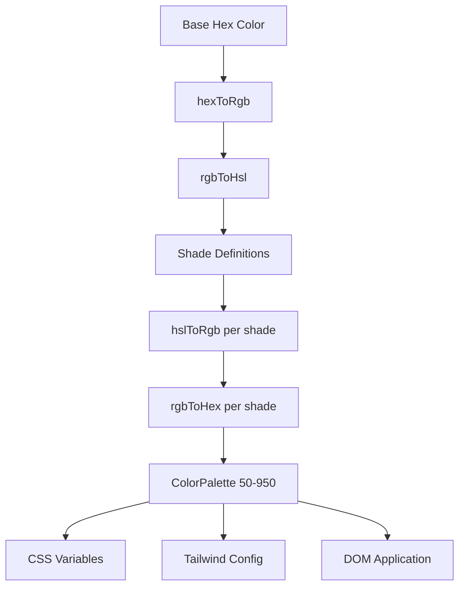

# Цветовая система

В шаблоне используется система динамической генерации цветов, которая создает полные цветовые палитры из базовых шестнадцатеричных цветов. Это обеспечивает работу механизма тем и позволяет настраивать цвета во время выполнения с помощью переменных CSS и интеграции Tailwind CSS.

## Обзор архитектуры



## Исходные файлы

|Файл|Цель|
|------|---------|
|`lib/color-generator.ts`|Генерация базовой палитры из шестнадцатеричных цветов|
|`lib/theme-color-manager.ts`|Применение цвета на уровне темы и генерация CSS|
|`lib/theme-utils.ts`|Служебные классы, помощники по непрозрачности и предустановки тем.|

## Конвейер преобразования цвета

Система преобразует цвета через несколько представлений для точного создания оттенков. Четыре функции преобразования обеспечивают полный цикл обработки.

```typescript
// Hex -> RGB -> HSL (for manipulation) -> RGB -> Hex (output)
export function hexToRgb(hex: string): { r: number; g: number; b: number };
export function rgbToHsl(r: number, g: number, b: number): { h: number; s: number; l: number };
export function hslToRgb(h: number, s: number, l: number): { r: number; g: number; b: number };
export function rgbToHex(r: number, g: number, b: number): string;
```

Регулировка яркости и насыщенности осуществляется в цветовом пространстве HSL, которое обеспечивает воспринимаемые однородные переходы оттенков по всей палитре.

## Определения оттенков

Каждый уровень оттенка имеет фиксированные настройки яркости и насыщенности относительно базового цвета (500):

|Тень|Регулировка яркости|Настройка насыщенности|Использование|
|-------|-----------------|-------------------|-------|
| 50 | +45 | -30 |Самые светлые фоны|
| 100 | +40 | -25 |Фоны при наведении|
| 200 | +30 | -20 |Активные фоны|
| 300 | +20 | -10 |Границы|
| 400 | +10 | -5 |Текст заполнителя|
| **500** | **0** | **0** |**Базовый цвет**|
| 600 | -10 | +5 |Состояния при наведении|
| 700 | -20 | +10 |Активные состояния|
| 800 | -30 | +15 |Выделение текста|
| 900 | -40 | +20 |Заголовки|
| 950 | -45 | +25 |Самые темные фоны|

## Интерфейс цветовой палитры

```typescript
export interface ColorPalette {
  50: string;
  100: string;
  200: string;
  300: string;
  400: string;
  500: string;  // Base color
  600: string;
  700: string;
  800: string;
  900: string;
  950: string;
}
```

## Создание палитры

Функция `generateColorPalette` принимает любой шестнадцатеричный цвет и создает полную палитру из 11 оттенков:

```typescript
import { generateColorPalette } from '@/lib/color-generator';

const palette = generateColorPalette('#3b82f6');
// Returns: { 50: '#e8f0fe', 100: '#d4e4fd', ..., 950: '#0a1d3d' }
```

Значения фиксируются в диапазоне от 0 до 100 как для яркости, так и для насыщенности, чтобы цвета не выходили за пределы диапазона.

## Генерация CSS-переменных

Система генерирует пользовательские свойства CSS для каждого оттенка:

```typescript
import { generateCssVariables } from '@/lib/color-generator';

const palette = generateColorPalette('#3b82f6');
const css = generateCssVariables('theme-primary', palette);
// Output:
// --theme-primary: #3b82f6;
// --theme-primary-50: #e8f0fe;
// --theme-primary-100: #d4e4fd;
// ... (all 11 shades)
```

## CSS-интеграция попутного ветра

Создайте объекты конфигурации Tailwind, которые ссылаются на переменные CSS:

```typescript
import { generateTailwindConfig } from '@/lib/color-generator';

const config = generateTailwindConfig('theme-primary');
// Returns: {
//   DEFAULT: 'var(--theme-primary)',
//   50: 'var(--theme-primary-50)',
//   100: 'var(--theme-primary-100)',
//   ...
// }
```

## Диспетчер цветов темы

Модуль `theme-color-manager.ts` применяет палитры к DOM во время выполнения.

### Расширенные конфигурации тем

Четыре встроенные темы определяют базовые цвета для основного, дополнительного, акцентного, фона, поверхности и текста:

```typescript
export const EXTENDED_THEME_CONFIGS: Record<ThemeKey, ThemeConfig> = {
  everworks: {
    primary: "#3d70ef",
    secondary: "#00c853",
    accent: "#0056b3",
    background: "#ffffff",
    surface: "#f8f9fa",
    text: "#1a1a1a",
    textSecondary: "#6c757d",
  },
  corporate: { /* ... */ },
  material: { /* ... */ },
  funny: { /* ... */ },
};
```

### Применение палитр к DOM

```typescript
import { applyColorPalette, applyThemeWithPalettes } from '@/lib/theme-color-manager';

// Apply a single color palette
applyColorPalette('theme-primary', '#3d70ef');

// Apply an entire theme (primary + secondary + accent + utility colors)
applyThemeWithPalettes('everworks');
```

Функция `applyColorPalette` также генерирует вариант RGB для поддержки непрозрачности:

```typescript
// Sets both:
// --theme-primary: #3d70ef
// --theme-primary-rgb: 61, 112, 239
```

### Генерация статического CSS

Для рендеринга на стороне сервера или генерации CSS во время сборки:

```typescript
import { generateThemeCss } from '@/lib/theme-color-manager';

const css = generateThemeCss('everworks');
// Returns full CSS variable string for all theme colors
```

## Служебные классы темы

Модуль `theme-utils.ts` предоставляет готовые комбинации классов Tailwind:

```typescript
import { themeClasses } from '@/lib/theme-utils';

// Button variants
themeClasses.button.primary   // "bg-theme-primary hover:bg-theme-accent text-white"
themeClasses.button.secondary // "bg-theme-secondary hover:bg-theme-secondary/80 text-white"
themeClasses.button.outline   // "border-2 border-theme-primary text-theme-primary ..."
themeClasses.button.ghost     // "text-theme-primary hover:bg-theme-primary/10"

// Text variants
themeClasses.text.primary     // "text-theme-text"
themeClasses.text.secondary   // "text-theme-text-secondary"
themeClasses.text.accent      // "text-theme-primary"
```

### Вспомогательные функции

```typescript
import { withOpacity, getCssVariable, cn, buildThemeClasses } from '@/lib/theme-utils';

// Generate opacity variant
withOpacity('bg-theme-primary', 50); // "bg-theme-primary/50"

// Get CSS variable reference
getCssVariable('theme-primary'); // "var(--theme-primary)"

// Conditional class building
buildThemeClasses('base-class', 'theme-class', {
  'active-class': isActive,
  'disabled-class': isDisabled,
});
```

## Пакетная генерация цвета темы

Создайте конфигурацию CSS и Tailwind для нескольких цветов одновременно:

```typescript
import { generateThemeColors } from '@/lib/color-generator';

const result = generateThemeColors({
  primary: '#3d70ef',
  secondary: '#00c853',
  accent: '#0056b3',
});

// result.css - Complete CSS variable declarations
// result.tailwind - Tailwind config object for all colors
```

## Пользовательское приложение темы

Применяйте произвольные цвета без использования предустановленных тем:

```typescript
import { applyCustomTheme } from '@/lib/theme-color-manager';

applyCustomTheme({
  primary: '#e91e63',
  secondary: '#9c27b0',
  accent: '#673ab7',
});
```

## Обработка ошибок

Диспетчер цветов темы включает в себя резервное поведение:

- Если ключ темы не найден, происходит возврат к теме `everworks` по умолчанию.
- Если при применении темы возникает ошибка, а запрошенная тема не `everworks`, автоматически повторяется попытка с темой по умолчанию.
- Безопасность SSR: `useThemeWithPalettes` проверяет доступность `window` перед применением изменений DOM.
