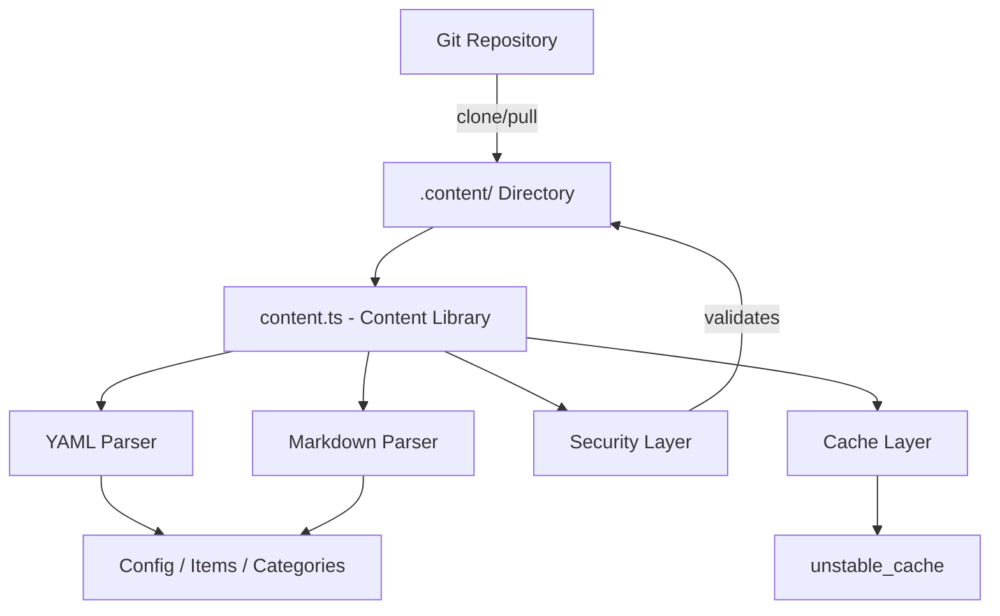
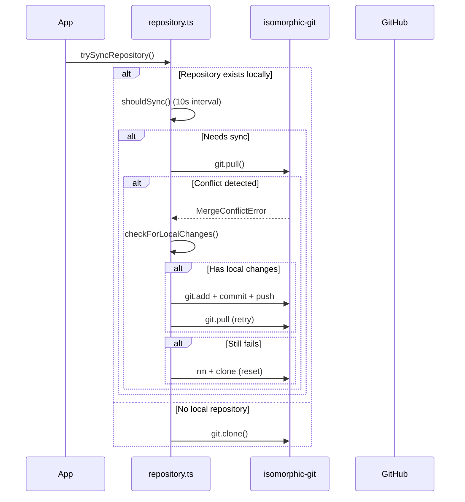

# Библиотека контента

Библиотека контента (`lib/content.ts`) предоставляет серверные утилиты для чтения, анализа и кэширования контента из репозитория CMS на базе Git. Он обрабатывает файлы содержимого YAML/Markdown, управляет конфигурацией и синхронизирует контент с помощью надежных мер безопасности.

## Обзор архитектуры



## Исходные файлы

|Файл|Цель|
|------|---------|
|`lib/content.ts`|Основная обработка, чтение и кэширование контента|
|`lib/repository.ts`|Синхронизация клонирования/извлечения Git с удаленным репозиторием|
|`lib/lib.ts`|Утилиты пути (`getContentPath`, `fsExists`, `dirExists`)|
|`lib/cache-config.ts`|Теги кэша и конфигурация TTL|

## Уровень безопасности

Библиотека контента применяет несколько мер безопасности для предотвращения атак с обходом пути и внедрением.

### Проверка языкового кода

```typescript
function validateLanguageCode(lang: string): boolean {
  const validLangPattern = /^[a-zA-Z0-9_-]+$/;
  return validLangPattern.test(lang) && lang.length <= 10;
}
```

Допускаются только буквенно-цифровые символы, дефисы и подчеркивания максимальной длиной 10 символов.

### Очистка имени файла

```typescript
function sanitizeFilename(filename: string): string {
  const sanitized = path.basename(filename);
  if (sanitized.includes('..') || sanitized.includes('/') || sanitized.includes('\\')) {
    throw new Error('Invalid filename: contains dangerous characters');
  }
  return sanitized;
}
```

Использует `path.basename` для удаления компонентов каталога и отклоняет все оставшиеся символы обхода.

### Проверка пути

```typescript
function validatePath(filepath: string, basePath: string): void {
  const resolvedPath = path.resolve(filepath);
  const resolvedBase = path.resolve(basePath);
  if (!resolvedPath.startsWith(resolvedBase + path.sep) && resolvedPath !== resolvedBase) {
    throw new Error('Invalid file path: outside of allowed directory');
  }
}
```

Функция `safeReadFile` выполняет двойную проверку: она проверяет путь, а затем проверяет, что разрешенный реальный путь (следующий по символическим ссылкам) остается в базовом каталоге.

### Проверка URL-адреса

```typescript
function isValidUrl(url: string): boolean {
  const trimmed = url.trim();
  if (trimmed.startsWith('/') && !trimmed.startsWith('//')) return true;
  return trimmed.startsWith('http://') || trimmed.startsWith('https://');
}
```

Блокирует `javascript:`, `data:`, `vbscript:` и другие опасные схемы протоколов.

### Проверка размера CSS

```typescript
function isValidCssSize(value: string): boolean {
  if (['auto', 'inherit', 'initial', 'unset'].includes(value.trim())) return true;
  return /^\d+(\.\d+)?(px|em|rem|vh|vw|%|pt|cm|mm|in)?$/.test(value.trim());
}
```

Предотвращает внедрение CSS через пользовательские поля заголовка главного героя.

## Обработка контента

### Парсинг YAML

Файлы контента анализируются с использованием библиотеки `yaml` с проверкой схемы Zod на предмет:

```typescript
const customHeroFrontmatterSchema = z.object({
  background_image: z.string().refine(isValidUrl, {
    message: 'Invalid URL: must be http, https, or relative path'
  }).optional(),
  // ... additional validated fields
});
```

### Кэширование конфигурации

Конфигурация сайта кэшируется с помощью Next.js `unstable_cache` с определенными TTL и тегами кэша:

```typescript
import { CACHE_TAGS, CACHE_TTL } from './cache-config';

const getCachedConfig = unstable_cache(
  async () => { /* read and parse config.yml */ },
  [CACHE_TAGS.CONFIG],
  { revalidate: CACHE_TTL }
);
```

## Синхронизация репозитория Git

Модуль `repository.ts` управляет операциями Git с помощью `isomorphic-git`.

### Синхронизация потока



### Защита от тайм-аута

Все операции Git имеют настраиваемые таймауты:

```typescript
async function withTimeout<T>(promise: Promise<T>, timeoutMs: number = 120000): Promise<T> {
  const timeoutPromise = new Promise<never>((_, reject) => {
    setTimeout(() => reject(new Error(`Operation timeout after ${timeoutMs}ms`)), timeoutMs);
  });
  return Promise.race([promise, timeoutPromise]);
}
```

### Разрешение конфликтов

Система обрабатывает конфликты слияния с помощью многоэтапной стратегии:

1. **Обнаружение локальных изменений** через `git.statusMatrix()`
2. **Попытка отправки** локальных изменений перед извлечением
3. **Повторить попытку** после успешной отправки
4. **Полный сброс** (удаление + повторное клонирование) в крайнем случае.

### Резервное поведение

Если `DATA_REPOSITORY` не настроен или клонирование не удалось, система создает минимальный резервный контент:

```typescript
// Creates empty content directory with minimal config
const DEFAULT_CONFIG = `site_name: Website
item_name: Item
items_name: Items
copyright_year: ${new Date().getFullYear()}
`;
```

## Принудительное применение только на сервере

И `content.ts`, и `repository.ts` используют импорт `server-only` для предотвращения случайного использования на стороне клиента:

```typescript
'use server';
import 'server-only';
```

Это гарантирует, что операции с контентом с доступом к файловой системе никогда не попадут в клиентские пакеты.

## Ключевые экспортированные функции

|Функция|Описание|
|----------|-------------|
|`getCachedConfig()`|Возвращает кэшированную конфигурацию сайта из `config.yml`|
|`trySyncRepository()`|Клонирует или извлекает контент из удаленного репозитория Git.|
|`pullChanges()`|Извлекает последние изменения с разрешением конфликтов|
|`validateLanguageCode()`|Проверяет формат языкового кода i18n|
|`sanitizeFilename()`|Удаляет компоненты каталога из имен файлов|
|`safeReadFile()`|Читает файлы с полной защитой от обхода пути.|
