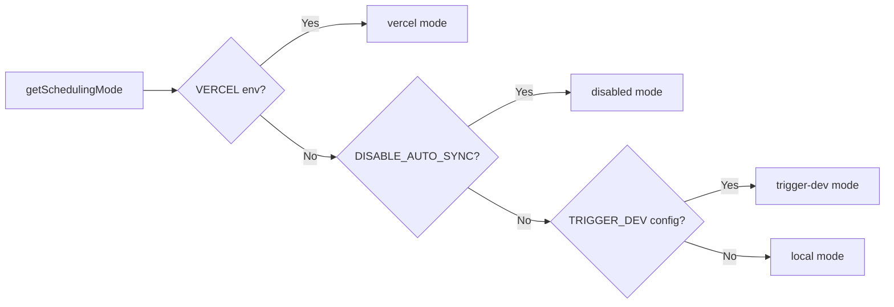

# Система заданий Cron

## Обзор

Шаблон Ever Works реализует гибкую систему фоновых заданий, которая поддерживает три режима планирования: **Vercel Cron**, **Trigger.dev** и **локальный планировщик**. Конечные точки Cron — это стандартные маршруты API Next.js, аутентифицированные через `CRON_SECRET`, а система включает в себя одноэлементный модуль инициализации, который гарантирует, что задания настраиваются ровно один раз для каждого процесса.

## Архитектура

```mermaid
flowchart TD
    A[Scheduling Mode Detection] --> B{getSchedulingMode}

    B -->|vercel| C[Vercel Cron]
    B -->|trigger-dev| D[Trigger.dev]
    B -->|local| E[Local Scheduler]
    B -->|disabled| F[No Jobs]

    C --> G[vercel.json crons]
    G --> G1[/api/cron/sync]
    G --> G2[/api/cron/subscription-reminders]
    G --> G3[/api/cron/subscription-expiration]

    G1 --> H[CRON_SECRET Verification]
    G2 --> H
    G3 --> H

    H -->|Valid| I[Execute Job]
    H -->|Invalid| J[401 Unauthorized]

    I --> I1[triggerManualSync]
    I --> I2[subscriptionRenewalReminderJob]
    I --> I3[processExpiredSubscriptions]

    D --> K[Trigger.dev SDK]
    E --> L[Internal setInterval]

    K --> I
    L --> I
```

## Исходные файлы

|Файл|Цель|
|------|---------|
|`template/vercel.json`|Определения расписания Vercel cron|
|`template/app/api/cron/sync/route.ts`|Конечная точка cron синхронизации контента|
|`template/app/api/cron/subscription-reminders/route.ts`|Письма с напоминанием о продлении|
|`template/app/api/cron/subscription-expiration/route.ts`|Обработка истекшей подписки|
|`template/app/api/cron/jobs/background-jobs-init.ts`|Инициализация одноэлементного задания|

## Настройка расписания Cron

### Vercel.json

```json
{
    "crons": [
        {
            "path": "/api/cron/sync",
            "schedule": "0 3 * * *"
        },
        {
            "path": "/api/cron/subscription-reminders",
            "schedule": "0 9 * * *"
        },
        {
            "path": "/api/cron/subscription-expiration",
            "schedule": "0 0 * * *"
        }
    ]
}
```

|Работа|Расписание|Время|Описание|
|-----|----------|------|-------------|
|Синхронизация контента| `0 3 * * *` |3:00 утра по всемирному координированному времени ежедневно|Синхронизирует контент с CMS на базе Git.|
|Напоминания о подписке| `0 9 * * *` |9:00 UTC ежедневно|Отправляет электронные письма с напоминанием о продлении|
|Срок действия подписки| `0 0 * * *` |Полночь UTC ежедневно|Обрабатывает просроченные подписки|

## Аутентификация

### Безопасная по времени секретная проверка

Все конечные точки cron проверяют `CRON_SECRET`, используя безопасное по времени сравнение, чтобы предотвратить атаки по времени:

```typescript
import crypto from 'crypto';

function verifyCronSecret(request: NextRequest): boolean {
    const authHeader = request.headers.get('authorization');
    const cronSecret = process.env.CRON_SECRET;

    // Development bypass
    if (!cronSecret && process.env.NODE_ENV === 'development') {
        console.log('[Cron] Bypassing cron auth in development');
        return true;
    }

    if (!cronSecret || !authHeader) return false;

    const expectedValue = `Bearer ${cronSecret}`;

    // Length check before timing-safe comparison
    if (authHeader.length !== expectedValue.length) return false;

    return crypto.timingSafeEqual(
        Buffer.from(authHeader, 'utf8'),
        Buffer.from(expectedValue, 'utf8')
    );
}
```

Основные функции безопасности:
- **Сравнение по времени** с помощью `crypto.timingSafeEqual` – не позволяет злоумышленникам измерить разницу во времени отклика, чтобы угадать секрет.
- **Предварительная проверка длины** -- `timingSafeEqual` требует буферов одинаковой длины.
- **Обход разработки** -- только если `CRON_SECRET` не настроен и `NODE_ENV=development`

### Автоматическая аутентификация Vercel

При развертывании на Vercel платформа автоматически включает заголовок `Authorization: Bearer <CRON_SECRET>` для настроенных заданий cron. Вам нужно только установить переменную среды `CRON_SECRET` на панели управления Vercel.

## Реализация работы

### Задание синхронизации контента

```typescript
export async function GET(request: Request): Promise<NextResponse> {
    const startTime = Date.now();

    // Verify authorization
    if (!isAuthorized) {
        return NextResponse.json({ success: false, message: "Unauthorized" }, { status: 401 });
    }

    try {
        const result = await triggerManualSync();
        const duration = Date.now() - startTime;

        return NextResponse.json({
            success: result.success,
            timestamp: new Date().toISOString(),
            duration,
            message: result.message,
        }, {
            headers: { "Cache-Control": "no-cache, no-store, must-revalidate" },
        });
    } catch (error) {
        return NextResponse.json({
            success: false,
            message: "Cron sync failed",
            details: safeErrorMessage(error, "Unknown error"),
        }, { status: 500 });
    }
}
```

Формат ответа:
```json
{
    "success": true,
    "timestamp": "2025-01-15T03:00:05.123Z",
    "duration": 5123,
    "message": "Sync completed successfully"
}
```

### Задание истечения срока действия подписки

Это задание обрабатывает просроченные подписки и отправляет уведомления по электронной почте:

```typescript
export async function GET(request: NextRequest) {
    if (!verifyCronSecret(request)) {
        return NextResponse.json({ success: false, message: 'Unauthorized' }, { status: 401 });
    }

    // 1. Find and update expired subscriptions
    const result = await subscriptionService.processExpiredSubscriptions();

    // 2. Send notification emails
    const { service: emailService } = await createEmailService();
    if (emailService.isServiceAvailable()) {
        for (const subscription of result.subscriptions) {
            const user = await getUserById(subscription.userId);
            const emailTemplate = getSubscriptionExpiredTemplate({ /* ... */ });
            await sendEmailSafely(emailService, emailConfig, emailTemplate, user.email);
        }
    }

    // 3. Return results
    return NextResponse.json({
        success: true,
        data: {
            processed: result.processed,
            affectedUsers,
            errors: result.errors,
            timestamp: new Date().toISOString()
        }
    });
}
```

Ключевые модели поведения:
- Сбои электронной почты не приводят к сбою задания
- Метод `POST` также экспортируется как псевдоним для ручных триггеров.
- Возвращает `207 Multi-Status` в случае частичного успеха.

### Напоминания о подписке

```typescript
export async function GET(request: NextRequest) {
    if (!verifyCronSecret(request)) {
        return NextResponse.json({ error: 'Unauthorized' }, { status: 401 });
    }

    const result = await subscriptionRenewalReminderJob();

    if (!result.success) {
        return NextResponse.json(
            { error: 'Job completed with errors', ...result },
            { status: 207 }  // Multi-Status for partial success
        );
    }

    return NextResponse.json({
        message: 'Subscription reminder job completed',
        ...result
    });
}

// Support POST for Vercel Cron
export async function POST(request: NextRequest) {
    return GET(request);
}
```

## Инициализация фоновых заданий

### Шаблон Синглтон

Модуль инициализации использует `globalThis`, чтобы гарантировать, что задания устанавливаются только один раз, даже при вызове бессерверных функций:

```typescript
const GLOBAL_KEY = '__BACKGROUND_JOBS_INIT__' as const;

interface BackgroundJobsGlobalState {
    initializationState: 'pending' | 'initializing' | 'completed';
    initializationPromise: Promise<void> | null;
    loggedMode: SchedulingMode | null;
}

export async function ensureBackgroundJobsInitialized(): Promise<void> {
    // Skip during tests and builds
    if (process.env.NODE_ENV === 'test') return;
    if (process.env.NEXT_PHASE === 'phase-production-build') return;

    const state = getGlobalState();

    // Fast path: already completed
    if (state.initializationState === 'completed') return;

    // Wait for in-progress initialization
    if (state.initializationState === 'initializing') {
        return state.initializationPromise;
    }

    // Start initialization
    state.initializationState = 'initializing';
    state.initializationPromise = doInitialize();

    try {
        await state.initializationPromise;
        state.initializationState = 'completed';
    } catch (error) {
        state.initializationState = 'pending'; // Allow retry
        throw error;
    }
}
```

### Режимы планирования



|Режим|Поведение|
|------|----------|
|`vercel`|Задания, обрабатываемые Vercel Cron через конечные точки HTTP|
|`trigger-dev`|Задания, управляемые облачным планировщиком Trigger.dev|
|`local`|Внутренний планировщик на базе `setInterval` для разработки|
|`disabled`|Нет автоматического планирования (`DISABLE_AUTO_SYNC=true`)|

## Переменные среды

|Переменная|Требуется|Описание|
|----------|----------|-------------|
|`CRON_SECRET`|Только производство|Токен носителя для аутентификации cron|
|`DISABLE_AUTO_SYNC`|Нет|Установите значение `true`, чтобы отключить все фоновые задания.|
|`VERCEL`|Автоустановка|Автоматически устанавливается платформой Vercel|

## Лучшие практики

1. **Всегда используйте сравнение с учетом времени** для секретов cron — предотвращает атаки по времени.
2. **Экспортируйте как GET, так и POST** – Vercel Cron может использовать любой метод.
3. **Установите `Cache-Control: no-cache`** для ответов – запретите кэширование результатов заданий.
4. **Журнал продолжительности задания** – помогает выявить снижение производительности.
5. **Управляйте ошибками электронной почты** — не допускайте сбоев в работе уведомлений.
6. **Используйте `207 Multi-Status`** для частичного успеха — в отличие от полного успеха/неудачи.
