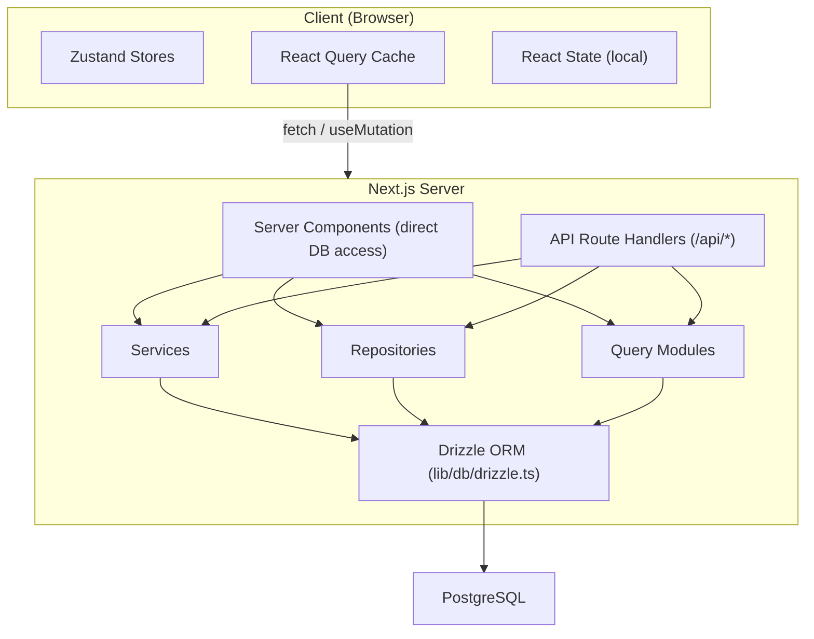

# Поток данных и управление состоянием

В этом документе описывается, как данные проходят через шаблон Ever Works из базы данных в пользовательский интерфейс, охватывая серверные компоненты, маршруты API, запросы React, хранилища Zustand и шаблон репозитория.

## Обзор архитектуры

В шаблоне используется многоуровневая архитектура данных:



## Получение данных на стороне сервера

### Серверные компоненты (прямой доступ к БД)

Компоненты сервера в каталоге `app/` могут напрямую импортировать и вызывать функции запроса к базе данных или методы хранилища. Это наиболее эффективный путь, поскольку он позволяет избежать ненужных HTTP-обходов.

```typescript
// app/[locale]/admin/items/page.tsx (simplified)
import { getItems } from '@/lib/db/queries';

export default async function AdminItemsPage() {
  const items = await getItems();
  return <ItemsList items={items} />;
}
```

### Обработчики маршрутов API

Маршруты API в `app/api/` служат мостом между клиентскими компонентами и логикой на стороне сервера. Они следуют шаблону тонкого обработчика: проверяют входные данные, вызывают соответствующую службу или репозиторий и возвращают HTTP-ответ.

```typescript
// Typical API route pattern
export async function GET(request: NextRequest) {
  const session = await auth();
  if (!session?.user) {
    return NextResponse.json({ error: 'Unauthorized' }, { status: 401 });
  }

  const data = await someRepository.findAll();
  return NextResponse.json({ success: true, data });
}
```

## Управление состоянием на стороне клиента

### Запрос TanStack (запрос React 5)

React Query — это основной инструмент для управления состоянием сервера на стороне клиента. Шаблон широко использует его посредством пользовательских перехватчиков в каталоге `hooks/`.

**Глобальная конфигурация** (`lib/react-query-config.ts`):
- Время хранения по умолчанию: 5 минут.
- Время вывоза мусора: 10 минут.
- Автоматическая повторная попытка с экспоненциальной задержкой (до 3 повторных попыток)
- Повторная выборка фокуса окна и повторное подключение
- Нет повторной попытки при ошибках клиента 4xx

**Шаблон перехватчиков**. В каждой функциональной области есть выделенные перехватчики, которые обертывают React Query:

```typescript
// hooks/use-admin-items.ts (simplified pattern)
import { useQuery, useMutation, useQueryClient } from '@tanstack/react-query';

export function useAdminItems(params) {
  return useQuery({
    queryKey: ['admin', 'items', params],
    queryFn: () => fetch('/api/admin/items').then(r => r.json()),
    staleTime: 5 * 60 * 1000,
  });
}

export function useCreateItem() {
  const queryClient = useQueryClient();
  return useMutation({
    mutationFn: (data) => fetch('/api/admin/items', {
      method: 'POST',
      body: JSON.stringify(data),
    }).then(r => r.json()),
    onSuccess: () => {
      queryClient.invalidateQueries({ queryKey: ['admin', 'items'] });
    },
  });
}
```

### Магазины Зустанд

Zustand используется для состояния пользовательского интерфейса только для клиента, не требующего синхронизации с сервером. Примеры включают в себя:

- **Состояние темы**: предпочтение светлого/темного режима.
- **Состояние фильтра**: выбранные активные фильтры.
- **Модальное состояние**: открытое/закрытое состояние модальных окон и наложений.
- **Настройки макета**: представление в виде сетки или списка, состояние боковой панели.

### Реагировать на контекст

Поставщики контекста React в `components/context/` и `components/providers/` предоставляют общее состояние поддеревьям компонентов. Обертка корневых провайдеров (`app/[locale]/providers.tsx`) содержит:

- Поставщик запросов React (с клиентом запросов)
- Поставщик тем
- Поставщик сеанса аутентификации
- Поставщик всплывающих уведомлений

## Уровни доступа к данным

### Шаблон репозитория

Репозитории в `lib/repositories/` обеспечивают чистую абстракцию операций с базой данных. Каждый репозиторий инкапсулирует запросы для определенной сущности домена.

```
lib/repositories/
├── admin-analytics-optimized.repository.ts
├── admin-stats.repository.ts
├── category.repository.ts
├── client-dashboard.repository.ts
├── client-item.repository.ts
├── collection.repository.ts
├── integration-mapping.repository.ts
├── item.repository.ts
├── role.repository.ts
├── sponsor-ad.repository.ts
├── tag.repository.ts
├── twenty-crm-config.repository.ts
└── user.repository.ts
```

### Модули запросов

Каталог `lib/db/queries/` содержит более 23 модулей запросов, организованных по доменам. Они предоставляют необработанные функции запросов Drizzle ORM, которые используют репозитории и сервисы.

### Уровень сервисов

Каталог `lib/services/` содержит более 30 служебных файлов, реализующих бизнес-логику. Службы управляют несколькими репозиториями, внешними вызовами API и побочными эффектами (электронная почта, уведомления, веб-перехватчики).

## API-клиентская архитектура

### Серверный API-клиент

`lib/api/server-api-client.ts` предоставляет централизованный HTTP-клиент для вызовов на стороне сервера с помощью:
- Автоматическая повторная попытка с экспоненциальной задержкой
- Настраиваемые таймауты (по умолчанию 30 секунд)
- Структурированное журналирование в разработке
- Нормализация ошибок

### API-клиент на стороне браузера

`lib/api/api-client.ts` и `lib/api/api-client-class.ts` предоставляют абстракцию API на стороне клиента, используемую перехватчиками React Query для вызова маршрутов API.

## Данные контента (CMS на основе Git)

Содержимое элементов (списки каталогов) хранится в репозитории Git и управляется через `lib/content.ts` и `lib/repository.ts`. Этот контент клонируется в `.content/` во время сборки и периодически синхронизируется. Система контента использует `isomorphic-git` для операций Git непосредственно из Node.js.

## Стратегия кэширования

В шаблоне реализован подход многоуровневого кэширования:

1. **Кэш запросов React**: на стороне клиента с настраиваемым временем устаревания/сборки мусора для каждого запроса.
2. **Кэш Next.js**: рендеринг на стороне сервера и кеш данных через `lib/cache-config.ts`
3. **Аннулирование кэша**: Целенаправленное аннулирование через `lib/cache-invalidation.ts` с использованием тегов повторной проверки.
4. **Пул соединений с базой данных**: настраивается в `lib/db/drizzle.ts` с размером пула от 1 до 50 соединений.
