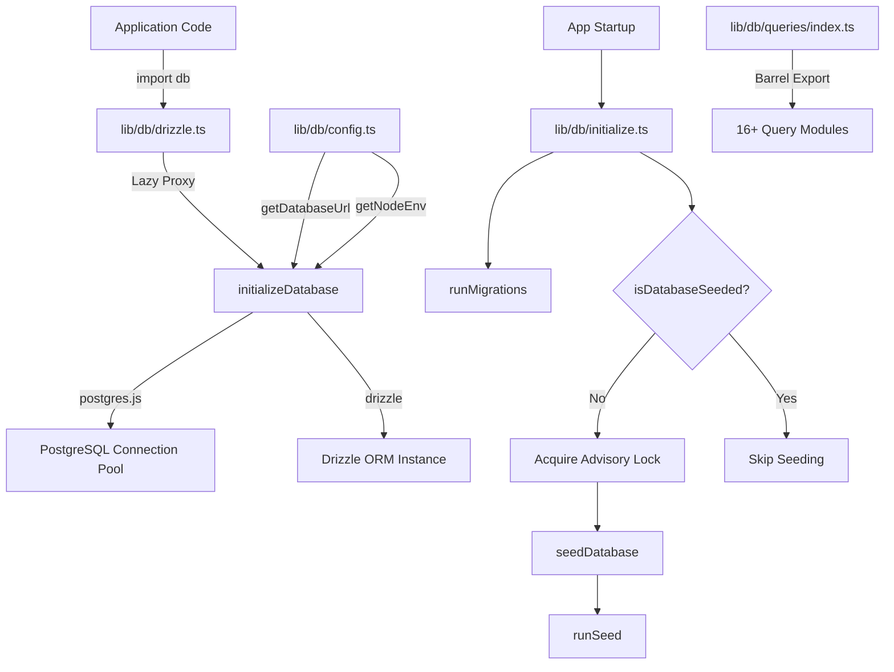
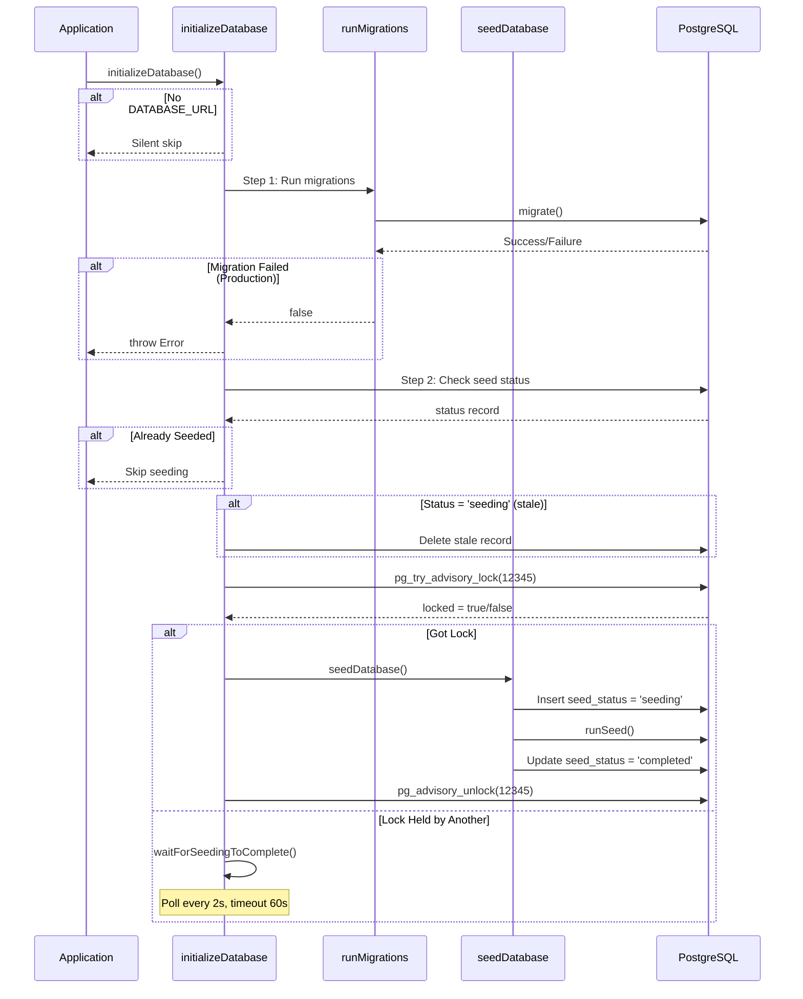

# Модуль утилит базы данных

Модуль утилит базы данных (`template/lib/db/`) управляет пулом соединений PostgreSQL через `postgres.js`, инициализацией Drizzle ORM, автоматической миграцией и заполнением базы данных с блокировкой, безопасной для параллелизма. Он предназначен для работы в бессерверных средах (Vercel), где несколько холодных запусков могут привести к инициализации базы данных.

## Обзор архитектуры



## Исходные файлы

|Файл|Описание|
|------|-------------|
|`lib/db/config.ts`|Конфигурация базы данных, безопасная для сценариев (без `server-only`)|
|`lib/db/drizzle.ts`|Пул соединений и экземпляр Drizzle с ленивым прокси|
|`lib/db/initialize.ts`|Автоматическая миграция и оркестрация заполнения|
|`lib/db/migrate.ts`|Бегун по миграции|
|`lib/db/queries/index.ts`|Экспорт ствола для всех модулей запроса|

## Конфигурация базы данных (`config.ts`)

Безопасные для сценариев функции, которые **не** импортируют `server-only`, что позволяет использовать их в сценариях миграции и начального заполнения:

```typescript
function getDatabaseUrl(): string | undefined;
function getNodeEnv(): 'development' | 'production' | 'test';
function isProduction(): boolean;
```

## Подключение и ORM (`drizzle.ts`)

### Шаблон ленивого прокси

При экспорте `db` используется JavaScript `Proxy` для отсрочки инициализации соединения до первого использования. Это предотвращает ошибки соединения во время сборки, когда `DATABASE_URL` может быть недоступен.

```typescript
// Proxy intercepts all property access and initializes on demand
export const db = new Proxy({} as ReturnType<typeof drizzle>, {
  get(target, prop) {
    const database = initializeDatabase();
    return database[prop as keyof typeof database];
  },
});
```

### Конфигурация пула соединений

```typescript
function getPoolSize(): number;
// - Reads DB_POOL_SIZE env var (clamped to 1-50)
// - Defaults: 20 (production), 10 (development)
```

Настройки бассейна:
- `idle_timeout`: 20 секунд
- `connect_timeout`: 30 секунд
- `prepare`: false (требуется для некоторых бессерверных сред)

### Синглтон через `globalThis`

Соединение кэшируется на `globalThis`, чтобы выдержать перезагрузку горячего модуля Next.js в процессе разработки:

```typescript
const globalForDb = globalThis as unknown as {
  conn: postgres.Sql | undefined;
  db: ReturnType<typeof drizzle> | undefined;
};
```

### Прямой доступ к экземпляру

В случаях, когда требуется реальный экземпляр Drizzle (например, адаптер NextAuth.js Drizzle):

```typescript
import { getDrizzleInstance } from '@/lib/db/drizzle';

const adapter = DrizzleAdapter(getDrizzleInstance(), { ... });
```

## Менеджер по миграции (`migrate.ts`)

### `runMigrations(): Promise<boolean>`

Запускает миграцию Drizzle из папки `./lib/db/migrations`. Безопасно обращаться к каждому стартапу, поскольку `migrate()` Drizzle является идемпотентным — он отслеживает прикладные миграции в таблице `__drizzle_migrations`.

```typescript
import { runMigrations } from '@/lib/db/migrate';

const success = await runMigrations();
if (!success) {
  console.error('Migrations failed -- run pnpm db:migrate manually');
}
```

**Поведение:**
- Регистрирует недавнюю историю миграции до и после выполнения.
- Возвращает `true` в случае успеха, `false` в случае неудачи.
- Не выдает — ошибки регистрируются и возвращаются в виде логического значения.

## Инициализация базы данных (`initialize.ts`)

### `initializeDatabase(): Promise<void>`

Основная функция инициализации вызывается при запуске приложения. Обрабатывает полный жизненный цикл:



### Безопасность параллелизма

Несколько бессерверных экземпляров могут запускаться одновременно. Модуль предотвращает дублирование заполнения, используя:

1. **Консультационная блокировка PostgreSQL** (`pg_try_advisory_lock(12345)`) — неблокирующая
2. **Таблица статуса начального числа** отслеживает состояния `seeding`, `completed`, `failed`
3. **Обнаружение устаревания** – 5-минутный порог зависания статуса `seeding`
4. **Ожидание и опрос** – экземпляры, которые не могут получать опрос блокировки каждые 2 секунды.

### Вспомогательные функции

```typescript
// Check if database has been successfully seeded
async function isDatabaseSeeded(): Promise<boolean>;

// Wait for another instance to finish seeding (60s timeout, 2s intervals)
async function waitForSeedingToComplete(): Promise<boolean>;
```

## Модули запросов

Каталог `lib/db/queries/` содержит модули запросов, специфичные для домена, и все они реэкспортируются через `index.ts`:

|Модуль|Домен|
|--------|--------|
|`activity.queries.ts`|Регистрация активности|
|`auth.queries.ts`|Аутентификация (поиск пользователя, проверка пароля)|
|`client.queries.ts`|Профили клиентов|
|`comment.queries.ts`|Комментарии|
|`company.queries.ts`|Профили компании|
|`dashboard.queries.ts`|Статистика информационной панели|
|`engagement.queries.ts`|Просмотры, голоса, агрегирование избранного|
|`item.queries.ts`|Товар CRUD|
|`location-index.queries.ts`|Индексация на основе местоположения|
|`newsletter.queries.ts`|Подписка на рассылку|
|`payment.queries.ts`|Платежные отчеты|
|`report.queries.ts`|Отчеты|
|`subscription.queries.ts`|Подписки|
|`survey.queries.ts`|Опросы и ответы|
|`user.queries.ts`|Управление пользователями|
|`vote.queries.ts`|Система голосования|

### Импорт шаблона

```typescript
import {
  getUserByEmail,
  getClientProfileByUserId,
  logActivity,
  isUserAdmin,
} from '@/lib/db/queries';
```

## Переменные среды

|Переменная|Требуется|Описание|
|----------|----------|-------------|
|`DATABASE_URL`|Нет (дополнительная база данных)|Строка подключения PostgreSQL|
|`DB_POOL_SIZE`|Нет|Размер пула подключений (по умолчанию: 10/20)|
|`NODE_ENV`|Нет|Определяет размер пула по умолчанию и ведение журнала|
