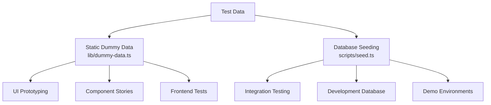
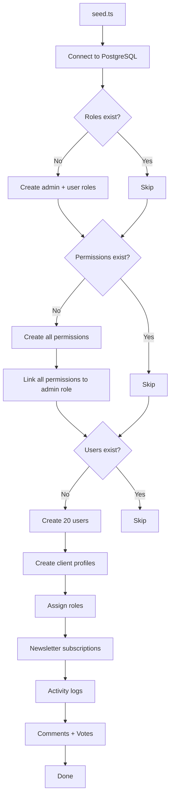
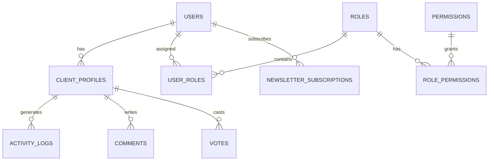

# Фиктивная система данных

Шаблон предоставляет два подхода к тестированию данных: статические фиктивные данные для разработки пользовательского интерфейса и прототипирования, а также систему заполнения базы данных для создания реалистичных записей в PostgreSQL. Вместе они охватывают полный жизненный цикл разработки: от макетов до интеграционного тестирования.

## Обзор



## Статические фиктивные данные

Модуль `lib/dummy-data.ts` экспортирует типизированные образцы данных для использования в компонентах во время разработки.

### Интерфейс отправки

```typescript
export interface Submission {
  id: string;
  title: string;
  description: string;
  status: "approved" | "pending" | "rejected";
  submittedAt: string | null;
  approvedAt?: string;
  rejectedAt?: string;
  rejectionReason?: string;
  category: string;
  tags: string[];
  views: number;
  likes: number;
}
```

### манекенПредложения

Шесть образцов отправки, охватывающих все состояния статуса:

|идентификатор|Название|Статус|Категория|Просмотры|Нравится|
|---|---|---|---|---|---|
| 1 |Современная платформа электронной коммерции|одобрено|Веб-разработка| 1250 | 89 |
| 2 |Приложение для управления задачами|в ожидании|Мобильная разработка| 567 | 23 |
| 3 |Панель погоды|отклонено|Веб-разработка| 890 | 45 |
| 4 |AI-помощник в чате|одобрено|ИИ/МО| 2100 | 156 |
| 5 |Приложение для отслеживания фитнеса|в ожидании|Мобильная разработка| 432 | 18 |
| 6 |Блог-платформа|в ожидании|Веб-разработка| 0 | 0 |

Использование в компонентах:

```typescript
import { dummySubmissions } from '@/lib/dummy-data';

export function SubmissionList() {
  return (
    <div>
      {dummySubmissions.map((submission) => (
        <SubmissionCard key={submission.id} submission={submission} />
      ))}
    </div>
  );
}
```

### манекенПортфель

Три образца портфолио для демонстрации карточек проектов:

|идентификатор|Название|Рекомендуемые|Теги|
|---|---|---|---|
| 1 |Платформа электронной коммерции|Да|Next.js, Stripe, Электронная коммерция|
| 2 |Приложение для управления задачами|Да|Реагировать, Firebase, В реальном времени|
| 3 |Панель погоды|Нет|Vue.js, API погоды, информационная панель|

Каждая позиция портфолио включает в себя:

```typescript
{
  id: string;
  title: string;
  description: string;
  imageUrl: string;      // Unsplash placeholder image
  externalUrl: string;   // Demo link
  tags: string[];
  isFeatured: boolean;
}
```

## Заполнение базы данных

Скрипт `scripts/seed.ts` генерирует реалистичные данные непосредственно в PostgreSQL с помощью Drizzle ORM.

### Посевная архитектура



### Отношения данных



### Созданные профили пользователей

Сеялка создает профили с детерминированной вариацией:

```typescript
// Plan distribution
plan: i % 5 === 0 ? 'premium'    // 20% premium
    : i % 3 === 0 ? 'standard'   // ~13% standard
    : 'free';                     // ~67% free

// Job titles alternate
jobTitle: i % 2 === 0 ? 'Developer' : 'Designer';

// Companies alternate
company: i % 2 === 0 ? 'Acme Inc.' : 'Globex';

// Bios for every 3rd user
bio: i % 3 === 0 ? 'Power user' : null;
```

### Шаблоны журналов активности

Журналы активности циклически повторяют четыре типа действий:

|Индексный шаблон|Действие|Описание|
|---|---|---|
|`i % 4 === 0`|`SIGN_UP`|Создание учетной записи|
|`i % 4 === 1`|`SIGN_IN`|Событие входа|
|`i % 4 === 2`|`COMMENT`|Комментарий опубликован|
|`i % 4 === 3`|`VOTE`|Голосование по составу|

Временные метки рандомизированы в течение последних 7 дней.

### Распределение голосов

Голоса разделяются 75/25 в пользу голосов «за»:

```typescript
voteType: i % 4 === 0 ? VoteType.DOWNVOTE : VoteType.UPVOTE
```

### Конфигурация подключения

Сидер использует консервативные настройки подключения, подходящие для скриптов:

```typescript
const conn = postgres(databaseUrl, {
  max: 1,              // Single connection (no pool needed)
  idle_timeout: 20,    // Close idle connections after 20s
  connect_timeout: 10, // 10-second connection timeout
  prepare: false,      // Disable prepared statements
});
```

## Посев полосового продукта

Скрипт `scripts/seed-stripe-products.ts` создает каталог биллинга в Stripe. Полный список продуктов см. в документации [Скрипты базы данных](../development/database-scripts.md).

## Идемпотентность

Оба подхода к заполнению разработаны так, чтобы быть безопасными для многократного выполнения:

|Тип данных|Состояние охраны|Поведение при повторном запуске|
|---|---|---|
|Роли|`SELECT * FROM roles LIMIT 1`|Пропустить, если таковые имеются|
|Разрешения|`SELECT * FROM permissions LIMIT 1`|Пропустить, если таковые имеются|
|Пользователи|`SELECT count(*) FROM users`|Пропустить, если количество > 0|
|Информационный бюллетень|Включено в блок создания пользователя|Пропущено с пользователями|

## Использование фиктивных данных в разработке

### Схема 1. Прототипирование компонентов

Используйте статические фиктивные данные для создания компонентов пользовательского интерфейса до того, как серверная часть будет готова:

```typescript
import { dummySubmissions, type Submission } from '@/lib/dummy-data';

interface SubmissionCardProps {
  submission: Submission;
}

export function SubmissionCard({ submission }: SubmissionCardProps) {
  const statusColors = {
    approved: 'bg-green-100 text-green-800',
    pending: 'bg-yellow-100 text-yellow-800',
    rejected: 'bg-red-100 text-red-800',
  };

  return (
    <div className="p-4 border rounded-lg">
      <h3>{submission.title}</h3>
      <span className={statusColors[submission.status]}>
        {submission.status}
      </span>
      <p>{submission.description}</p>
      <div className="flex gap-2">
        {submission.tags.map(tag => (
          <span key={tag} className="badge">{tag}</span>
        ))}
      </div>
    </div>
  );
}
```

### Схема 2: Мокапы информационной панели

```typescript
import { dummySubmissions } from '@/lib/dummy-data';

// Derive stats from dummy data
const stats = {
  total: dummySubmissions.length,
  approved: dummySubmissions.filter(s => s.status === 'approved').length,
  pending: dummySubmissions.filter(s => s.status === 'pending').length,
  rejected: dummySubmissions.filter(s => s.status === 'rejected').length,
  totalViews: dummySubmissions.reduce((sum, s) => sum + s.views, 0),
};
```

### Шаблон 3: заменить реальными данными

Когда интеграция с серверной частью будет готова, замените импорт:

```typescript
// Before (dummy data)
import { dummySubmissions } from '@/lib/dummy-data';
const submissions = dummySubmissions;

// After (real data)
const submissions = await getSubmissions();
```

## Добавление новых фиктивных данных

При добавлении новых функций дополните `lib/dummy-data.ts` типизированными примерами данных:

1. Определите интерфейс TypeScript для фигуры данных.
2. Экспортируйте его для использования в компонентах.
3. Создайте образцы записей, охватывающие крайние случаи (пустые поля, строки максимальной длины, все значения статуса).
4. Используйте реалистичные значения (имена собственные, действительные URL-адреса, разумные числа).
5. Включите как избранные, так и не избранные элементы, если это применимо.

```typescript
// Example: adding dummy reviews
export interface DummyReview {
  id: string;
  authorName: string;
  rating: number;
  comment: string;
  createdAt: string;
}

export const dummyReviews: DummyReview[] = [
  {
    id: "1",
    authorName: "Jane Developer",
    rating: 5,
    comment: "Excellent tool for rapid prototyping",
    createdAt: "2024-02-01T10:00:00Z"
  },
  // ... more entries covering 1-star, no comment, etc.
];
```
