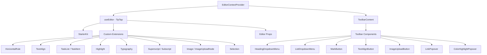

# Система редактора

Шаблон включает в себя редактор форматированного текста, построенный на TipTap (ProseMirror) с модульной архитектурой расширений, компонентов панели инструментов, перехватчиков и служебных функций. Редактор поддерживает заголовки, списки, списки задач, изображения, блоки кода, форматирование текста и многое другое.

## Обзор архитектуры



## Исходные файлы

|Каталог|Содержание|
|-----------|----------|
|`lib/editor/extensions/`|Реэкспорт и настройка расширения TipTap|
|`lib/editor/components/`|Компоненты пользовательского интерфейса (кнопки панели инструментов, всплывающие окна, значки)|
|`lib/editor/hooks/`|Хуки React для управления состоянием редактора|
|`lib/editor/providers/`|Поставщик контекста редактора с настройкой расширения|
|`lib/editor/contents/`|Макет панели инструментов и компоненты содержимого редактора|
|`lib/editor/utils/`|Служебные функции (ярлыки, проверка, загрузка)|

## Конфигурация расширения

Расширения регистрируются в `EditorContextProvider`. `StarterKit` обеспечивает базовую функциональность с дополнительными расширениями, расположенными поверх:

```typescript
const extensions = useMemo(() => [
  StarterKit.configure({
    horizontalRule: false,
    link: { openOnClick: false, enableClickSelection: true },
  }),
  HorizontalRule,
  TextAlign.configure({ types: ['heading', 'paragraph'] }),
  ImageUploadNode.configure({
    accept: 'image/*',
    maxSize: MAX_FILE_SIZE, // 5MB
    limit: 3,
    upload: handleImageUpload,
    onError: (error) => console.error('Upload failed:', error),
  }),
  TaskList,
  TaskItem.configure({ nested: true }),
  Highlight.configure({ multicolor: true }),
  Image,
  Typography,
  Superscript,
  Subscript,
  Selection,
], []);
```

### Сводка расширений

|Расширение|Источник|Цель|
|-----------|--------|---------|
|`StarterKit`|`@tiptap/starter-kit`|Абзацы, жирный, курсив, списки, код, цитаты|
|`HorizontalRule`|`@tiptap/extension-horizontal-rule`|Горизонтальные разделители|
|`TextAlign`|`@tiptap/extension-text-align`|Слева, по центру, справа, выравнивание по ширине|
|`TaskList` / `TaskItem`|`@tiptap/extension-list`|Интерактивные списки флажков|
|`Highlight`|`@tiptap/extension-highlight`|Многоцветная подсветка текста|
|`Typography`|`@tiptap/extension-typography`|Умные кавычки, тире, многоточие|
|`Superscript`|`@tiptap/extension-superscript`|Надстрочный текст|
|`Subscript`|`@tiptap/extension-subscript`|Подстрочный текст|
|`Selection`|`@tiptap/extensions`|Улучшенная обработка выбора|
|`Image`|`@tiptap/extension-image`|Статическое отображение изображения|
|`ImageUploadNode`|Пользовательский|Загрузка изображения с помощью перетаскивания с прогрессом|

## Поставщик контекста редактора

Редактор предоставляется через React Context для доступа ко всему дереву:

```typescript
export const EditorContext = createContext<Editor | null>(null);

export function EditorContextProvider({ children }: { children: React.ReactNode }) {
  const editor = useEditor({
    immediatelyRender: false,
    shouldRerenderOnTransaction: false,
    editorProps: {
      attributes: {
        autocomplete: 'on',
        autocorrect: 'on',
        autocapitalize: 'off',
        'aria-label': 'Main content area, start typing to enter text.',
        class: cn('min-h-96'),
      },
    },
    extensions,
  });

  return <EditorContext.Provider value={editor}>{children}</EditorContext.Provider>;
}
```

Ключевые варианты конфигурации:
- `immediatelyRender: false` предотвращает несоответствие гидратации SSR
- `shouldRerenderOnTransaction: false` оптимизирует производительность, избегая ненужного повторного рендеринга.

## Конфигурация панели инструментов

Компонент `ToolbarContent` определяет полный макет панели инструментов, организованный в группы:

|Группа|Компоненты|
|-------|------------|
|История|Отменить, повторить|
|Типы блоков|Раскрывающийся список заголовков (H1–H4), раскрывающийся список (маркер, упорядоченный, задача), цитата, блок кода|
|Встроенные метки|Жирный, курсив, зачеркивание, код, подчеркивание, выделение цветом, ссылка|
|Скрипт|Надстрочный индекс, Подстрочный индекс|
|Выравнивание|Влево, В центре, Вправо, По ширине|
|СМИ|Загрузка изображения|

Группы разделяются компонентами `ToolbarSeparator` с элементами `Spacer` для позиционирования.

## Редакторские крючки

### `useTiptapEditor`

Обеспечивает гибкий доступ к экземпляру редактора либо из реквизита, либо из контекста:

```typescript
export function useTiptapEditor(providedEditor?: Editor | null): {
  editor: Editor | null;
  editorState?: Editor["state"];
  canCommand?: Editor["can"];
}
```

Этот хук объединяет непосредственно предоставленный редактор с редактором контекста, позволяя компонентам работать как автономно, так и внутри дерева провайдеров.

### Дополнительные крючки

|Крюк|Цель|
|------|---------|
|`use-editor.ts`|Управление состоянием основного редактора|
|`use-editor-sync.ts`|Синхронизация между экземплярами редактора|
|`use-cursor-visibility.ts`|Отслеживание положения курсора и видимости|
|`use-element-rect.ts`|Отслеживание ограничивающего прямоугольника элемента|
|`use-scrolling.ts`|Положение и поведение прокрутки|
|`use-throttled-callback.ts`|Регулированное выполнение обратного вызова|
|`use-window-size.ts`|Адаптивное отслеживание размера окна|
|`use-unmount.ts`|Очистка при размонтировании компонента|

## Служебные функции

### Форматирование сочетаний клавиш

Система обрабатывает сочетания клавиш для конкретной платформы:

```typescript
export const MAC_SYMBOLS: Record<string, string> = {
  mod: "Command", command: "Command", meta: "Command",
  ctrl: "Ctrl", alt: "Option", shift: "Shift",
  // ... additional mappings
};

export const formatShortcutKey = (key: string, isMac: boolean, capitalize?: boolean) => {
  // Returns Mac symbols or formatted key names
};

export const parseShortcutKeys = (props: {
  shortcutKeys: string | undefined;
  delimiter?: string;
  capitalize?: boolean;
}) => string[];
```

### Проверка схемы

```typescript
// Check if a mark type exists in the editor schema
export const isMarkInSchema = (markName: string, editor: Editor | null): boolean;

// Check if a node type exists in the editor schema
export const isNodeInSchema = (nodeName: string, editor: Editor | null): boolean;

// Check if extensions are registered
export function isExtensionAvailable(editor: Editor | null, extensionNames: string | string[]): boolean;
```

### Навигация по узлам

```typescript
// Find a node at a specific document position
export function findNodeAtPosition(editor: Editor, position: number): TiptapNode | null;

// Find a node by reference or position
export function findNodePosition(props: {
  editor: Editor | null;
  node?: TiptapNode | null;
  nodePos?: number | null;
}): { pos: number; node: TiptapNode } | null;

// Move focus to the next node
export function focusNextNode(editor: Editor): boolean;
```

### Загрузка изображения

```typescript
export const MAX_FILE_SIZE = 5 * 1024 * 1024; // 5MB

export const handleImageUpload = async (
  file: File,
  onProgress?: (event: { progress: number }) => void,
  abortSignal?: AbortSignal
): Promise<string>;
```

Обработчик загрузки проверяет размер файла, поддерживает отслеживание хода выполнения и обрабатывает отмену через `AbortSignal`.

### Обеззараживание URL-адресов

```typescript
export function isAllowedUri(uri: string | undefined, protocols?: ProtocolConfig): boolean;
export function sanitizeUrl(inputUrl: string, baseUrl: string, protocols?: ProtocolConfig): string;
```

Гарантирует, что в ссылках разрешены только безопасные протоколы (`http`, `https`, `ftp`, `mailto` и т. д.). Небезопасные URL-адреса заменяются на `"#"`.
