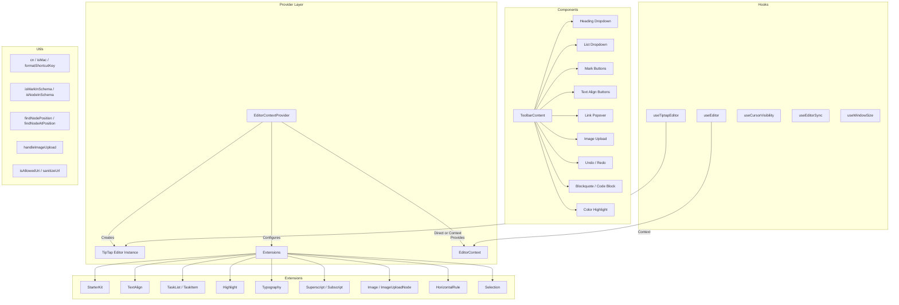

# Модуль утилит редактора

Модуль утилит редактора (`template/lib/editor/`) представляет собой комплексное решение для редактирования форматированного текста, созданное на основе **TipTap** (ProseMirror). Он включает в себя предварительно настроенный поставщик редактора, расширения TipTap, полную библиотеку компонентов панели инструментов, служебные функции для манипулирования DOM и специальные перехватчики React для управления состоянием редактора.

## Обзор архитектуры



## Исходные файлы

|Каталог|Описание|
|-----------|-------------|
|`lib/editor/index.ts`|Экспорт стволов для всех подмодулей|
|`lib/editor/providers/`|`EditorContextProvider` и `EditorContext`|
|`lib/editor/extensions/`|Реэкспорт расширения TipTap|
|`lib/editor/hooks/`|Пользовательские хуки React|
|`lib/editor/utils/`|Вспомогательные функции|
|`lib/editor/contents/`|Компоненты `ToolbarContent` и `EditorContent`|
|`lib/editor/components/`|Примитивы пользовательского интерфейса, кнопки панели инструментов, значки, узлы|
|`lib/editor/styles/`|Редактор стилей CSS|

## Поставщик редактора

### `EditorContextProvider`

Обертывает дочерние элементы предварительно настроенным экземпляром редактора TipTap:

```tsx
import { EditorContextProvider } from '@/lib/editor';

function MyEditor() {
  return (
    <EditorContextProvider>
      <ToolbarContent editor={null} />
      <EditorContent />
    </EditorContextProvider>
  );
}
```

### Конфигурация

Провайдер настраивает TipTap со следующими настройками:

```typescript
const editor = useEditor({
  immediatelyRender: false,
  shouldRerenderOnTransaction: false,
  editorProps: {
    attributes: {
      autocomplete: 'on',
      autocorrect: 'on',
      autocapitalize: 'off',
      'aria-label': 'Main content area, start typing to enter text.',
      class: 'min-h-96',
    },
  },
  extensions: [/* ... */],
});
```

### Предварительно настроенные расширения

|Расширение|Конфигурация|
|-----------|--------------|
|`StarterKit`|`horizontalRule: false`, `link.openOnClick: false`|
|`HorizontalRule`|По умолчанию|
|`TextAlign`|Применяется к узлам `heading` и `paragraph`|
|`ImageUploadNode`|Принять: `image/*`, максимум 5 МБ, максимум 3 изображения.|
|`TaskList` / `TaskItem`|Вложенные задачи включены|
|`Highlight`|Многоцветность включена|
|`Image`|По умолчанию|
|`Typography`|Умные кавычки и тире|
|`Superscript` / `Subscript`|По умолчанию|
|`Selection`|По умолчанию|

## Крючки

### `useEditor(): Editor`

Извлекает экземпляр редактора из `EditorContext`. Должен использоваться в `EditorContextProvider`.

```typescript
import { useEditor } from '@/lib/editor';

function MyComponent() {
  const editor = useEditor();
  // editor is the TipTap Editor instance
}
```

### `useTiptapEditor(providedEditor?): { editor, editorState?, canCommand? }`

Гибкий хук, который принимает дополнительный экземпляр редактора или возвращается к контексту TipTap:

```typescript
import { useTiptapEditor } from '@/lib/editor/hooks';

function ToolbarButton({ editor: externalEditor }) {
  const { editor, editorState, canCommand } = useTiptapEditor(externalEditor);

  const isBold = editorState ? editor?.isActive('bold') : false;
  const canBold = canCommand ? canCommand().toggleBold() : false;
}
```

### Другие крючки

|Крюк|Цель|
|------|---------|
|`useCursorVisibility`|Отслеживает видимость положения курсора в окне просмотра.|
|`useEditorSync`|Синхронизирует содержимое редактора с внешним состоянием|
|`useElementRect`|Отслеживает ограничивающий прямоугольник элемента|
|`useScrolling`|Обнаруживает состояние прокрутки|
|`useThrottledCallback`|Регулирует функцию обратного вызова|
|`useUnmount`|Запускает очистку при отключении компонента|
|`useWindowSize`|Отслеживает размеры окна|

## Служебные функции

### Помощник по имени класса

```typescript
function cn(...classes: (string | boolean | undefined | null)[]): string;
// Filters falsy values and joins with space
cn('min-h-96', isActive && 'bg-blue-500', undefined); // 'min-h-96 bg-blue-500'
```

### Обнаружение платформы

```typescript
function isMac(): boolean;
// Returns true if navigator.platform includes 'mac'
```

### Форматирование сочетаний клавиш

```typescript
function formatShortcutKey(key: string, isMac: boolean, capitalize?: boolean): string;
// Mac: 'ctrl' -> '???', 'alt' -> '???', 'shift' -> '???', 'meta' -> '???'
// Windows: 'ctrl' -> 'Ctrl'

function parseShortcutKeys(props: {
  shortcutKeys: string | undefined;
  delimiter?: string;    // default: '+'
  capitalize?: boolean;  // default: true
}): string[];
// 'ctrl+shift+b' -> ['???', '???', 'B'] (Mac) or ['Ctrl', 'Shift', 'B'] (Windows)
```

### Проверка схемы

```typescript
function isMarkInSchema(markName: string, editor: Editor | null): boolean;
// Checks if a mark type exists in the editor schema

function isNodeInSchema(nodeName: string, editor: Editor | null): boolean;
// Checks if a node type exists in the editor schema

function isExtensionAvailable(editor: Editor | null, extensionNames: string | string[]): boolean;
// Checks if one or more extensions are registered
// Logs a warning if none found
```

### Операции узла

```typescript
function findNodeAtPosition(editor: Editor, position: number): TiptapNode | null;
// Returns the node at the given document position

function findNodePosition(props: {
  editor: Editor | null;
  node?: TiptapNode | null;
  nodePos?: number | null;
}): { pos: number; node: TiptapNode } | null;
// Finds position by node reference or position number

function focusNextNode(editor: Editor): boolean;
// Moves cursor to the next node, creating a paragraph if at end

function isNodeTypeSelected(editor: Editor | null, types: string[]): boolean;
// Checks if current selection is a NodeSelection matching any type

function isValidPosition(pos: number | null | undefined): pos is number;
// Type guard for valid document positions (>= 0)
```

### Загрузка изображения

```typescript
const MAX_FILE_SIZE = 5 * 1024 * 1024; // 5MB

async function handleImageUpload(
  file: File,
  onProgress?: (event: { progress: number }) => void,
  abortSignal?: AbortSignal,
): Promise<string>;
// Returns the URL of the uploaded image
// Default implementation is a demo stub -- replace with actual upload logic
```

### Проверка URL-адреса

```typescript
function isAllowedUri(uri: string | undefined, protocols?: ProtocolConfig): boolean;
// Checks URI against allowed protocols:
// http, https, ftp, ftps, mailto, tel, callto, sms, cid, xmpp
// Plus any custom protocols passed in

function sanitizeUrl(inputUrl: string, baseUrl: string, protocols?: ProtocolConfig): string;
// Returns sanitized URL or '#' if not allowed
```

## Содержимое панели инструментов

Компонент `ToolbarContent` предоставляет полную, предварительно настроенную панель инструментов:

```tsx
import { ToolbarContent } from '@/lib/editor/contents';

<ToolbarContent editor={editor} />
```

### Группы панелей инструментов

|Группа|Компоненты|
|-------|-----------|
|Отменить/Повторить|`UndoRedoButton` (отменить, повторить)|
|Форматирование блоков|`HeadingDropdownMenu` (H1-H4), `ListDropdownMenu` (пуля, приказ, задание), `BlockquoteButton`, `CodeBlockButton`|
|Встроенное форматирование|`MarkButton` (жирный, курсив, зачеркивание, код, подчеркивание), `ColorHighlightPopover`, `LinkPopover`|
|Надстрочный индекс|`MarkButton` (надстрочный индекс, нижний индекс)|
|Выравнивание текста|`TextAlignButton` (слева, по центру, справа, по ширине)|
|СМИ|`ImageUploadButton`|

## Библиотека компонентов

### Примитивные компоненты

Базовые компоненты пользовательского интерфейса, используемые кнопками панели инструментов:

- `Badge`, `Button`, `Card`, `DropdownMenu`, `Input`, `Popover`, `Separator`, `Spacer`, `Toolbar`, `Tooltip`

### Компоненты узла

Пользовательские виды узлов TipTap:

- `HorizontalRuleNode` -- пользовательское расширение горизонтального правила
- `ImageUploadNode` -- узел загрузки файлов с помощью перетаскивания

### Компоненты значков

Значки SVG для всех действий на панели инструментов (жирный, курсив, уровни заголовков, списки, выравнивание и т. д.).
