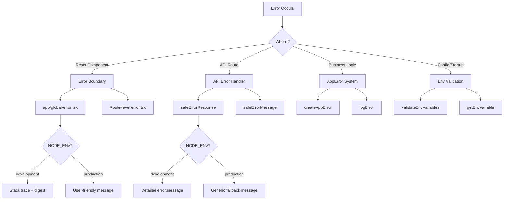

# Шаблоны обработки ошибок

## Обзор

Шаблон Ever Works реализует многоуровневую стратегию обработки ошибок, которая охватывает границы ошибок React, ответы об ошибках маршрута API, типизированные ошибки приложений и проверку переменных среды. При разработке приоритет отдается безопасности (отсутствие утечки информации в рабочей среде), при этом поддерживается удобная для разработчиков отладка в процессе разработки.

## Архитектура



## Исходные файлы

|Файл|Цель|
|------|---------|
|`template/app/global-error.tsx`|Граница ошибки React на корневом уровне|
|`template/app/not-found.tsx`|Страница 404 «Не найдено»|
|`template/lib/utils/api-error.ts`|Утилиты ошибок маршрута API|
|`template/lib/utils/error-handler.ts`|Типы ошибок приложений и журналирование|
|`template/lib/auth/error-handler.ts`|Обработка ошибок аутентификации|

## Границы ошибок React

### Глобальная граница ошибки

Файл `global-error.tsx` перехватывает необработанные ошибки в корне приложения:

```typescript
'use client';

export default function GlobalError({
    error,
    reset,
}: {
    error: Error & { digest?: string };
    reset: () => void;
}) {
    useEffect(() => {
        console.error(error);
    }, [error]);

    return (
        <html lang="en">
            <body>
                <h1>Something went wrong!</h1>
                {process.env.NODE_ENV !== 'production' && (
                    <div>
                        <p className="text-red-600">{error.message}</p>
                        {error.stack && <pre>{error.stack}</pre>}
                        {error.digest && <p>Error ID: {error.digest}</p>}
                    </div>
                )}
                <Button onPress={() => reset()}>Refresh</Button>
                <Link href="/">Go Home</Link>
            </body>
        </html>
    );
}
```

Ключевые модели поведения:
- **Разработка**: показывает сообщение об ошибке, трассировку стека и дайджест ошибок.
- **Производство**: отображается только общее сообщение.
- **Дайджест ошибок**: уникальный идентификатор, созданный Next.js для корреляции ошибок на стороне сервера.
- **Функция сброса**: повторно отображает поддерево границ ошибок.
- **Автономный HTML**: включает собственные теги `<html>` и `<body>`, поскольку заменяет всю страницу.

### Страница не найдена

```typescript
'use client';

export default function NotFound() {
    const router = useRouter();
    return (
        <div>
            <h1>404</h1>
            <h2>Page Not Found</h2>
            <Button onClick={() => router.back()}>Go Back</Button>
            <Button onClick={() => router.push('/')}>Back to Home</Button>
        </div>
    );
}
```

## Обработка ошибок API

### безопасныйErrorResponse

Основная утилита для ответов об ошибках маршрута API:

```typescript
export function safeErrorResponse(
    error: unknown,
    fallbackMessage: string,
    status: number = 500
): NextResponse {
    const detail = error instanceof Error ? error.message : String(error);

    // Always log full details server-side
    console.error(`[API Error] ${fallbackMessage}:`, detail);

    const message = process.env.NODE_ENV === "development" ? detail : fallbackMessage;

    return NextResponse.json({ success: false, error: message }, { status });
}
```

Использование в маршрутах API:

```typescript
export async function GET(request: NextRequest) {
    try {
        const result = await someOperation();
        return NextResponse.json(result);
    } catch (error) {
        return safeErrorResponse(error, 'Failed to process request');
    }
}
```

### SafeErrorMessage

В случаях, когда вам нужна строка ошибки без создания ответа:

```typescript
export function safeErrorMessage(error: unknown, fallbackMessage: string): string {
    if (process.env.NODE_ENV === "development") {
        return error instanceof Error ? error.message : String(error);
    }
    return fallbackMessage;
}
```

## Система ошибок приложений

### Типы ошибок

```typescript
export enum ErrorType {
    AUTH = 'auth',
    CONFIG = 'config',
    DATABASE = 'database',
    NETWORK = 'network',
    VALIDATION = 'validation',
    UNKNOWN = 'unknown'
}

export interface AppError {
    message: string;
    type: ErrorType;
    code?: string;
    originalError?: unknown;
}
```

### Создание типизированных ошибок

```typescript
import { createAppError, ErrorType } from '@/lib/utils/error-handler';

const error = createAppError(
    'Failed to configure OAuth providers',
    ErrorType.CONFIG,
    'OAUTH_CONFIG_FAILED',
    originalError
);
```

### Структурированное журналирование ошибок

```typescript
import { logError } from '@/lib/utils/error-handler';

// Logs: [CONFIG] [Auth Config]: Failed to configure OAuth providers
// Logs: Error code: OAUTH_CONFIG_FAILED
// Logs: Original error: <original error details>
logError(error, 'Auth Config');
```

Функция `logError` обрабатывает три формы ошибок:
1. **AppError** — структурированный журнал с указанием типа, кода и исходной ошибки.
2. **Ошибка** – стандартный журнал с трассировкой сообщений и стека.
3. **Неизвестно** – резервный журнал с приведением строк.

### Проверка переменных среды

```typescript
import { validateEnvVariables, getEnvVariable } from '@/lib/utils/error-handler';

// Validate multiple variables at once
const validationError = validateEnvVariables([
    'DATABASE_URL', 'AUTH_SECRET', 'CRON_SECRET'
]);
if (validationError) {
    logError(validationError, 'Startup');
}

// Get a single required variable (throws if missing)
const dbUrl = getEnvVariable('DATABASE_URL');

// Get an optional variable
const optional = getEnvVariable('OPTIONAL_VAR', false);
```

## Обработка ошибок в аутентификации

Конфигурация аутентификации использует плавную деградацию:

```typescript
const configureProviders = () => {
    try {
        const oauthProviders = configureOAuthProviders();
        return createNextAuthProviders({ /* full config */ });
    } catch (error) {
        const appError = createAppError(
            'Failed to configure OAuth providers. Falling back to credentials only.',
            ErrorType.CONFIG,
            'OAUTH_CONFIG_FAILED',
            error
        );
        logError(appError, 'Auth Config');

        // Fallback to credentials only
        return createNextAuthProviders({
            credentials: { enabled: true },
            google: { enabled: false },
            github: { enabled: false },
            facebook: { enabled: false },
            twitter: { enabled: false },
        });
    }
};
```

Если настройка поставщика OAuth завершается неудачей, система возвращается к аутентификации только с использованием учетных данных, а не выходит из строя.

## Поэтапная обработка ошибок

|Слой|Стратегия|Производственное поведение|
|-------|----------|-------------------|
|Реагировать на компоненты|Граница ошибки (`global-error.tsx`)|Общее сообщение, без трассировки стека|
|API-маршруты|`safeErrorResponse()`|Общее резервное сообщение|
|Действия сервера|`validatedAction()` перехватывает ошибки Zod|Первое сообщение об ошибке проверки|
|Конфигурация аутентификации|Попробуй/поймай с `createAppError()`|Грамотное понижение полномочий|
|Крон Джобс|Try/catch + структурированное журналирование|Зарегистрирована ошибка, получен ответ|
|Вебхуки|Попробуй/поймай + 400 ответов|Общее сообщение об ошибке поставщику|

## Лучшие практики

1. **Никогда не раскрывайте внутренние компоненты в рабочей среде** — всегда используйте `safeErrorResponse` для маршрутов API.
2. **Записывайте все на стороне сервера** — полная информация об ошибках передается в консоль/журнал независимо от среды.
3. **Используйте типизированные ошибки** — `createAppError` с `ErrorType` для единообразной категоризации.
4. **Милая деградация** – вместо сбоя можно вернуться к уменьшенной функциональности.
5. **Дайджесты ошибок для корреляции** — используйте поле `digest` из ошибок Next.js, чтобы отслеживать проблемы на стороне сервера.
6. **Проверка на границах** – проверка переменных окружения при запуске, проверка ввода на границах API.
