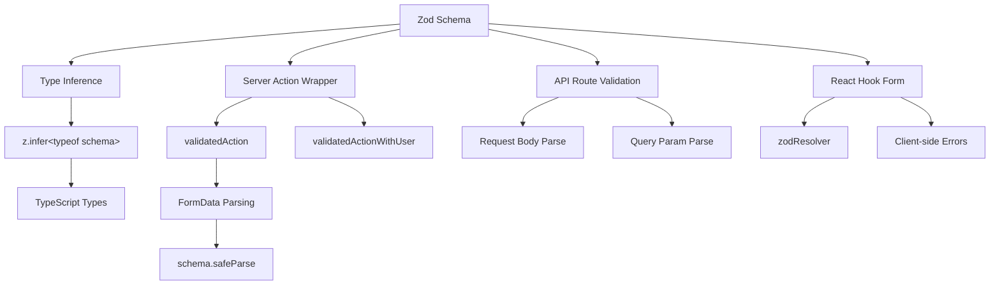

# Шаблоны проверки формы

## Обзор

Шаблон Ever Works использует **Zod** в качестве единственного источника достоверных данных для проверки данных как на границах клиента, так и на сервере. Схемы проверки организованы в `lib/validations/` и используются:

- **Действия сервера** через оболочки `validatedAction()` и `validatedActionWithUser()`
- **Обработчики маршрутов API** для проверки тела запроса/параметров запроса.
- **Интеграция React Hook Form** для проверки формы на стороне клиента.
- **Вывод типа** через `z.infer<>` для сквозной безопасности типов.

## Архитектура



## Исходные файлы

|Файл|Цель|
|------|---------|
|`template/lib/validations/auth.ts`|Схема проверки пароля|
|`template/lib/validations/company.ts`|Схемы CRUD компании|
|`template/lib/validations/client-item.ts`|Схемы отправки/обновления элементов клиента|
|`template/lib/validations/client-dashboard.ts`|Схемы запросов информационной панели|
|`template/lib/validations/sponsor-ad.ts`|Схемы жизненного цикла спонсорских объявлений|
|`template/lib/validations/item.ts`|Схема данных о местоположении|
|`template/lib/validations/user-location.ts`|Схема настроек местоположения пользователя|
|`template/lib/auth/middleware.ts`|`validatedAction` / `validatedActionWithUser` утилиты|

## Шаблоны схем проверки

### Шаблон 1. Проверка пароля с помощью цепочек правил

```typescript
import { z } from "zod";

export const passwordSchema = z
    .string()
    .min(8, "Password must be at least 8 characters")
    .regex(/[A-Z]/, "Password must contain at least one uppercase letter")
    .regex(/[a-z]/, "Password must contain at least one lowercase letter")
    .regex(/[0-9]/, "Password must contain at least one number")
    .regex(/[^A-Za-z0-9]/, "Password must contain at least one special character");
```

Эта схема обеспечивает строгие требования к паролям посредством цепочек уточнений. Каждый `.regex()` предоставляет конкретное сообщение об ошибке, которое пользовательский интерфейс может отображать в строке.

### Шаблон 2. Создание/обновление пар схем

Проверка компании демонстрирует шаблон создания/обновления:

```typescript
export const createCompanySchema = z.object({
    name: z.string().min(1, "Company name is required").max(255),
    website: z.string().url("Invalid URL format").optional().or(z.literal("")),
    domain: z.string().max(255).optional()
        .transform((val) => val?.toLowerCase().trim() || undefined),
    slug: z.string().max(255).optional()
        .transform((val) => val?.toLowerCase().trim() || undefined)
        .refine(
            (val) => !val || /^[a-z0-9-]+$/.test(val),
            { message: "Slug must contain only lowercase letters, numbers, and hyphens" }
        ),
    status: z.enum(companyStatus).default("active"),
});

export const updateCompanySchema = z.object({
    id: z.string().uuid(),
    name: z.string().min(1).max(255).optional(),  // Optional for updates
    // ... other fields also optional
    status: z.enum(companyStatus).optional(),
});
```

Ключевые отличия:
- **Создание схем** содержит обязательные поля со значениями по умолчанию.
- **Схемы обновления** требуют `id` и делают все остальные поля необязательными.
- Оба используют логику `.transform()` для нормализации (например, строчные буквы).

### Шаблон 3: Поля статуса на основе перечислений

```typescript
export const companyStatus = ["active", "inactive"] as const;
export const itemStatus = ['pending', 'approved', 'rejected'] as const;
export const sponsorAdStatuses = [
    "pending_payment", "pending", "rejected",
    "active", "expired", "cancelled",
] as const;

// Usage in schemas
status: z.enum(companyStatus).default("active"),
status: z.enum(sponsorAdStatuses).optional(),
```

Использование массивов `as const` с `z.enum()` обеспечивает как проверку во время выполнения, так и безопасность типов во время компиляции.

### Шаблон 4. Схемы параметров запроса с преобразованиями

```typescript
export const clientItemsListQuerySchema = z.object({
    page: z.string().optional()
        .transform(val => (val ? parseInt(val, 10) : 1))
        .refine(val => !Number.isNaN(val), { message: 'Page must be a valid number' })
        .refine(val => val >= 1, { message: 'Page must be at least 1' }),
    limit: z.string().optional()
        .transform(val => (val ? parseInt(val, 10) : 10))
        .refine(val => val >= 1 && val <= 100, { message: 'Limit must be between 1 and 100' }),
    status: z.enum(clientStatusFilter).optional().default('all'),
    search: z.string().max(100, 'Search query is too long').optional(),
    sortBy: z.enum(['name', 'updated_at', 'status', 'submitted_at']).optional().default('updated_at'),
    sortOrder: z.enum(['asc', 'desc']).optional().default('desc'),
    deleted: z.string().optional().transform(val => val === 'true'),
});
```

Параметры запроса поступают в виде строк. Схема использует `.transform()` для преобразования их в правильные типы (числа, логические значения) при применении проверки и значений по умолчанию.

### Шаблон 5: схемы вложенных объектов с межполевой проверкой

```typescript
export const updateLocationSchema = z
    .object({
        defaultLatitude: z.number().min(-90).max(90).nullable().optional(),
        defaultLongitude: z.number().min(-180).max(180).nullable().optional(),
        defaultCity: z.string().max(200).nullable().optional(),
        defaultCountry: z.string().max(100).nullable().optional(),
        locationPrivacy: locationPrivacySchema.optional(),
    })
    .refine(
        (data) => {
            const hasLat = data.defaultLatitude != null;
            const hasLng = data.defaultLongitude != null;
            return hasLat === hasLng;  // Both or neither
        },
        { message: 'Both latitude and longitude must be provided together' }
    );
```

`.refine()` на уровне объекта проверяет зависимости между полями: широта и долгота должны либо присутствовать, либо оба отсутствовать.

### Шаблон 6: Типы объединения для гибких входных данных

```typescript
category: z.union([
    z.string().min(1, 'Category is required'),
    z.array(z.string().min(1)).min(1, 'At least one category is required'),
]).optional().nullable(),
```

При этом для поля категории принимается как одна строка, так и массив строк, поддерживающий различные типы ввода формы.

## Проверка на стороне сервера

### validatedAction-оболочка

```typescript
export function validatedAction<S extends z.ZodType<any, any>, T>(
    schema: S,
    action: ValidatedActionFunction<S, T>
) {
    return async (prevState: ActionState, formData: FormData): Promise<T> => {
        const result = schema.safeParse(Object.fromEntries(formData));
        if (!result.success) {
            return { error: result.error.issues[0].message } as T;
        }
        return action(result.data, formData);
    };
}
```

Эта функция высшего порядка:
1. Преобразует `FormData` в простой объект
2. Проверяет соответствие схеме Zod с использованием `safeParse()`
3. Возвращает первую ошибку проверки, если она недействительна.
4. Вызывает функцию действия с проанализированными типизированными данными, если они действительны.

### validatedActionWithUser оболочка

```typescript
export function validatedActionWithUser<S extends z.ZodType<any, any>, T>(
    schema: S,
    action: ValidatedActionWithUserFunction<S, T>
) {
    return async (prevState: ActionState, formData: FormData): Promise<T> => {
        const session = await auth();
        if (!session?.user) {
            throw new Error("User is not authenticated");
        }
        const result = schema.safeParse(Object.fromEntries(formData));
        if (!result.success) {
            return { error: result.error.issues[0].message } as T;
        }
        return action(result.data, formData, session.user);
    };
}
```

Это добавляет проверку аутентификации перед проверкой, передавая аутентифицированный объект `user` в функцию действия.

## Вывод типа

Каждая схема экспортирует выведенные типы TypeScript:

```typescript
export type CreateCompanyInput = z.infer<typeof createCompanySchema>;
export type UpdateCompanyInput = z.infer<typeof updateCompanySchema>;
export type ClientUpdateItemInput = z.infer<typeof clientUpdateItemSchema>;
export type ClientCreateItemInput = z.infer<typeof clientCreateItemSchema>;
```

Эти типы используются на уровне обслуживания и в маршрутах API, обеспечивая соответствие проверенной формы данных тому, что ожидает бизнес-логика.

## Лучшие практики

1. **Одна схема, несколько потребителей** — определите один раз в `lib/validations/`, используйте везде.
2. **Преобразование на границе** – используйте `.transform()` для преобразования строк в правильные типы.
3. **Пользовательские сообщения об ошибках** – каждое правило проверки включает понятное пользователю сообщение.
4. **Общие подсхемы** — повторное использование схем, таких как `locationSchema` и `passwordSchema`, в разных формах.
5. **Выводить типы из схем** – никогда не определять вручную типы, дублирующие определения схемы.
6. **Проверка между полями** – используйте `.refine()` на уровне объекта для правил с несколькими полями.
7. **Разумные значения по умолчанию** — используйте `.default()` для необязательных полей со стандартными значениями.
