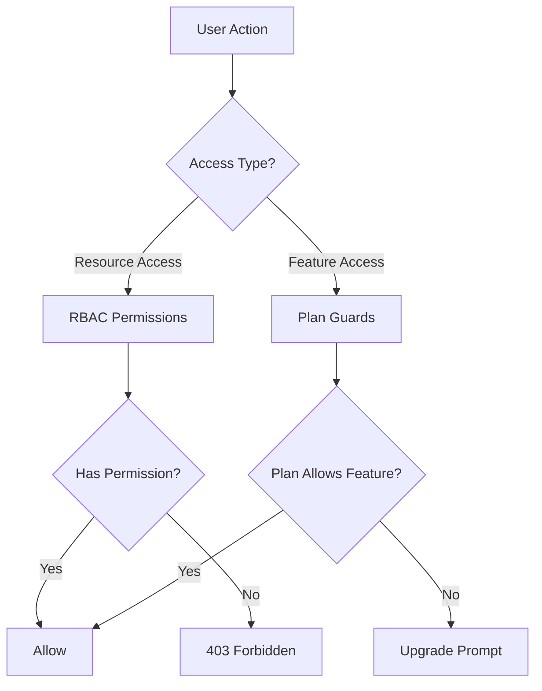
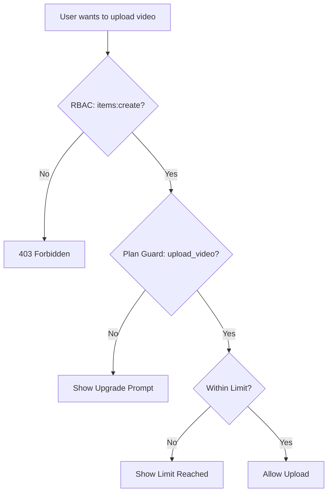

# Охрана и система разрешений

Шаблон Ever Works реализует двухуровневую систему контроля доступа: **разрешения RBAC** для доступа к ресурсам на основе ролей и **плановые защиты** для ограничения функций на основе подписки. Вместе эти системы контролируют, что могут делать пользователи и к каким функциям они могут получить доступ.

## Архитектура системы



## Система разрешений RBAC

### Определения разрешений

Все разрешения определяются в `lib/permissions/definitions.ts` с использованием формата `resource:action`:

```typescript
const PERMISSIONS = {
  items: {
    read: 'items:read',
    create: 'items:create',
    update: 'items:update',
    delete: 'items:delete',
    review: 'items:review',
    approve: 'items:approve',
    reject: 'items:reject',
  },
  categories: { read, create, update, delete },
  tags: { read, create, update, delete },
  roles: { read, create, update, delete },
  users: { read, create, update, delete, assignRoles },
  analytics: { read, export },
  system: { settings },
} as const;
```

### Тип разрешения

Тип `Permission` является производным от константного объекта `PERMISSIONS`, обеспечивая безопасность типов:

```typescript
type Permission = 'items:read' | 'items:create' | ... | 'system:settings';
```

### Роли по умолчанию

Две роли по умолчанию предварительно настроены:

|Роль|идентификатор|Разрешения|
|---|---|---|
|Супер администратор|`super-admin`|Все системные разрешения|
|Контент-менеджер|`content-manager`|Предметы + Категории + Теги (полный CRUD + обзор)|

### Группы разрешений

Разрешения организованы в удобные для пользовательского интерфейса группы в `lib/permissions/groups.ts`:

|Группа|Значок|Включенные ресурсы|
|---|---|---|
|Управление контентом|`FileText`|Предметы, Категории, Теги|
|Управление пользователями|`Users`|Пользователи, роли|
|Система и аналитика|`Settings`|Аналитика, Система|

### Служебные функции

Модуль `lib/permissions/utils.ts` предоставляет утилиты управления состоянием пользовательского интерфейса разрешений:

```typescript
// Create a permission state map for checkboxes
const state = createPermissionState(currentPermissions);
// { 'items:read': true, 'items:create': true, ... }

// Get selected permissions from state
const selected = getSelectedPermissions(state);

// Calculate changes between old and new permissions
const changes = calculatePermissionChanges(original, updated);
// { added: ['items:delete'], removed: ['tags:create'] }

// Compare two permission sets
const equal = arePermissionsEqual(perms1, perms2);

// Filter permissions by search term
const filtered = filterPermissions(allPerms, 'items');
```

## План системы охраны

Охранники плана контролируют доступ к функциям на основе плана подписки пользователя. Система определена в `lib/guards/plan-features.guard.ts`.

### Иерархия планов

```typescript
const PLAN_LEVELS: Record<string, number> = {
  free: 1,
  standard: 2,
  premium: 3,
};
```

### Определения функций

Все закрытые функции перечислены в `FEATURES`:

|Категория|Особенности|
|---|---|
|Представление|`submit_product`, `extended_description`, `unlimited_description`, `upload_images`, `upload_video`|
|Значки|`verified_badge`, `sponsored_badge`|
|Обзор|`priority_review`, `instant_review`|
|Видимость|`search_visibility`, `category_placement`, `sponsored_position`, `homepage_featured`, `newsletter_mention`|
|Аналитика|`view_statistics`, `advanced_analytics`|
|Поддержка|`email_support`, `priority_email_support`, `phone_support`|
|Социальные|`social_sharing`, `learn_more_button`|
|Другое|`free_modifications`, `unlimited_submissions`|

### Матрица доступа к функциям

Каждая функция соответствует правилу доступа:

|Тип доступа|Синтаксис|Пример|
|---|---|---|
|Все планы|`'all'`|`submit_product`, `upload_images`|
|Единый план|`PaymentPlan.PREMIUM`|`upload_video`, `instant_review`|
|Минимальный план|`{ minPlan: PaymentPlan.STANDARD }`|`verified_badge`, `priority_review`|
|Конкретные планы|`[PaymentPlan.STANDARD, PaymentPlan.PREMIUM]`|(пользовательские функции)|

### Ограничения плана

Числовые ограничения зависят от плана:

|Лимит|Бесплатно|Стандартный|Премиум|
|---|---|---|---|
|`max_images`| 1 | 5 |Безлимитный|
|`max_description_words`| 200 | 500 |Безлимитный|
|`max_submissions`| 1 | 10 |Безлимитный|
|`review_days`| 7 | 3 | 1 |
|`free_modification_days`| 0 | 30 | 365 |

### Использование защиты на стороне сервера

```typescript
import { canAccessFeature, createPlanGuard, FEATURES } from '@/lib/guards';

// Simple check
const allowed = canAccessFeature(FEATURES.UPLOAD_VIDEO, userPlan);

// Guard factory for multiple checks
const guard = createPlanGuard(userPlan);
guard.canAccess(FEATURES.VERIFIED_BADGE);       // boolean
guard.requireFeature(FEATURES.UPLOAD_VIDEO);     // throws PlanGuardError
guard.getLimit('max_images');                    // number | null
guard.isWithinLimit('max_submissions', count);   // boolean
guard.getAccessibleFeatures();                   // Feature[]
```

### Плангуардеррор

При сбое `requireFeature` выдается типизированная ошибка:

```typescript
class PlanGuardError extends Error {
  feature: Feature;      // e.g., 'upload_video'
  userPlan: string;      // e.g., 'free'
  requiredPlan: PaymentPlan; // e.g., 'premium'
}
```

### Защитный крючок на стороне клиента

Хук `usePlanGuard` в `hooks/use-plan-guard.ts` оборачивает систему защиты для компонентов React:

```typescript
import { usePlanGuard, FEATURES } from '@/hooks/use-plan-guard';

function VideoUploadButton() {
  const { canAccess, requireUpgrade, isLoading } = usePlanGuard();

  if (isLoading) return <Spinner />;

  const upgradePlan = requireUpgrade(FEATURES.UPLOAD_VIDEO);
  if (upgradePlan) {
    return <UpgradePrompt plan={upgradePlan} />;
  }

  return <Button>Upload Video</Button>;
}
```

### Специализированные крючки

#### `useFeatureAccess`

Проверьте доступ к одной функции:

```typescript
const { hasAccess, requiredPlan, isLoading } = useFeatureAccess(FEATURES.VERIFIED_BADGE);
```

#### `useFeatureLimit`

Проверьте числовые пределы с оставшимся количеством:

```typescript
const { limit, isUnlimited, remaining, isWithinLimit } = useFeatureLimit('max_images', currentCount);

if (!isUnlimited && remaining <= 0) {
  return <LimitReached />;
}
```

## Составление стражей

Охранники естественным образом компонуются для сложных сценариев контроля доступа:

```typescript
// Server: Combine RBAC + plan check
function canCreateItem(userPermissions: UserPermissions, userPlan: string): boolean {
  const hasRBACAccess = hasPermission(userPermissions, 'items:create');
  const hasPlanAccess = canAccessFeature(FEATURES.SUBMIT_PRODUCT, userPlan);
  return hasRBACAccess && hasPlanAccess;
}

// Client: Combine hooks
function CreateItemButton() {
  const { canAccess } = usePlanGuard();
  const { permissions } = useRolePermissions();

  const canCreate =
    hasPermission(permissions, 'items:create') &&
    canAccess(FEATURES.SUBMIT_PRODUCT);

  if (!canCreate) return null;
  return <Button>Create Item</Button>;
}
```

## Блок-схема защиты



## Добавление новых охранников

### Добавление нового разрешения

1. Добавьте в `PERMISSIONS` в `lib/permissions/definitions.ts`:

```typescript
billing: {
  read: 'billing:read',
  manage: 'billing:manage',
},
```

2. Добавить в группу разрешений в `lib/permissions/groups.ts`
3. Назначьте соответствующие роли по умолчанию

### Добавление новой функции плана

1. Добавьте константу функции к `FEATURES` в `lib/guards/plan-features.guard.ts`
2. Определите правило доступа в `FEATURE_ACCESS`
3. При желании добавьте числовые ограничения в `PLAN_LIMITS`.

## Лучшие практики

1. **Предпочитайте плановую защиту для ограничения функций** и RBAC для контроля доступа к ресурсам — не смешивайте их.
2. **Всегда проверяйте на сервере**, даже если клиент скрывает элементы пользовательского интерфейса. Проверка на стороне клиента предназначена только для пользовательского интерфейса.
3. **Используйте `createPlanGuard`** для нескольких проверок в одном запросе, чтобы избежать повторного поиска плана.
4. **Обработка состояний загрузки** в перехватчиках: данные плана могут загружаться асинхронно из службы подписки.
5. **Сохраняйте описательные названия функций** — используйте `upload_video`, а не `feature_3` для ясности в журналах и сообщениях об ошибках.
