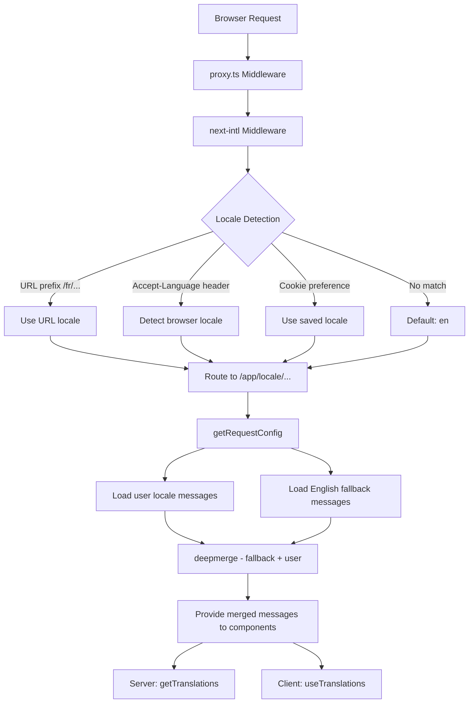

# i18n Реализация

## Обзор

Шаблон Ever Works реализует интернационализацию с использованием **next-intl** с поддержкой более 20 локалей, направление текста RTL (справа налево), резервные варианты сообщений с глубоким слиянием и навигацию с учетом локали. Система построена на трех уровнях: конфигурация маршрутизации, загрузка сообщений с резервным копированием и помощники навигации с учетом локали.

## Архитектура



## Исходные файлы

|Файл|Цель|
|------|---------|
|`template/i18n/routing.ts`|Конфигурация маршрутизации локали|
|`template/i18n/request.ts`|Загрузка сообщения на уровне запроса|
|`template/i18n/navigation.ts`|Экспорт навигации с учетом локали|
|`template/lib/constants.ts`|Определения локали и RTL|
|`template/messages/*.json`|Файлы сообщений перевода|
|`template/proxy.ts`|Промежуточное ПО с разрешением префикса локали|

## Поддерживаемые локали

```typescript
// lib/constants.ts
export const DEFAULT_LOCALE = 'en';
export const LOCALES = [
    'en', 'fr', 'es', 'de', 'zh', 'ar', 'he',
    'ru', 'uk', 'pt', 'it', 'ja', 'ko', 'nl',
    'pl', 'tr', 'vi', 'th', 'hi', 'id', 'bg'
] as const;

export type Locale = (typeof LOCALES)[number];

/** Locales that use right-to-left text direction */
export const RTL_LOCALES: readonly Locale[] = ['ar', 'he'] as const;
```

Шаблон поддерживает 20 языковых стандартов, включая два языковых стандарта RTL (арабский и иврит).

## Конфигурация маршрутизации

```typescript
// i18n/routing.ts
import { defineRouting } from "next-intl/routing";
import { DEFAULT_LOCALE, LOCALES } from "@/lib/constants";

export const routing = defineRouting({
    locales: LOCALES,
    defaultLocale: DEFAULT_LOCALE,
    localeDetection: true,
    localePrefix: "as-needed",
});
```

|Настройка|Значение|Эффект|
|---------|-------|--------|
|`locales`|20 кодов локали|Поддерживаемый набор языков|
|`defaultLocale`|`'en'`|Резервный вариант, когда ни одна локаль не соответствует|
|`localeDetection`|`true`|Автоматическое обнаружение по заголовку `Accept-Language`|
|`localePrefix`|`"as-needed"`|Локаль по умолчанию не имеет префикса; другие делают|

С `localePrefix: "as-needed"`:
- Английский (по умолчанию): `https://example.com/about`
- Французский: `https://example.com/fr/about`
- Арабский: `https://example.com/ar/about`

## Загрузка сообщения с резервным вариантом

```typescript
// i18n/request.ts
import deepmerge from "deepmerge";
import { getRequestConfig } from "next-intl/server";

export default getRequestConfig(async ({ requestLocale }) => {
    let locale = await requestLocale;

    if (!locale || !routing.locales.includes(locale as any)) {
        locale = routing.defaultLocale;
    }

    const userMessages = (await import(`../messages/${locale}.json`)).default;
    const defaultMessages = (await import(`../messages/en.json`)).default;
    const messages = deepmerge(defaultMessages, userMessages) as any;

    return { locale, messages };
});
```

Стратегия глубокого слияния гарантирует, что:
1. Сообщения на английском языке служат полным запасным набором
2. Сообщения, специфичные для локали, переопределяют английский язык, если существуют переводы.
3. Отсутствующие переводы изящно переключаются на английский вместо отображения ключей.

### Структура файла сообщения

```
messages/
  en.json        # Complete English messages (base)
  fr.json        # French translations
  es.json        # Spanish translations
  de.json        # German translations
  ar.json        # Arabic translations
  he.json        # Hebrew translations
  zh.json        # Chinese translations
  ...            # 13+ more locales
```

### Форматы даты/числа

```typescript
// i18n/request.ts
export const formats = {
    dateTime: {
        short: {
            day: "numeric",
            month: "short",
            year: "numeric",
        },
    },
    number: {
        precise: {
            maximumFractionDigits: 5,
        },
    },
    list: {
        enumeration: {
            style: "long",
            type: "conjunction",
        },
    },
} satisfies Formats;
```

## Помощники по навигации

```typescript
// i18n/navigation.ts
import { createNavigation } from "next-intl/navigation";
import { routing } from "./routing";

export const { Link, redirect, usePathname, useRouter, getPathname } =
    createNavigation(routing);
```

Эти экспорты заменяют стандартные навигационные утилиты Next.js версиями с учетом локали:

|Экспорт|Стандартный Next.js|Поведение с учетом локали|
|--------|-----------------|----------------------|
|`Link`|`next/link`|Добавляет префикс локали к `href`.|
|`redirect`|`next/navigation`|Сохраняет текущую локаль при перенаправлении|
|`usePathname`|`next/navigation`|Возвращает путь без префикса локали.|
|`useRouter`|`next/navigation`|`push()` / `replace()` добавить префикс локали|
|`getPathname`| -- |Путь на стороне сервера с локалью|

### Использование в серверных компонентах

```typescript
import { getTranslations } from 'next-intl/server';

export default async function Page({ params }: { params: Promise<{ locale: string }> }) {
    const { locale } = await params;
    const t = await getTranslations({ locale, namespace: 'common' });

    return <h1>{t('WELCOME')}</h1>;
}
```

### Использование в клиентских компонентах

```typescript
'use client';
import { useTranslations } from 'next-intl';
import { Link } from '@/i18n/navigation';

export function NavLink() {
    const t = useTranslations('navigation');
    return <Link href="/about">{t('ABOUT')}</Link>;
}
```

## Разрешение локали промежуточного программного обеспечения

Промежуточное программное обеспечение в `proxy.ts` обрабатывает информацию о локали для принятия решений по защите аутентификации:

```typescript
function resolveLocalePrefix(pathname: string): {
    prefix: string;           // "/fr" or ""
    hasLocale: boolean;
    locale?: string;
    pathWithoutLocale: string; // "/admin/items"
} {
    const segments = pathname.split('/').filter(Boolean);
    const maybeLocale = segments[0];
    const hasLocale = routing.locales.includes(maybeLocale as any);
    const pathWithoutLocale = hasLocale
        ? `/${segments.slice(1).join('/')}`
        : pathname;
    return {
        prefix: hasLocale ? `/${maybeLocale}` : '',
        hasLocale,
        locale: hasLocale ? maybeLocale : undefined,
        pathWithoutLocale
    };
}
```

Это используется для создания URL-адресов перенаправления с учетом локали в средствах защиты аутентификации:

```typescript
url.pathname = `${localePrefix}/auth/signin`;
```

## Поддержка RTL

Локали RTL определены в `lib/constants.ts`:

```typescript
export const RTL_LOCALES: readonly Locale[] = ['ar', 'he'] as const;
```

Корневой компонент макета должен применить атрибут `dir` на основе текущей локали:

```typescript
// app/[locale]/layout.tsx
const isRTL = RTL_LOCALES.includes(locale as Locale);

return (
    <html lang={locale} dir={isRTL ? 'rtl' : 'ltr'}>
        {/* ... */}
    </html>
);
```

## SEO: альтернативы Hreflang

Утилита `lib/seo/hreflang.ts` генерирует ссылки на альтернативных языках для SEO:

```typescript
import { generateHreflangAlternates } from '@/lib/seo/hreflang';

export async function generateMetadata(): Promise<Metadata> {
    return {
        alternates: {
            languages: generateHreflangAlternates('/about')
        }
    };
}
```

При этом создаются теги `<link rel="alternate" hreflang="fr" href="...">` для всех поддерживаемых языков, а также запись `x-default`, указывающая на английскую версию.

## Интеграция плагинов Next.js

```typescript
// next.config.ts
import createNextIntlPlugin from "next-intl/plugin";

const withNextIntl = createNextIntlPlugin('./i18n/request.ts');
const configWithIntl = withNextIntl(nextConfig);
```

Плагин `next-intl` применяется к конфигурации Next.js с явным путем к файлу конфигурации запроса.

## Лучшие практики

1. **Всегда используйте `getTranslations` в компонентах сервера** – загружает переводы без затрат на клиентский пакет.
2. **Импортировать навигацию из `@/i18n/navigation`** – обеспечивает привязку с учетом локали.
3. **Сохраняйте английский полностью** — он служит запасным вариантом для всех остальных языков.
4. **Используйте переводы в пространстве имен** — организуйте по функциям (`common`, `footer`, `pages` и т. д.)
5. **Проверьте RTL с помощью `RTL_LOCALES`** — примените `dir="rtl"` на уровне макета.
6. **Создать теги hreflang** — используйте `generateHreflangAlternates()` в функциях метаданных.
