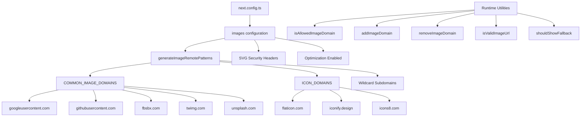

# Оптимизация изображения

## Обзор

Шаблон Ever Works настраивает оптимизацию изображений Next.js с динамическими удаленными шаблонами, поддержкой SVG и служебным уровнем для управления доменом. Система обрабатывает изображения от поставщиков OAuth (Google, GitHub, Facebook, Twitter), сервисов стоковых фотографий (Unsplash) и библиотек значков, одновременно обеспечивая соблюдение заголовков безопасности для контента SVG.

## Архитектура



## Исходные файлы

|Файл|Цель|
|------|---------|
|`template/next.config.ts`|Конфигурация образа Next.js|
|`template/lib/utils/image-domains.ts`|Утилиты управления доменом|

## Конфигурация

### Настройки изображения Next.js

```typescript
// next.config.ts
images: {
    remotePatterns: generateImageRemotePatterns(),
    dangerouslyAllowSVG: true,
    contentDispositionType: 'attachment',
    contentSecurityPolicy: "default-src 'self'; script-src 'none'; sandbox;",
    unoptimized: false,
},
```

|Настройка|Значение|Цель|
|---------|-------|---------|
|`remotePatterns`|Динамический через `generateImageRemotePatterns()`|Белый список внешних доменов изображений|
|`dangerouslyAllowSVG`|`true`|Разрешить изображения SVG через оптимизатор|
|`contentDispositionType`|`'attachment'`|Принудительная загрузка вместо встроенного рендеринга для необработанного доступа|
|`contentSecurityPolicy`|Строгая песочница|Предотвращение XSS-атак на основе SVG|
|`unoptimized`|`false`|Оставьте оптимизацию изображений включенной|

### SVG-безопасность

Файлы SVG могут содержать встроенный JavaScript. Шаблон смягчает это с помощью:
- **Политика безопасности контента**: `script-src 'none'; sandbox;` предотвращает выполнение скриптов в SVG.
- **Расположение контента**: `attachment` гарантирует загрузку, а не выполнение SVG-файлов при прямом доступе.

## Удаленная генерация шаблонов

Функция `generateImageRemotePatterns()` динамически создает список разрешений:

```typescript
export function generateImageRemotePatterns() {
    const patterns = [
        {
            protocol: 'https' as const,
            hostname: 'lh3.googleusercontent.com',
            pathname: '/a/**'
        },
        {
            protocol: 'https' as const,
            hostname: 'avatars.githubusercontent.com',
            pathname: '/u/**'
        },
        {
            protocol: 'https' as const,
            hostname: 'platform-lookaside.fbsbx.com',
            pathname: '/platform/**'
        },
        // ... more specific patterns
    ];

    // Add wildcard subdomain patterns
    [...COMMON_IMAGE_DOMAINS, ...ICON_DOMAINS].forEach((domain) => {
        patterns.push({
            protocol: 'https' as const,
            hostname: `*.${domain}`,
            pathname: '/**'
        });
    });

    return patterns;
}
```

### Разрешенные домены

**Общие домены изображений** (аватары OAuth, стоковые фотографии):

|Домен|Источник|
|--------|--------|
|`lh3.googleusercontent.com`|Аватары Google OAuth|
|`avatars.githubusercontent.com`|Аватары GitHub OAuth|
|`platform-lookaside.fbsbx.com`|Аватары Facebook OAuth|
|`pbs.twimg.com`|Аватары Twitter/X|
|`images.unsplash.com`|Unsplash стоковые фотографии|

**Домены значков** (значки предметов):

|Домен|Источник|
|--------|--------|
|`flaticon.com`|Иконки флэтикона|
|`iconify.design`|Иконизировать значки|
|`icons8.com`|Иконки8 иконок|
|`feathericons.com`|Иконки перьев|
|`heroicons.com`|Иконки героев|
|`tabler-icons.io`|Иконки таблиц|

## Управление доменом во время выполнения

### Проверка разрешенных доменов

```typescript
import { isAllowedImageDomain } from '@/lib/utils/image-domains';

// Returns true for whitelisted domains
isAllowedImageDomain('https://lh3.googleusercontent.com/a/photo.jpg'); // true
isAllowedImageDomain('https://cdn.flaticon.com/icons/svg/123.svg');    // true
isAllowedImageDomain('https://evil-site.com/image.jpg');               // false

// Relative URLs are always allowed
isAllowedImageDomain('/images/logo.png'); // true
```

### Динамическое добавление домена

```typescript
import { addImageDomain, removeImageDomain } from '@/lib/utils/image-domains';

// Add a new domain at runtime
addImageDomain('cdn.example.com');

// Add as an icon domain
addImageDomain('my-icons.com', true);

// Remove a domain
removeImageDomain('old-cdn.com');
```

Примечание. Дополнения среды выполнения влияют на служебные функции, но не изменяют удаленные шаблоны Next.js `next.config.ts` (которые требуют перестроения).

### Проверка URL-адреса

```typescript
import { isValidImageUrl, isProblematicUrl, shouldShowFallback } from '@/lib/utils/image-domains';

// Check URL format validity
isValidImageUrl('https://example.com/photo.jpg'); // true
isValidImageUrl('/images/local.png');              // true (relative)
isValidImageUrl('not-a-url');                      // false

// Check for problematic URLs (non-image pages, redirect URLs)
isProblematicUrl('https://flaticon.com/icone-gratuite/search'); // true (not a direct image)
isProblematicUrl('https://cdn.flaticon.com/icon.svg');          // false (has image extension)

// Determine if fallback icon should be shown
shouldShowFallback('');                                          // true (empty)
shouldShowFallback('https://flaticon.com/icone-gratuite/123');   // true (problematic)
shouldShowFallback('https://cdn.flaticon.com/icon.svg');         // false
```

## Заголовки безопасности

`next.config.ts` применяет заголовки безопасности ко всем маршрутам:

```typescript
async headers() {
    return [{
        source: "/(.*)",
        headers: [
            { key: "X-Content-Type-Options", value: "nosniff" },
            { key: "X-Frame-Options", value: "DENY" },
            { key: "Referrer-Policy", value: "strict-origin-when-cross-origin" },
            { key: "X-DNS-Prefetch-Control", value: "on" },
            { key: "Strict-Transport-Security", value: "max-age=63072000; includeSubDomains; preload" },
            {
                key: "Content-Security-Policy",
                value: "default-src 'self'; script-src 'self' 'unsafe-inline' https://assets.lemonsqueezy.com; style-src 'self' 'unsafe-inline'; img-src 'self' data: https:; font-src 'self'; connect-src 'self' https:; frame-ancestors 'none';"
            },
        ],
    }];
},
```

Директива `img-src 'self' data: https:` разрешает изображения из одного и того же источника, URI данных и любого источника HTTPS. Это намеренно разрешено для `img-src`, поскольку компонент изображения Next.js обрабатывает проверку домена на уровне приложения.

## Лучшие практики

1. **Используйте `next/image`** для всех внешних изображений — он обеспечивает оптимизацию, отложенную загрузку и преобразование формата.
2. **Добавить новые домены в `image-domains.ts`** – не встроить в `next.config.ts`
3. **Проверьте `shouldShowFallback()`** перед рендерингом — покажите значок по умолчанию для недействительных/отсутствующих URL-адресов.
4. **Сохраняйте заголовки безопасности SVG** — никогда не удаляйте настройки `contentSecurityPolicy` или `contentDispositionType`.
5. **Предпочитайте ограничения по именам путей** – по возможности используйте определенные шаблоны `pathname` (например, `/a/**`) вместо широких подстановочных знаков.
