# Обзор утилит Lib

Каталог `template/lib/` — это основной уровень утилит и бизнес-логики шаблона Ever Works. Он содержит общие модули для аналитики, связи через API, аутентификации, фоновых заданий, кэширования, настройки, доступа к базе данных, платежей, инструментов редактора, защиты и многого другого. Вся некомпонентная и немаршрутизирующая логика находится здесь, следуя принципу сохранения представления компонентов и делегирования тяжелой логики `lib/`.

## Карта модуля

```mermaid
graph TD
    subgraph Core Infrastructure
        A[config/] --> B[config.ts / config-manager.ts]
        C[db/] --> D[drizzle.ts / queries/ / migrate.ts]
        E[cache-config.ts] --> F[cache-invalidation.ts]
    end

    subgraph Auth & Security
        G[auth/] --> H[NextAuth / Supabase / Guards / Caching]
        I[guards/] --> J[Plan Feature Access Control]
        K[permissions/] --> L[Role-Based Permissions]
    end

    subgraph API Layer
        M[api/] --> N[ApiClient / ServerClient / Error Handling]
    end

    subgraph Analytics & Tracking
        O[analytics/] --> P[PostHog + Sentry Singleton]
    end

    subgraph Background Processing
        Q[background-jobs/] --> R[Trigger.dev / Local / NoOp]
    end

    subgraph Content & Editor
        S[content.ts] --> T[Git CMS Content Loader]
        U[editor/] --> V[TipTap Rich Text Editor]
        W[lib.ts] --> X[Content Path / File Utilities]
    end

    subgraph Business Logic
        Y[services/] --> Z[20+ Domain Services]
        AA[repositories/] --> AB[Data Access Layer]
        AC[payment/] --> AD[Stripe / LemonSqueezy / Polar]
    end

    subgraph Shared Utilities
        AE[constants.ts + constants/]
        AF[utils.ts + utils/]
        AG[types.ts + types/]
        AH[validations/]
        AI[helpers.ts]
    end
```



## Структура каталогов

|Каталог/файл|Описание|
|-----------------|-------------|
|`lib/analytics/`|PostHog + Sentry Analytics Singleton ([docs](./analytics-module))|
|`lib/api/`|HTTP-клиенты для браузера и сервера ([docs](./api-client-module))|
|`lib/auth/`|Аутентификация с помощью NextAuth.js + Supabase ([docs](./auth-utilities-module))|
|`lib/background-jobs/`|Планирование заданий с помощью Trigger.dev/local/no-op ([docs](./background-jobs-module))|
|`lib/cache-config.ts`|Срок жизни кэша и определения тегов ([docs](./cache-invalidation-module))|
|`lib/cache-invalidation.ts`|Функции аннулирования кэша ([docs](./cache-invalidation-module))|
|`lib/config/`|Служба централизованной настройки со схемами Zod|
|`lib/config.ts`|Конфигурация сайта (`siteConfig`)|
|`lib/config-manager.ts`|Менеджер конфигурации среды выполнения|
|`lib/constants.ts`|Константы приложения ([docs](./constants-reference-module))|
|`lib/constants/`|Константы, специфичные для предметной области (платежи, аналитика)|
|`lib/content.ts`|Загрузка и кэширование контента CMS на основе Git|
|`lib/db/`|Подключение к базе данных, миграции, заполнение, запросы ([docs](./db-utilities-module))|
|`lib/editor/`|Компоненты и утилиты редактора форматированного текста TipTap ([docs](./editor-utilities-module))|
|`lib/guards/`|Управление доступом к функциям на основе плана ([docs](./guards-module))|
|`lib/helpers.ts`|Сопоставление кода языка с кодом страны|
|`lib/lib.ts`|Разрешение пути к содержимому, утилиты файловой системы|
|`lib/logger.ts`|Утилита структурированного журналирования|
|`lib/mail/`|Отправка электронной почты с поддержкой шаблонов|
|`lib/mappers/`|Сопоставители преобразования данных|
|`lib/maps/`|Интеграция с поставщиками карт (Google Maps, Mapbox)|
|`lib/middleware/`|Утилиты промежуточного программного обеспечения Next.js|
|`lib/newsletter/`|Поставщики подписки на рассылку новостей|
|`lib/paginate.ts`|Вспомогательная функция нумерации страниц|
|`lib/payment/`|Обработка платежей (Stripe, LemonSqueezy, Solidgate, Polar)|
|`lib/permissions/`|Определения разрешений на основе ролей|
|`lib/query-client.ts`|Конфигурация клиента React Query|
|`lib/react-query-config.ts`|Параметры React Query по умолчанию|
|`lib/repositories/`|Уровень доступа к данным (шаблон репозитория)|
|`lib/repository.ts`|Операции с репозиторием Git (клонирование, извлечение, синхронизация)|
|`lib/seo/`|SEO-метаданные и генераторы структурированных данных|
|`lib/services/`|Сервисы бизнес-логики (более 20 доменных сервисов)|
|`lib/stripe-helpers.ts`|Утилиты, специфичные для полос|
|`lib/swagger/`|Аннотации Swagger/OpenAPI|
|`lib/theme-color-manager.ts`|Динамическое управление цветом темы|
|`lib/theme-utils.ts`|Вспомогательные функции темы|
|`lib/themes.tsx`|Определения тем|
|`lib/types.ts`|Определения общих типов|
|`lib/types/`|Определения типов, специфичные для домена|
|`lib/utils.ts`|Общие служебные функции|
|`lib/utils/`|Специализированные утилиты (более 15 модулей)|
|`lib/validations/`|Схемы проверки Zod|

## Ключевые автономные модули

### `lib/helpers.ts` -- Сопоставление кода языка/страны

```typescript
type LanguageCode = 'en' | 'fr' | 'es' | 'zh' | 'de' | 'ar' | ... ;

const LANGUAGE_COUNTRY_CODES: Record<LanguageCode, string>;
// { en: 'US', fr: 'FR', es: 'ES', zh: 'CN', ... }

const appLocales: string[];
// All supported locale codes

function getCountryCode(languageCode?: LanguageCode): string;
// 'en' -> 'US', 'fr' -> 'FR'
```

### `lib/lib.ts` -- Путь к содержимому и файловая система

Серверные утилиты для управления каталогом контента:

```typescript
function getContentPath(): string;
// Returns '.content' path (local) or '/tmp/.content' (Vercel runtime)

async function ensureContentAvailable(): Promise<string>;
// Ensures content is available, triggering Git clone if needed

async function fsExists(filepath: string): Promise<boolean>;
async function dirExists(dirpath: string): Promise<boolean>;
```

### `lib/paginate.ts` -- Помощник по нумерации страниц

```typescript
function paginate<T>(items: T[], page: number, limit: number): T[];
```

### `lib/logger.ts` -- Структурированное журналирование

```typescript
const logger = {
  info(message: string, context?: Record<string, any>): void;
  warn(message: string, context?: Record<string, any>): void;
  error(message: string, context?: Record<string, any>): void;
  debug(message: string, context?: Record<string, any>): void;
};
```

### `lib/color-generator.ts` -- Детерминированная генерация цвета

Генерирует согласованные цвета из строк (используются для аватаров, тегов и т. д.).

### `lib/theme-color-manager.ts` -- Динамические цвета темы

Управляет обновлениями пользовательских свойств CSS для переключения тем.

## Уровень сервисов (`lib/services/`)

Каталог сервисов содержит сервисы бизнес-логики, организованные по доменам:

|Сервис|Ответственность|
|---------|---------------|
|`analytics-background-processor.ts`|Фоновая аналитическая обработка|
|`analytics-export.service.ts`|Экспорт данных аналитики|
|`analytics-scheduled-reports.service.ts`|Аналитические отчеты по расписанию|
|`category-file.service.ts`|Операции с файлами категорий|
|`category-git.service.ts`|Категория Git-операции|
|`collection-git.service.ts`|Сбор операций Git|
|`company.service.ts`|Управление профилем компании|
|`currency-detection.service.ts`|Обнаружение валюты пользователя|
|`currency.service.ts`|Конвертация валюты|
|`email-notification.service.ts`|Уведомления по электронной почте|
|`engagement.service.ts`|Просмотреть/проголосовать/поставить в избранное трек|
|`file.service.ts`|Загрузка/управление файлами|
|`geocoding/`|Геокодирование с помощью поставщиков Google/Mapbox|
|`item-audit.service.ts`|Контрольный журнал элемента|
|`item-git.service.ts`|Операции с элементами Git|
|`location/`|Индексирование и управление местоположением|
|`moderation.service.ts`|Модерация контента|
|`notification.service.ts`|Push-уведомления|
|`posthog-api.service.ts`|Серверный API PostHog|
|`role-db.service.ts`|Управление ролями|
|`settings.service.ts`|Настройки приложения|
|`sponsor-ad.service.ts`|Управление рекламой спонсоров|
|`stripe-products.service.ts`|Синхронизация продуктов Stripe|
|`subscription-jobs.ts`|Фоновые задания по подписке|
|`subscription.service.ts`|Жизненный цикл подписки|
|`survey.service.ts`|Управление опросами|
|`sync-service.ts`|Синхронизация репозитория Git|
|`tag-git.service.ts`|Тег операций Git|
|`twenty-crm-*.ts`|Интеграция Twenty CRM (5 файлов)|
|`user-db.service.ts`|Операции с базой данных пользователей|
|`webhook-subscription.service.ts`|Управление вебхуками|

## Слой утилит (`lib/utils/`)

Вспомогательные модули для решения конкретных задач:

|Модуль|Цель|
|--------|---------|
|`api-error.ts`|Класс ошибки API|
|`bot-detection.ts`|Обнаружение пользовательского агента бота|
|`checkout-utils.ts`|Помощники при оформлении платежа|
|`client-auth.ts`|Утилиты аутентификации на стороне клиента|
|`currency-format.ts`|Форматирование валюты|
|`custom-navigation.ts`|Пользовательская навигация по маршрутизатору|
|`database-check.ts`|Проверка работоспособности базы данных|
|`email-validation.ts`|Проверка формата электронной почты|
|`error-handler.ts`|Глобальный обработчик ошибок|
|`featured-items.ts`|Выбор избранного товара|
|`footer-utils.ts`|Утилиты для ссылок в нижнем колонтитуле|
|`image-domains.ts`|Разрешенные домены изображений|
|`pagination-validation.ts`|Проверка параметров пагинации|
|`payment-provider.ts`|Обнаружение платежного провайдера|
|`plan-expiration.utils.ts`|Расчеты срока действия плана|
|`rate-limit.ts`|Ограничение скорости API|
|`request-body.ts`|Разбор тела запроса|
|`server-url.ts`|Разрешение URL-адреса сервера|
|`settings.ts`|Вспомогательные функции настроек|
|`slug.ts`|Генерация URL-слагов|
|`url-cleaner.ts`|очистка URL-адресов|
|`url-filter-sync.ts`|Синхронизация состояния URL-фильтра|

## Принципы проектирования

1. **Разделение ответственности** — Бизнес-логика в `services/`, доступ к данным в `repositories/` и `db/queries/`, презентация в `components/`.

2. **Безопасность сценариев**. Модули, используемые сценариями миграции/исходного кода (например, `constants/payment.ts` и `db/config.ts`), избегают импорта кода, специфичного для Next.js.

3. **Отложенная инициализация**. Подключения к базе данных, клиенты API и менеджеры заданий используют одноэлементные шаблоны с отложенной инициализацией, чтобы избежать ошибок во время сборки.

4. **Динамический импорт**. Модули, специфичные для Node.js, используют динамический импорт в фоновых заданиях и аутентификацию, чтобы предотвратить проблемы с объединением веб-пакетов.

5. **Граница сервер/клиент** – модули только для серверов используют пакет `server-only`. Клиентобезопасные модули позволяют избежать импорта с сервера. Директива `'use client'` используется умеренно.
