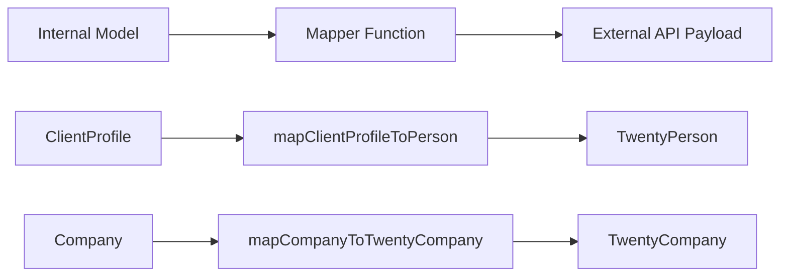

# Шаблоны картографов

Шаблон использует чистые функции сопоставления для преобразования данных между внутренними моделями и внешними полезными нагрузками API. Картографы не имеют побочных эффектов, безопасны для нулевых значений и проверяют обязательные поля перед преобразованием.

## Обзор архитектуры



## Исходные файлы

|Файл|Цель|
|------|---------|
|`lib/mappers/twenty-crm.mapper.ts`|Сопоставляет локальные объекты с полезными нагрузками Twenty CRM API.|

## Принципы проектирования

Модуль Mapper следует строгим соглашениям функционального программирования:

1. **Чистые функции** — никаких побочных эффектов, мутаций и вызовов базы данных.
2. **Null-safe** – во всех необязательных полях используются явные проверки на значение NULL или неопределенное значение.
3. **Проверка перед сопоставлением** – обязательные поля проверяются с ошибками описания.
4. **Принудительное использование внешнего идентификатора** – каждый сопоставленный объект должен иметь действительный `external_id`.

## Проверка внешнего идентификатора

Каждому объекту, сопоставленному с внешней системой, требуется действительный идентификатор:

```typescript
export function ensureExternalId(id: string | undefined | null, entityType: string): string {
  if (!id || id.trim() === '') {
    throw new Error(`${entityType} ID is required for external_id mapping`);
  }
  return id.trim();
}
```

Эта функция вызывается в начале каждого преобразователя, чтобы гарантировать, что поле `external_id` никогда не будет пустым.

## Извлечение местоположения

Вспомогательная функция анализирует названия городов из строк местоположения в виде произвольного текста:

```typescript
export function extractCityFromLocation(location: string | undefined | null): string | null {
  if (!location || location.trim() === '') return null;
  const parts = location.split(',');
  const city = parts[0]?.trim();
  return city || null;
}
```

Обрабатывает такие форматы, как `"San Francisco"`, `"San Francisco, CA"` и `"San Francisco, CA, USA"`.

## Профиль клиента для двадцати человек CRM

Сопоставляет внутренние записи `ClientProfile` с полезной нагрузкой Twenty CRM `TwentyPerson`:

```typescript
export function mapClientProfileToPerson(clientProfile: ClientProfile): TwentyPerson {
  const external_id = ensureExternalId(clientProfile.id, 'ClientProfile');

  const person: TwentyPerson = {
    external_id,
    name: clientProfile.name,
    email: clientProfile.email,
  };

  // Optional field mapping (null-safe)
  if (clientProfile.phone)     person.phone = clientProfile.phone;
  if (clientProfile.jobTitle)  person.job_title = clientProfile.jobTitle;
  if (clientProfile.company)   person.company_name = clientProfile.company;
  if (clientProfile.website)   person.website = clientProfile.website;

  const city = extractCityFromLocation(clientProfile.location);
  if (city) person.city = city;

  // Custom fields
  if (clientProfile.accountType) person.account_type = clientProfile.accountType;
  if (clientProfile.plan)        person.plan = clientProfile.plan;
  if (clientProfile.totalSubmissions !== null && clientProfile.totalSubmissions !== undefined) {
    person.total_submissions = clientProfile.totalSubmissions;
  }

  return person;
}
```

### Таблица сопоставления полей

|Поле профиля клиента|Двадцать человек поле|Требуется|Примечания|
|--------------------|--------------------|----------|-------|
|`id`|`external_id`|Да|Проверено и обрезано|
|`name`|`name`|Да|Прямое картографирование|
|`email`|`email`|Да|Прямое картографирование|
|`phone`|`phone`|Нет|Только если присутствует|
|`jobTitle`|`job_title`|Нет|CamelCase в Snake_case|
|`company`|`company_name`|Нет|Переименованное поле|
|`website`|`website`|Нет|Прямое картографирование|
|`location`|`city`|Нет|Извлечено через `extractCityFromLocation`|
|`accountType`|`account_type`|Нет|Пользовательское поле|
|`plan`|`plan`|Нет|Пользовательское поле|
|`totalSubmissions`|`total_submissions`|Нет|Требуется явная проверка на ноль|

## Компания в Twenty CRM Company

Сопоставляет внутренние объекты `Company` с полезной нагрузкой Twenty CRM `TwentyCompany`:

```typescript
export function mapCompanyToTwentyCompany(company: Company): TwentyCompany {
  const external_id = ensureExternalId(company.id, 'Company');

  const twentyCompany: TwentyCompany = {
    external_id,
    name: company.name,
  };

  if (company.domain)  twentyCompany.domain_name = company.domain;
  if (company.website) twentyCompany.website = company.website;
  if (company.status)  twentyCompany.status = company.status;

  return twentyCompany;
}
```

### Таблица сопоставления полей

|Поле компании|ДвадцатьКомпания Поле|Требуется|Примечания|
|--------------|---------------------|----------|-------|
|`id`|`external_id`|Да|Проверено и обрезано|
|`name`|`name`|Да|Прямое картографирование|
|`domain`|`domain_name`|Нет|Переименованное поле|
|`website`|`website`|Нет|Прямое картографирование|
|`status`|`status`|Нет|`'active'` или `'inactive'`|

## Добавление новых картографов

При создании картографов для новых интеграций следуйте установленным шаблонам:

```typescript
// 1. Always validate external_id first
const external_id = ensureExternalId(entity.id, 'EntityName');

// 2. Build the required fields object
const payload: ExternalType = {
  external_id,
  // ... required fields
};

// 3. Conditionally add optional fields (null-safe)
if (entity.optionalField) {
  payload.optional_field = entity.optionalField;
}

// 4. Return the payload -- never mutate the input
return payload;
```

## Рекомендации по тестированию

Поскольку преобразователи являются чистыми функциями, их легко протестировать:

- Тестирование с заполнением всех необязательных полей
- Проверьте все необязательные поля как `null` или `undefined`.
- Проверьте, что отсутствие необходимых идентификаторов приводит к описательным ошибкам.
- Извлечение тестового местоположения с использованием различных форматов строк
- Убедитесь, что входной объект никогда не мутировал.
