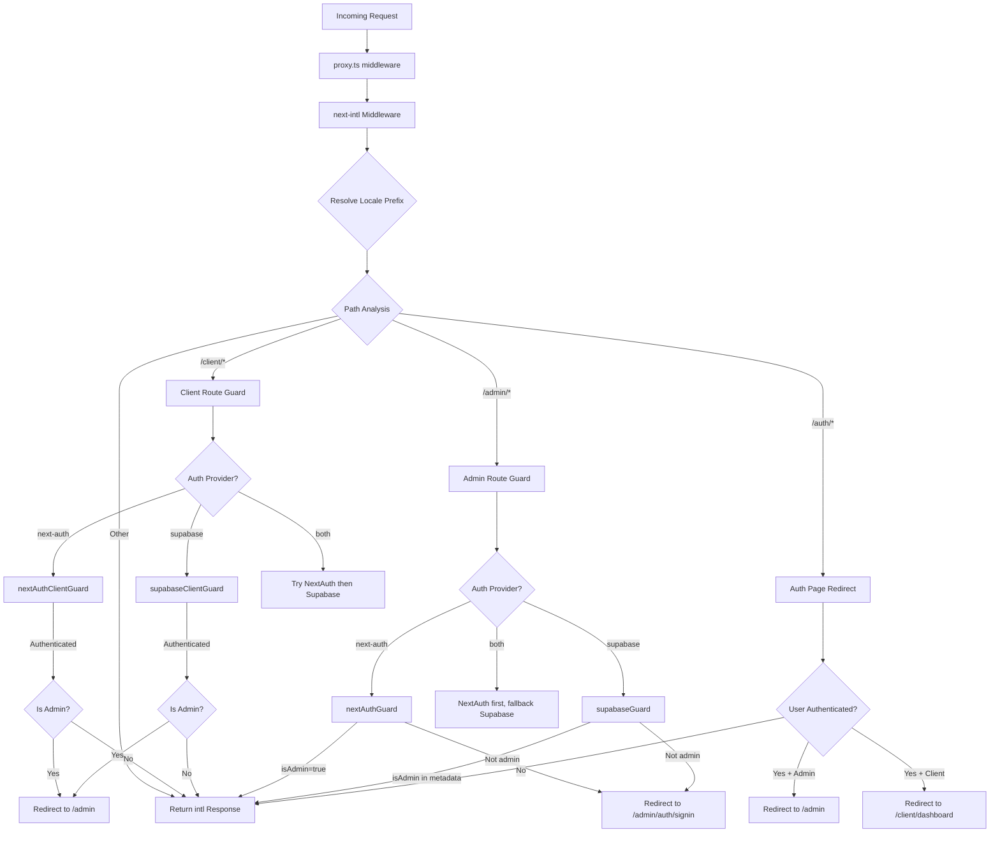

# Цепочка промежуточного программного обеспечения и обработка запросов

## Обзор

Шаблон Ever Works использует **унифицированную архитектуру промежуточного программного обеспечения**, определенную в `proxy.ts` в корне проекта. Это промежуточное программное обеспечение решает три критически важные проблемы для каждого входящего запроса:

1. **Интернационализация** — определение локали, вставка префикса и маршрутизация через `next-intl`.
2. **Защитники аутентификации** – защита маршрутов `/admin/*` и `/client/*` с использованием NextAuth, Supabase или обоих.
3. **Перенаправление на основе ролей** – отправка прошедших проверку пользователей с общедоступных страниц аутентификации и перенаправление администраторов/клиентов на соответствующие панели управления.

Проект поддерживает модель **подключаемого поставщика аутентификации**: промежуточное программное обеспечение считывает текущий `AuthProviderType` (`'next-auth'`, `'supabase'` или `'both'`) из централизованной конфигурации аутентификации и соответственно выбирает соответствующие функции защиты.

## Схема архитектуры



## Исходные файлы

|Файл|Цель|
|------|---------|
|`template/proxy.ts`|Основная точка входа промежуточного программного обеспечения|
|`template/lib/auth/config.ts`|Конфигурация поставщика аутентификации (`getAuthConfig()`)|
|`template/lib/auth/supabase/middleware.ts`|Помощник обновления сеанса Supabase|
|`template/lib/auth/validate-callback-url.ts`|Безопасное создание URL обратного вызова|
|`template/i18n/routing.ts`|Конфигурация маршрутизации локали|

## Порядок обработки запроса

### Шаг 1: Интернационализация

Каждый запрос сначала проходит через промежуточное программное обеспечение `next-intl`, созданное с помощью `createIntlMiddleware(routing)`:

```typescript
import createIntlMiddleware from 'next-intl/middleware';
import { routing } from './i18n/routing';

const intl = createIntlMiddleware(routing);
```

Это обеспечивает определение локали с помощью заголовка `Accept-Language`, настроек файлов cookie и префикса URL-адреса. В конфигурации маршрутизации используется `localePrefix: "as-needed"`, что означает, что локаль по умолчанию (`en`) не требует префикса URL-адреса.

### Шаг 2. Разрешение локали

Помощник `resolveLocalePrefix` извлекает информацию о локали из пути:

```typescript
function resolveLocalePrefix(pathname: string): {
    prefix: string;       // e.g., "/fr" or ""
    hasLocale: boolean;
    locale?: string;
    pathWithoutLocale: string;  // e.g., "/admin/items"
}
```

Это очень важно, поскольку все последующие сопоставления путей (например, проверка `/admin` или `/client`) должны выполняться по пути **без** префикса локали.

### Шаг 3: Выбор защиты на основе маршрута

Промежуточное программное обеспечение оценивает `pathWithoutLocale`, чтобы определить, какую защитную цепочку применить:

|Шаблон пути|Применена защита|Цель|
|-------------|--------------|---------|
|`/client` или `/client/*`|Защита авторизации клиента|Требуется аутентификация; перенаправляет администраторов на `/admin`|
|`/admin/*` (кроме `/admin/auth/signin`)|Защита авторизации администратора|Требуется аутентификация + флаг `isAdmin`|
|`/auth/*`|Перенаправление страницы авторизации|Перенаправляет аутентифицированных пользователей от входа/регистрации|
|Все остальное|Нет охраны|Проходит с ответом i18n|

### Шаг 4. Проверка аутентификации

#### NextAuth Guard (на основе JWT)

```typescript
const token = await getToken({ req, secret: process.env.AUTH_SECRET });
if (token?.isAdmin === true) {
    return baseRes; // Admin access granted
}
```

Охранники NextAuth используют `getToken()` из `next-auth/jwt` для чтения токена JWT из файлов cookie. Это совместимо с Edge Runtime и не требует поиска в базе данных.

#### Супабаза Страж

```typescript
const supRes = await supabaseUpdate(req);
// Merge cookies...
const { data: { user } } = await supabase.auth.getUser();
const isAdmin = user?.user_metadata?.isAdmin === true
    || user?.user_metadata?.role === 'admin';
```

Защита Supabase сначала обновляет сеанс, используя `updateSession()`, затем проверяет метаданные пользователя на наличие флагов администратора.

### Шаг 5: Распространение файлов cookie

Важная деталь реализации: когда охранник выдает ответ на перенаправление, все файлы cookie из `intlResponse` должны быть распространены:

```typescript
const redirectRes = NextResponse.redirect(url);
baseRes.cookies.getAll().forEach((c) => redirectRes.cookies.set(c));
return redirectRes;
```

Это гарантирует, что настройки локали и файлы cookie сеанса аутентификации выдержат перенаправления.

## Конфигурация

### Выбор поставщика аутентификации

Поставщик аутентификации определяется `getAuthConfig()` в `lib/auth/config.ts`:

```typescript
export type AuthProviderType = 'supabase' | 'next-auth' | 'both';

export function getAuthConfig(): AuthConfig {
    // Priority 1: Global override via configureAuth()
    // Priority 2: Environment-based (detects Supabase env vars)
    // Priority 3: Default ('next-auth')
}
```

### Сопоставитель промежуточного программного обеспечения

```typescript
export const config = {
    matcher: ['/((?!api|trpc|_next|_vercel|.*\\..*).*)']
};
```

Это регулярное выражение исключает:
- Маршруты `/api/*` (обрабатываются уровнем API Next.js)
- `/trpc/*` маршруты
- `/_next/*` (внутреннее устройство Next.js)
- `/_vercel/*` (внутреннее оборудование Vercel)
- Любой путь с расширением файла (статические ресурсы)

### Безопасность URL обратного вызова

Промежуточное программное обеспечение использует `createSafeCallbackUrl()` для предотвращения атак с открытым перенаправлением:

```typescript
export function createSafeCallbackUrl(pathname: string, search?: string): string {
    // Limits URL length to 2048 characters
    // Validates relative-only paths
}

export function isValidCallbackUrl(url: string | null): boolean {
    return url?.startsWith('/') && !url.startsWith('//');
}
```

## Режим двух поставщиков («оба»)

Когда `provider === 'both'`, промежуточное программное обеспечение реализует резервную цепочку:

1. **Клиентские маршруты**: сначала попробуйте NextAuth; если не авторизован, попробуйте Supabase
2. **Административные маршруты**: сначала попробуйте NextAuth; если он производит перенаправление (отказано), попробуйте Supabase
3. **Страницы аутентификации**: сначала проверьте токен NextAuth, затем проверьте сеанс Supabase.

Это позволяет организациям мигрировать между поставщиками аутентификации, не нарушая работу существующих пользователей.

## Ключевые детали реализации

### Совместимость с Edge Runtime

Промежуточное ПО работает в среде выполнения Next.js Edge. Все проверки аутентификации используют API-интерфейсы, совместимые с Edge:
- NextAuth: `getToken()` (на основе JWT, база данных не требуется)
- Supabase: `createServerClient()` с сеансом на основе файлов cookie.

### Разработка и производственная регистрация

Ведение журнала отладки закрыто `NODE_ENV === 'development'`:

```typescript
if (process.env.NODE_ENV === 'development') {
    console.log('[Middleware] Admin access granted via token');
}
```

### Обновление сеанса Supabase

Помощник промежуточного программного обеспечения Supabase (`updateSession`) вызывается перед каждой проверкой аутентификации, чтобы гарантировать обновление токенов:

```typescript
export async function updateSession(request: NextRequest) {
    const supabase = createServerClient(url, anonKey, {
        cookies: { getAll, setAll }
    });
    // IMPORTANT: DO NOT REMOVE auth.getUser()
    await supabase.auth.getUser();
    return supabaseResponse;
}
```

Комментарий в исходном коде подчеркивает, что `auth.getUser()` нельзя удалять — он запускает цикл обновления токена, который предотвращает случайные выходы из системы.
