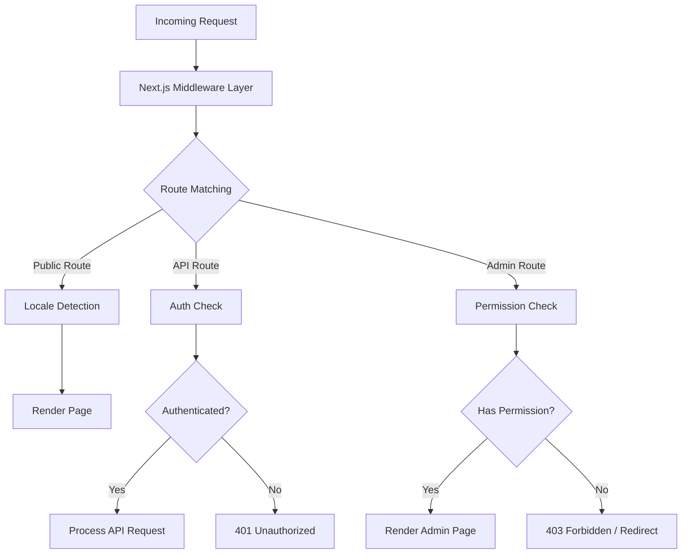
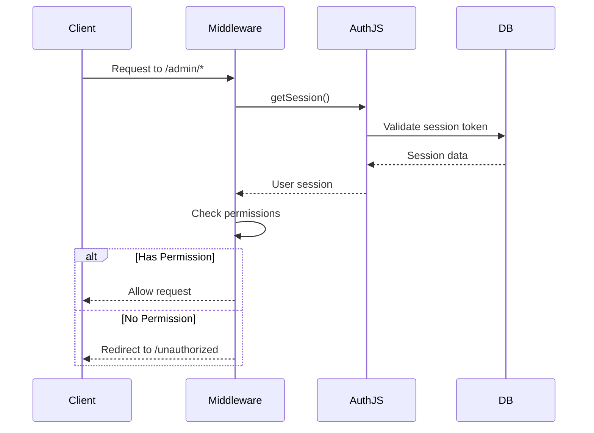
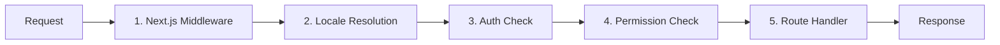

# Глубокое погружение в промежуточное программное обеспечение

Шаблон Ever Works использует многоуровневую архитектуру промежуточного программного обеспечения, основанную на соглашениях маршрутизатора приложений Next.js и настраиваемой логике проверки разрешений. В этом документе описан полный конвейер обработки запросов, проверки разрешений, промежуточное программное обеспечение аутентификации, обработка языковых стандартов и порядок промежуточного программного обеспечения.

## Обзор архитектуры



## Промежуточное программное обеспечение проверки разрешений

Система проверки разрешений находится в `lib/middleware/permission-check.ts` и обеспечивает детальный контроль доступа к маршрутам API и страницам администрирования.

### Основной интерфейс

```typescript
interface UserPermissions {
  userId: string;
  roles: string[];
  permissions: Permission[];
}
```

### Функции проверки разрешений

|Функция|Цель|Возврат|
|---|---|---|
|`hasPermission(user, permission)`|Проверьте единое разрешение|`boolean`|
|`hasAnyPermission(user, permissions)`|Проверьте, есть ли у пользователя хотя бы один|`boolean`|
|`hasAllPermissions(user, permissions)`|Проверьте, есть ли у пользователя все перечисленные|`boolean`|
|`hasResourcePermission(user, resource, action)`|Проверьте формат `resource:action`|`boolean`|
|`getResourcePermissions(user, resource)`|Получить все разрешения для ресурса|`Permission[]`|
|`canManageResource(user, resource)`|Проверьте доступ на создание/обновление/удаление|`boolean`|
|`isSuperAdmin(user)`|Проверьте роль суперадминистратора или все разрешения|`boolean`|

### Использование в маршрутах API

```typescript
import { hasPermission, hasAnyPermission } from '@/lib/middleware/permission-check';

export async function GET(request: Request) {
  const userPermissions = await getUserPermissions(session);

  // Single permission check
  if (!hasPermission(userPermissions, 'items:read')) {
    return new Response('Forbidden', { status: 403 });
  }

  // Multiple permission check (any)
  if (!hasAnyPermission(userPermissions, ['items:review', 'items:approve'])) {
    return new Response('Forbidden', { status: 403 });
  }
}
```

### Проверки на уровне ресурсов

```typescript
// Check specific resource and action
const canEdit = hasResourcePermission(userPermissions, 'items', 'update');

// Get all permissions for a resource
const itemPerms = getResourcePermissions(userPermissions, 'items');
// Returns: ['items:read', 'items:create', 'items:update']

// Check management capability (create, update, or delete)
const canManage = canManageResource(userPermissions, 'categories');
```

### Специализированные помощники по разрешениям

Промежуточное программное обеспечение предоставляет вспомогательные средства для конкретного домена, которые объединяют несколько проверок разрешений:

```typescript
// Can the user review, approve, or reject items?
const canReview = canReviewItems(userPermissions);

// Can the user manage users (read, create, update, delete, assignRoles)?
const canAdmin = canManageUsers(userPermissions);

// Can the user view analytics data?
const canView = canViewAnalytics(userPermissions);

// Is the user a super admin?
const isAdmin = isSuperAdmin(userPermissions);
```

### Обнаружение суперадминистратора

Функция `isSuperAdmin` использует двухуровневый подход:

1. **Проверка роли** (основная): проверяет, имеет ли пользователь роль `super-admin`.
2. **Проверка разрешений** (резервный вариант): проверяет наличие у пользователя всех системных разрешений.

```typescript
function isSuperAdmin(userPermissions: UserPermissions): boolean {
  // Fast path: check role
  if (userPermissions.roles.includes('super-admin')) {
    return true;
  }
  // Exhaustive check: verify all permissions
  return hasAllPermissions(userPermissions, allSystemPermissions);
}
```

## Промежуточное программное обеспечение аутентификации

Аутентификация осуществляется через NextAuth.js (Auth.js v5), настроенный в `auth.config.ts`. Промежуточное программное обеспечение запускается при каждом запросе к защищенным маршрутам.

### Конфигурация поставщика

Конфигурация аутентификации динамически настраивает провайдеров OAuth с плавным откатом:

|Поставщик|Источник конфигурации|
|---|---|
|Гугл|`authConfig.google.clientId/clientSecret`|
|GitHub|`authConfig.github.clientId/clientSecret`|
|Фейсбук|`authConfig.facebook.clientId/clientSecret`|
|Твиттер/Х|`authConfig.twitter.clientId/clientSecret`|
|Полномочия|Всегда включено|

Если настройка OAuth не удалась, система возвращается к аутентификации только с учетными данными.

### Ход сеанса аутентификации



## Промежуточное программное обеспечение локали

Шаблон поддерживает более 20 локалей благодаря интеграции промежуточного программного обеспечения `next-intl`. Обнаружение локали соответствует шаблону префикса «по мере необходимости»:

- Языковой стандарт по умолчанию (`en`): без префикса URL — `/items/my-app`
- Другие локали: префикс локали -- `/fr/items/my-app`.

### Поддерживаемые локали

|Языковой стандарт|Язык|Языковой стандарт|Язык|
|---|---|---|---|
|`en`|английский (по умолчанию)|`ja`|японский|
|`fr`|французский|`ko`|корейский|
|`es`|испанский|`nl`|голландский|
|`de`|немецкий|`pl`|Польский|
|`zh`|китайский|`tr`|турецкий|
|`ar`|арабский|`vi`|вьетнамский|
|`he`|иврит|`th`|тайский|
|`ru`|русский|`hi`|Хинди|
|`uk`|Украинский|`id`|индонезийский|
|`pt`|португальский|`bg`|Болгарский|
|`it`|итальянский| | |

## Конвейер обработки запросов

Полный конвейер обработки запросов следует следующему порядку:



### Этапы конвейера

1. **Промежуточное программное обеспечение Next.js** (`middleware.ts`): запускается при каждом запросе, соответствующем настроенным средствам сопоставления. Обрабатывает перенаправления, перезаписи и внедрение заголовков.

2. **Разрешение языкового стандарта**: определяет предпочтительный языковой стандарт пользователя по URL-пути, заголовку `Accept-Language` или файлу cookie. Устанавливает локаль для контекста запроса.

3. **Проверка аутентификации**: для защищенных маршрутов (`/admin/*`, `/dashboard/*`, `/api/admin/*`) проверяет токен сеанса пользователя.

4. **Проверка разрешений**. После аутентификации проверяется наличие у пользователя необходимых разрешений для определенного ресурса и действия.

5. **Обработчик маршрута**. Фактический компонент страницы или обработчик маршрута API обрабатывает запрос.

### Гарантии заказа промежуточного программного обеспечения

Система обеспечивает строгий порядок:

- Обнаружение локали всегда запускается первым (необходимо для страниц ошибок)
- Проверки аутентификации выполняются перед проверкой разрешений (требуется, чтобы пользователь проверял разрешения)
- Проверки разрешений — это последние ворота перед обработчиками маршрутов.
- Маршруты API используют проверки разрешений на уровне функций (а не на уровне промежуточного программного обеспечения).

## Утилиты проверки разрешений

Промежуточное программное обеспечение включает помощники проверки для работы со строками разрешений:

```typescript
// Validate a permission string
validatePermission('items:read');     // true
validatePermission('invalid:perm');   // false

// Parse a permission into parts
parsePermission('items:update');
// Returns: { resource: 'items', action: 'update' }

// Get summary grouped by resource
getPermissionSummary(userPermissions);
// Returns: { items: ['read', 'create'], categories: ['read'] }
```

## Обработка ошибок

Система промежуточного программного обеспечения обрабатывает ошибки на каждом уровне:

|Слой|Ошибка|Ответ|
|---|---|---|
|Языковой стандарт|Неверная локаль|Перенаправление на локаль по умолчанию|
|Авторизация|Нет сеанса|401 или перенаправление на вход|
|Авторизация|Срок действия сеанса истек|401 с подсказкой по обновлению|
|Разрешение|Отсутствует разрешение|403 Запрещено|
|Разрешение|Неверная строка разрешения|Предупреждение зарегистрировано, доступ запрещен|

## Лучшие практики

1. **Используйте наиболее конкретную проверку** – для обычного ограничения функций отдайте предпочтение `hasPermission` с одним разрешением, а не `isSuperAdmin`.

2. **Проверяйте разрешения в маршрутах API** – не полагайтесь исключительно на промежуточное программное обеспечение; всегда проверяйте в обработчике маршрута наличие глубокоэшелонированной защиты.

3. **Используйте динамический импорт** в промежуточном программном обеспечении, чтобы избежать объединения серверных модулей в пограничную среду выполнения.

4. **Быстрая проверка разрешений** — поиск набора разрешений `O(1)` обеспечивает минимальные накладные расходы на каждый запрос.

5. **Ошибки разрешения журнала** – используйте структурированное ведение журнала с идентификатором пользователя и предпринятым разрешением для аудита безопасности.
