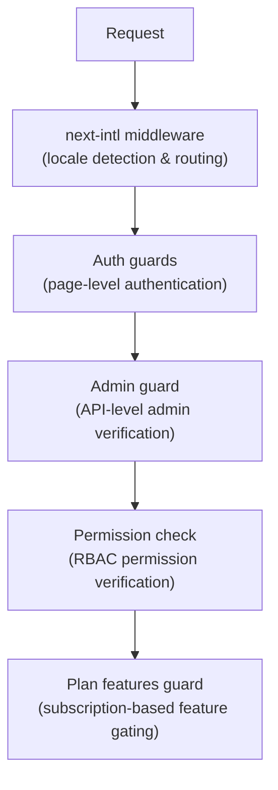

# Промежуточное ПО и защита

Шаблон Ever Works использует многоуровневую систему защиты, состоящую из промежуточного программного обеспечения Next.js для маршрутизации, средств аутентификации для защиты страниц и API, проверок разрешений для RBAC и средств защиты функций на основе плана для ограничения подписки.

## Уровни промежуточного программного обеспечения



## Промежуточное программное обеспечение локали (следующий международный)

Корневое промежуточное программное обеспечение управляет маршрутизацией интернационализации через `next-intl`. Настраивается через `i18n/routing.ts` и `i18n/request.ts`.

Обязанности:
- Определите языковой стандарт пользователя по URL-адресу, файлам cookie или заголовку `Accept-Language`.
- Перенаправить запросы без префикса локали на соответствующую локаль.
- По умолчанию используется английский (`en`), если предпочтения не обнаружены.
- Поддержка 6 локалей: `en`, `fr`, `es`, `de`, `ar`, `zh`

## Стражи аутентификации

### Стражи уровня страницы (`lib/auth/guards.ts`)

Модуль Guards обеспечивает проверку подлинности страниц на стороне сервера. Они вызываются в верхней части серверных компонентов для защиты доступа к страницам.

**`requireAuth()`** -- Требуется аутентификация пользователя:

```typescript
import { requireAuth } from '@/lib/auth/guards';

export default async function ProtectedPage() {
  const session = await requireAuth();
  // session.user is guaranteed to exist here
  return <div>Welcome {session.user.email}</div>;
}
```

Если пользователь не прошел аутентификацию, он перенаправляется на `/auth/signin`.

**`requireAdmin()`** -- Требуется, чтобы пользователь прошел аутентификацию И имел роль администратора:

```typescript
import { requireAdmin } from '@/lib/auth/guards';

export default async function AdminPage() {
  const session = await requireAdmin();
  return <div>Admin: {session.user.email}</div>;
}
```

Если пользователь не прошел аутентификацию, он перенаправляется на `/admin/auth/signin`. Если они прошли аутентификацию, но не являются администраторами, они перенаправляются на `/unauthorized`.

**`getSession()`** -- Получает сеанс без перенаправления:

```typescript
const session = await getSession();
if (session) {
  // Authenticated
} else {
  // Guest
}
```

**`checkIsAdmin()`** -- Проверяет статус администратора без перенаправления:

```typescript
const isAdmin = await checkIsAdmin();
// Returns true or false
```

### Проверенные действия (`lib/auth/guards.ts`)

Модуль Guards также предоставляет проверенные оболочки действий для действий сервера Next.js:

**`validatedAction(schema, action)`** — проверяет данные формы на соответствие схеме Zod:

```typescript
export const myAction = validatedAction(mySchema, async (data, formData) => {
  // data is validated and typed
});
```

**`validatedActionWithUser(schema, action)`** -- Проверяет и требует аутентификации:

```typescript
export const myAction = validatedActionWithUser(mySchema, async (data, formData, user) => {
  // data is validated, user is authenticated
});
```

## Администратор (`lib/auth/admin-guard.ts`)

Защита администратора обеспечивает защиту маршрутов API специально для конечных точек администратора.

**`checkAdminAuth()`** -- Функция промежуточного программного обеспечения для маршрутов API:

```typescript
import { checkAdminAuth } from '@/lib/auth/admin-guard';

export async function GET(request: NextRequest) {
  const authError = await checkAdminAuth();
  if (authError) return authError;

  // User is verified admin, proceed with handler
}
```

Возвращает `null`, если авторизовано, или `NextResponse` с соответствующим статусом ошибки (401 или 403).

**`withAdminAuth(handler)`** -- оболочка функции высшего порядка:

```typescript
import { withAdminAuth } from '@/lib/auth/admin-guard';

export const GET = withAdminAuth(async (request) => {
  // Already verified as admin
  return NextResponse.json({ data: 'admin only' });
});
```

Администратор проверяет как аутентификацию (сеанс существует), так и авторизацию (пользователь имеет роль администратора в базе данных посредством проверки `isAdmin()`).

## Система проверки разрешений (`lib/middleware/permission-check.ts`)

Система разрешений реализует управление доступом на основе ролей (RBAC) с детальными разрешениями.

### Структура разрешений

Разрешения имеют формат `resource:action`:

```typescript
// Examples of permission keys
'items:read'
'items:create'
'items:update'
'items:delete'
'items:review'
'items:approve'
'items:reject'
'categories:read'
'categories:create'
'users:assignRoles'
'analytics:read'
'system:settings'
```

### Функции проверки разрешений

```typescript
import {
  hasPermission,
  hasAnyPermission,
  hasAllPermissions,
  hasResourcePermission,
  canManageResource,
  canReviewItems,
  canManageUsers,
  canManageRoles,
  canViewAnalytics,
  isSuperAdmin,
} from '@/lib/middleware/permission-check';

// Single permission check
hasPermission(userPermissions, 'items:create');

// Any of multiple permissions
hasAnyPermission(userPermissions, ['items:create', 'items:update']);

// All permissions required
hasAllPermissions(userPermissions, ['items:read', 'items:update']);

// Resource-level check
hasResourcePermission(userPermissions, 'items', 'create');

// Domain-specific helpers
canManageResource(userPermissions, 'categories'); // create, update, or delete
canReviewItems(userPermissions);                  // review, approve, or reject
canManageUsers(userPermissions);                  // user CRUD + assignRoles
isSuperAdmin(userPermissions);                    // all system permissions
```

### Обнаружение суперадминистратора

Функция `isSuperAdmin()` проверяет два условия:
1. Имеет ли пользователь роль `super-admin` (предпочтительно)
2. В качестве запасного варианта: есть ли у пользователя ВСЕ системные разрешения.

### Проверка разрешения

```typescript
// Validate a permission string is defined in the system
validatePermission('items:create'); // true
validatePermission('invalid:perm'); // false

// Parse permission into resource and action
parsePermission('items:create'); // { resource: 'items', action: 'create' }
```

## Функции плана Guard (`lib/guards/plan-features.guard.ts`)

В этом плане предусмотрен доступ к функциям контроля безопасности на основе планов подписки (Бесплатный, Стандартный, Премиум).

### Иерархия планов

```typescript
const PLAN_LEVELS = {
  free: 1,
  standard: 2,
  premium: 3,
};
```

### Матрица доступа к функциям

Каждая функция сопоставлена с планами, которые имеют к ней доступ:

|Особенность|Бесплатно|Стандартный|Премиум|
|---------|------|----------|---------|
|Отправить продукт|Да|Да|Да|
|Загрузить изображения|Да|Да|Да|
|Поддержка по электронной почте|Да|Да|Да|
|Расширенное описание| - |Да|Да|
|Проверенный значок| - |Да|Да|
|Приоритетный обзор| - |Да|Да|
|Посмотреть статистику| - |Да|Да|
|Загрузить видео| - | - |Да|
|Спонсорский значок| - | - |Да|
|Домашняя страница Рекомендуемые| - | - |Да|
|Расширенная аналитика| - | - |Да|
|Неограниченное количество заявок| - | - |Да|

### Ограничения плана

Каждый план имеет числовые ограничения для определенных функций:

|Лимит|Бесплатно|Стандартный|Премиум|
|-------|------|----------|---------|
|Макс. изображений| 1 | 5 |Безлимитный|
|Максимальное количество слов описания| 200 | 500 |Безлимитный|
|Максимальное количество заявок| 1 | 10 |Безлимитный|
|Обзорные дни| 7 | 3 | 1 |
|Дни бесплатных модификаций| 0 | 30 | 365 |

### Использование Plan Guard

**Прямые вызовы функций:**

```typescript
import { canAccessFeature, getFeatureLimit, isWithinLimit } from '@/lib/guards';

canAccessFeature('upload_video', 'free');    // false
canAccessFeature('upload_video', 'premium'); // true
getFeatureLimit('max_images', 'standard');   // 5
isWithinLimit('max_submissions', 3, 'free'); // false (limit is 1)
```

**Охранный завод (при многократной проверке):**

```typescript
import { createPlanGuard } from '@/lib/guards';

const guard = createPlanGuard('standard');
guard.canAccess('verified_badge');     // true
guard.canAccess('upload_video');       // false
guard.getLimit('max_images');          // 5
guard.requireFeature('upload_video');  // throws PlanGuardError
```

**Интеграция React Hook:**

```typescript
import { createPlanGuardResult } from '@/lib/guards';

// In a hook or component
const guardResult = createPlanGuardResult(userPlan);
guardResult.canAccess('verified_badge');
guardResult.accessibleFeatures; // array of all accessible features
```

`PlanGuardError`, созданный `requireFeature()`, включает имя функции, текущий план пользователя и требуемый план, что позволяет отображать информативные подсказки по обновлению в пользовательском интерфейсе.
