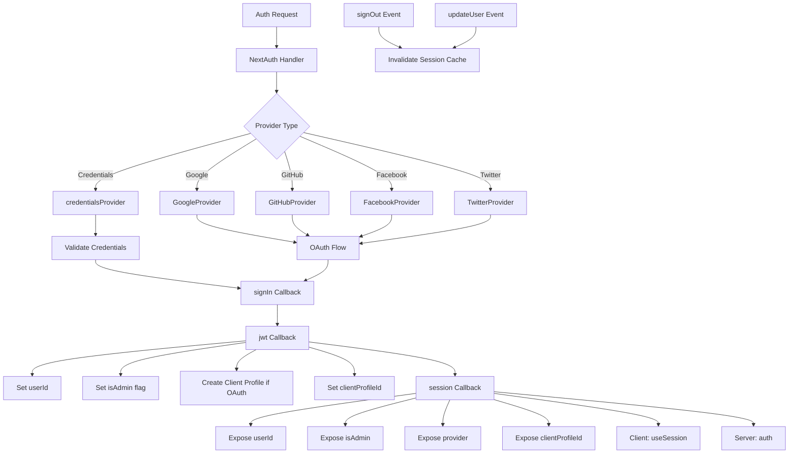

# Следующая конфигурация аутентификации

## Обзор

Шаблон Ever Works настраивает NextAuth.js (Auth.js v5) с сеансами на основе JWT, адаптером Drizzle ORM, несколькими поставщиками OAuth (Google, GitHub, Facebook, Twitter), аутентификацией на основе учетных данных и настраиваемыми обратными вызовами для управления ролями администратора/клиента. Система поддерживает автоматическое создание клиентских профилей для пользователей OAuth и кэширование сеансов с аннулированием кэша.

## Архитектура



## Исходные файлы

|Файл|Цель|
|------|---------|
|`template/lib/auth/index.ts`|Основная конфигурация и экспорт NextAuth|
|`template/auth.config.ts`|Конфигурация провайдера (совместимая с Edge)|
|`template/lib/auth/config.ts`|Выбор типа поставщика аутентификации|
|`template/lib/auth/providers.ts`|Фабричные функции поставщика OAuth|
|`template/lib/auth/credentials.ts`|Реализация поставщика учетных данных|
|`template/lib/auth/guards.ts`|Утилиты защиты авторизации на стороне сервера|
|`template/lib/auth/middleware.ts`|Проверенные оболочки действий|
|`template/lib/auth/setup.ts`|Помощник по инициализации аутентификации|
|`template/lib/auth/cached-session.ts`|Управление кэшем сеансов|
|`template/lib/auth/session-cache.ts`|Реализация кэша сеанса|
|`template/lib/auth/admin-guard.ts`|Логика защиты, специфичная для администратора|

## ДалееИнициализация аутентификации

```typescript
// lib/auth/index.ts
export const { handlers, auth, signIn, signOut, unstable_update } = NextAuth({
    adapter: drizzle,
    session: {
        strategy: 'jwt',
        maxAge: 30 * 24 * 60 * 60,    // 30 days
        updateAge: 24 * 60 * 60        // Refresh every 24 hours
    },
    jwt: {
        maxAge: 30 * 24 * 60 * 60      // 30 days
    },
    callbacks: { authorized, redirect, signIn, jwt, session },
    events: { signOut, updateUser },
    pages: {
        signIn: '/auth/signin',
        signOut: '/auth/signout',
        error: '/auth/error',
        verifyRequest: '/auth/verify-request',
        newUser: '/auth/register'
    },
    ...authConfig  // Merges providers from auth.config.ts
});
```

### Стратегия сессии

В шаблоне используются **сеансы JWT** (`strategy: 'jwt'`), а не сеансы базы данных. Это означает:
- Сессии хранятся в зашифрованных файлах cookie, а не в базе данных.
- Для проверки сеанса не требуется запрос к базе данных
- Совместимость с Edge Runtime (промежуточное ПО)
- Данные сеанса ограничены тем, что помещается в токен JWT.

## Адаптер базы данных

```typescript
const isDatabaseAvailable = !!coreConfig.DATABASE_URL && typeof db !== 'undefined';

const drizzle = isDatabaseAvailable
    ? DrizzleAdapter(getDrizzleInstance(), {
        usersTable: users,
        accountsTable: accounts,
        sessionsTable: sessions,
        verificationTokensTable: verificationTokens
    })
    : undefined;
```

Адаптер создается условно в зависимости от доступности базы данных. Это позволяет запустить шаблон даже без базы данных (например, во время первоначальной настройки), хотя аутентификация будет ограничена.

## Конфигурация поставщика

### auth.config.ts (совместимый с Edge)

```typescript
// auth.config.ts
const configureProviders = () => {
    try {
        const oauthProviders = configureOAuthProviders();
        return createNextAuthProviders({
            google: oauthProviders.find((p) => p.id === 'google')
                ? { enabled: true, clientId: '...', clientSecret: '...' }
                : { enabled: false },
            github: { /* ... */ },
            facebook: { /* ... */ },
            twitter: { /* ... */ },
            credentials: { enabled: true },
        });
    } catch (error) {
        // Fallback to credentials only
        return createNextAuthProviders({
            credentials: { enabled: true },
            google: { enabled: false },
            github: { enabled: false },
            facebook: { enabled: false },
            twitter: { enabled: false },
        });
    }
};

export default {
    trustHost: true,
    providers: configureProviders(),
} satisfies NextAuthConfig;
```

### Фабрика поставщиков

```typescript
// lib/auth/providers.ts
export function createNextAuthProviders(config: OAuthProvidersConfig) {
    const providers = [];

    if (config.google?.enabled && config.google.clientId && config.google.clientSecret) {
        providers.push(GoogleProvider({
            clientId: config.google.clientId,
            clientSecret: config.google.clientSecret,
            ...config.google.options,
        }));
    }
    // GitHub, Facebook, Twitter follow the same pattern...

    if (config.credentials?.enabled) {
        providers.push(credentialsProvider);
    }

    return providers;
}
```

Поставщики добавляются только при наличии у них действительных учетных данных, что предотвращает ошибки конфигурации при запуске.

## Обратные вызовы

### Войти Обратный звонок

```typescript
signIn: async ({ user, account, profile }) => {
    const isCredentials = account?.provider === 'credentials';

    if (!user?.email) {
        return !isCredentials; // Allow OAuth without email
    }

    if (!isDatabaseAvailable) {
        return !isCredentials; // Skip DB validation if no DB
    }

    // For OAuth providers, allow account linking
    if (!isCredentials && account?.provider) {
        return true;
    }

    return true;
}
```

### jwt Обратный вызов

Обратный вызов JWT — это ядро конвейера аутентификации. Он запускается при каждом запросе и управляет:

```typescript
jwt: async ({ token, user, account }) => {
    // 1. Set userId from user object or token.sub
    if (user?.id) token.userId = user.id;
    if (!token.userId && token.sub) token.userId = token.sub;

    // 2. Set clientProfileId
    if (user?.clientProfileId) token.clientProfileId = user.clientProfileId;

    // 3. Record provider
    if (account?.provider) token.provider = account.provider;

    // 4. Auto-create client profile for OAuth users
    if (isOAuthProvider && !token.clientProfileId && token.userId) {
        let clientProfile = await getClientProfileByUserId(token.userId);
        if (!clientProfile) {
            clientProfile = await createClientProfile({
                userId: token.userId,
                email: token.email,
                name: token.name || token.email?.split('@')[0],
            });
        }
        token.clientProfileId = clientProfile?.id;
    }

    // 5. Set isAdmin flag
    if (user?.isClient !== undefined) {
        token.isAdmin = !user.isClient;
    } else if (user?.isAdmin !== undefined) {
        token.isAdmin = user.isAdmin;
    } else if (token.isAdmin === undefined) {
        token.isAdmin = false; // Default: non-admin
    }

    return token;
}
```

### Обратный вызов сеанса

Сопоставляет поля токена JWT с объектом сеанса, доступным клиентским компонентам:

```typescript
session: async ({ session, token }) => {
    if (token && session.user) {
        session.user.id = token.userId;
        session.user.clientProfileId = token.clientProfileId;
        session.user.provider = token.provider || 'credentials';
        session.user.isAdmin = token.isAdmin;
    }
    return session;
}
```

## События

### Аннулирование кэша сеанса

```typescript
events: {
    signOut: async (event) => {
        const token = 'token' in event ? event.token : undefined;
        if (token?.userId) {
            await invalidateSessionCache(undefined, token.userId);
        }
    },
    updateUser: async ({ user }) => {
        if (user?.id) {
            await invalidateSessionCache(undefined, user.id);
        }
    }
}
```

События `signOut` и `updateUser` вызывают аннулирование кэша сеанса, гарантируя, что устаревшие данные сеанса не будут переданы после изменения состояния аутентификации.

## Серверная защита

### требуется авторизация

```typescript
export async function requireAuth() {
    const session = await auth();
    if (!session?.user) {
        redirect('/auth/signin');
    }
    return session;
}
```

### требуется администратор

```typescript
export async function requireAdmin() {
    const session = await auth();
    if (!session?.user) {
        redirect('/admin/auth/signin');
    }
    if (!session.user.isAdmin) {
        redirect('/unauthorized');
    }
    return session;
}
```

### Утилита Охранники

```typescript
// Check without redirecting
export async function getSession() {
    return await auth();
}

export async function checkIsAdmin() {
    const session = await auth();
    return session?.user?.isAdmin === true;
}
```

## Пользовательские страницы

|Страница|Путь|Цель|
|------|------|---------|
|Войти|`/auth/signin`|Форма входа|
|Выйти|`/auth/signout`|Подтверждение выхода из системы|
|Ошибка|`/auth/error`|Отображение ошибки аутентификации|
|Подтвердить запрос|`/auth/verify-request`|Запрос на подтверждение электронной почты|
|Зарегистрироваться|`/auth/register`|Регистрация нового пользователя|

## Переменные среды

|Переменная|Требуется|Цель|
|----------|----------|---------|
|`AUTH_SECRET`|Да|Секрет шифрования JWT|
|`AUTH_GOOGLE_ID`|Нет|Идентификатор клиента Google OAuth|
|`AUTH_GOOGLE_SECRET`|Нет|Секрет клиента Google OAuth|
|`AUTH_GITHUB_ID`|Нет|Идентификатор клиента GitHub OAuth|
|`AUTH_GITHUB_SECRET`|Нет|Секрет клиента GitHub OAuth|
|`AUTH_FACEBOOK_ID`|Нет|Идентификатор клиента Facebook OAuth|
|`AUTH_FACEBOOK_SECRET`|Нет|Секрет клиента Facebook OAuth|
|`AUTH_TWITTER_ID`|Нет|Идентификатор клиента OAuth Twitter/X|
|`AUTH_TWITTER_SECRET`|Нет|Секрет клиента Twitter/X OAuth|
|`DATABASE_URL`|Для адаптера|Строка подключения к базе данных|

## Лучшие практики

1. **Используйте стратегию JWT** для обеспечения совместимости Edge Runtime в промежуточном программном обеспечении.
2. **Автоматическое создание профилей клиентов** для пользователей OAuth в обратном вызове JWT.
3. **Мягкое ухудшение** – если настройка OAuth не удалась, вернитесь только к учетным данным.
4. **Недействительный кеш при событиях аутентификации** – оба сеанса при выходе из системы и обновлении пользователя очищают кэшированные сеансы.
5. **Условный адаптер** – разрешает запуск без базы данных для первоначальной настройки.
6. **Защитные функции** — используйте `requireAuth()` / `requireAdmin()` в компонентах сервера, а не проверку сеанса вручную.
7. **Пользовательские страницы** – переопределять страницы NextAuth по умолчанию для обеспечения согласованности пользовательского интерфейса с дизайном шаблона.
