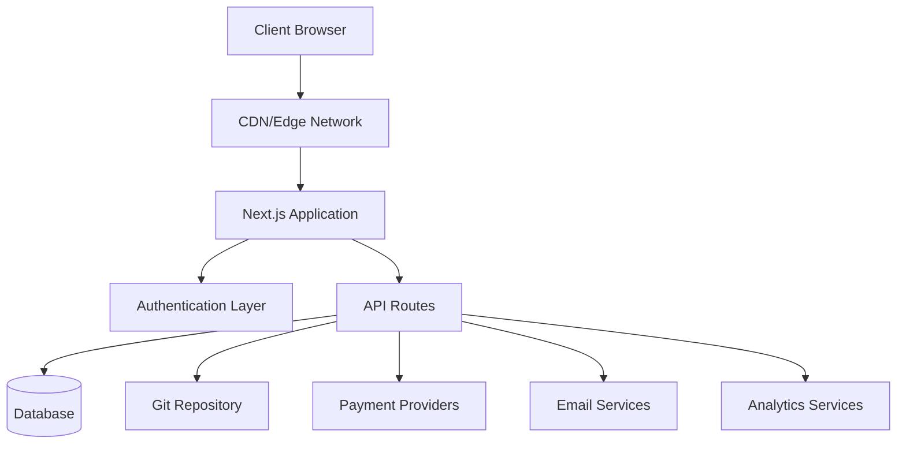
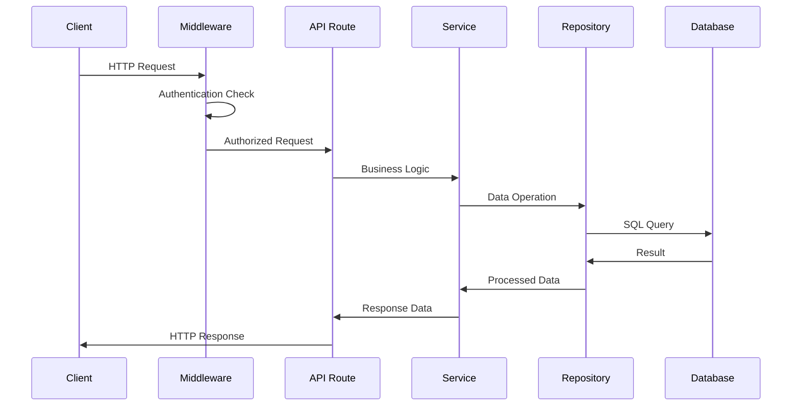
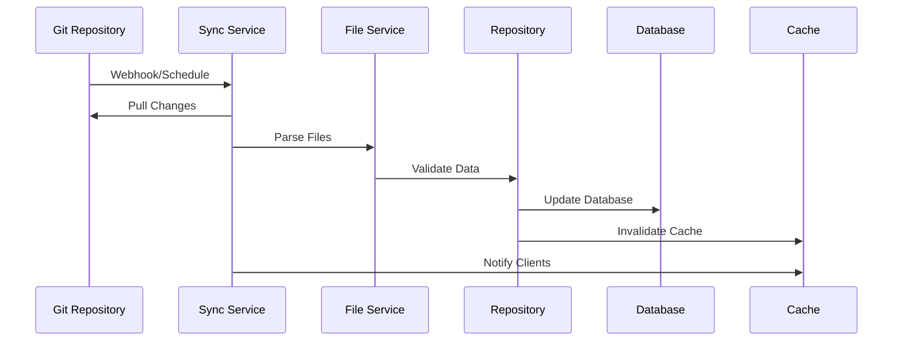
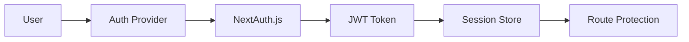

# Обзор архитектуры

Ever Works использует современную масштабируемую архитектуру, обеспечивающую производительность, удобство обслуживания и удобство для разработчиков.

## Высокоуровневая архитектура



## Основные принципы

### 1. Разделение интересов
- **Уровень представления**: компоненты React и логика пользовательского интерфейса.
- **Бизнес-уровень**: сервисы и репозитории.
- **Уровень данных**: база данных и внешние API.

### 2. Модульная конструкция
- Функциональная организация
- Многоразовые компоненты
- Плагин-подобные интеграции

### 3. Типовая безопасность
- TypeScript повсюду
- Строгая проверка типов
- Проверка времени выполнения с помощью Zod

### 4. Производительность прежде всего
- Серверный рендеринг
- Статическая генерация, где это возможно
- Оптимизированные стратегии кэширования

## Уровни приложения

### Внешний слой

**Технология**: React 19 + Next.js 15.
**Обязанности**:
- Рендеринг пользовательского интерфейса
- Управление состоянием на стороне клиента
- Взаимодействие с пользователем
- Обработка маршрута

**Ключевые компоненты**:
- Компоненты страницы (`app/[locale]/`)
- Многоразовые компоненты пользовательского интерфейса (`components/`)
- Пользовательские крючки (`hooks/`)
- Поставщики контекста (`components/providers/`)

### Уровень API

**Технология**: Маршруты API Next.js
**Обязанности**:
- Выполнение бизнес-логики
- Проверка данных
- Интеграция внешних сервисов
- Обработка аутентификации

**Структура**:
```
app/api/
├── auth/           # Authentication endpoints
├── admin/          # Admin-only endpoints
├── items/          # Item management
└── webhooks/       # External service webhooks
```

### Уровень данных

**Технологии**: Drizzle ORM + PostgreSQL.
**Обязанности**:
- Сохранение данных
- Оптимизация запросов
- Управление транзакциями
- Миграции схемы

**Компоненты**:
- Схема базы данных (`lib/db/schema.ts`)
- Репозитории (`lib/repositories/`)
- Файлы миграции (`lib/db/migrations/`)

### Слой контента

**Технология**: CMS на базе Git.
**Обязанности**:
- Синхронизация контента
- Контроль версий
- Совместное редактирование
- Проверка контента

**Структура**:
```
.content/
├── config.yml      # Site configuration
├── items/          # Item definitions
├── categories/     # Category definitions
└── tags/           # Tag definitions
```

## Шаблоны проектирования

### 1. Шаблон репозитория

Аннотация логики доступа к данным:

```typescript
interface ItemRepository {
  findById(id: string): Promise<Item | null>;
  findBySlug(slug: string): Promise<Item | null>;
  findWithFilters(filters: ItemFilters): Promise<Item[]>;
  create(item: CreateItemRequest): Promise<Item>;
  update(id: string, updates: UpdateItemRequest): Promise<Item>;
  delete(id: string): Promise<void>;
}
```

### 2. Шаблон уровня обслуживания

Инкапсулирует бизнес-логику:

```typescript
class ItemService {
  constructor(
    private itemRepository: ItemRepository,
    private gitService: GitService,
    private notificationService: NotificationService
  ) {}

  async submitItem(data: SubmitItemRequest): Promise<SubmissionResult> {
    // Business logic here
  }
}
```

### 3. Заводской шаблон

Создает экземпляры службы:

```typescript
class PaymentProviderFactory {
  static create(provider: PaymentProvider): PaymentService {
    switch (provider) {
      case 'stripe':
        return new StripePaymentService();
      case 'lemonsqueezy':
        return new LemonSqueezyPaymentService();
      default:
        throw new Error(`Unsupported provider: ${provider}`);
    }
  }
}
```

### 4. Модель наблюдателя

Обновления, управляемые событиями:

```typescript
class ContentSyncService {
  private observers: ContentObserver[] = [];

  addObserver(observer: ContentObserver): void {
    this.observers.push(observer);
  }

  notifyObservers(event: ContentEvent): void {
    this.observers.forEach(observer => observer.update(event));
  }
}
```

## Поток данных

### 1. Поток запроса



### 2. Процесс синхронизации контента



## Архитектура безопасности

### 1. Процесс аутентификации



### 2. Уровни авторизации

- **Уровень маршрута**: защита промежуточного программного обеспечения.
- **Уровень API**: защита конечных точек
- **Уровень данных**: безопасность на уровне строк.
- **Уровень пользовательского интерфейса**: контроль доступа на основе компонентов.

### 3. Меры безопасности

- **Проверка входных данных**: схемы Zod
- **SQL-инъекция**: параметризованные запросы
- **Защита XSS**: очистка контента
- **Защита CSRF**: проверка токена
- **Ограничение скорости**: запросить регулирование

## Стратегия кэширования

### 1. Кэш приложений

- **React Query**: кэш данных на стороне клиента
- **Кэш Next.js**: Кэш маршрутов страниц и API.
- **Статическая генерация**: готовые страницы.

### 2. Кэш базы данных

- **Пул соединений**: эффективные соединения с БД
- **Оптимизация запросов**: индексированные запросы
- **Реплики чтения**: распределенные операции чтения.

### 3. CDN-кэш

- **Статические ресурсы**: изображения, CSS, JS.
- **Ответы API**: кэшируемые конечные точки.
- **Периферийные местоположения**: глобальное распространение.

## Соображения масштабируемости

### 1. Горизонтальное масштабирование

- **Дизайн без сохранения состояния**: отсутствие сеансов на стороне сервера.
- **Масштабирование базы данных**: чтение реплик и сегментирование
- **Распределение CDN**: глобальное пограничное кэширование

### 2. Оптимизация производительности

- **Разделение кода**: динамический импорт
- **Оптимизация изображений**: компонент изображения Next.js
- **Пакетная оптимизация**: встряхивание и минификация дерева

### 3. Мониторинг и наблюдаемость

- **Отслеживание ошибок**: интеграция Sentry
- **Мониторинг производительности**: основные веб-показатели
- **Аналитика**: интеграция PostHog
- **Ведение**: структурированное ведение журнала.

## Технологические решения

### Почему Next.js?
- **Полнофункциональная платформа**: маршруты API + интерфейс.
- **Производительность**: SSR, SSG и ISR.
- **Опыт разработчика**: горячая перезагрузка, поддержка TypeScript.
- **Экосистема**: Богатая экосистема плагинов.

### Почему «Дождь» ORM?
- **Типовая безопасность**: полная поддержка TypeScript.
- **Производительность**: минимальные накладные расходы.
- **Гибкость**: необработанный SQL при необходимости
- **Система миграции**: изменения схемы с контролем версий.

### Почему CMS на базе Git?
- **Контроль версий**: полное отслеживание истории.
- **Совместная работа**: рабочий процесс запроса на включение
- **Резервное копирование**: Распространяется по природе.
- **Гибкость**: любой поставщик Git.

### Зачем реагировать на запросы?
- **Кэширование**: интеллектуальное управление кэшем.
- **Синхронизация**: фоновые обновления.
- **Оптимистичные обновления**: лучший UX
- **Обработка ошибок**: логика повтора

## Точки расширения

Архитектура предусматривает несколько точек расширения:

### 1. Пользовательские поставщики аутентификации
```typescript
// lib/auth/providers/custom-provider.ts
export function CustomProvider(options: CustomProviderOptions) {
  return {
    id: "custom",
    name: "Custom Provider",
    type: "oauth",
    // Implementation
  }
}
```

### 3. Интеграция источников контента
```typescript
// lib/content/sources/custom-source.ts
export class CustomContentSource implements ContentSource {
  async sync(): Promise<SyncResult> {
    // Implementation
  }
}
```

## Следующие шаги

- [Изучите стек технологий](./tech-stack) подробно
