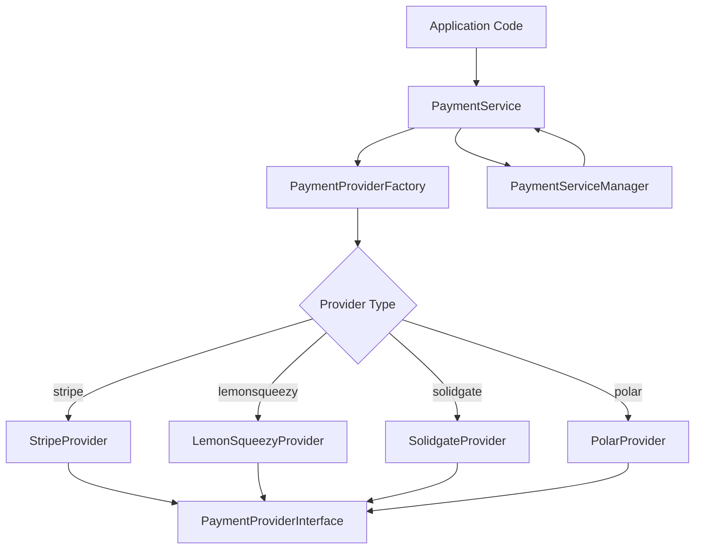
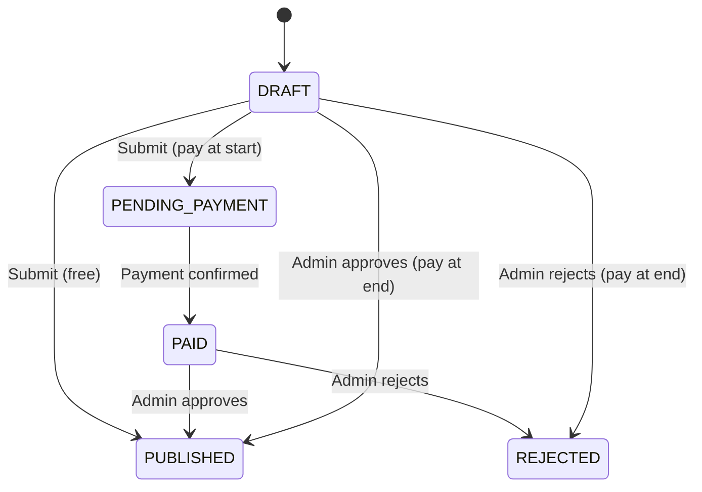

# Библиотека платежей

Шаблон реализует систему оплаты с несколькими провайдерами с использованием шаблонов Factory и Strategy. Он поддерживает Stripe, LemonSqueezy, Solidgate и Polar в качестве поставщиков платежей, а также имеет унифицированный интерфейс для платежей, подписок, веб-перехватчиков и возвратов средств.

## Обзор архитектуры



## Исходные файлы

|Файл|Цель|
|------|---------|
|`lib/payment/index.ts`|Экспорт общедоступных API|
|`lib/payment/lib/payment-provider-factory.ts`|Фабрика для создания экземпляров провайдера|
|`lib/payment/lib/payment-service.ts`|Единый сервисный фасад|
|`lib/payment/lib/payment-service-manager.ts`|Менеджер Singleton для жизненного цикла сервиса|
|`lib/payment/types/payment-types.ts`|Основные интерфейсы и перечисления|
|`lib/payment/types/payment.ts`|Поток платежей и типы отправки|
|`lib/payment/config/`|Настройка и проверка поставщика|
|`lib/payment/lib/providers/`|Реализации отдельных поставщиков|
|`lib/payment/hooks/`|Перехватчики React для потоков платежей на стороне клиента|
|`lib/payment/ui/`|Компоненты платежной формы|

## Основные интерфейсы

### Интерфейс поставщика платежей

Каждый провайдер реализует этот комплексный интерфейс:

```typescript
export interface PaymentProviderInterface {
  // Payment operations
  createPaymentIntent(params: CreatePaymentParams): Promise<PaymentIntent>;
  confirmPayment(paymentId: string, paymentMethodId: string): Promise<PaymentIntent>;
  verifyPayment(paymentId: string): Promise<PaymentVerificationResult>;
  createSetupIntent(user: User | null): Promise<SetupIntent>;

  // Subscription management
  createCustomer(params: CreateCustomerParams): Promise<CustomerResult>;
  createSubscription(params: CreateSubscriptionParams): Promise<SubscriptionInfo>;
  cancelSubscription(subscriptionId: string, cancelAtPeriodEnd?: boolean): Promise<SubscriptionInfo>;
  updateSubscription(params: UpdateSubscriptionParams): Promise<SubscriptionInfo>;
  hasCustomerId(user: User | null): boolean;
  getCustomerId(user: User | null): Promise<string | null>;

  // Webhooks and refunds
  handleWebhook(payload: any, signature: string, ...args: any[]): Promise<WebhookResult>;
  refundPayment(paymentId: string, amount?: number): Promise<any>;

  // Client configuration and UI
  getClientConfig(): ClientConfig;
  getUIComponents(): UIComponents;
}
```

### Фабрика Поставщика Платежей

Создает экземпляры провайдера на основе конфигурации:

```typescript
export type SupportedProvider = 'stripe' | 'solidgate' | 'lemonsqueezy' | 'polar';

export class PaymentProviderFactory {
  static createProvider(
    providerType: SupportedProvider,
    config: PaymentProviderConfig
  ): PaymentProviderInterface {
    switch (providerType) {
      case 'stripe':       return new StripeProvider(config);
      case 'solidgate':    return new SolidgateProvider(config);
      case 'lemonsqueezy': return new LemonSqueezyProvider(config);
      case 'polar':        return new PolarProvider(config);
      default:             throw new Error(`Unsupported payment provider: ${providerType}`);
    }
  }
}
```

## ОплатаСервис

Класс `PaymentService` обеспечивает единый фасад для всех операций провайдера:

```typescript
export class PaymentService {
  private provider: PaymentProviderInterface;

  constructor(config: PaymentServiceConfig) {
    this.provider = PaymentProviderFactory.createProvider(config.provider, config.config);
  }

  // All methods delegate to the underlying provider
  async createPaymentIntent(params: CreatePaymentParams): Promise<PaymentIntent> {
    return this.provider.createPaymentIntent(params);
  }

  async createSubscription(params: CreateSubscriptionParams): Promise<SubscriptionInfo> {
    return this.provider.createSubscription(params);
  }

  // ... additional delegated methods
}
```

## Типы данных

### Перечисления платежей

```typescript
export enum PaymentType {
  ONE_TIME = 'one_time',
  SUBSCRIPTION = 'subscription',
  FREE = 'free',
}

export enum SubscriptionStatus {
  INCOMPLETE = 'incomplete',
  INCOMPLETE_EXPIRED = 'incomplete_expired',
  TRIALING = 'trialing',
  ACTIVE = 'active',
  PAST_DUE = 'past_due',
  CANCELED = 'canceled',
  UNPAID = 'unpaid',
}

export enum PaymentFlow {
  PAY_AT_START = "pay_at_start",
  PAY_AT_END = "pay_at_end",
}
```

### События вебхука

```typescript
export enum WebhookEventType {
  PAYMENT_SUCCEEDED = 'payment_succeeded',
  PAYMENT_FAILED = 'payment_failed',
  SUBSCRIPTION_CREATED = 'subscription_created',
  SUBSCRIPTION_UPDATED = 'subscription_updated',
  SUBSCRIPTION_CANCELLED = 'subscription_cancelled',
  INVOICE_PAID = 'invoice_paid',
  REFUND_CREATED = 'refund_created',
  // ... additional event types
}
```

### Ключевые структуры данных

|Тип|Цель|
|------|---------|
|`PaymentIntent`|Сеанс оплаты с идентификатором, суммой, валютой, статусом, clientSecret|
|`SubscriptionInfo`|Подробности подписки со статусом, окончанием периода, информацией о пробной версии|
|`CustomerResult`|Создан клиент с идентификатором, адресом электронной почты и именем.|
|`WebhookResult`|Обработанный вебхук с типом, идентификатором и данными|
|`ClientConfig`|Безопасная для внешнего интерфейса конфигурация с открытым ключом и типом шлюза|
|`UIComponents`|Компоненты React и визуальные ресурсы для провайдера|

## Валютные утилиты

Библиотека включает вспомогательные функции для форматирования валюты:

```typescript
// Format cents to display currency
export function formatCentsToCurrency(
  cents: number, currency: string = 'USD', locale: string = 'en-US'
): string {
  const amount = cents / 100;
  return new Intl.NumberFormat(locale, {
    style: 'currency', currency,
    minimumFractionDigits: 2, maximumFractionDigits: 2,
  }).format(amount);
}

// Convert between cents and decimal
export function convertCentsToDecimal(cents: number): number;
export function convertDecimalToCents(decimal: number): number;

// Convert timestamps to Date objects
export function convertNumberToDate(timestamp?: number): Date | null;
export function safeTimestampToDate(timestamp: number | null | undefined): Date | undefined;
```

## Типы платежных потоков

Система поддерживает два потока оплаты заявок:

|Поток|Перечисление|Описание|
|------|------|-------------|
|Оплата при старте|`PAY_AT_START`|Оплата требуется до рассмотрения заявки|
|Оплата в конце|`PAY_AT_END`|Оплата взимается после одобрения администратора|

### Жизненный цикл статуса отправки



## Интерфейс компонентов пользовательского интерфейса

Каждый поставщик предоставляет компоненты пользовательского интерфейса для интеграции с внешним интерфейсом:

```typescript
export interface UIComponents {
  PaymentForm: React.ComponentType<PaymentFormProps>;
  logo: string;
  cardBrands: CardBrandIcon[];
  supportedPaymentMethods: string[];
  translations: Record<string, Record<string, string>>;
}
```

## Клиентская интеграция

Хук `usePayment` и контекст `PaymentProvider` обеспечивают интеграцию React:

```typescript
import { usePayment, PaymentProvider } from '@/lib/payment';

// Wrap your app with the payment provider
<PaymentProvider>
  <PaymentForm
    amount={2999}
    currency="usd"
    isSubscription={false}
    onSuccess={(paymentId) => console.log('Paid:', paymentId)}
    onError={(error) => console.error('Failed:', error)}
  />
</PaymentProvider>
```

## Конфигурация поставщика

```typescript
export interface PaymentProviderConfig {
  apiKey: string;
  webhookSecret?: string;
  secretKey?: string;
  options?: Record<string, any>;
}
```

Каждому провайдеру требуется как минимум `apiKey`. Stripe и Solidgate также используют `webhookSecret` для проверки подписи веб-перехватчика.
