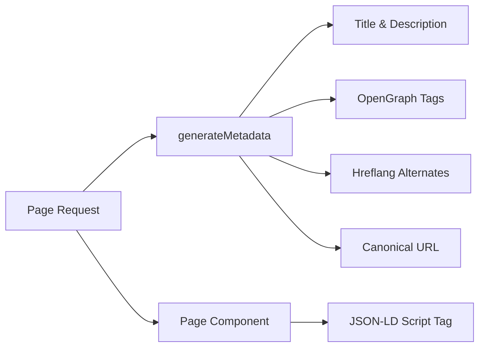

# SEO-система

Шаблон Ever Works включает в себя комплексную систему SEO, которая генерирует структурированные данные (JSON-LD), теги hreflang, метаданные OpenGraph и динамические карты сайта. Все утилиты SEO живут под `lib/seo/` и интегрируются с API метаданных Next.js.

## Обзор архитектуры



### Исходные файлы

|Файл|Цель|
|---|---|
|`lib/seo/schema.ts`|Генераторы структурированных данных JSON-LD|
|`lib/seo/hreflang.ts`|Генераторы URL-адресов на альтернативных языках|
|`lib/seo/listing-metadata.ts`|Фабрика метаданных страницы листинга|

## Структурированные данные JSON-LD

Модуль `lib/seo/schema.ts` генерирует структурированные данные Schema.org для расширенных результатов поисковых систем.

### Схема продукта

Для страниц сведений об элементе генерируется схема `Product`:

```typescript
import { generateProductSchema } from '@/lib/seo/schema';

const schema = generateProductSchema({
  name: 'My App',
  description: 'A productivity tool',
  image: 'https://example.com/icon.png',
  url: 'https://example.com/items/my-app',
  category: 'Productivity',
  sourceUrl: 'https://myapp.com',
  brandName: 'MyApp Inc.',
});
```

Сгенерированный вывод:

```json
{
  "@context": "https://schema.org",
  "@type": "Product",
  "name": "My App",
  "description": "A productivity tool",
  "image": "https://example.com/icon.png",
  "url": "https://example.com/items/my-app",
  "category": "Productivity",
  "brand": {
    "@type": "Brand",
    "name": "MyApp Inc."
  },
  "offers": {
    "@type": "Offer",
    "url": "https://myapp.com",
    "availability": "https://schema.org/InStock"
  }
}
```

### Схема организации

Создает схему `Organization` для всего сайта для видимости панели знаний:

```typescript
import { generateOrganizationSchema } from '@/lib/seo/schema';

const schema = generateOrganizationSchema();
```

Эта схема включает в себя:
- Название бренда, URL-адрес и логотип
- Ссылки на социальные профили (`sameAs` массив) от `siteConfig.social`
- Контактное лицо с электронной почтой (если настроено)

### Схема веб-сайта с SearchAction

Включает окно поиска дополнительных ссылок Google:

```typescript
import { generateWebSiteSchema } from '@/lib/seo/schema';

const schema = generateWebSiteSchema('en');
// Includes potentialAction with SearchAction targeting /?q={search_term_string}
```

Схема учитывает префиксы локали:
- Языковой стандарт по умолчанию: `https://example.com`
- Другие регионы: `https://example.com/fr`

### Хлебная схема

Генерирует `BreadcrumbList` для результатов поиска с учетом навигации:

```typescript
import { generateBreadcrumbSchema } from '@/lib/seo/schema';

const schema = generateBreadcrumbSchema([
  { name: 'Home', url: 'https://example.com' },
  { name: 'Productivity', url: 'https://example.com/categories/productivity' },
  { name: 'My App', url: 'https://example.com/items/my-app' },
]);
```

### Встраивание в страницы

JSON-LD встраивается с помощью тега `<script>` в компонент страницы:

```tsx
export default function ItemDetailPage({ item }) {
  const schema = generateProductSchema({ ... });

  return (
    <>
      <script
        type="application/ld+json"
        dangerouslySetInnerHTML={{ __html: JSON.stringify(schema) }}
      />
      <ItemDetail item={item} />
    </>
  );
}
```

## Hreflang-теги

Модуль `lib/seo/hreflang.ts` генерирует альтернативные языковые URL-адреса для многоязычного SEO.

### Шаблон URL-адреса

В шаблоне используется шаблон префикса локали «по мере необходимости»:

|Языковой стандарт|Шаблон URL-адреса|
|---|---|
|`en` (по умолчанию)|`https://example.com/items/my-app`|
|`fr`|`https://example.com/fr/items/my-app`|
|`es`|`https://example.com/es/items/my-app`|
|`x-default`|То же, что `en` (язык по умолчанию)|

### Создание альтернатив

```typescript
import { generateHreflangAlternates } from '@/lib/seo/hreflang';

// For any page path
const alternates = generateHreflangAlternates('/about');
// Returns: { en: 'https://example.com/about', fr: 'https://example.com/fr/about', ... }

// Convenience functions for common page types
import { generateItemHreflangAlternates } from '@/lib/seo/hreflang';
const itemAlternates = generateItemHreflangAlternates('my-app');

import { generatePageHreflangAlternates } from '@/lib/seo/hreflang';
const pageAlternates = generatePageHreflangAlternates('about');
```

### Интеграция с метаданными Next.js

```typescript
export async function generateMetadata({ params }) {
  const { locale, slug } = await params;
  return {
    alternates: {
      canonical: `https://example.com/${locale}/items/${slug}`,
      languages: generateItemHreflangAlternates(slug),
    },
  };
}
```

### Поддерживаемые сопоставления локалей

Все более 20 локалей отображаются в `LOCALE_TO_HREFLANG`:

```
en -> en, fr -> fr, es -> es, de -> de, zh -> zh,
ar -> ar, he -> he, ru -> ru, uk -> uk, pt -> pt,
it -> it, ja -> ja, ko -> ko, nl -> nl, pl -> pl,
tr -> tr, vi -> vi, th -> th, hi -> hi, id -> id, bg -> bg
```

## Метаданные страницы листинга

Модуль `lib/seo/listing-metadata.ts` генерирует полные объекты `Metadata` для страниц списков и категорий.

### Использование

```typescript
import { generateListingMetadata } from '@/lib/seo/listing-metadata';

export async function generateMetadata({ params }) {
  const { locale } = await params;
  return generateListingMetadata({
    title: 'Time Tracking Tools',
    description: 'Browse the best time tracking tools',
    path: '/categories/time-tracking',
    locale,
    itemCount: 42,
    keywords: ['time tracking', 'productivity', 'tools'],
    imageUrl: 'https://example.com/og/time-tracking.png',
  });
}
```

### Сгенерированная структура метаданных

Функция создает полный объект Next.js `Metadata`:

|Поле|Источник|
|---|---|
|`title`|`{title} \|{siteName}`|
|`description`|Пользовательский или автоматически созданный на основе названия и количества элементов.|
|`keywords`|Объединенный массив ключевых слов|
|`openGraph.type`|`'website'`|
|`openGraph.siteName`|От `siteConfig.name`|
|`openGraph.url`|Канонический URL-адрес с локалью|
|`openGraph.images`|Необязательный URL-адрес изображения|
|`twitter.card`|`'summary_large_image'`|
|`alternates.canonical`|Полный канонический URL|
|`alternates.languages`|Альтернативы Hreflang для всех локалей|

## Генерация изображений OpenGraph

Динамические OG-образы генерируются с помощью Next.js `ImageResponse` на двух уровнях:

|Файл|Маршрут|Цель|
|---|---|---|
|`app/opengraph-image.tsx`|`/opengraph-image`|Изображение OG по умолчанию для всего сайта|
|`app/[locale]/items/[slug]/opengraph-image.tsx`|`/items/{slug}/opengraph-image`|Динамическое общее изображение для каждого элемента|

Эти файлы используют модуль `next/og` для отображения компонентов React в виде изображений во время запроса, что позволяет использовать динамический текст, логотипы и фирменную символику.

## Контрольный список SEO

При добавлении нового типа страницы убедитесь, что присутствуют следующие элементы SEO:

|Элемент|Реализация|
|---|---|
|Название страницы|`generateMetadata` с описательным названием|
|Мета-описание|Пользовательское описание или созданное автоматически|
|Канонический URL-адрес|Установить в `alternates.canonical`|
|Hreflang-теги|Используйте `generateHreflangAlternates`|
|Теги OpenGraph|Включается через `generateListingMetadata` или вручную|
|Твиттер-карта|Установите `twitter.card` на `summary_large_image`|
|JSON-LD|Добавьте схему через `<script type="application/ld+json">`|
|Панировочные сухари|Используйте `generateBreadcrumbSchema` для вложенных страниц.|

## Лучшие практики

1. **Всегда устанавливайте канонические URL-адреса** – предотвращает проблемы с дублированием контента в разных локалях.
2. **Включите hreflang для всех языков** – даже если контент еще не переведен, структура URL помогает поисковым системам.
3. **Используйте описательные, уникальные заголовки**. Избегайте общих заголовков, таких как «Главная», без названия сайта.
4. **Не превышайте 160 символов** – более длинные описания в результатах поиска обрезаются.
5. **Проверяйте структурированные данные** с помощью инструмента Google RichResults Test перед развертыванием.
6. **Создавайте стандартные изображения динамически** — статические резервные изображения не позволяют использовать брендинг для конкретных товаров.
