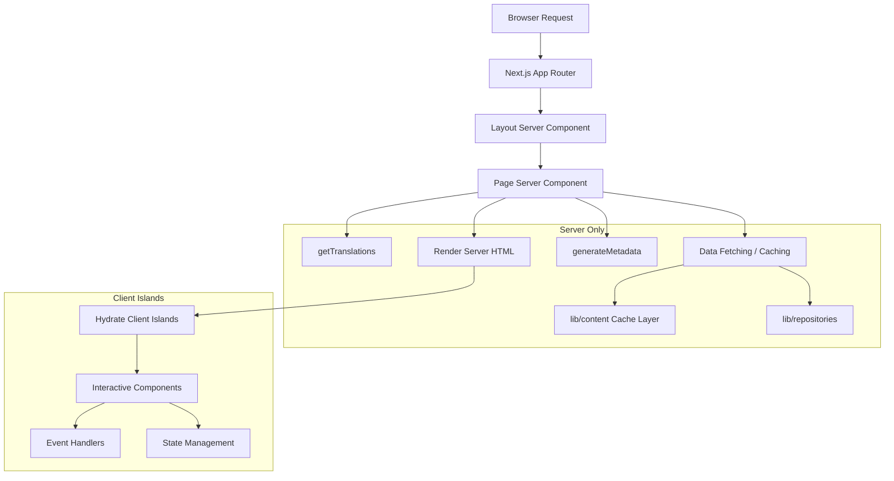

# Шаблоны серверных компонентов

## Обзор

Шаблон Ever Works использует серверные компоненты React (RSC) в качестве стратегии рендеринга по умолчанию в маршрутизаторе приложений Next.js. Компоненты сервера обрабатывают выборку данных, загрузку перевода, генерацию метаданных и компоновку макета на сервере, отправляя клиенту только обработанный HTML.

## Архитектура



## Исходные файлы

|Файл|Модель продемонстрирована|
|------|---------------------|
|`template/app/[locale]/about/page.tsx`|Извлечение данных, i18n, метаданные, рендеринг MDX|
|`template/app/[locale]/layout.tsx`|Корневой макет с поставщиком локали|
|`template/app/layout.tsx`|Глобальный макет, шрифты, поставщики|
|`template/app/sitemap.ts`|Генерация маршрутов только для сервера|
|`template/app/robots.ts`|Конфигурация только для сервера|

## Основные шаблоны

### Шаблон 1: асинхронные компоненты страницы с i18n

Каждая локализованная страница следует этому шаблону:

```typescript
// Server Component -- no "use client" directive
export const revalidate = 3600; // ISR: revalidate every hour

interface PageProps {
    params: Promise<{ locale: string }>;
}

export async function generateMetadata({ params }: PageProps): Promise<Metadata> {
    const { locale } = await params;
    const t = await getTranslations({ locale, namespace: 'footer' });
    return {
        title: t('ABOUT_US'),
        description: t('ABOUT_PAGE_META_DESCRIPTION'),
        alternates: {
            languages: generateHreflangAlternates('/about')
        }
    };
}

export default async function AboutPage({ params }: PageProps) {
    const { locale } = await params;
    const pageData = await getCachedPageContent('about', locale);
    const tCommon = await getTranslations({ locale, namespace: 'common' });

    return (
        <PageContainer>
            <MDX source={pageData?.content || DEFAULT_CONTENT} />
        </PageContainer>
    );
}
```

Ключевые характеристики:
- `params` — это `Promise` (соглашение Next.js 15+ App Router)
- Несколько вызовов `getTranslations()` для разных пространств имен
- Получение кэшированного контента через `getCachedPageContent()`
- Статический интервал повторной проверки с `export const revalidate`

### Схема 2: Генерация метаданных

Серверные компоненты генерируют метаданные SEO на уровне маршрута:

```typescript
export async function generateMetadata({ params }: PageProps): Promise<Metadata> {
    const { locale } = await params;
    const t = await getTranslations({ locale, namespace: 'pages' });

    return {
        metadataBase: new URL(appUrl),
        title: t('PAGE_TITLE'),
        description: t('PAGE_DESCRIPTION'),
        alternates: {
            languages: generateHreflangAlternates('/path')
        }
    };
}
```

Утилита `generateHreflangAlternates()` от `lib/seo/hreflang.ts` автоматически генерирует ссылки на альтернативные языки для всех поддерживаемых локалей.

### Схема 3: ISR с кэшированием контента

```typescript
export const revalidate = 3600; // Revalidate every hour

export default async function Page({ params }: PageProps) {
    const data = await getCachedPageContent('page-name', locale);
    // Render with cached data...
}
```

Функция `getCachedPageContent()` обеспечивает уровень кэша на стороне сервера поверх содержимого CMS на основе Git в `.content/`. В сочетании с `revalidate` это создает шаблон ISR (инкрементная статическая регенерация), при котором страницы статически генерируются и периодически обновляются.

### Шаблон 4. Проверка аутентификации на стороне сервера

Защищенные страницы используют защиту на стороне сервера от `lib/auth/guards.ts`:

```typescript
import { requireAuth, requireAdmin } from '@/lib/auth/guards';

export default async function ProtectedPage() {
    const session = await requireAuth();
    // session.user is guaranteed to exist here
    return <div>Welcome {session.user.email}</div>;
}

export default async function AdminPage() {
    const session = await requireAdmin();
    // session.user.isAdmin is guaranteed true here
    return <AdminDashboard />;
}
```

Эти охранники звонят `auth()` внутри компании и используют `redirect()` от `next/navigation` для отправки неаутентифицированных пользователей на страницу входа. Перенаправление происходит на стороне сервера, поэтому клиентский JavaScript не требуется.

### Шаблон 5: Составление серверных и клиентских компонентов

Серверные компоненты делегируют интерактивность «островам» клиентских компонентов:

```typescript
// Server Component (page.tsx)
export default async function Page({ params }: PageProps) {
    const { locale } = await params;
    const data = await fetchData();
    const t = await getTranslations({ locale, namespace: 'page' });

    return (
        <div>
            <h1>{t('TITLE')}</h1>
            {/* Server-rendered static content */}
            <StaticContent data={data} />
            {/* Client island for interactivity */}
            <InteractiveFilter initialData={data} />
        </div>
    );
}
```

Данные передаются от сервера к клиенту в виде сериализуемых реквизитов. Клиентские компоненты получают предварительно полученные данные и обрабатывают взаимодействия с пользователем.

## Стратегии получения данных

### Прямой доступ к репозиторию

Серверные компоненты могут напрямую импортировать и вызывать функции репозитория:

```typescript
import { getItemBySlug } from '@/lib/repositories/item-repository';

export default async function ItemPage({ params }) {
    const item = await getItemBySlug(params.slug);
    // ...
}
```

### Слой кэшированного контента

Для контента CMS на основе Git:

```typescript
import { getCachedPageContent } from '@/lib/content';

const pageData = await getCachedPageContent('about', locale);
```

### Внешние вызовы API

Сервисные функции в `lib/services/` инкапсулируют внешние взаимодействия API:

```typescript
import { triggerManualSync } from '@/lib/services/sync-service';
```

## Стриминг и интрига

Серверные компоненты поддерживают потоковую передачу через границы React Suspense. На больших страницах можно отображать состояния загрузки отдельных разделов:

```typescript
import { Suspense } from 'react';

export default async function Page() {
    return (
        <div>
            <Header /> {/* Renders immediately */}
            <Suspense fallback={<LoadingSkeleton />}>
                <SlowDataSection /> {/* Streams when ready */}
            </Suspense>
        </div>
    );
}
```

## Лучшие практики в шаблоне

1. **Нет `"use client"`, если не требуется** — по умолчанию компоненты являются серверными компонентами.
2. **Переводы загружаются на стороне сервера** – `getTranslations()` выполняется только на сервере.
3. **Метаданные, расположенные рядом со страницами** – `generateMetadata` экспортируются из того же файла.
4. **Повторная проверка на уровне маршрута** — `export const revalidate` контролирует время ISR.
5. **Защитные функции для аутентификации** – перенаправление на стороне сервера без затрат на клиентский пакет.
6. **Реквизиты вниз, события вверх** — серверные компоненты передают данные на клиентские острова в качестве реквизитов.
