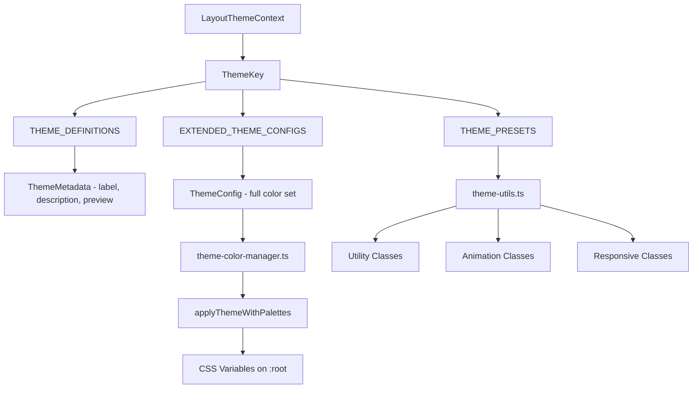
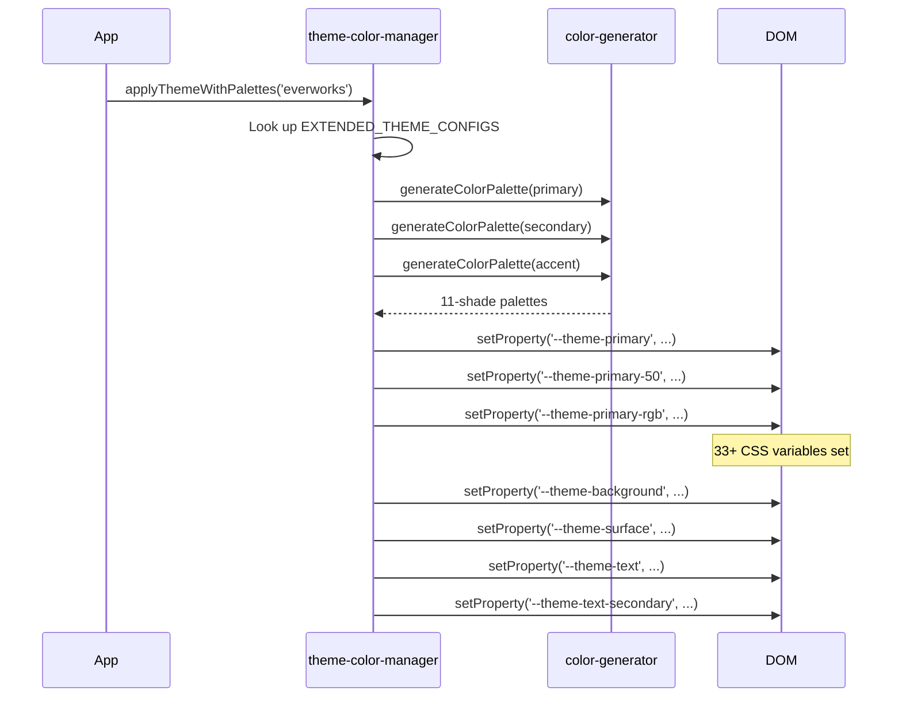

# Система тем

Шаблон предоставляет многотемовую систему с четырьмя встроенными темами. Темы управляют цветами, переменными CSS, утилитами Tailwind, а также включают компоненты предварительного просмотра и метаданные для пользовательских интерфейсов выбора тем.

## Обзор архитектуры



## Исходные файлы

|Файл|Цель|
|------|---------|
|`lib/themes.tsx`|Определения тем, метаданные и компоненты предварительного просмотра|
|`lib/theme-color-manager.ts`|Расширенные конфиги, DOM-приложение, генерация CSS|
|`lib/theme-utils.ts`|Утилиты класса Tailwind, пресеты, вспомогательные функции|
|`components/context/LayoutThemeContext`|Контекст реагирования на состояние темы (ссылка)|

## Доступные темы

|Ключ темы|Этикетка|Первичный|вторичный|Описание|
|-----------|-------|---------|-----------|-------------|
|`everworks`|По умолчанию|`#3d70ef`|`#00c853`|Современный и профессиональный с синим и зеленым|
|`corporate`|Корпоративный|`#00c853`|`#e74c3c`|Профессиональный бизнес с зеленым и красным|
|`material`|Материал|`#673ab7`|`#ff9800`|Google Material Design с фиолетовым и оранжевым|
|`funny`|Смешно|`#ff4081`|`#ffeb3b`|Игривый и яркий с розовым и желтым|

## Конфигурация темы

Каждая тема определяет семь цветовых слотов:

```typescript
export interface ThemeConfig {
  primary: string;
  secondary: string;
  accent: string;
  background: string;
  surface: string;
  text: string;
  textSecondary: string;
}
```

### Расширенные конфигурации темы

`EXTENDED_THEME_CONFIGS` в `theme-color-manager.ts` предоставляет полные определения цветов:

```typescript
export const EXTENDED_THEME_CONFIGS: Record<ThemeKey, ThemeConfig> = {
  everworks: {
    primary: "#3d70ef",
    secondary: "#00c853",
    accent: "#0056b3",
    background: "#ffffff",
    surface: "#f8f9fa",
    text: "#1a1a1a",
    textSecondary: "#6c757d",
  },
  // ... other themes
};
```

## Метаданные темы

Модуль `themes.tsx` предоставляет компоненты отображения метаданных и предварительного просмотра:

```typescript
export interface ThemeMetadata {
  readonly key: ThemeKey;
  readonly label: string;
  readonly description: string;
  readonly preview: React.ReactNode;
  readonly config: ThemeConfig;
}
```

### Определения тем

```typescript
export const THEME_DEFINITIONS: Record<ThemeKey, Omit<ThemeMetadata, 'config'>> = {
  everworks: {
    key: "everworks",
    label: "Default",
    description: "Modern and professional theme with blue and green accents",
    preview: ThemePreviews.everworks,
  },
  // ... other themes
};
```

### Предварительный просмотр компонентов

Каждая тема имеет небольшой визуальный предварительный просмотр, оформленный в виде `div`:

```typescript
export const ThemePreviews: Record<ThemeKey, React.ReactNode> = {
  everworks: (
    <div className="w-12 h-8 bg-[#3d70ef] rounded-sm overflow-hidden relative">
      <div className="absolute inset-0 bg-linear-to-br from-white/10 to-black/10" />
      <div className="absolute bottom-1 left-1 w-2 h-1 bg-white/80 rounded-xs" />
      <div className="absolute top-1 right-1 w-1 h-1 bg-white/60 rounded-full" />
    </div>
  ),
  // ... other previews
};
```

### Функции запроса метаданных

```typescript
// Get metadata for a single theme
export const getThemeMetadata = (themeKey: ThemeKey, config: ThemeConfig): ThemeMetadata;

// Get metadata for all themes
export const getAllThemeMetadata = (configs: Record<ThemeKey, ThemeConfig>): ThemeMetadata[];
```

## Приложение CSS-переменных

При применении темы диспетчер цвета устанавливает пользовательские свойства CSS для `document.documentElement`:



### Сгенерированные переменные CSS

Для каждой темы создаются следующие переменные CSS:

|Переменный шаблон|Граф|Пример|
|-----------------|-------|---------|
|`--theme-primary-{50-950}`| 11 |`--theme-primary-500: #3d70ef`|
|`--theme-primary-rgb`| 1 |`--theme-primary-rgb: 61, 112, 239`|
|`--theme-secondary-{50-950}`| 11 |`--theme-secondary-500: #00c853`|
|`--theme-accent-{50-950}`| 11 |`--theme-accent-500: #0056b3`|
|`--theme-background`| 1 |`--theme-background: #ffffff`|
|`--theme-surface`| 1 |`--theme-surface: #f8f9fa`|
|`--theme-text`| 1 |`--theme-text: #1a1a1a`|
|`--theme-text-secondary`| 1 |`--theme-text-secondary: #6c757d`|

## Классы полезности попутного ветра

Предварительно созданные комбинации классов для единообразного использования темы:

### Варианты кнопок

```typescript
themeClasses.button.primary   // "bg-theme-primary hover:bg-theme-accent text-white"
themeClasses.button.secondary // "bg-theme-secondary hover:bg-theme-secondary/80 text-white"
themeClasses.button.outline   // "border-2 border-theme-primary text-theme-primary ..."
themeClasses.button.ghost     // "text-theme-primary hover:bg-theme-primary/10"
```

### Классы анимации

```typescript
export const animationClasses = {
  fadeIn: "animate-in fade-in duration-200",
  slideIn: "animate-in slide-in-from-top-2 duration-200",
  scaleIn: "animate-in zoom-in-95 duration-200",
  hover: "transition-all duration-200 hover:scale-105",
  press: "transition-all duration-100 active:scale-95",
};
```

### Классы адаптивного макета

```typescript
export const responsiveClasses = {
  container: "container max-w-7xl px-4 sm:px-6 lg:px-8",
  grid: {
    responsive: "grid grid-cols-1 md:grid-cols-2 lg:grid-cols-3 gap-4",
    auto: "grid grid-cols-[repeat(auto-fit,minmax(300px,1fr))] gap-4",
  },
  flex: {
    center: "flex items-center justify-center",
    between: "flex items-center justify-between",
    start: "flex items-center justify-start",
  },
};
```

## Создание классов с учетом тем

Функция `buildThemeClasses` объединяет базовые, тематические и условные классы:

```typescript
import { buildThemeClasses } from '@/lib/theme-utils';

const className = buildThemeClasses(
  'px-4 py-2 rounded',           // Base classes
  'bg-theme-primary text-white',  // Theme classes
  {
    'opacity-50 cursor-not-allowed': isDisabled,
    'ring-2 ring-theme-accent': isFocused,
  }
);
```

## Предварительные настройки цвета темы

Быстрый доступ к основным/вторичным цветам темы:

```typescript
export const THEME_PRESETS = {
  everworks: { primary: "#3d70ef", secondary: "#00c853" },
  corporate: { primary: "#2c3e50", secondary: "#e74c3c" },
  material: { primary: "#673ab7", secondary: "#ff9800" },
  funny: { primary: "#ff4081", secondary: "#ffeb3b" },
} as const;

// Query function
export const getThemeColor = (
  themeKey: ThemeKey,
  colorType: "primary" | "secondary"
) => colorMap[themeKey][colorType];
```

## Справочник цветов попутного ветра

Модуль `theme-utils.ts` также экспортирует полный набор значений цветов Tailwind CSS в виде объекта `tailwindColors`, охватывающего все 22 семейства цветов (от сланцевого до розового) с оттенками 50–950, а также карту `opacities` от 5% до 95%.
