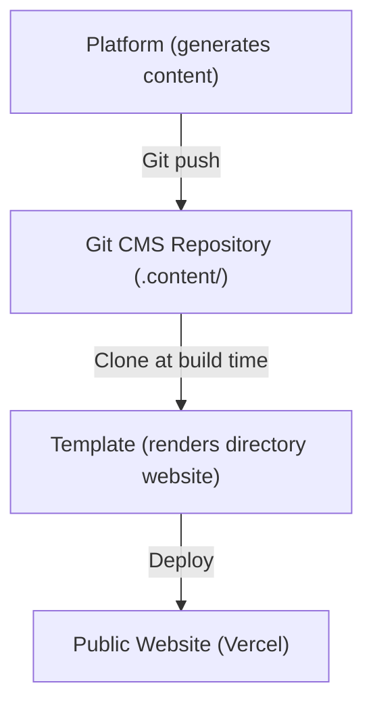
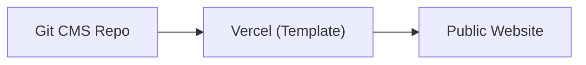
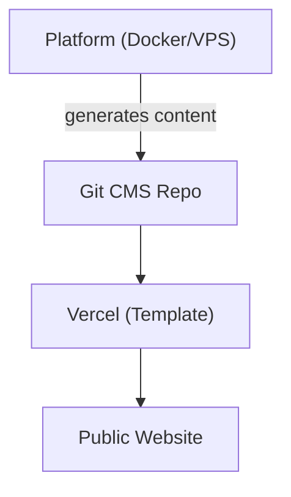
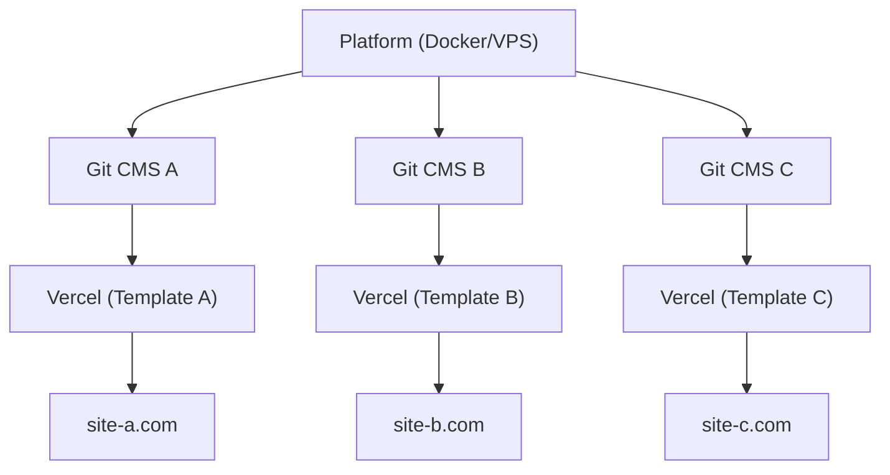

# Платформа против Шаблона

Ever Works состоит из двух основных продуктов, которые служат разным целям, но работают вместе как единая экосистема. На этой странице объясняется разница между ними и когда использовать каждый из них.

## Платформа Ever Works

**Платформа Ever Works** — это бэкенд-инфраструктура для создания и управления сайтами-каталогами в масштабе. Она предоставляет REST API, конвейеры генерации контента на базе ИИ, систему плагинов и оркестрацию развёртывания.

Полная документация по платформе доступна на [docs.ever.works](https://docs.ever.works).

## Directory Web Template

**Directory Web Template** (этот проект) — готовый к производству полностековый сайт-каталог, который можно клонировать, настраивать и развёртывать как самостоятельное приложение.

### Что он делает

- Предоставляет полноценный **сайт-каталог** с листингами элементов, поиском, фильтрацией, категориями, тегами и коллекциями
- Включает **аутентификацию** через NextAuth.js v5 с OAuth-провайдерами (Google, GitHub, Facebook, Twitter, Microsoft) и Supabase Auth
- Поддерживает **платежи** через Stripe, LemonSqueezy и Polar с управлением подписками
- Предлагает **интернационализацию** с несколькими языками и поддержкой RTL через next-intl
- Использует **CMS на основе Git** для синхронизации контента каталога из Git-репозиториев
- Включает **систему тем** со встроенными темами и динамической генерацией цветов
- Обеспечивает **аналитику и мониторинг** через PostHog и Sentry
- Поставляется с **SEO-оптимизацией**, генерацией карты сайта и структурированными данными (JSON-LD)
- Включает **панель администратора** с управлением контентом, пользователями и аналитикой

### Технологический Стек

- **Фреймворк:** Next.js 15, React 19
- **Язык:** TypeScript 5
- **ORM:** Drizzle ORM (PostgreSQL)
- **UI:** Tailwind CSS 4, HeroUI React, Radix UI
- **Auth:** NextAuth.js v5, Supabase Auth
- **Платежи:** Stripe, LemonSqueezy, Polar
- **Тестирование:** Playwright (E2E)
- **Развёртывание:** Vercel (основное), Docker (альтернативное)

## Сравнение Бок о Бок

| Аспект               | Платформа                                  | Шаблон                                 |
| -------------------- | ------------------------------------------ | -------------------------------------- |
| **Назначение**       | Бэкенд-инфраструктура и ИИ-конвейер        | Фронтенд-сайт каталог                  |
| **Архитектура**      | Монорепо (Turborepo + pnpm)                | Автономное приложение Next.js          |
| **Бэкенд**           | NestJS 11 API                              | API-маршруты Next.js                   |
| **ORM базы данных**  | TypeORM                                    | Drizzle ORM                            |
| **Аутентификация**   | JWT + OAuth (NestJS Guards)                | NextAuth.js v5 + Supabase Auth         |
| **Платежи**          | Не включены                                | Stripe, LemonSqueezy, Polar            |
| **ИИ-функции**       | Агенты LangChain, 7 LLM-провайдеров        | Нет (потребляет ИИ-сгенерированный контент) |
| **Контент**          | Генерирует контент через ИИ-конвейеры      | Читает контент из CMS на основе Git    |
| **Развёртывание**    | Docker на любом VPS                        | Vercel (или Docker)                    |
| **Тестирование**     | Jest + Vitest                              | Playwright                             |
| **Аудитория**        | Операторы платформы, ИИ-разработчики       | Создатели сайтов, создатели каталогов  |

## Как они соединяются

Платформа и Шаблон работают вместе через паттерн **CMS на основе Git**:

### Независимая Работа

- **Шаблон без Платформы:** Управляйте контентом каталога вручную, редактируя файлы YAML и Markdown в Git CMS-репозитории. Шаблон работает как полностью функциональный сайт-каталог без ИИ-генерации.
- **Платформа без Шаблона:** Используйте API платформы для генерации данных каталога и экспорта их в любой фронтенд.

## Когда что использовать

### Используйте Шаблон, когда...

- Вы хотите быстро запустить сайт-каталог с минимальной настройкой бэкенда
- Контент каталога курируется вручную или берётся из статического источника данных
- Вам нужен готовый к производству сайт с аутентификацией, платежами и SEO из коробки
- Вы предпочитаете развёртывать на Vercel без управления сервером

### Используйте Платформу, когда...

- Вам нужна ИИ-генерация контента для крупных каталогов
- Вам нужны автоматизированные конвейеры для обнаружения, обогащения и обновления элементов каталога
- Вам нужно управлять несколькими каталогами из одного бэкенда
- Вы хотите использовать систему плагинов для пользовательских интеграций

### Используйте оба, когда...

- Вы хотите, чтобы ИИ-сгенерированный контент поступал в производственный сайт
- Вы создаёте SaaS-продукт на базе Ever Works
- Вам нужна автоматическая генерация контента И отточенный фронтенд

## Архитектуры Развёртывания

### Только Шаблон (Простейшее)

Ручное управление контентом через Git. Одно развёртывание на Vercel.

### Платформа + Шаблон (Full Stack)

Автоматическая генерация контента через Платформу. Соединение через Git.

### Платформа + Несколько Шаблонов

Один экземпляр Платформы управляет несколькими сайтами-каталогами.
