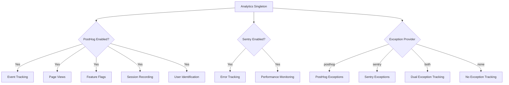
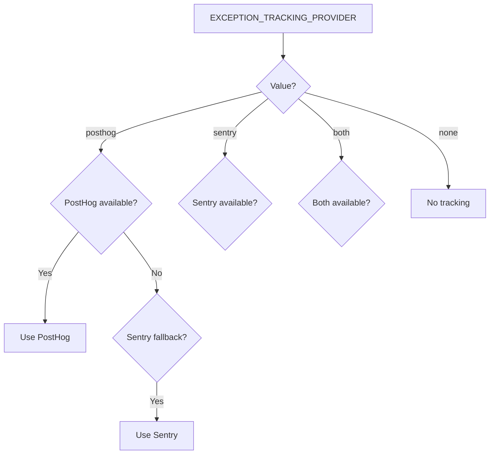

# Конфигурация Аналитики

Шаблон предоставляет унифицированную систему аналитики, интегрирующую PostHog для продуктовой аналитики и Sentry для отслеживания ошибок. Оба провайдера управляются через единственный экземпляр класса `Analytics` с автоматическим механизмом резервирования.

## Архитектура



## Переменные Окружения

### Конфигурация PostHog

| Переменная | Обязательно | По умолчанию | Описание |
|---|---|---|---|
| `NEXT_PUBLIC_POSTHOG_KEY` | Да (для аналитики) | -- | API-ключ проекта PostHog |
| `NEXT_PUBLIC_POSTHOG_HOST` | Да (для аналитики) | -- | URL экземпляра PostHog |
| `POSTHOG_DEBUG` | Нет | `false` | Включить отладочное логирование |
| `POSTHOG_SESSION_RECORDING_ENABLED` | Нет | `true` | Включить запись сессий |
| `POSTHOG_AUTO_CAPTURE` | Нет | `false` | Автоматически захватывать просмотры страниц |
| `POSTHOG_EXCEPTION_TRACKING` | Нет | `true` | Включить отслеживание исключений PostHog |

### Конфигурация Sentry

| Переменная | Обязательно | По умолчанию | Описание |
|---|---|---|---|
| `NEXT_PUBLIC_SENTRY_DSN` | Да (для ошибок) | -- | Sentry Data Source Name |
| `SENTRY_ENABLE_DEV` | Нет | `false` | Включить Sentry в режиме разработки |
| `SENTRY_DEBUG` | Нет | `false` | Включить режим отладки Sentry |
| `SENTRY_EXCEPTION_TRACKING` | Нет | `true` | Включить отслеживание исключений Sentry |

### Унифицированное Отслеживание Исключений

| Переменная | Обязательно | По умолчанию | Описание |
|---|---|---|---|
| `EXCEPTION_TRACKING_PROVIDER` | Нет | `both` | Используемый провайдер: `posthog`, `sentry`, `both` или `none` |

## Настройка PostHog

### Шаг 1: Получите учётные данные

1. Зарегистрируйтесь на [posthog.com](https://posthog.com) или разверните PostHog самостоятельно
2. Создайте проект
3. Скопируйте API-ключ проекта и URL хоста

### Шаг 2: Настройте окружение

```env
NEXT_PUBLIC_POSTHOG_KEY=phc_your_project_key_here
NEXT_PUBLIC_POSTHOG_HOST=https://app.posthog.com
```

PostHog автоматически включается при наличии обоих значений: `NEXT_PUBLIC_POSTHOG_KEY` и `NEXT_PUBLIC_POSTHOG_HOST`.

### Шаг 3: Частота выборки

Частота выборки автоматически настраивается в зависимости от окружения:

| Окружение | Частота выборки событий | Частота записи сессий |
|---|---|---|
| Продакшн | 10% (`0.1`) | 10% (`0.1`) |
| Разработка | 100% (`1.0`) | 100% (`1.0`) |

## Настройка Sentry

### Шаг 1: Получите DSN

1. Создайте проект на [sentry.io](https://sentry.io)
2. Скопируйте DSN из настроек проекта

### Шаг 2: Настройте окружение

```env
NEXT_PUBLIC_SENTRY_DSN=https://examplePublicKey@o0.ingest.sentry.io/0
SENTRY_ENABLE_DEV=true  # Опционально: включить в режиме разработки
```

Sentry автоматически включается в продакшне при наличии DSN. Для разработки явно установите `SENTRY_ENABLE_DEV=true`.

## API класса Analytics

Класс `Analytics` — это синглтон, доступный во всём приложении:

```typescript
import { analytics } from '@/lib/analytics';
```

### Инициализация

```typescript
// Инициализировать аналитику (вызвать один раз в корне приложения)
analytics.init();
```

Метод `init()` работает только на стороне клиента и безопасен для вызова в серверных контекстах (в этом случае ничего не происходит).

### Отслеживание событий

```typescript
// Отслеживать пользовательское событие
analytics.track('button_clicked', {
  buttonName: 'signup',
  page: '/landing'
});

// Отслеживать просмотр страницы
analytics.trackPageView('/dashboard', {
  referrer: document.referrer
});
```

### Идентификация пользователя

```typescript
// Идентифицировать пользователя (после входа)
analytics.identify('user-123', {
  email: 'user@example.com',
  plan: 'premium',
  company: 'Acme Inc.'
});

// Сбросить идентификатор (после выхода)
analytics.reset();

// Установить постоянные свойства пользователя
analytics.setUserProperties({
  subscription_tier: 'premium',
  signup_date: '2024-01-15'
});

// Установить суперсвойства (отправляются с каждым событием)
analytics.setSuperProperties({
  app_version: '2.0.0',
  platform: 'web'
});
```

### Флаги функций

```typescript
// Проверить, включён ли флаг функции
const isEnabled = analytics.isFeatureEnabled('new-dashboard', false);

// Перезагрузить флаги функций с сервера
await analytics.reloadFeatureFlags();
```

### Отслеживание исключений

```typescript
// Захватить исключение (направляется к настроенному провайдеру)
analytics.captureException(error, {
  component: 'PaymentForm',
  action: 'submit'
});

// Захватить с текстовым сообщением
analytics.captureException('Payment processing failed', {
  orderId: 'ord-123'
});
```

## Выбор провайдера для отслеживания исключений


