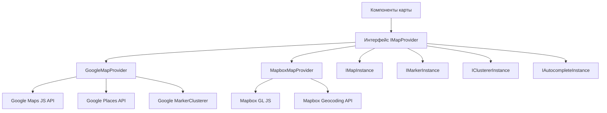

# Настройка карт

Шаблон включает провайдеро-агностическую систему карт, поддерживающую как Google Maps, так и Mapbox GL JS. Общий слой интерфейса позволяет переключаться между провайдерами без изменения кода компонентов.

## Архитектура



## Выбор провайдера

Провайдер карты определяется по настроенным ключам API:

| Провайдер | Требуемая переменная окружения |
|---|---|
| Google Maps | `NEXT_PUBLIC_GOOGLE_MAPS_API_KEY` |
| Mapbox | `NEXT_PUBLIC_MAPBOX_ACCESS_TOKEN` |

Если настроены оба, провайдер выбирается через настройки конфигурации карты приложения.

## Настройка Google Maps

### Шаг 1: Получение ключа API

1. Перейдите в [Google Cloud Console](https://console.cloud.google.com)
2. Включите следующие API:
   - Maps JavaScript API
   - Places API
   - Geocoding API
3. Создайте ключ API с ограничениями по HTTP-реферерам

### Шаг 2: Настройка окружения

```env
NEXT_PUBLIC_GOOGLE_MAPS_API_KEY=AIzaSy...your-api-key
NEXT_PUBLIC_GOOGLE_MAPS_MAP_ID=your-map-id        # Опционально: для стилизованных карт
```

### Шаг 3: Безопасность

Провайдер Google Maps обеспечивает использование ключа только в браузере.

**Необходимые ограничения ключа API:**
- Ограничение приложения: HTTP-реферы
- Добавьте шаблоны вашего домена (например, `https://yourdomain.com/*`)
- Ограничение API: Ограничьте Maps JavaScript, Places и Geocoding API

## Настройка Mapbox

### Шаг 1: Получение токена доступа

1. Зарегистрируйтесь на [mapbox.com](https://www.mapbox.com)
2. Скопируйте ваш публичный токен доступа (начинается с `pk.`)

### Шаг 2: Настройка окружения

```env
NEXT_PUBLIC_MAPBOX_ACCESS_TOKEN=pk.eyJ1Ijoi...your-token
```

### Шаг 3: Безопасность

**Необходимые ограничения токена:**
- Используйте **публичный** токен (префикс `pk.`)
- Добавьте ограничения URL для ваших доменов
- Никогда не используйте секретные токены (`sk.*`) в клиентском коде

## Интерфейс провайдера

Оба провайдера реализуют интерфейс `IMapProvider` с идентичными возможностями:

### Методы IMapProvider

| Метод | Описание |
|---|---|
| `isLoaded()` | Проверить, загружен ли скрипт провайдера |
| `loadScript()` | Загрузить библиотеку провайдера (идемпотентно) |
| `createMap(container, options)` | Создать экземпляр карты в DOM-элементе |
| `createMarker(map, options)` | Добавить маркер на карту |
| `createClusterer(map, options, onClick)` | Группировать близлежащие маркеры в кластеры |
| `createAutocomplete(input, onSelect)` | Прикрепить автодополнение адреса к полю ввода |
| `getStyleUrl(style)` | Получить URL стиля для вида улиц или спутника |
| `isConfigured()` | Проверить наличие ключей API |

### Стили карты

| Стиль | Google Maps | Mapbox |
|---|---|---|
| `streets` | `roadmap` | `mapbox://styles/mapbox/streets-v12` |
| `satellite` | `satellite` | `mapbox://styles/mapbox/satellite-streets-v12` |

## Система типов

### Основные типы

```typescript
interface Coordinates {
  latitude: number;
  longitude: number;
}

interface MapBounds {
  north: number;
  south: number;
  east: number;
  west: number;
}

interface MapViewport {
  center: Coordinates;
  zoom: number;
  bounds?: MapBounds;
}
```

### Типы маркеров

```typescript
interface MapMarkerData {
  id: string;
  coordinates: Coordinates;
  title: string;
  icon?: string;
  category?: string;
  slug: string;
  description?: string;
}
```

### Конфигурация кластеров

```typescript
interface ClusterOptions {
  radius?: number;     // Радиус кластера в пикселях (по умолчанию: 60)
  maxZoom?: number;    // Максимальный зум для кластеризации (по умолчанию: 16)
  minZoom?: number;    // Минимальный зум для кластеризации (по умолчанию: 0)
  minPoints?: number;  // Минимальное количество точек для кластера (по умолчанию: 2)
}
```

### Обработчики событий

```typescript
interface MapEventHandlers {
  onMarkerClick?: (marker: MapMarkerData) => void;
  onClusterClick?: (cluster: MapClusterData) => void;
  onViewportChange?: (viewport: MapViewport) => void;
  onMapReady?: () => void;
  onMapError?: (error: Error) => void;
}
```

## Пропсы компонента карты

| Prop | Тип | По умолчанию | Описание |
|---|---|---|---|
| `markers` | `MapMarkerData[]` | `[]` | Маркеры для отображения |
| `center` | `Coordinates` | -- | Начальная центральная позиция |
| `zoom` | `number` | -- | Начальный уровень зума (1-20) |
| `style` | `MapStyle` | `streets` | Стиль карты (streets/satellite) |
