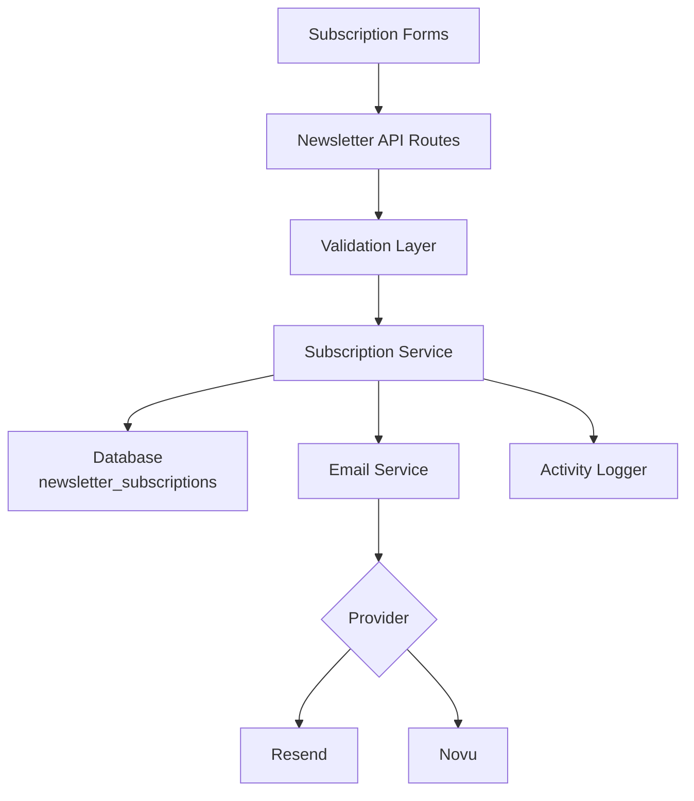
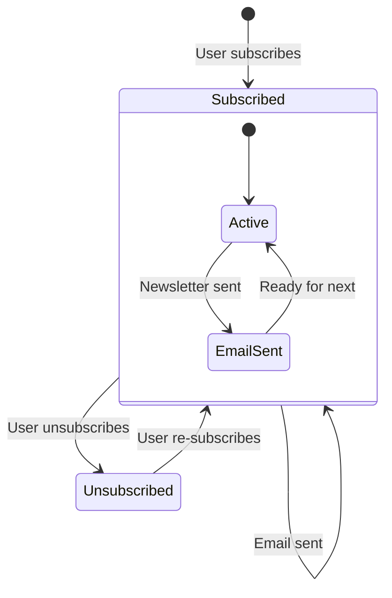

# Конфигурация Рассылки

Шаблон включает полноценную систему подписки на рассылку с интеграцией почтового провайдера, валидацией, управлением жизненным циклом подписок и журналированием активности. Конфигурация централизована в `lib/newsletter/`.

## Архитектура



## Структура Файлов

```
lib/newsletter/
├── config.ts    # Configuration, types, validation schemas
└── utils.ts     # Email sending, subscription validation, logging
```

## Константы Конфигурации

Объект `NEWSLETTER_CONFIG` в `config.ts` определяет все значения по умолчанию и сообщения:

```typescript
export const NEWSLETTER_CONFIG = {
  DEFAULT_PROVIDER: "resend",
  DEFAULT_FROM: "onboarding@resend.dev",
  DEFAULT_COMPANY_NAME: "Ever Works",

  SOURCES: {
    FOOTER: "footer",
    POPUP: "popup",
    SIGNUP: "signup",
  },

  ERRORS: {
    INVALID_EMAIL: "Please enter a valid email address",
    ALREADY_SUBSCRIBED: "Email is already subscribed to the newsletter",
    NOT_SUBSCRIBED: "Email is not subscribed to the newsletter",
    SUBSCRIPTION_FAILED: "Failed to create subscription. Please try again.",
    UNSUBSCRIPTION_FAILED: "Failed to unsubscribe. Please try again.",
    EMAIL_SEND_FAILED: "Failed to send email. Please try again.",
    STATS_FAILED: "Failed to get newsletter statistics",
  },

  SUCCESS: {
    SUBSCRIBED: "Successfully subscribed to newsletter",
    UNSUBSCRIBED: "Successfully unsubscribed from newsletter",
  },
};
```

## Настройка Почтового Провайдера

### Resend (По умолчанию)

```env
RESEND_API_KEY=re_your_api_key_here
```

1. Зарегистрируйтесь на [resend.com](https://resend.com)
2. Создайте API-ключ
3. Подтвердите домен отправки (или используйте `onboarding@resend.dev` для тестирования)

### Novu

```env
NOVU_API_KEY=your_novu_api_key
```

Для Novu доступна дополнительная конфигурация в настройках сайта:

```yaml
mail:
  provider: "novu"
  template_id: "your-template-id"
  backend_url: "https://api.novu.co"
```

## Конфигурация Электронной Почты

Функция `createEmailConfig()` формирует конфигурацию электронной почты из настроек приложения:

```typescript
interface EmailConfig {
  provider: string;      // "resend" or "novu"
  defaultFrom: string;   // Sender email address
  domain: string;        // Application domain URL
  apiKeys: {
    resend: string;
    novu: string;
  };
  novu?: {
    templateId?: string;
    backendUrl?: string;
  };
}
```

Приоритет конфигурации:

| Настройка         | Источник                        | Резервное значение         |
|---|---|---|
| Провайдер         | `config.mail.provider`          | `"resend"`                 |
| Адрес отправителя | `config.mail.default_from`      | `"onboarding@resend.dev"`  |
| Домен             | `config.app_url`                | `coreConfig.APP_URL`       |
| Ключ Resend       | Переменная окружения `RESEND_API_KEY` | Пустая строка        |
| Ключ Novu         | Переменная окружения `NOVU_API_KEY`  | Пустая строка        |

## Схемы Валидации

Система рассылки использует схемы Zod для валидации входных данных:

### Схема Электронной Почты

```typescript
const emailSchema = z.object({
  email: z
    .string()
    .email("Please enter a valid email address")
    .transform((email) => email.toLowerCase().trim()),
});
```

### Схема Подписки

```typescript
const newsletterSubscriptionSchema = z.object({
  email: z
    .string()
    .email("Please enter a valid email address")
    .transform((email) => email.toLowerCase().trim()),
  source: z
    .enum(["footer", "popup", "signup"])
    .default("footer"),
});
```

## Источники Подписок

Отслеживание происхождения подписок:

| Источник | Описание                                         |
|---|---|
| `footer` | Форма подписки в подвале сайта                   |
| `popup`  | Всплывающее окно/модальное окно рассылки         |
| `signup` | Процесс регистрации аккаунта                     |

## Утилиты Рассылки

### Отправка Электронной Почты

```typescript
import { sendEmailSafely, createEmailService } from '@/lib/newsletter/utils';

// Create email service
const { service, config } = await createEmailService();

// Send email with error handling
const result = await sendEmailSafely(
  service,
  config,
  {
    subject: "Welcome to our newsletter!",
    html: "<h1>Welcome!</h1>",
    text: "Welcome!"
  },
  "user@example.com",
  "welcome"
);

if (!result.success) {
  console.error(result.error);
}
```

### Валидация Подписки

```typescript
import { canSubscribe, canUnsubscribe } from '@/lib/newsletter/utils';

// Check if email can be subscribed
const { canSubscribe: allowed, error } = await canSubscribe("user@example.com");
if (!allowed) {
  // Email is already subscribed
}

// Check if email can be unsubscribed
const { canUnsubscribe: allowed, error } = await canUnsubscribe("user@example.com");
if (!allowed) {
  // Email is not currently subscribed
}
```

### Журналирование Активности

```typescript
import { logNewsletterActivity, trackNewsletterMetric } from '@/lib/newsletter/utils';

// Log newsletter activity
logNewsletterActivity("subscribe", "user@example.com", "footer", {
  ip: "192.168.1.1"
});

// Track newsletter metrics
trackNewsletterMetric("subscription", "user@example.com", "popup");
```

Типы активности:

| Действие       | Когда Записывается                                   |
|---|---|
| `subscribe`    | Пользователь подписывается на рассылку               |
| `unsubscribe`  | Пользователь отписывается                            |
| `email_sent`   | Письмо рассылки успешно отправлено                   |
| `email_failed` | Отправка письма рассылки не удалась                  |

### Утилиты Шаблонов

```typescript
import { getTemplateWithCompany } from '@/lib/newsletter/utils';

// Generate email template with company name
const template = await getTemplateWithCompany(
  (email, companyName) => ({
    subject: `Welcome to ${companyName}`,
    html: `<p>Thanks for subscribing, ${email}!</p>`,
    text: `Thanks for subscribing, ${email}!`
  }),
  "user@example.com"
);
```

### Вспомогательные Функции Ответа

```typescript
import { createErrorResponse, createSuccessResponse } from '@/lib/newsletter/utils';

// Standardized error response
const error = createErrorResponse(
  "Subscription failed",
  "user@example.com",
  "subscribe"
);
// { error: "Subscription failed", email: "user@example.com", context: "subscribe" }

// Standardized success response
const success = createSuccessResponse("user@example.com", "subscribe");
// { success: true, email: "user@example.com", context: "subscribe" }
```

## Схема Базы Данных

Подписки на рассылку хранятся в таблице `newsletter_subscriptions`:

| Столбец          | Тип       | Описание                                          |
|---|---|---|
| `id`             | UUID      | Первичный ключ                                    |
| `email`          | String    | Электронная почта подписчика (уникальная)         |
| `isActive`       | Boolean   | Текущий статус подписки                           |
| `subscribedAt`   | Timestamp | Когда началась подписка                           |
| `unsubscribedAt` | Timestamp | Когда отписался (nullable)                        |
| `lastEmailSent`  | Timestamp | Последнее письмо, отправленное подписчику         |
| `source`         | String    | Источник подписки (footer, popup, signup)         |

## Жизненный Цикл Подписки



## Типы

```typescript
type NewsletterSource = "footer" | "popup" | "signup";

interface NewsletterActionResult {
  success?: boolean;
  error?: string;
  email?: string;
}

interface NewsletterStats {
  totalActive: number;
  recentSubscriptions: number;
}
```

## Безопасность

- Адреса электронной почты нормализуются до нижнего регистра и очищаются от пробелов перед сохранением
- Валидация почты использует безопасное регулярное выражение, предотвращающее атаки ReDoS (из `lib/utils/email-validation.ts`)
- Функция `sendEmailSafely` оборачивает все операции с почтой в блоки try-catch
- API-ключи никогда не раскрываются клиенту — все операции с почтой выполняются на стороне сервера

## Устранение Неполадок

| Проблема                              | Решение                                                                              |
|---|---|
| Письма не отправляются                | Убедитесь, что `RESEND_API_KEY` или `NOVU_API_KEY` установлен                        |
| Ошибка «уже подписан»                 | Проверьте таблицу `newsletter_subscriptions` на наличие активной записи              |
| Неверный адрес отправителя            | Обновите `mail.default_from` в настройках сайта                                      |
| Шаблон не загружается                 | Убедитесь, что `getCompanyName()` может получить доступ к конфигурации сайта         |
| Источник не отслеживается             | Передайте параметр `source` в запросах на подписку                                   |
