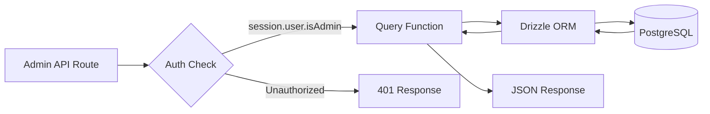
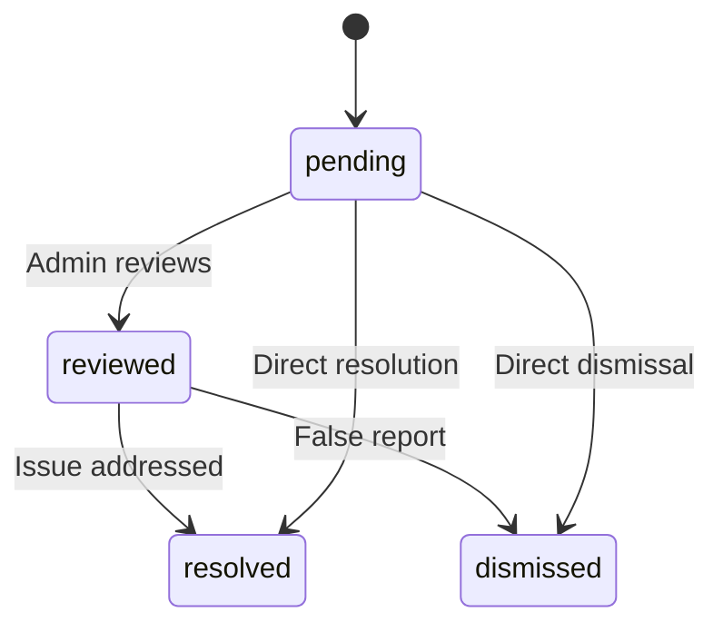

# Запросы к базе данных администратора

Запросы администратора обрабатывают управление элементами, управление пользователями/клиентами, доступ на основе ролей, статистику информационной панели, модерацию отчетов и настройки. Эти функции в основном используются маршрутами API под `app/api/admin/`.

## Последовательность запросов администратора



## Управление пользователями (`user.queries.ts`)

### Основные функции

|Функция|Параметры|Возврат|Описание|
|----------|-----------|---------|-------------|
|`getUserByEmail`|`email: string`|`Пользователь \|ноль`|Найти пользователя по адресу электронной почты|
|`getUserById`|`id: string`|`Пользователь \|ноль`|Найти пользователя по первичному ключу|
|`insertNewUser`|`user: NewUser`|`User[]`|Создайте новую запись пользователя|
|`updateUserPassword`|`hash, userId`|`void`|Обновить хеш пароля|
|`updateUserVerification`|`email, verified`|`void`|Установить статус подтверждения электронной почты|
|`softDeleteUser`|`userId: string`|`void`|Обратное удаление (к электронному письму добавляется `-deleted`)|
|`isUserAdmin`|`userId: string`|`boolean`|Проверьте роль администратора через присоединение|

### Проверка роли администратора

Функция `isUserAdmin` выполняет соединение нескольких таблиц для проверки статуса администратора:

```typescript
export async function isUserAdmin(userId: string): Promise<boolean> {
  const result = await db
    .select({ isAdmin: roles.isAdmin })
    .from(userRoles)
    .innerJoin(roles, eq(userRoles.roleId, roles.id))
    .where(and(
      eq(userRoles.userId, userId),
      eq(roles.isAdmin, true),
      eq(roles.status, 'active')
    ))
    .limit(1);

  return result.length > 0;
}
```

### Мягкое удаление шаблона

Пользователи никогда не удаляются физически. При мягком удалении идентификатор пользователя объединяется с адресом электронной почты, чтобы освободить адрес электронной почты для повторной регистрации:

```typescript
export async function softDeleteUser(userId: string) {
  return db
    .update(users)
    .set({
      deletedAt: sql`CURRENT_TIMESTAMP`,
      email: sql`CONCAT(email, '-', id, '-deleted')`
    })
    .where(eq(users.id, userId));
}
```

## Управление клиентами (`client.queries.ts`)

### Профиль CRUD

|Функция|Описание|
|----------|-------------|
|`createClientProfile(data)`|Создать профиль с автоматически сгенерированным уникальным именем пользователя|
|`getClientProfileById(id)`|Получить по идентификатору профиля|
|`getClientProfileByUserId(userId)`|Получить по ссылке пользователя|
|`getClientProfileByEmail(email)`|Получить с помощью поиска в таблице учетных записей|
|`updateClientProfile(id, data)`|Частичное обновление с отметкой времени|
|`deleteClientProfile(id)`|Жесткое удаление записи профиля|

### Данные панели администратора

Функция `getAdminDashboardData` оптимизирована для панели администратора и возвращает как постраничный список клиентов, так и подробную статистику за минимальное количество запросов:

```typescript
export async function getAdminDashboardData(params: {
  page: number;
  limit: number;
  search?: string;
  status?: string;
  plan?: string;
  accountType?: string;
  provider?: string;
  createdAfter?: Date;
  createdBefore?: Date;
}): Promise<{
  clients: ClientProfileWithAuth[];
  stats: { overview, byProvider, byPlan, byAccountType, activity, growth };
  pagination: { page, totalPages, total, limit };
}>
```

Функция исключает пользователей-администраторов из списков клиентов, используя шаблон LEFT JOIN + IS NULL:

```typescript
// Exclude admin users from client listing
.leftJoin(userRoles, eq(userRoles.userId, clientProfiles.userId))
.leftJoin(roles, and(eq(userRoles.roleId, roles.id), eq(roles.isAdmin, true)))
.where(isNull(roles.id))  // Only non-admin users
```

### Расширенный поиск клиентов

`advancedClientSearch` поддерживает сложную многокритериальную фильтрацию:

|Категория фильтра|Параметры|
|----------------|------------|
|**Текстовый поиск**|`search` (по имени, электронной почте, имени пользователя, компании, биографии, должности, отрасли, местоположению)|
|**Перечисляемые фильтры**|`status`, `plan`, `accountType`, `provider`|
|**Диапазоны дат**|`createdAfter`, `createdBefore`, `updatedAfter`, `updatedBefore`, `dateRange`|
|**В зависимости от области**|`emailDomain`, `companySearch`, `locationSearch`, `industrySearch`|
|**Числовой**|`minSubmissions`, `maxSubmissions`|
|**Логическое значение**|`hasAvatar`, `hasWebsite`, `hasPhone`, `emailVerified`, `twoFactorEnabled`|
|**Сортировка**|`sortBy` (создано, обновлено, имя, адрес электронной почты, компания, общее количество отправленных), `sortOrder`|

### Статистика клиентов

`getEnhancedClientStats` возвращает подробную разбивку:

```typescript
{
  overview: { total, active, inactive, suspended, trial },
  byProvider: { credentials, google, github, facebook, twitter, linkedin, other },
  byPlan: { free: number, standard: number, premium: number },
  byAccountType: { individual, business, enterprise },
  activity: { newThisWeek, newThisMonth, activeThisWeek, activeThisMonth },
  growth: { weeklyGrowth, monthlyGrowth },
}
```

## Управление отчетами (`report.queries.ts`)

### Сообщить о CRUD

|Функция|Описание|
|----------|-------------|
|`createReport(data)`|Создайте отчет о содержании (элемент или комментарий)|
|`getReportById(id)`|Получите отчет с данными репортера и рецензента|
|`getReports(params)`|Постраничный список отчетов с фильтрами|
|`updateReport(id, data)`|Обновить статус, разрешение, добавить примечания к обзору|
|`getReportStats()`|Статистика по статусу, типу контента, причине|
|`hasUserReportedContent(reportedBy, contentType, contentId)`|Проверка дубликатов отчетов|

### Статус отчета



### Фильтрация отчетов

Отчеты поддерживают фильтрацию по статусу, типу контента (элемент/комментарий) и причине (спам, оскорбления, неприемлемое, другое):

```typescript
export async function getReports(params: {
  page?: number;
  limit?: number;
  search?: string;
  status?: ReportStatusValues;
  contentType?: ReportContentTypeValues;
  reason?: ReportReasonValues;
}): Promise<{
  reports: ReportWithReporter[];
  total: number;
  page: number;
  totalPages: number;
  limit: number;
}>
```

## Статистика панели (`dashboard.queries.ts`)

### Доступные метрики

|Функция|Цель|Используется в|
|----------|---------|---------|
|`getVotesReceivedCount(itemSlugs)`|Всего голосов по пунктам|Сводка панели мониторинга|
|`getCommentsReceivedCount(itemSlugs)`|Всего комментариев к элементам|Сводка панели мониторинга|
|`getUniqueItemsInteractedCount(clientId)`|Объекты, с которыми пользователь взаимодействовал|Панель действий|
|`getUserTotalActivityCount(clientId)`|Всего голосов + комментарии пользователя|Панель действий|
|`getWeeklyEngagementData(itemSlugs, weeks)`|Еженедельный график голосов/комментариев|Диаграмма вовлеченности|
|`getDailyActivityData(clientId, itemSlugs, days)`|Распределение ежедневной активности|График активности|
|`getTopItemsEngagement(itemSlugs, limit)`|Топ товаров по вовлеченности|Панель верхних элементов|

### Еженедельные данные о взаимодействии

Возвращает данные о взаимодействии, агрегированные по неделям ISO, соответствующие формату PostgreSQL `to_char(date, 'IYYY-IW')`:

```typescript
const weeklyVotes = await db
  .select({
    week: sql<string>`to_char(${votes.createdAt}, 'IYYY-IW')`.as('week'),
    count: count(),
  })
  .from(votes)
  .where(and(inArray(votes.itemId, itemSlugs), gte(votes.createdAt, startDate)))
  .groupBy(sql`to_char(${votes.createdAt}, 'IYYY-IW')`)
  .orderBy(sql`to_char(${votes.createdAt}, 'IYYY-IW')`);
```

## Управление токенами аутентификации (`auth.queries.ts`)

|Функция|Описание|
|----------|-------------|
|`getPasswordResetTokenByEmail(email)`|Найти токен сброса по электронной почте|
|`getPasswordResetTokenByToken(token)`|Найти токен сброса по строке токена|
|`deletePasswordResetToken(token)`|Удалить использованный/истёкший токен|
|`getVerificationTokenByEmail(email)`|Найти токен подтверждения по электронной почте|
|`getVerificationTokenByToken(token)`|Найти токен подтверждения по строке токена|
|`deleteVerificationToken(token)`|Удалить использованный/истёкший токен|

Все функции токена следуют одному и тому же простому шаблону выбора по полю с помощью `.limit(1)`.
