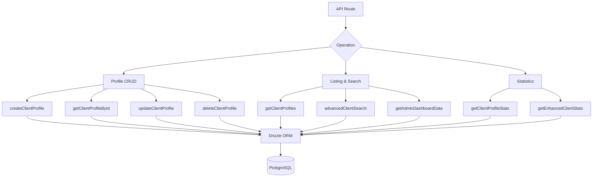

# Клиентские запросы

Клиентские запросы обрабатывают управление профилями, листинг с метаданными аутентификации, расширенный поиск по множеству критериев и подробную статистику. Все функции находятся в `client.queries.ts` и используются маршрутами API как администратора, так и клиента.

## Архитектура клиентских запросов



## Профиль CRUD

### Создать профиль

Новые профили автоматически генерируют уникальные имена пользователей на основе адреса электронной почты, если имя пользователя не указано:

```typescript
export async function createClientProfile(data: {
  userId: string;
  email: string;
  name: string;
  displayName?: string;
  username?: string;
  bio?: string;
  jobTitle?: string;
  company?: string;
  status?: string;
  plan?: string;
  accountType?: string;
}): Promise<ClientProfile>
```

Логика генерации имени пользователя:

1. Если указан `username`, нормализуйте и обеспечьте уникальность.
2. В противном случае извлеките имя пользователя из электронной почты через `extractUsernameFromEmail()`.
3. Резервный вариант: сгенерировать префикс `user<timestamp>`.
4. Все пути проходят через `ensureUniqueUsername()`, к которому при необходимости добавляются числовые суффиксы.

Значения по умолчанию, примененные при создании:

|Поле|По умолчанию|
|-------|---------|
|`displayName`|То же, что `name`|
|`bio`|`"Welcome! I'm a new user on this platform."`|
|`jobTitle`|`"User"`|
|`company`|`"Unknown"`|
|`status`|`"active"`|
|`plan`|`"free"`|
|`accountType`|`"individual"`|

### Чтение операций

|Функция|Поле поиска|Возврат|
|----------|-------------|---------|
|`getClientProfileById(id)`|`clientProfiles.id`|`КлиентПрофиль\|ноль`|
|`getClientProfileByUserId(userId)`|`clientProfiles.userId`|`КлиентПрофиль\|ноль`|
|`getClientProfileByEmail(email)`|Через таблицу `accounts`|`КлиентПрофиль\|ноль`|

Поиск по электронной почте разрешается через таблицу `accounts`, чтобы найти связанный `userId`, а затем запрашивает `clientProfiles`:

```typescript
export async function getClientProfileByEmail(email: string): Promise<ClientProfile | null> {
  const account = await getClientAccountByEmail(email);
  if (!account) return null;
  const [profile] = await db
    .select()
    .from(clientProfiles)
    .where(eq(clientProfiles.userId, account.userId))
    .limit(1);
  return profile || null;
}
```

### Обновить и удалить

- **`updateClientProfile(id, data)`** -- Частичное обновление с автоматической отметкой времени `updatedAt`.
- **`deleteClientProfile(id)`** -- Жесткое удаление (возвращает логическое значение успеха)

## Постраничный список

`getClientProfiles` возвращает результаты с разбивкой на страницы с данными поставщика аутентификации, за исключением пользователей с правами администратора:

```typescript
export async function getClientProfiles(params: {
  page?: number;
  limit?: number;
  search?: string;
  status?: string;
  plan?: string;
  accountType?: string;
  provider?: string;
}): Promise<{
  profiles: ClientProfileWithAuth[];
  total: number;
  page: number;
  totalPages: number;
  limit: number;
}>
```

### Шаблон исключения администратора

И запрос подсчета, и запрос данных используют шаблон LEFT JOIN + IS NULL для исключения пользователей-администраторов:

```typescript
.leftJoin(userRoles, eq(userRoles.userId, clientProfiles.userId))
.leftJoin(roles, and(eq(userRoles.roleId, roles.id), eq(roles.isAdmin, true)))
.where(isNull(roles.id))  // Only non-admin users
```

### Подзапрос поставщика

Чтобы избежать дублирования строк, когда у пользователя есть несколько учетных записей аутентификации, поставщик разрешается с помощью скалярного подзапроса:

```typescript
accountProvider: sql<string>`coalesce(
  (SELECT provider FROM ${accounts}
   WHERE ${accounts.userId} = ${clientProfiles.userId}
   LIMIT 1),
  'unknown'
)`
```

### Фильтр поиска

Текстовый поиск использует `ILIKE` по нескольким полям с предотвращением SQL-инъекций:

```typescript
const escapedSearch = search
  .replace(/\\/g, '\\\\')
  .replace(/[%_]/g, '\\$&');

whereConditions.push(
  sql`(${clientProfiles.username} ILIKE ${`%${escapedSearch}%`} OR
       ${clientProfiles.displayName} ILIKE ${`%${escapedSearch}%`} OR
       ${clientProfiles.company} ILIKE ${`%${escapedSearch}%`} OR
       ${clientProfiles.name} ILIKE ${`%${escapedSearch}%`} OR
       ${clientProfiles.email} ILIKE ${`%${escapedSearch}%`})`
);
```

## Расширенный поиск клиентов

`advancedClientSearch` поддерживает более 20 критериев фильтрации по нескольким категориям:

|Категория фильтра|Параметры|
|----------------|------------|
|**Текстовый поиск**|`search` (по имени, электронной почте, имени пользователя, компании, биографии, должности, отрасли, местоположению)|
|**Перечисляемые фильтры**|`status`, `plan`, `accountType`, `provider`|
|**Диапазоны дат**|`createdAfter`, `createdBefore`, `updatedAfter`, `updatedBefore`, `dateRange`|
|**В зависимости от области**|`emailDomain`, `companySearch`, `locationSearch`, `industrySearch`|
|**Числовой**|`minSubmissions`, `maxSubmissions`|
|**Логическое значение**|`hasAvatar`, `hasWebsite`, `hasPhone`, `emailVerified`, `twoFactorEnabled`|
|**Сортировка**|`sortBy`, `sortOrder`|

## Статистика клиентов

### Основная статистика

`getClientProfileStats` возвращает простые значения:

```typescript
{
  total: number;
  active: number;
  inactive: number;
  byPlan: Record<string, number>;
  byAccountType: Record<string, number>;
}
```

### Расширенная статистика

`getEnhancedClientStats` предоставляет полную многомерную разбивку:

```typescript
{
  overview: { total, active, inactive, suspended, trial },
  byProvider: { credentials, google, github, facebook, twitter, linkedin, other },
  byPlan: { free: number, standard: number, premium: number },
  byAccountType: { individual, business, enterprise },
  activity: { newThisWeek, newThisMonth, activeThisWeek, activeThisMonth },
  growth: { weeklyGrowth, monthlyGrowth },
}
```

В расширенной статистике используется `countDistinct` с объединениями нескольких таблиц для получения точных подсчетов, даже если у пользователей есть несколько поставщиков учетных записей:

```typescript
const statsResult = await db
  .select({
    status: clientProfiles.status,
    plan: clientProfiles.plan,
    accountType: clientProfiles.accountType,
    provider: accounts.provider,
    count: countDistinct(clientProfiles.id)
  })
  .from(clientProfiles)
  .leftJoin(accounts, eq(clientProfiles.userId, accounts.userId))
  .leftJoin(userRoles, eq(userRoles.userId, clientProfiles.userId))
  .leftJoin(roles, and(eq(userRoles.roleId, roles.id), eq(roles.isAdmin, true)))
  .where(isNull(roles.id))
  .groupBy(
    clientProfiles.status,
    clientProfiles.plan,
    clientProfiles.accountType,
    accounts.provider
  );
```

### Метрики активности

Окна активности рассчитываются с использованием арифметики дат:

```typescript
const oneWeekAgo = new Date(now.getTime() - 7 * 24 * 60 * 60 * 1000);
const oneMonthAgo = new Date(now.getTime() - 30 * 24 * 60 * 60 * 1000);
```

Темпы роста представляют собой упрощенные проценты новых регистраций по отношению к общему количеству:

```typescript
const weeklyGrowth = total > 0 ? Math.round((newThisWeek / total) * 100) : 0;
```

## Типы

Все типы клиентских запросов определены в `lib/db/queries/types.ts`:

```typescript
export type ClientProfileWithAuth = ClientProfile & {
  accountProvider: string;
  isActive: boolean;
};

export type ClientStatus = "active" | "inactive" | "suspended" | "trial";
export type ClientPlan = "free" | "standard" | "premium";
export type ClientAccountType = "individual" | "business" | "enterprise";
```
