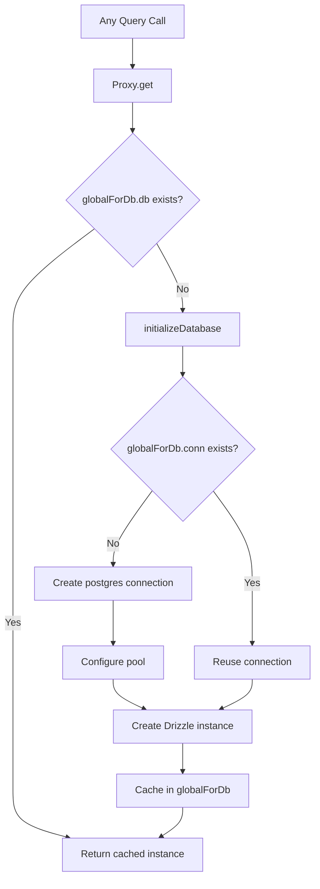

# Подключение к базе данных и объединение в пулы

В шаблоне используется `postgres.js` (пакет `postgres` npm) в качестве драйвера PostgreSQL с Drizzle ORM. Управление соединениями осуществляется с помощью шаблона ленивой инициализации с глобальным одноэлементным кэшированием, чтобы обеспечить возможность горячей замены модулей Next.js (HMR) в процессе разработки.

## Архитектура соединений



## Настройка базы данных (`lib/db/drizzle.ts`)

### Ленивая инициализация с прокси

Экземпляр базы данных экспортируется как `Proxy`, который инициализирует соединение при первом доступе:

```typescript
export const db = new Proxy({} as ReturnType<typeof drizzle>, {
  get(target, prop) {
    const database = initializeDatabase();
    return database[prop as keyof typeof database];
  },
});
```

Это гарантирует:
- Во время импорта соединение не создается
- Скрипты, которые импортируют модуль, но не запрашивают базу данных, не несут никаких дополнительных затрат на соединение.
- Первая фактическая операция с базой данных запускает инициализацию.

### Функция инициализации

```typescript
function initializeDatabase(): ReturnType<typeof drizzle> {
  if (!getDatabaseUrl()) {
    throw new Error('DATABASE_URL environment variable is required');
  }

  if (globalForDb.db) {
    return globalForDb.db;
  }

  const poolSize = getPoolSize();
  const conn = postgres(getDatabaseUrl()!, {
    max: poolSize,
    idle_timeout: 20,
    connect_timeout: 30,
    prepare: false,
    onnotice: getNodeEnv() === 'development' ? console.log : undefined,
  });

  globalForDb.conn = conn;
  globalForDb.db = drizzle(conn, { schema });
  return globalForDb.db;
}
```

### Варианты подключения

|Вариант|Значение|Цель|
|--------|-------|---------|
|`max`|Настраиваемый (см. размер пула)|Максимальное количество подключений в пуле|
|`idle_timeout`|`20` секунд|Закройте неактивные соединения по истечении этого времени.|
|`connect_timeout`|`30` секунд|Максимальное время установления соединения|
|`prepare`|`false`|Отключить подготовленные операторы (требуется для некоторых сред PaaS)|
|`onnotice`|`console.log` (только для разработчиков)|Журнал сообщений PostgreSQL NOTICE в разработке|

## Размер бассейна

### Конфигурация

Размер пула настраивается с помощью переменной среды `DB_POOL_SIZE` со значениями по умолчанию, учитывающими среду:

```typescript
const getPoolSize = (): number => {
  const envPoolSize = process.env.DB_POOL_SIZE;
  if (envPoolSize) {
    const parsed = parseInt(envPoolSize, 10);
    return isNaN(parsed) ? 20 : Math.max(1, Math.min(parsed, 50));
  }
  return getNodeEnv() === 'production' ? 20 : 10;
};
```

### По умолчанию

|Окружающая среда|Размер пула по умолчанию|Диапазон|
|-------------|------------------|-------|
|Производство| 20 | 1 - 50 |
|Развитие| 10 | 1 - 50 |

Размер пула ограничен диапазоном от 1 до 50 независимо от настроенного значения.

### Рекомендации по размеру бассейна

- **Разработка (10):** Достаточно для одного разработчика с HMR. Сохраняет низкое использование ресурсов.
- **Производство (20):** обрабатывает одновременные запросы API. Увеличение для развертываний с высоким трафиком.
- **Бессерверное (1–5):** используйте небольшие пулы при развертывании на бессерверных платформах, где каждый экземпляр получает собственный пул.

## Глобальный шаблон Singleton

### HMR Безопасность

Режим разработки Next.js повторно выполняет модули при изменении файла. Без защиты каждый цикл HMR создавал бы новый пул соединений, что быстро исчерпало бы соединения с базой данных.

Шаблон прикрепляет соединение к `globalThis`, чтобы выжить в HMR:

```typescript
const globalForDb = globalThis as unknown as {
  conn: postgres.Sql | undefined;
  db: ReturnType<typeof drizzle> | undefined;
};
```

Когда модуль перезапускается:
1. `initializeDatabase()` проверяет `globalForDb.db`
2. Если экземпляр существует, он возвращается немедленно.
3. Если соединение существует, а экземпляр Drizzle — нет, существующее соединение используется повторно.

Ведение журнала разработки показывает, использовалось ли соединение повторно:

```
Reusing existing database connection; pool size is unchanged
```

или недавно созданный:

```
Database connection established successfully with pool size: 10
```

### Прямой доступ к экземпляру

Для библиотек, которым требуется конкретный экземпляр Drizzle (например, адаптер Auth.js), предоставляется функция получения:

```typescript
export function getDrizzleInstance(): ReturnType<typeof drizzle> {
  return initializeDatabase();
}
```

## Модуль конфигурации (`lib/db/config.ts`)

Модуль конфигурации, безопасный для сценариев, который **не** импортирует `server-only`, что позволяет использовать его в сценариях миграции и заполнения:

```typescript
export function getDatabaseUrl(): string | undefined {
  return process.env.DATABASE_URL;
}

export function getNodeEnv(): 'development' | 'production' | 'test' {
  const env = process.env.NODE_ENV;
  if (env === 'production' || env === 'test') return env;
  return 'development';
}

export function isProduction(): boolean {
  return getNodeEnv() === 'production';
}
```

## Менеджер по миграции (`lib/db/migrate.ts`)

Средство миграции идемпотентно, и его можно безопасно вызывать при каждом запуске приложения:

```typescript
export async function runMigrations(): Promise<boolean> {
  const { db } = await import('./drizzle');
  await migrate(db, { migrationsFolder: './lib/db/migrations' });
  return true;
}
```

Ключевые модели поведения:
- Drizzle отслеживает прикладные миграции в `drizzle.__drizzle_migrations`
- Уже примененные миграции автоматически пропускаются.
- Возвращает `true` в случае успеха, `false` в случае неудачи (не выдает)
- Состояние миграции журналов до и после выполнения

## Переменные среды

|Переменная|Требуется|По умолчанию|Описание|
|----------|----------|---------|-------------|
|`DATABASE_URL`|Да| -- |Строка подключения PostgreSQL|
|`DB_POOL_SIZE`|Нет|`20` (продюсер) / `10` (разработчик)|Размер пула подключений (1–50)|
|`NODE_ENV`|Нет|`development`|Окружающая среда (разработка/производство/тестирование)|

## Конфигурация комплекта для дождевания

Конфигурация Drizzle Kit для создания схемы и управления миграцией:

```typescript
// drizzle.config.ts
export default {
  schema: "./lib/db/schema.ts",
  out: "./lib/db/migrations",
  dialect: "postgresql",
  dbCredentials: {
    url: process.env.DATABASE_URL,
  },
} satisfies Config;
```

## Устранение неполадок

|Проблема|Причина|Решение|
|-------|-------|----------|
|`DATABASE_URL is required`|Отсутствует переменная окружения|Установите `DATABASE_URL` в `.env.local`|
|Таймауты соединения|Медленная сеть или перегруженная БД|Увеличьте `connect_timeout` или проверьте работоспособность БД|
|Истощение пула в разработке|HMR создает несколько пулов|Убедитесь, что шаблон `globalForDb` не поврежден.|
|Истощение пула в проде|Слишком много одновременных запросов|Увеличение `DB_POOL_SIZE` (максимум 50)|
|`prepare` ошибки в PaaS|PaaS pgBouncer в режиме транзакции|Держите `prepare: false`|
