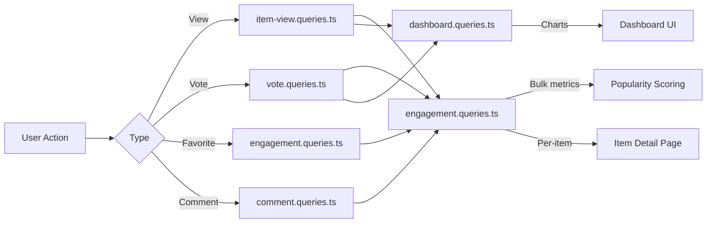

# Вопросы взаимодействия и взаимодействия

Запросы взаимодействия агрегируют действия пользователей (просмотры, голоса, избранное, комментарии) по всем элементам. Эти запросы обеспечивают сортировку популярности, диаграммы информационной панели и панели взаимодействия по каждому элементу. Соответствующие модули: `engagement.queries.ts`, `vote.queries.ts`, `comment.queries.ts`, `item-view.queries.ts` и `dashboard.queries.ts`.

## Поток данных взаимодействия



## Массовые показатели взаимодействия (`engagement.queries.ts`)

### `getEngagementMetricsPerItem`

Основная функция оценки популярности. Возвращает все параметры взаимодействия для нескольких элементов в одном пакете параллельных запросов:

```typescript
export async function getEngagementMetricsPerItem(
  itemSlugs: string[]
): Promise<Map<string, ItemEngagementMetrics>>
```

Тип возврата:

```typescript
export interface ItemEngagementMetrics {
  views: number;
  votes: number;       // Net votes (upvotes - downvotes)
  favorites: number;
  comments: number;
  avgRating: number;   // Average rating from comments (0-5)
}
```

### Стратегия параллельных запросов

Четыре независимых запроса выполняются через `Promise.all` для максимальной пропускной способности:

```typescript
const [viewsData, votesData, favoritesData, commentsData] = await Promise.all([
  // 1. Views per item
  db.select({ itemId: itemViews.itemId, count: count() })
    .from(itemViews)
    .where(inArray(itemViews.itemId, itemSlugs))
    .groupBy(itemViews.itemId),

  // 2. Net votes per item (upvotes - downvotes)
  db.select({
      itemId: votes.itemId,
      netScore: sql<number>`SUM(CASE
        WHEN vote_type = 'upvote' THEN 1
        WHEN vote_type = 'downvote' THEN -1
        ELSE 0 END)`.as('netScore'),
    })
    .from(votes)
    .where(inArray(votes.itemId, itemSlugs))
    .groupBy(votes.itemId),

  // 3. Favorites per item
  db.select({ itemSlug: favorites.itemSlug, count: count() })
    .from(favorites)
    .where(inArray(favorites.itemSlug, itemSlugs))
    .groupBy(favorites.itemSlug),

  // 4. Comments count + average rating (excluding soft-deleted)
  db.select({
      itemId: comments.itemId,
      count: count(),
      avgRating: sql<number>`COALESCE(AVG(${comments.rating}), 0)`.as('avgRating'),
    })
    .from(comments)
    .where(and(inArray(comments.itemId, itemSlugs), isNull(comments.deletedAt)))
    .groupBy(comments.itemId),
]);
```

### Нормализация результатов

Каждый результат запроса преобразуется в `Map` для поиска O(1), а затем объединяется в окончательную карту метрик:

```typescript
const viewsMap = new Map<string, number>(
  viewsData.map(v => [v.itemId, Number(v.count)])
);
// ... same for votesMap, favoritesMap, commentsMap

for (const slug of itemSlugs) {
  metricsMap.set(slug, {
    views: viewsMap.get(slug) ?? 0,
    votes: votesMap.get(slug) ?? 0,
    favorites: favoritesMap.get(slug) ?? 0,
    comments: commentsMap.get(slug)?.count ?? 0,
    avgRating: commentsMap.get(slug)?.avgRating ?? 0,
  });
}
```

### Автономные метрические функции

|Функция|Возврат|Описание|
|----------|---------|-------------|
|`getFavoritesPerItem(itemSlugs)`|`Map<string, number>`|Количество избранных на предмет|
|`getCommentsPerItem(itemSlugs)`|`Map<string, { count, avgRating }>`|Количество комментариев и средние оценки|

Обе функции используют один и тот же шаблон: ранний возврат для пустых массивов, агрегирование `groupBy`, построение `Map`.

## Запросы для голосования (`vote.queries.ts`)

### Голосовать за CRUD

|Функция|Описание|
|----------|-------------|
|`createVote(vote)`|Создать голосование с нормализацией слизней|
|`getVoteByUserIdAndItemId(userId, itemSlug)`|Проверить существующее голосование|
|`deleteVote(voteId)`|Жесткое удаление голоса|

Все функции голосования нормализуют пулы элементов через `getItemIdFromSlug()` перед запросом.

### Расчет чистого балла

Оценка отдельного элемента с использованием условного `SUM`:

```typescript
export async function getVoteCountForItem(itemSlug: string): Promise<number> {
  const itemId = getItemIdFromSlug(itemSlug);
  const [result] = await db
    .select({
      netScore: sql<number>`
        SUM(CASE
          WHEN vote_type = 'upvote' THEN 1
          WHEN vote_type = 'downvote' THEN -1
          ELSE 0
        END)`.as('netScore')
    })
    .from(votes)
    .where(eq(votes.itemId, itemId));
  return Number(result?.netScore ?? 0);
}
```

### Массовое голосование

`getVotesPerItem` возвращает `Map<string, number>` чистых оценок для нескольких элементов, используя `inArray` и `groupBy`.

### Отсортированные по голосованию предметы

```typescript
export async function getItemsSortedByVotes(limit = 10, offset = 0) {
  return db
    .select({
      itemId: votes.itemId,
      voteCount: sql<number>`count(${votes.id})`.as('vote_count')
    })
    .from(votes)
    .groupBy(votes.itemId)
    .orderBy(sql`vote_count DESC`)
    .limit(limit)
    .offset(offset);
}
```

## Запросы на комментарии (`comment.queries.ts`)

### Комментарий CRUD

|Функция|Описание|
|----------|-------------|
|`createComment(data)`|Создать с нормализацией слизней|
|`getCommentById(id)`|Необработанная запись комментария|
|`getCommentWithUserById(id)`|Комментарий с присоединением к профилю пользователя|
|`updateComment(id, { content?, rating? })`|Обновление с отметкой времени `editedAt`|
|`updateCommentRating(id, rating)`|Обновление только для рейтинга|
|`deleteComment(id)`|Обратное удаление (`deletedAt = new Date()`)|

### Комментарии с данными пользователя

`getCommentsByItemId` использует `innerJoin` с `clientProfiles`, чтобы обогатить каждый комментарий информацией об авторе:

```typescript
export async function getCommentsByItemId(itemSlug: string): Promise<CommentWithUser[]> {
  const itemId = getItemIdFromSlug(itemSlug);
  return db
    .select({
      id: comments.id,
      content: comments.content,
      rating: comments.rating,
      userId: comments.userId,
      itemId: comments.itemId,
      createdAt: comments.createdAt,
      updatedAt: comments.updatedAt,
      editedAt: comments.editedAt,
      deletedAt: comments.deletedAt,
      user: {
        id: clientProfiles.id,
        name: clientProfiles.name,
        email: clientProfiles.email,
        image: clientProfiles.avatar
      }
    })
    .from(comments)
    .innerJoin(clientProfiles, eq(comments.userId, clientProfiles.id))
    .where(and(eq(comments.itemId, itemId), isNull(comments.deletedAt)))
    .orderBy(desc(comments.createdAt));
}
```

## Просмотр отслеживания (`item-view.queries.ts`)

### Ежедневная дедупликация

Просмотры дедуплицируются для каждого зрителя на каждый элемент за день UTC с использованием шаблона upsert `onConflictDoNothing`:

```typescript
export async function recordItemView(
  view: Pick<NewItemView, 'itemId' | 'viewerId' | 'viewedDateUtc'>
): Promise<boolean> {
  const result = await db
    .insert(itemViews)
    .values(view)
    .onConflictDoNothing()
    .returning({ id: itemViews.id });
  return result.length > 0; // true = new view, false = duplicate
}
```

### Просмотр функций агрегирования

|Функция|Параметры|Возврат|Описание|
|----------|-----------|---------|-------------|
|`getTotalViewsCount(itemSlugs)`|`string[]`|`number`|Общее количество просмотров товаров|
|`getRecentViewsCount(itemSlugs, days)`|`string[], number`|`number`|Просмотры за последние N дней|
|`getDailyViewsData(itemSlugs, days)`|`string[], number`|`Map<string, number>`|Ежедневные просмотры засчитываются|
|`getViewsPerItem(itemSlugs)`|`string[]`|`Map<string, number>`|Количество просмотров по каждому элементу|

### Помощник по дате UTC

Во всех вычислениях дат используется время в формате UTC, чтобы предотвратить ошибки отклонения на единицу, связанные с часовым поясом:

```typescript
function getUtcDateString(daysAgo: number = 0): string {
  const date = new Date();
  date.setUTCDate(date.getUTCDate() - daysAgo);
  return date.toISOString().split('T')[0]; // "YYYY-MM-DD"
}
```

## Статистика панели (`dashboard.queries.ts`)

### Доступные метрики

|Функция|Цель|
|----------|---------|
|`getVotesReceivedCount(itemSlugs)`|Общее количество голосов за товары пользователя|
|`getCommentsReceivedCount(itemSlugs)`|Всего комментариев к материалам пользователя|
|`getUniqueItemsInteractedCount(clientId)`|Объекты, с которыми пользователь взаимодействовал|
|`getUserTotalActivityCount(clientId)`|Всего голосов + комментарии пользователя|
|`getWeeklyEngagementData(itemSlugs, weeks)`|Еженедельные агрегированные данные диаграммы|
|`getDailyActivityData(clientId, itemSlugs, days)`|Распределение ежедневной активности|
|`getTopItemsEngagement(itemSlugs, limit)`|Топ товаров по показателю вовлеченности|

### Еженедельный сбор показателей вовлеченности

Использует `to_char` PostgreSQL с форматом недели ISO для последовательного распределения недель:

```typescript
const weeklyVotes = await db
  .select({
    week: sql<string>`to_char(${votes.createdAt}, 'IYYY-IW')`.as('week'),
    count: count(),
  })
  .from(votes)
  .where(and(inArray(votes.itemId, itemSlugs), gte(votes.createdAt, startDate)))
  .groupBy(sql`to_char(${votes.createdAt}, 'IYYY-IW')`)
  .orderBy(sql`to_char(${votes.createdAt}, 'IYYY-IW')`);
```

## Вопросы производительности

- Все массовые функции принимают массивы и используют `inArray` для пакетной обработки.
- Входные данные пустого массива возвращаются раньше, не обращаясь к базе данных.
- `Promise.all` одновременно запускает независимые агрегаты
- Структуры данных `Map` обеспечивают поиск O(1) во время сборки результатов.
- Обратно удаляемые комментарии исключаются через `isNull(comments.deletedAt)` во всех агрегатах.
