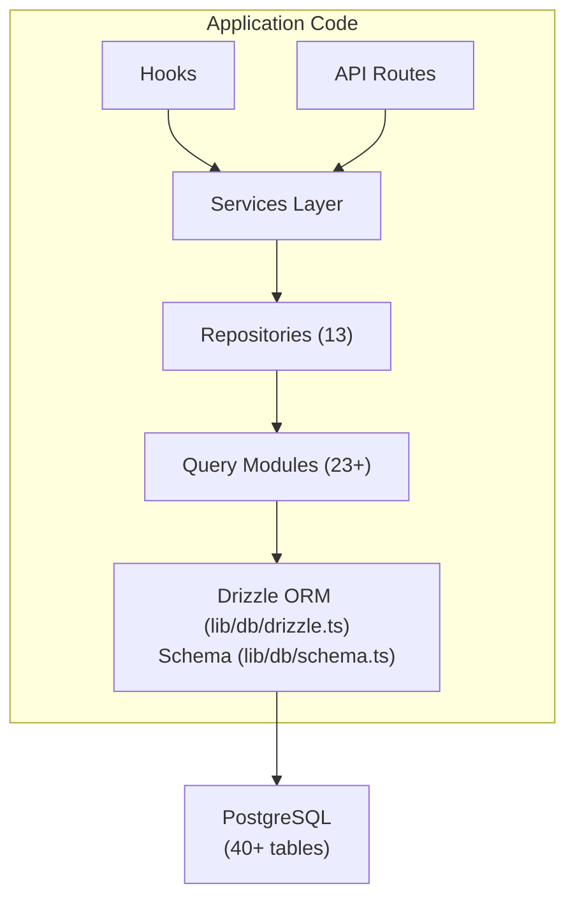

# Обзор базы данных

Шаблон Ever Works использует **Drizzle ORM** с **PostgreSQL** в качестве уровня базы данных. База данных не является обязательной — приложение может работать без нее при развертывании только контента — но она обеспечивает все функции пользователя, подписки, взаимодействия и администрирования.

## Технологический стек

|Компонент|Технология|Цель|
|-----------|-----------|---------|
|ОРМ|Дождь ОРМ|Типобезопасный построитель запросов и управление схемой|
|База данных|PostgreSQL|Основная реляционная база данных|
|Водитель|`postgres` (postgres.js)|Клиент PostgreSQL для Node.js|
|Миграции|Комплект для дождевания|Генерация и выполнение миграции схемы|
|Посев|`drizzle-seed` + пользовательские скрипты|Инициализация базы данных с данными по умолчанию|

## Архитектура базы данных



## Конфигурация

### Конфигурация дождя (`drizzle.config.ts`)

```typescript
export default {
  schema: "./lib/db/schema.ts",
  out: "./lib/db/migrations",
  dialect: "postgresql",
  dbCredentials: {
    url: process.env.DATABASE_URL,
  },
} satisfies Config;
```

Конфигурация указывает на:
- **Файл схемы**: `lib/db/schema.ts` – единый источник достоверных данных для всех определений таблиц.
- **Вывод данных миграции**: `lib/db/migrations/` — здесь хранятся сгенерированные файлы миграции SQL.
- **Диалект**: PostgreSQL
- **Соединение**: через переменную среды `DATABASE_URL`.

### Управление подключением (`lib/db/drizzle.ts`)

Соединение с базой данных лениво инициализируется при первом использовании и повторно использует соединения при горячей перезагрузке в процессе разработки с помощью глобального одноэлементного шаблона.

Ключевые особенности:
- **Ленивая инициализация**: подключение к базе данных не создается до тех пор, пока не будет выполнен первый запрос.
- **Доступ на основе прокси**: экспортированный объект `db` использует JavaScript `Proxy` для прозрачной инициализации соединения.
- **Пул соединений**: размер пула настраивается с помощью переменной среды `DB_POOL_SIZE` (по умолчанию: 20 в рабочей среде, 10 в разработке, ограничено от 1 до 50).
- **Тайм-аут простоя**: соединения разрываются после 20 секунд бездействия.
- **Тайм-аут подключения**: 30-секундный тайм-аут для установления новых подключений.
- **Шаблон Singleton**: использует `globalThis` для сохранения соединений при горячих перезагрузках Next.js.

```typescript
// Usage - just import and use
import { db } from '@/lib/db/drizzle';

const users = await db.select().from(schema.users);
```

### Переменные среды

|Переменная|Требуется|По умолчанию|Описание|
|----------|----------|---------|-------------|
|`DATABASE_URL`|Нет| - |Строка подключения PostgreSQL|
|`DB_POOL_SIZE`|Нет| 10/20 |Размер пула подключений (разработчик/продукт)|

Если `DATABASE_URL` не установлен, функции базы данных автоматически отключаются, что позволяет приложению работать в режиме только содержимого.

## Обзор схемы

Схема базы данных определена в одном файле (`lib/db/schema.ts`), содержащем более 40 таблиц, организованных по доменам:

|Домен|Таблицы|Описание|
|--------|--------|-------------|
|Пользователи и авторизация| 8 |Пользователи, учетные записи, сеансы, токены, аутентификаторы|
|Роли и разрешения| 3 |RBAC с ролями, разрешениями и сопоставлениями ролей-разрешений|
|Профили клиентов| 1 |Расширенные профили пользователей для учетных записей клиентов|
|Взаимодействие с контентом| 4 |Комментарии, голоса, избранное, просмотры товаров|
|Подписки| 4 |Планы, история подписок, поставщики платежей, платежные счета|
|Уведомления| 1 |Система уведомлений в приложении|
|Администрирование и модерация| 4 |Отчеты, история модерации, журналы аудита элементов, журналы активности|
|Интеграции| 2 |Конфигурация CRM, сопоставления интеграции|
|Компании| 2 |Компании и ассоциации компаний-предприятий|
|Спонсорские объявления| 1 |Реклама спонсируемых товаров|
|Опросы| 2 |Опросы и ответы на опросы|
|Информационный бюллетень| 1 |Подписка на рассылку|
|Система| 1 |Отслеживание статуса семян|

## Инициализация базы данных

При запуске приложения (через `instrumentation.ts`) шаблон автоматически:

1. **Запускает миграцию**: функция Drizzle `migrate()` применяет любые ожидающие миграции (идемпотентная — уже примененные миграции пропускаются)
2. **Исходные данные**: если база данных не была заполнена, сценарий заполнения запускается с защитой от рекомендательной блокировки, чтобы предотвратить условия гонки в многопроцессных развертываниях.

Этим занимается `lib/db/initialize.ts`. Подробности см. в [Руководстве по миграции](./migrations-guide) и [Заполнение базы данных](./seeding).

## Ключевые команды

```bash
# Generate a migration from schema changes
pnpm db:generate

# Run pending migrations
pnpm db:migrate

# Seed the database
pnpm db:seed

# Open Drizzle Studio (database GUI)
pnpm db:studio
```
