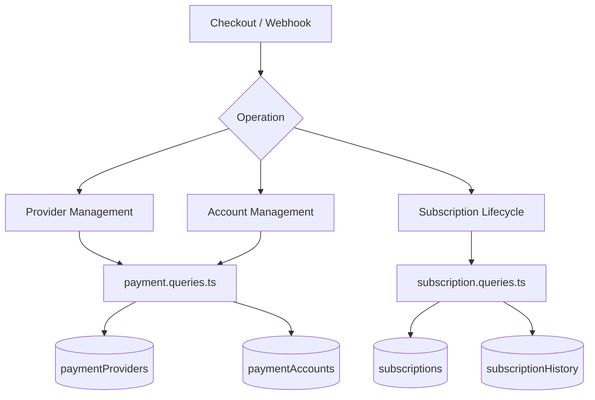
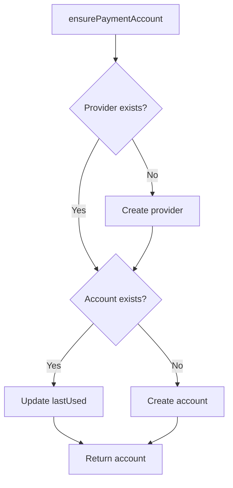
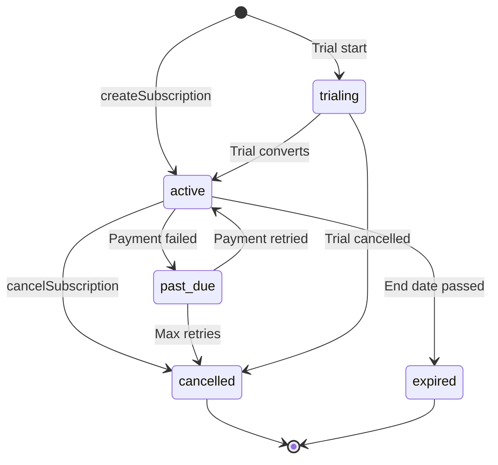

# Вопросы оплаты и подписки

Платежные запросы управляют реестром поставщиков, платежными счетами пользователей и полным жизненным циклом подписки. Соответствующие модули: `payment.queries.ts` и `subscription.queries.ts`.

## Архитектура платежной системы



## Запросы платежных систем (`payment.queries.ts`)

### Поставщик CRUD

|Функция|Описание|
|----------|-------------|
|`getPaymentProvider(id)`|Получить провайдера по ID|
|`getPaymentProviderByName(name)`|Получить провайдера по имени (например, `'stripe'`)|
|`getActivePaymentProviders()`|Список всех активных поставщиков, упорядоченных по имени|
|`createPaymentProvider(data)`|Создайте новую запись поставщика|
|`updatePaymentProvider(id, data)`|Частичное обновление полей провайдера|
|`deactivatePaymentProvider(id)`|Установить `isActive = false`|

Поддерживаемые имена провайдеров: `stripe`, `lemonsqueezy`, `polar`, `solidgate`.

### Запросы о платежном счете

Платежные счета связывают пользователя с идентификатором клиента конкретного поставщика:

|Функция|Описание|
|----------|-------------|
|`getPaymentAccountByUserId(userId, providerId)`|Получить аккаунт с активной проверкой провайдера|
|`getPaymentAccountByCustomerId(customerId, providerId)`|Обратный поиск по идентификатору клиента|
|`createPaymentAccount(data)`|Создать учетную запись с отметкой времени `lastUsed`|
|`updatePaymentAccountLastUsed(accountId)`|Нажмите `lastUsed` временную метку.|
|`getUserPaymentAccountByProvider(userId, providerName)`|Поиск по имени поставщика (сначала определяется поставщик)|

### Проверка активного поставщика

`getPaymentAccountByUserId` выполняет тройное внутреннее соединение, чтобы убедиться, что и поставщик, и пользователь действительны:

```typescript
export async function getPaymentAccountByUserId(
  userId: string,
  providerId: string
): Promise<PaymentAccount | null> {
  const result = await db
    .select({ /* payment account fields */ })
    .from(paymentAccounts)
    .innerJoin(paymentProviders, eq(paymentAccounts.providerId, paymentProviders.id))
    .innerJoin(users, eq(paymentAccounts.userId, users.id))
    .where(and(
      eq(paymentAccounts.userId, userId),
      eq(paymentAccounts.providerId, providerId),
      eq(paymentProviders.isActive, true)
    ))
    .limit(1);
  return result[0] || null;
}
```

### Убедитесь, что платежный счет

`ensurePaymentAccount` реализует идемпотентный шаблон обновления для платежных счетов:



```typescript
export async function ensurePaymentAccount(
  providerName: string,
  userId: string,
  customerId: string,
  accountId?: string
): Promise<PaymentAccount>
```

### Настройка платежного аккаунта пользователя

`setupUserPaymentAccount` расширяет шаблон обеспечения за счет обнаружения изменения идентификатора клиента:

```typescript
if (existingAccount.customerId !== customerId) {
  await db
    .update(paymentAccounts)
    .set({
      customerId,
      accountId: accountId || existingAccount.accountId,
      lastUsed: new Date(),
      updatedAt: new Date()
    })
    .where(eq(paymentAccounts.id, existingAccount.id));
}
```

### Удобные псевдонимы

- `getOrCreatePaymentAccount` -- псевдоним для `ensurePaymentAccount`
- `createOrGetPaymentAccount` -- псевдоним для `setupUserPaymentAccount`

## Вопросы по подписке (`subscription.queries.ts`)

### Поиск подписки

|Функция|Параметры|Возврат|
|----------|-----------|---------|
|`getUserActiveSubscription(userId)`|Идентификатор пользователя|Активная подписка или нулевая|
|`getUserSubscriptions(userId)`|Идентификатор пользователя|Все подписки (упорядочены по дате)|
|`getSubscriptionByProviderSubscriptionId(provider, subId)`|Поставщик + дополнительный идентификатор|Подписка или ноль|
|`getSubscriptionByUserIdAndSubscriptionId(userId, subId)`|Пользователь + дополнительный идентификатор|Подписка или ноль|
|`getSubscriptionWithUser(subId)`|Идентификатор подписки|Подписка с присоединением пользователя|
|`hasActiveSubscription(userId)`|Идентификатор пользователя|логическое значение|

### Жизненный цикл подписки

#### Создать

```typescript
export async function createSubscription(data: NewSubscription): Promise<Subscription> {
  const result = await db
    .insert(subscriptions)
    .values({ ...data, createdAt: new Date(), updatedAt: new Date() })
    .returning();
  return result[0];
}
```

#### Обновить статус

Изменения статуса автоматически устанавливаются `cancelledAt` и `cancelReason` при переходе на `CANCELLED`:

```typescript
export async function updateSubscriptionStatus(
  subscriptionId: string,
  status: string,
  reason?: string
): Promise<Subscription | null>
```

#### Отмена

Поддерживает как немедленную отмену, так и отмену в конце периода:

```typescript
export async function cancelSubscription(
  subscriptionId: string,
  reason?: string,
  cancelAtPeriodEnd: boolean = false
): Promise<Subscription | null>
```

При `cancelAtPeriodEnd = true` статус остается `ACTIVE`, но устанавливаются `cancelledAt` и `cancelAtPeriodEnd`.

### Порядок статуса подписки



### Разрешение плана

`getUserPlan` проверяет срок действия подписки и возвращается к бесплатному плану:

```typescript
export async function getUserPlan(userId: string): Promise<string> {
  const subscription = await getUserActiveSubscription(userId);
  if (!subscription) return PaymentPlan.FREE;
  return getEffectivePlan(subscription.planId, subscription.endDate, subscription.status);
}
```

`getUserPlanWithExpiration` возвращает полную информацию об истечении срока действия:

```typescript
{
  planId: string;         // Stored plan
  effectivePlan: string;  // Actual plan after expiration check
  isExpired: boolean;
  expiresAt: Date | null;
  status: string | null;
  subscriptionId: string | null;
}
```

### Срок действия и продление

|Функция|Описание|
|----------|-------------|
|`getSubscriptionsExpiringSoon(days)`|Активные подписки, срок действия которых истекает в течение N дней.|
|`getExpiredSubscriptions()`|Подписки после даты окончания|
|`getSubscriptionsForRenewalReminder(days)`|Подписки, требующие уведомления о продлении|

### История подписки

Изменения записываются в таблицу `subscriptionHistory`:

```typescript
export async function logSubscriptionHistory(data: NewSubscriptionHistory)
export async function getSubscriptionHistory(subscriptionId: string)
```

### Статистика подписки

`getSubscriptionStats` возвращает совокупное количество:

```typescript
{
  total: number;
  active: number;
  cancelled: number;
  expired: number;
  pastDue: number;
  trialing: number;
}
```

## Константы схемы

```typescript
// lib/db/schema.ts
export const SubscriptionStatus = {
  ACTIVE: 'active',
  CANCELLED: 'cancelled',
  EXPIRED: 'expired',
  PAST_DUE: 'past_due',
  TRIALING: 'trialing',
} as const;

// lib/constants/payment.ts
export const PaymentPlan = {
  FREE: 'free',
  STANDARD: 'standard',
  PREMIUM: 'premium',
} as const;

export const PaymentProvider = {
  STRIPE: 'stripe',
  LEMONSQUEEZY: 'lemonsqueezy',
  POLAR: 'polar',
  SOLIDGATE: 'solidgate',
} as const;
```
