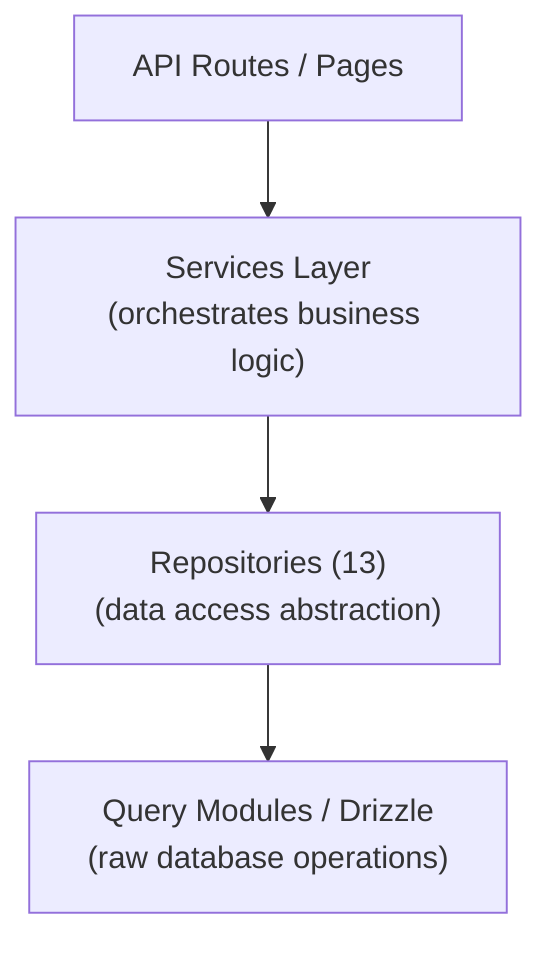

# Шаблон репозитория

Шаблон Ever Works реализует шаблон репозитория посредством 13 специализированных классов репозитория в `lib/repositories/`. Репозитории обеспечивают абстракцию более высокого уровня над необработанными запросами к базе данных, инкапсулируя сложную логику запросов, бизнес-правила и преобразование данных.

## Архитектура



## Список репозиториев

|Репозиторий|Файл|Домен|
|------------|------|--------|
|Административная аналитика (оптимизированная)|`admin-analytics-optimized.repository.ts`|Административная аналитика с оптимизацией производительности|
|Статистика администратора|`admin-stats.repository.ts`|Статистика панели администратора|
|Категория|`category.repository.ts`|Категорийный менеджмент|
|Панель управления клиента|`client-dashboard.repository.ts`|Операции с панелью управления клиентом|
|Клиентский элемент|`client-item.repository.ts`|Отправка элементов клиента|
|Коллекция|`collection.repository.ts`|Управление коллекцией|
|Картирование интеграции|`integration-mapping.repository.ts`|Сопоставления интеграции CRM|
|Товар|`item.repository.ts`|Операции с элементами|
|Роль|`role.repository.ts`|Управление ролями|
|Спонсорское объявление|`sponsor-ad.repository.ts`|Управление спонсируемой рекламой|
|Тег|`tag.repository.ts`|Управление тегами|
|Двадцать конфигураций CRM|`twenty-crm-config.repository.ts`|Конфигурация CRM|
|Пользователь|`user.repository.ts`|Управление пользователями|

## Репозиторий контента на базе Git (`lib/repository.ts`)

Помимо репозиториев баз данных, шаблон включает репозиторий контента на базе Git по адресу `lib/repository.ts`. Это обрабатывает операции Git CMS:

- Клонировать репозиторий контента с URL `DATA_REPOSITORY`
- Синхронизация контента с восходящим потоком (извлечение/отправка с обнаружением конфликтов)
- Отслеживайте локальные изменения и фиксируйте их
- Защита по тайм-ауту для операций Git (тайм-аут 120 секунд)

Он отличается от репозиториев базы данных и управляет каталогом `.content/`, используемым уровнем контента.

## Детали репозитория

### admin-analytics-optimized.repository.ts

Оптимизированный по производительности репозиторий аналитики для панели администратора. Использует пакетные запросы и стратегии кэширования для минимизации нагрузки на базу данных при создании аналитических представлений.

Ключевые возможности:
- Агрегированная статистика просмотров
- Тенденции роста пользователей
- Сводные данные по взаимодействию с контентом
- Аналитика доходов

### admin-stats.repository.ts

Предоставляет статистику панели администратора.

Ключевые возможности:
- Общее количество пользователей
- Количество активных подписок
- Статистика контента (элементы, комментарии, отчеты)
- Сводка последних действий

### категория.repository.ts

Управляет данными категорий с помощью операций CRUD и обработки отношений.

Ключевые возможности:
- Список категорий с количеством позиций
- Обход дерева категорий (родитель/потомок)
- Поиск по категориям и фильтрация
- Заказ категорий

### клиент-dashboard.repository.ts

Самый большой репозиторий (28 КБ), обрабатывающий все данные панели управления на стороне клиента.

Ключевые возможности:
- Управление подачами клиентов
- Аналитика представлений (просмотры, голоса, комментарии по каждому элементу)
- История активности клиента
- Сводная статистика панели мониторинга
- Постраничный список элементов с фильтрами

### клиент-item.repository.ts

Управляет элементами с точки зрения клиента (отправителя).

Ключевые возможности:
- Создание и обновление отправки элементов
- Отслеживание статуса товара
- История отправки
- Фильтрация элементов для конкретного клиента

### коллекция.repository.ts

Управление коллекциями для курируемых групп товаров.

Ключевые возможности:
- Сбор CRUD-операций
- Ассоциации коллекций предметов
- Заказ и статус коллекции
- Постраничный список коллекции

### интеграция-mapping.repository.ts

Постоянство отображения интеграции CRM.

Ключевые возможности:
- Создание и обновление сопоставлений между внутренними идентификаторами и идентификаторами CRM.
- Массовые операции добавления
- Поиск по внутреннему идентификатору или идентификатору CRM
- Синхронизация отслеживания временных меток
- Управление хешем версий для обнаружения изменений

### item.repository.ts

Основные операции с данными элемента (для метаданных, хранящихся в базе данных, а не для содержимого Git).

Ключевые возможности:
- Управление метаданными элемента
- Поиск товаров с несколькими фильтрами
- Агрегация данных о взаимодействии с объектом
- Управление избранными элементами

### роль.repository.ts

Управление ролями для системы RBAC.

Ключевые возможности:
- Роль CRUD-операций
- Ассоциации ролевых разрешений
- Назначение ролей пользователей
- Проверка роли

### спонсор-ad.repository.ts

Управление жизненным циклом спонсируемой рекламы.

Ключевые возможности:
- Создание и управление спонсорской рекламой
- Переходы статусов (ожидание, активный, срок действия истек)
- Фильтрация рекламы по статусу, пользователю или элементу
- Данные платежной интеграции
- Обработка истечения срока действия

### tag.repository.ts

Управление тегами с ассоциациями элементов.

Ключевые возможности:
- Теговые операции CRUD
- Поиск по тегам и автозаполнение
- Статистика использования тегов
- Ассоциации тегов предметов

### двадцать crm-config.repository.ts

Управление конфигурацией Twenty Singleton CRM.

Ключевые возможности:
- Получить/обновить конфигурацию CRM
- Включить/отключить интеграцию с CRM
- Управление режимом синхронизации
- Управление ключами API

### user.repository.ts

Управление учетными записями пользователей.

Ключевые возможности:
- Операции с профилем пользователя
- Поиск и фильтрация пользователей
- Управление статусом аккаунта
- Удаление пользователя (мягкое удаление)

## Схема использования

Репозитории импортируются и используются непосредственно в маршрутах API, сервисах и компонентах сервера:

```typescript
import { clientDashboardRepository } from '@/lib/repositories/client-dashboard.repository';

// In an API route
export async function GET(request: NextRequest) {
  const session = await auth();
  const dashboard = await clientDashboardRepository.getDashboardStats(session.user.id);
  return NextResponse.json({ success: true, data: dashboard });
}
```

```typescript
import { itemRepository } from '@/lib/repositories/item.repository';

// In a server component
export default async function ItemPage({ params }) {
  const item = await itemRepository.findBySlug(params.slug);
  return <ItemDetail item={item} />;
}
```

## Репозиторий против модулей запросов

|Аспект|Модули запросов (`lib/db/queries/`)|Репозитории (`lib/repositories/`)|
|--------|-----------------------------------|-------------------------------------|
|Сложность|Простые, целенаправленные запросы|Сложные многотабличные операции|
|Бизнес-логика|Нет (чистый доступ к данным)|Включает проверку и бизнес-правила.|
|Преобразование данных|Необработанные результаты базы данных|Преобразованные/обогащенные данные|
|Вариант использования|Прямые операции с базой данных|Доступ к данным на уровне объектов|
|Типичный потребитель|Другие модули запросов, простые маршруты|Сервисы, маршруты API, серверные компоненты|

Оба слоя используют Drizzle ORM и импортируют соединение с базой данных из `lib/db/drizzle.ts`. Выбор между ними зависит от сложности операции: простые чтения используют модули запросов напрямую, а сложные функции проходят через репозитории.
