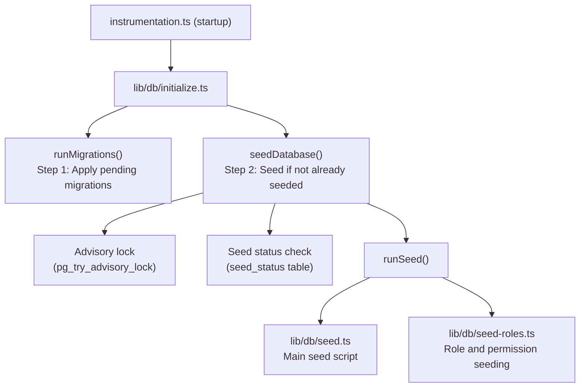

# Заполнение базы данных

Шаблон Ever Works включает в себя комплексную систему заполнения базы данных, которая инициализирует необходимые данные (роли, разрешения, поставщики платежей) и при необходимости генерирует демонстрационные данные для разработки и тестирования.

## Начальная архитектура



## Начальные сценарии

### Основной исходный скрипт (`lib/db/seed.ts`)

Первичный начальный сценарий обрабатывает всю инициализацию базы данных. Он работает в двух режимах:

**Производственный режим**: отправляются только необходимые данные, необходимые для работы приложения:
- Роли администратора и клиента
- Системные разрешения
- Поставщики платежей по умолчанию
- Необходимые системные записи

**Демонстрационный режим**: дополнительно затрачиваются полные тестовые данные для разработки:
- Примеры пользователей с разными ролями
- Примеры профилей клиентов
- Примеры подписок
- Демо-комментарии, голоса и избранное
- Тестовые уведомления
- Записи журнала активности

Демонстрационный режим активируется, когда установлена переменная среды `DEMO_MODE`.

Ключевые характеристики:
- **Идемпотентность каждой таблицы**: каждая таблица проверяется перед заполнением; заполняются только пустые таблицы
- **Проверка существования таблиц**: проверяет существование таблиц перед попыткой вставки.
- **Использует `drizzle-seed`**: использует официальную библиотеку посева Drizzle для генерации структурированных данных.
- **Безопасно для повторных запусков**: можно вызывать несколько раз без дублирования данных.

```typescript
// Simplified seed flow
export async function runSeed(): Promise<void> {
  await ensureDb();
  const isDemo = isDemoMode();

  if (isDemo) {
    // Seed comprehensive test data
  } else {
    // Seed minimal essential data only
  }

  // Seed roles (always)
  if (await isTableEmpty('roles', roles)) {
    await seedRoles();
  }

  // Seed permissions (always)
  if (await isTableEmpty('permissions', permissions)) {
    await seedPermissions();
  }

  // Seed payment providers (always)
  if (await isTableEmpty('paymentProviders', paymentProviders)) {
    await seedPaymentProviders();
  }

  // Demo-only: seed users, profiles, subscriptions, etc.
  if (isDemo) {
    await seedDemoData();
  }
}
```

### Распределение ролей (`lib/db/seed-roles.ts`)

Специальный сценарий для заполнения системы RBAC, который также можно запускать независимо.

**`seedPermissions()`** создает исходный набор разрешений:

|Ключ разрешения|Описание|
|---------------|-------------|
|`read:own`|Может читать собственные данные|
|`write:own`|Может писать свои данные|
|`admin:all`|Полный административный доступ|
|`client:manage`|Может управлять операциями, специфичными для клиента|
|`user:read`|Может читать пользовательские данные|
|`user:write`|Может записывать пользовательские данные|

Использует `onConflictDoUpdate` для безопасного обновления существующих разрешений без сбоев при повторных запусках.

**`linkRolesToPermissions()`** создает ассоциации ролей и разрешений:

- **Роль администратора**: получает ВСЕ разрешения.
- **Роль клиента**: получает `read:own`, `write:own` и `client:manage`.

Функция проверяет, что необходимые роли (администратор, клиент) существуют и активны, прежде чем создавать ассоциации.

**`seedRolesAndPermissions()`** организует обе операции в транзакции базы данных:

```typescript
export async function seedRolesAndPermissions() {
  await db.transaction(async () => {
    await seedPermissions();
    await linkRolesToPermissions();
  });
}
```

Может запускаться автономно:
```bash
# Run directly (if configured as a script)
npx tsx lib/db/seed-roles.ts
```

## Система инициализации (`lib/db/initialize.ts`)

Система инициализации управляет всей последовательностью запуска с защитой параллелизма.

### Отслеживание статуса семян

Таблица `seed_status` отслеживает состояние заполнения:

|Статус|Значение|
|--------|---------|
|`seeding`|Выполняется посевная операция|
|`completed`|Раздача завершена успешно|
|`failed`|Ошибка заполнения (сохранена ошибка)|

### Защита одновременного доступа

В многопроцессных развертываниях (например, при одновременном запуске нескольких бессерверных функций Vercel) система предотвращает дублирование заполнения, используя:

1. **Консультационные блокировки PostgreSQL**: `pg_try_advisory_lock(12345)` обеспечивает неблокирующую блокировку. Только один процесс может получить его.
2. **Таблица состояния начального состояния**: другие процессы проверяют таблицу `seed_status` и ждут завершения.
3. **Обнаружение устаревшего**: если статус `seeding` старше 5 минут, он считается устаревшим и очищается.
4. **Тайм-аут ожидания**: процессы, ожидающие завершения другого экземпляра, истечет по истечении 60 секунд.

### Поток инициализации

```
initializeDatabase()
│
├── DATABASE_URL not set? → Silent skip (DB is optional)
│
├── Step 1: Run migrations (always, idempotent)
│   └── Failure? → Error in production, warning in dev/preview
│
├── Step 2: Check if already seeded
│   └── seed_status = 'completed'? → Done
│
├── Step 3: Handle edge cases
│   ├── Previous seed failed? → Delete failed status, retry
│   ├── Stale seeding (>5min)? → Clean up, retry
│   └── Another instance seeding? → Wait for completion
│
├── Step 4: Acquire advisory lock
│   └── Lock not available? → Wait for other instance
│
├── Step 5: Double-check (another instance may have finished)
│
├── Step 6: Run seed
│   ├── Create seed_status record ('seeding')
│   ├── Execute runSeed()
│   └── Update seed_status ('completed' or 'failed')
│
└── Step 7: Release advisory lock (always, in finally block)
```

## Запуск семян вручную

### Стандартное семя

```bash
pnpm db:seed
```

### Индивидуальные начальные сценарии

```bash
# Seed roles and permissions only
npx tsx lib/db/seed-roles.ts
```

### Демонстрационный режим

Чтобы использовать демонстрационные данные, установите переменную среды `DEMO_MODE`:

```bash
DEMO_MODE=true pnpm db:seed
```

## Переменные среды

|Переменная|По умолчанию|Описание|
|----------|---------|-------------|
|`DATABASE_URL`| - |Строка подключения PostgreSQL (требуется для заполнения)|
|`DEMO_MODE`|`false`|Включить раздачу демонстрационных данных|

## Сводка данных о семенах

### Всегда сеяно (режим производства)

|Таблица|Данные|
|-------|------|
|`roles`|Роли администратора и клиента|
|`permissions`|Определения системных разрешений|
|`rolePermissions`|Ассоциации ролевых разрешений|
|`paymentProviders`|Полоса, LemonSqueezy, Polar, Solidgate|

### Только демонстрационный режим

|Таблица|Данные|
|-------|------|
|`users`|Примеры администраторов и пользователей клиента|
|`accounts`|Учетные записи аутентификации для примеров пользователей|
|`clientProfiles`|Профили клиентов с различными статусами|
|`subscriptions`|Примеры подписок на разные планы|
|`comments`|Пример комментариев к элементу|
|`votes`|Примеры голосов|
|`favorites`|Примеры избранного|
|`notifications`|Примеры уведомлений администратора|
|`activityLogs`|Пример истории активности|

## Лучшие практики

1. **Никогда не запускайте начальную версию в рабочей среде с помощью DEMO_MODE**: демонстрационные данные следует использовать только при разработке и промежуточном этапе.
2. **Проверьте статус заполнения перед повторным заполнением вручную**: запросите таблицу `seed_status`, чтобы понять текущее состояние.
3. **Использовать транзакции**: при заполнении роли используются транзакции для обеспечения согласованности.
4. **Идемпотентная конструкция**: всегда проверяйте наличие данных перед вставкой, чтобы обеспечить безопасный повторный запуск.
5. **Консультационные блокировки**. Система консультативной блокировки предотвращает проблемы в бессерверных средах, где одновременно могут запускаться несколько экземпляров.
