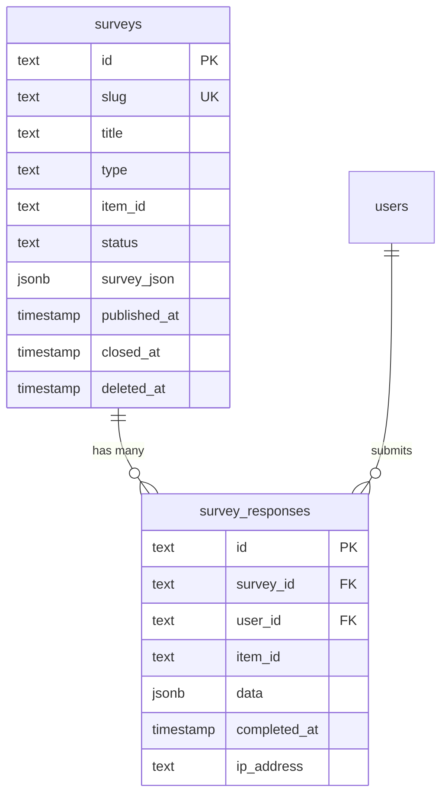
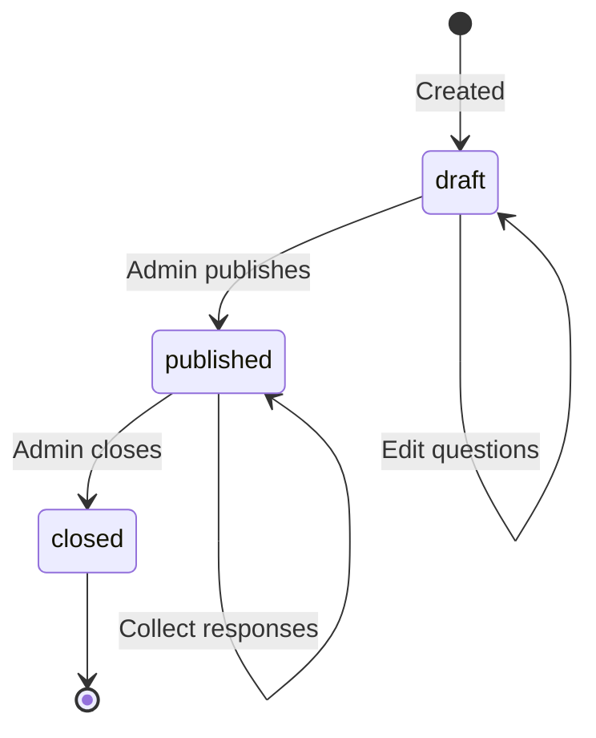

# Подробное описание схемы опросов

## Обзор

Модуль опросов предоставляет гибкую систему опросов с двумя типами таблиц: `surveys` для определений опросов и `survey_responses` для собранных ответов. Опросы могут быть как глобальными (по всему сайту), так и конкретными. Структура опроса хранится в виде большого двоичного объекта JSON (`surveyJson`) с использованием типа столбца JSONB, что позволяет создавать динамические схемы вопросов без жесткого моделирования базы данных.

**Исходный файл:** `template/lib/db/schema.ts`

---

## Table: `surveys`

Stores survey definitions with their question structure in a JSON column.

### Columns

| Column | DB Name | Type | Nullable | Default | Constraints |
|---|---|---|---|---|---|
| `id` | `id` | `text` | No | `crypto.randomUUID()` | Primary Key |
| `slug` | `slug` | `text` | No | - | Unique |
| `title` | `title` | `text` | No | - | - |
| `description` | `description` | `text` | Yes | - | - |
| `type` | `type` | `text (enum)` | No | - | `global`, `item` |
| `itemId` | `item_id` | `text` | Yes | - | Item slug (for item surveys) |
| `status` | `status` | `text (enum)` | No | `'draft'` | `draft`, `published`, `closed` |
| `surveyJson` | `survey_json` | `jsonb` | No | - | Full survey structure |
| `createdAt` | `created_at` | `timestamp (tz)` | No | `now()` | - |
| `updatedAt` | `updated_at` | `timestamp (tz)` | No | `now()` | - |
| `publishedAt` | `published_at` | `timestamp (tz)` | Yes | - | - |
| `closedAt` | `closed_at` | `timestamp (tz)` | Yes | - | - |
| `deletedAt` | `deleted_at` | `timestamp (tz)` | Yes | - | Soft delete |

### Indexes

| Name | Columns | Type |
|---|---|---|
| `surveys_slug_idx` | `slug` | B-tree |
| `surveys_type_idx` | `type` | B-tree |
| `surveys_item_id_idx` | `itemId` | B-tree |
| `surveys_status_idx` | `status` | B-tree |
| `surveys_created_at_idx` | `createdAt` | B-tree |

### Survey Type Enum

| Value | Description |
|---|---|
| `global` | Site-wide survey visible to all users |
| `item` | Survey attached to a specific item (referenced by `itemId`) |

### Survey Status Enum

| Value | Description |
|---|---|
| `draft` | Not yet published, only visible to admins |
| `published` | Live and accepting responses |
| `closed` | No longer accepting responses |

---

## Таблица: `survey_responses`

Хранит индивидуальные ответы пользователей на опросы. Данные ответа хранятся в виде большого двоичного объекта JSONB.

### Столбцы

|Столбец|Имя БД|Тип|Обнуляемый|По умолчанию|Ограничения|
|---|---|---|---|---|---|
|`id`|`id`|`text`|Нет|`crypto.randomUUID()`|Первичный ключ|
|`surveyId`|`survey_id`|`text`|Нет| - |FK -> `surveys.id` (ОГРАНИЧЕНИЕ)|
|`userId`|`user_id`|`text`|Да| - |FK -> `users.id` (УСТАНОВИТЬ НУЛЬ)|
|`itemId`|`item_id`|`text`|Да| - |Ссылка контекста элемента|
|`data`|`data`|`jsonb`|Нет| - |Ответ Ответы|
|`completedAt`|`completed_at`|`timestamp (tz)`|Нет| - |Когда пользователь закончил|
|`ipAddress`|`ip_address`|`text`|Да| - |IP-адрес отправителя|
|`userAgent`|`user_agent`|`text`|Да| - |Пользовательский агент браузера|
|`createdAt`|`created_at`|`timestamp (tz)`|Нет|`now()`| - |
|`updatedAt`|`updated_at`|`timestamp (tz)`|Нет|`now()`| - |

### Внешние ключи

|Столбец|Ссылки|При удалении|
|---|---|---|
|`surveyId`|`surveys.id`|ОГРАНИЧИТЬ|
|`userId`|`users.id`|УСТАНОВИТЬ НУЛЬ|

:::info УДАЛИТЬ Поведение
Внешний ключ `surveyId` использует `RESTRICT` (а не `CASCADE`), что означает, что опрос нельзя удалить, пока на него есть ответы. Это защищает данные ответа от случайной потери. Вместо этого используйте мягкое удаление (`deletedAt`) в опросе.

Внешний ключ `userId` использует `SET NULL`, сохраняя данные анонимного ответа даже при удалении учетной записи пользователя.
:::

### Индексы

|Имя|Столбцы|Тип|
|---|---|---|
|`survey_responses_survey_id_idx`|`surveyId`|B-дерево|
|`survey_responses_user_id_idx`|`userId`|B-дерево|
|`survey_responses_item_id_idx`|`itemId`|B-дерево|
|`survey_responses_completed_at_idx`|`completedAt`|B-дерево|

---

## TypeScript Types

```typescript
export type Survey = typeof surveys.$inferSelect;

export type SurveyItem = Survey & {
    responseCount?: number;
    isCompletedByUser?: boolean;
};

export type NewSurvey = typeof surveys.$inferInsert;
export type SurveyResponse = typeof surveyResponses.$inferSelect;
export type NewSurveyResponse = typeof surveyResponses.$inferInsert;
```

---

## Диаграмма отношений



---

## Survey Lifecycle



---

## Столбец `surveyJson`

Столбец `surveyJson` JSONB хранит полное определение опроса. Это гибкая схема, которая может представлять различные типы вопросов:

```typescript
// Example surveyJson structure
{
  "pages": [
    {
      "name": "page1",
      "elements": [
        {
          "type": "rating",
          "name": "satisfaction",
          "title": "How satisfied are you?",
          "rateMin": 1,
          "rateMax": 5
        },
        {
          "type": "text",
          "name": "feedback",
          "title": "Any additional feedback?"
        },
        {
          "type": "radiogroup",
          "name": "recommend",
          "title": "Would you recommend this?",
          "choices": ["Yes", "No", "Maybe"]
        }
      ]
    }
  ]
}
```

---

## Query Examples

### Create a survey

```typescript
import { db } from '@/lib/db/drizzle';
import { surveys } from '@/lib/db/schema';

await db.insert(surveys).values({
    slug: 'user-satisfaction-2025',
    title: «Опрос удовлетворенности пользователей 2025»,
    description: 'Help us improve our platform',
    type: 'global',
    status: 'draft',
    surveyJson: {
        pages: [{
            name: 'page1',
            elements: [
                { type: 'rating', name: 'overall', title: 'Overall satisfaction' }
            ]
        }]
    },
});
```

### Publish a survey

```typescript
await db
    .update(surveys)
    .set({
        status: 'published',
        publishedAt: new Date(),
        updatedAt: new Date(),
    })
    .where(eq(surveys.id, surveyId));
```

### Submit a response

```typescript
import { surveyResponses } from '@/lib/db/schema';

await db.insert(surveyResponses).values({
    surveyId,
    userId,
    itemId: 'specific-item-slug', // Optional, for item-type surveys
    data: {
        overall: 4,
        feedback: 'Great platform, minor UI issues',
        recommend: 'Yes',
    },
    completedAt: new Date(),
    ipAddress: request.headers.get('x-forwarded-for'),
    userAgent: request.headers.get('user-agent'),
});
```

### Get surveys with response counts

```typescript
import { sql } from 'drizzle-orm';

const surveysWithCounts = await db
    .select({
        id: surveys.id,
        title: опросы.название,
        status: surveys.status,
        responseCount: sql<number>`(
            SELECT count(*) FROM survey_responses
            WHERE survey_responses.survey_id = surveys.id
        )`,
    })
    .from(surveys)
    .where(isNull(surveys.deletedAt))
    .orderBy(desc(surveys.createdAt));
```

### Check if user completed a survey

```typescript
const completed = await db
    .select({ id: surveyResponses.id })
    .from(surveyResponses)
    .where(
        and(
            eq(surveyResponses.surveyId, surveyId),
            eq(surveyResponses.userId, userId)
        )
    )
    .limit(1);

const hasCompleted = completed.length > 0;
```

### Get published surveys for an item

```typescript
const itemSurveys = await db
    .select()
    .from(surveys)
    .where(
        and(
            eq(surveys.type, 'item'),
            eq(surveys.itemId, 'my-item-slug'),
            eq(surveys.status, 'published'),
            isNull(surveys.deletedAt)
        )
    );
```

---

## Примечания к проектированию

- **JSONB для гибкости.** Использование `surveyJson` и `data` в качестве столбцов JSONB позволяет системе опросов поддерживать вопросы любого типа без миграции схемы. Компромисс — менее строгая безопасность типов на уровне базы данных.
- **ОГРАНИЧЕНИЕ на удаление.** Опросы с ответами невозможно удалить без возможности восстановления. Вместо этого используйте столбец обратимого удаления `deletedAt`.
- **Поддерживаются анонимные ответы.** `userId` на `survey_responses` имеет нулевое значение и использует `SET NULL` при удалении, что позволяет отправлять как аутентифицированные, так и анонимные опросы.
- **Контекст элемента.** Поле `itemId` в обеих таблицах позволяет проводить опросы по конкретным элементам (например, «Оцените этот инструмент»), сохраняя при этом общую схему для глобальных опросов.
