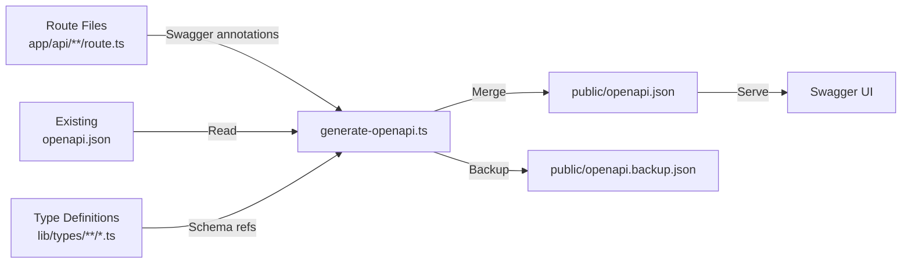

# Генерация OpenAPI

Шаблон включает автоматизированную систему генерации документации OpenAPI, которая сканирует JSDoc-аннотации `@swagger` в файлах маршрутов API, объединяет их с существующей документацией и создаёт полную спецификацию `openapi.json`.

## Обзор



## Запуск Генератора

```bash
# Стандартная генерация с выводом
tsx scripts/generate-openapi.ts

# Тихий режим (для CI/CD)
tsx scripts/generate-openapi.ts --silent
```

Скрипт автоматически запускается в тихом режиме при обнаружении переменных окружения CI (`CI`, `GITHUB_ACTIONS`, `GITLAB_CI`, `VERCEL` и т.д.).

## Конфигурация

Генератор использует `swagger-jsdoc` со следующей базовой конфигурацией:

```typescript
const swaggerOptions = {
	definition: {
		openapi: '3.0.0',
		info: {
			title: 'Ever Works API',
			version: '1.0.0',
			description: 'Comprehensive API documentation for Directory Web Template',
			contact: {
				name: 'Ever Works Team',
				url: 'https://ever.works'
			}
		},
		servers: [{ url: '/', description: 'Current Environment' }],
		components: {
			securitySchemes: {
				sessionAuth: { type: 'http', scheme: 'bearer', bearerFormat: 'JWT' },
				session: { type: 'apiKey', in: 'cookie', name: 'session_token' },
				cronSecret: { type: 'http', scheme: 'bearer', bearerFormat: 'Secret' }
			}
		}
	},
	apis: ['./app/api/**/route.ts', './app/api/**/*.ts', './lib/types/**/*.ts']
};
```

## Схемы Безопасности

| Схема         | Тип                      | Использование                             |
| ------------- | ------------------------ | ----------------------------------------- |
| `sessionAuth` | Bearer JWT               | Эндпоинты аутентифицированных пользователей |
| `session`     | Cookie (`session_token`) | Аутентификация сессии браузера            |
| `cronSecret`  | Bearer Secret            | Эндпоинты задач cron                      |

## Встроенные Схемы Компонентов

Генератор предоставляет следующие повторно используемые схемы:

### ErrorResponse

```json
{
	"type": "object",
	"properties": {
		"success": { "type": "boolean", "example": false },
		"error": { "type": "string", "example": "Error message" }
	},
	"required": ["success", "error"]
}
```

### PaginationMeta

```json
{
	"type": "object",
	"properties": {
		"page": { "type": "integer", "example": 1 },
		"pageSize": { "type": "integer", "example": 20 },
		"total": { "type": "integer", "example": 150 },
		"totalPages": { "type": "integer", "example": 8 }
	}
}
```

## Написание Аннотаций Swagger

### Базовая Аннотация Маршрута

Добавьте JSDoc-комментарии `@swagger` непосредственно над или внутри файлов маршрутов:

```typescript
/**
 * @swagger
 * /api/items:
 *   get:
 *     tags: ["Items"]
 *     summary: "List all items"
 *     description: "Returns a paginated list of items with optional filtering"
 *     parameters:
 *       - name: "page"
 *         in: query
 *         schema:
 *           type: integer
 *           minimum: 1
 *           default: 1
 *       - name: "limit"
 *         in: query
 *         schema:
 *           type: integer
 *           minimum: 1
 *           maximum: 100
 *           default: 10
 *     responses:
 *       200:
 *         description: "Successful response"
 *         content:
 *           application/json:
 *             schema:
 *               $ref: "#/components/schemas/Pagination"
 *       500:
 *         description: "Internal server error"
 *         content:
 *           application/json:
 *             schema:
 *               $ref: "#/components/schemas/ErrorResponse"
 */
export async function GET(request: Request) {
	// handler implementation
}
```
