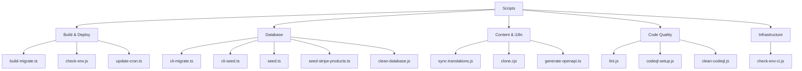
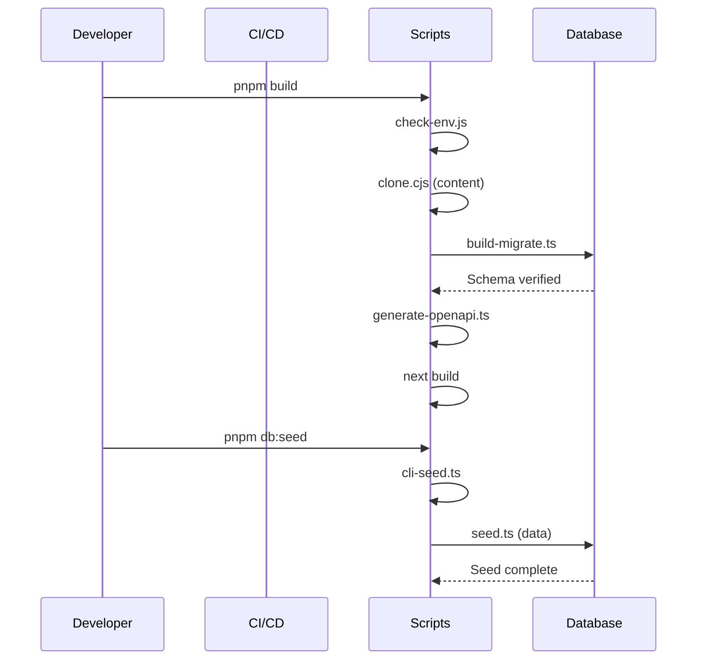

# Обзор Скриптов

Директория `scripts/` содержит скрипты автоматизации, которые управляют конвейером сборки, жизненным циклом базы данных, синхронизацией контента, качеством кода и инфраструктурой развёртывания. Каждый скрипт предназначен для конкретного этапа рабочего процесса разработки или развёртывания.

## Структура Директорий

```
scripts/
├── build-migrate.ts          # Миграции БД во время сборки
├── check-env.js              # Валидация переменных окружения
├── check-env-ci.js           # Валидация env для CI
├── clean-database.js         # Утилита сброса базы данных
├── cli-migrate.ts            # CLI ручной миграции
├── cli-seed.ts               # CLI ручного заполнения
├── clone.cjs                 # Клонирование контента Git-CMS
├── codeql-setup.js           # Настройка анализа безопасности CodeQL
├── clean-codeql.js           # Утилита очистки CodeQL
├── generate-openapi.ts       # Генерация спецификации OpenAPI
├── lint.js                   # Скрипт-обёртка ESLint
├── seed.ts                   # Полный сидер базы данных
├── seed-stripe-products.ts   # Сидер продуктов/цен Stripe
├── sync-translations.js      # Синхронизация переводов i18n
├── update-cron.ts            # Управление cron-задачами Vercel
└── tsconfig.json             # Конфигурация TypeScript для скриптов
```

## Категории Скриптов



## Скрипты Сборки и Развёртывания

### build-migrate.ts

Выполняет миграции базы данных во время процесса сборки Vercel. Обеспечивает согласованность схемы до запуска развёртывания в производство.

```bash
tsx scripts/build-migrate.ts
```

| Функция              | Поведение                                                          |
|----------------------|--------------------------------------------------------------------|
| Обнаружение CI       | Пропускает миграции в GitHub Actions (не Vercel)                   |
| Флаг пропуска        | Установите `SKIP_BUILD_MIGRATIONS=true` для пропуска              |
| Проверка схемы       | Валидирует наличие критических столбцов после миграции             |
| Безопасность prod    | Прерывает сборку при неудаче производственных миграций             |
| Толерантность preview| Допускает ошибки соединения при развёртываниях предпросмотра       |

### check-env.js

Валидирует переменные окружения перед запуском приложения. Динамически категоризирует переменные по префиксу и проверяет полноту.

```bash
node scripts/check-env.js [--silent] [--quick]
```

| Флаг             | Описание                                               |
|------------------|--------------------------------------------------------|
| `--silent`, `-s` | Подавляет некритический вывод                          |
| `--quick`, `-q`  | Пропускает детальные проверки, минимальный вывод       |

Автоматически определяемые категории: `core`, `database`, `auth`, `supabase`, `content`, `email`, `payment`, `analytics`, `storage`, `api`, `security`, `background-jobs`.

### update-cron.ts

Управляет расписаниями cron-задач Vercel через API Vercel. Регулирует частоту синхронизации в зависимости от тарифного плана проекта.

```bash
tsx scripts/update-cron.ts
```

| Переменная окружения  | Назначение                                              |
|-----------------------|---------------------------------------------------------|
| `VERCEL_TOKEN`        | Токен аутентификации API                                |
| `VERCEL_PROJECT_ID`   | Идентификатор целевого проекта                          |
| `VERCEL_TEAM_SCOPE`   | Область команды для вызовов API                         |
| `VERCEL_DEPLOYMENT_ID`| Развёртывание для ожидания перед обновлением            |
| `CRON_FREQUENCY`      | Установите `5min` для высокочастотной синхронизации     |

Расписания по умолчанию: Бесплатный план использует `0 3 * * *` (ежедневно в 3:00), Pro план — `*/5 * * * *` (каждые 5 минут).

## Скрипты Базы Данных

### seed.ts

Заполняет базу данных реалистичными тестовыми данными, включая пользователей, профили, роли, разрешения, журналы активности, комментарии и голоса.

```bash
DATABASE_URL=postgres://... pnpm seed
```

Заполняемые данные (по умолчанию 20 пользователей):

| Сущность             | Количество | Детали                                        |
|----------------------|------------|-----------------------------------------------|
| Роли                 | 2          | `admin` и `user`                              |
| Разрешения           | Все        | Из определений `getAllPermissions()`          |
| Пользователи         | 20         | С последовательными адресами email            |
| Профили клиентов     | 20         | Смешанные планы: бесплатный, стандарт, premium|
| Роли пользователей   | 20         | Первый пользователь — admin                   |
| Подписки на рассылку | ~7         | Каждый 3-й пользователь                       |
| Журналы активности   | 30         | Действия SIGN_UP, SIGN_IN, COMMENT, VOTE      |
| Комментарии          | 15         | Примеры комментариев с оценками               |
| Голоса               | 25         | Смесь положительных и отрицательных голосов   |

### seed-stripe-products.ts

Создаёт продукты и цены Stripe, соответствующие тарифным уровням шаблона.

```bash
npx tsx scripts/seed-stripe-products.ts
```

Созданные продукты:

| Продукт                        | Ежемесячно | Ежегодно          | Тип              |
|--------------------------------|------------|-------------------|------------------|
| Бесплатный                     | $0         | $0                | Подписка         |
| Стандарт                       | $10/мес    | $96/год (скидка 20%)| Подписка       |
| Premium                        | $20/мес    | $180/год (скидка 25%)| Подписка      |
| Спонсорская реклама - Недельн. | $100       | --                | Единовременно    |
| Спонсорская реклама - Месячн.  | $300       | --                | Единовременно    |

### clean-database.js

Удаляет все таблицы в схеме `public` и схему отслеживания миграций `drizzle`. Использовать с осторожностью.

```bash
node scripts/clean-database.js
```

**Предупреждение:** Это деструктивная операция. Удаляет все данные и определения схем.

## Скрипты Контента и i18n

### clone.cjs

Клонирует репозиторий контента Git-CMS в `.content/` на основе переменной окружения `DATA_REPOSITORY`. Вызывается автоматически во время сборки.

### sync-translations.js

Синхронизирует файлы переводов с английским эталоном. Гарантирует наличие в каждом файле локали всех ключей из `en.json`.

```bash
node scripts/sync-translations.js
```

Поддерживаемые локали: `ar`, `bg`, `de`, `es`, `fr`, `he`, `hi`, `id`, `it`, `ja`, `ko`, `nl`, `pl`, `pt`, `ru`, `th`, `tr`, `uk`, `vi`.

### generate-openapi.ts

Сканирует JSDoc-аннотации `@swagger` в файлах маршрутов и объединяет их с существующей спецификацией `public/openapi.json`.

```bash
tsx scripts/generate-openapi.ts [--silent]
```

## Скрипты Качества Кода

### lint.js

Оборачивает ESLint в формат flat-конфигурации, обходя проблемы совместимости линтера Next.js.

```bash
node scripts/lint.js
```

Выполняет `npx eslint . --max-warnings=55` внутри.

## Маппинг Скриптов Package.json

| npm-скрипт           | Базовая команда                | Назначение                   |
|----------------------|-------------------------------|------------------------------|
| `pnpm dev`           | `next dev`                    | Сервер разработки            |
| `pnpm build`         | Конвейер сборки с миграциями  | Производственная сборка      |
| `pnpm lint`          | `node scripts/lint.js`        | Линтинг кода                 |
| `pnpm db:generate`   | `drizzle-kit generate`        | Генерация файлов миграций    |
| `pnpm db:migrate`    | `tsx scripts/build-migrate.ts`| Запуск миграций              |
| `pnpm db:migrate:cli`| `tsx scripts/cli-migrate.ts`  | Ручной CLI миграций          |
| `pnpm db:seed`       | `tsx scripts/cli-seed.ts`     | Заполнение базы данных       |
| `pnpm db:studio`     | `drizzle-kit studio`          | GUI базы данных              |

## Поток Выполнения



## Добавление Новых Скриптов

При добавлении нового скрипта:

1. Поместите его в директорию `scripts/`
2. По возможности используйте TypeScript (`.ts`) для новых скриптов
3. Загружайте переменные окружения через `dotenv` в начале
4. Добавьте соответствующие JSDoc-заголовки с инструкциями по использованию
5. Зарегистрируйте в скриптах `package.json`, если должен быть доступен пользователю
6. Обрабатывайте ошибки корректно с осмысленными кодами выхода
