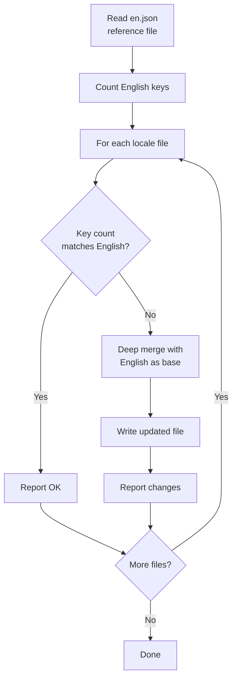
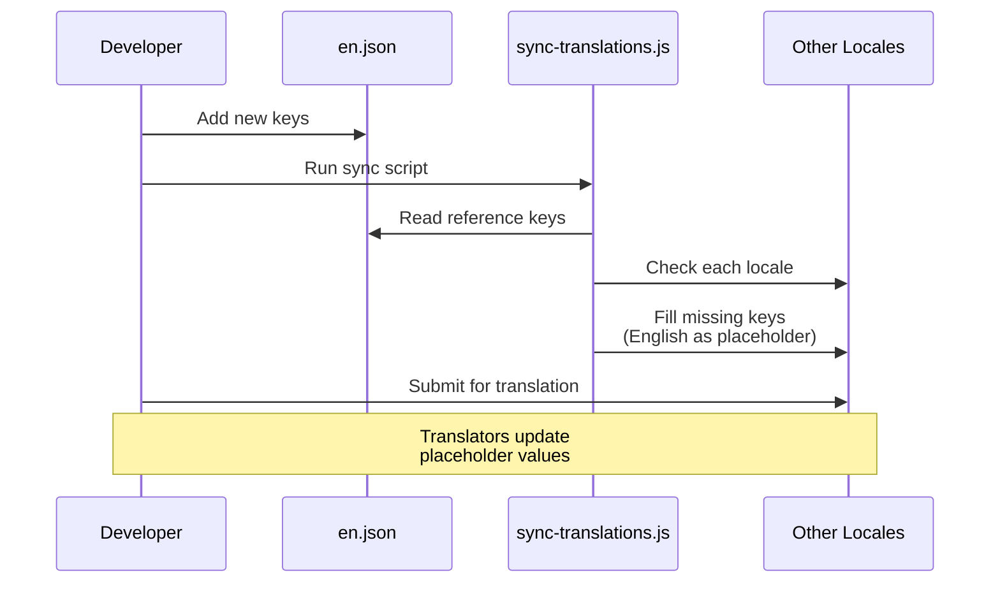

# Рабочий Процесс Перевода

Шаблон использует `next-intl` для интернационализации (i18n) с файлами сообщений на основе JSON. Рабочий процесс перевода обеспечивает синхронизацию всех поддерживаемых локалей с английским эталонным файлом через автоматизированный скрипт синхронизации.

## Поддерживаемые Локали

Шаблон поставляется с 20 поддерживаемыми языками:

| Код  | Язык                | Код  | Язык         |
|------|---------------------|------|--------------|
| `en` | Английский (эталон) | `ko` | Корейский    |
| `ar` | Арабский            | `nl` | Голландский  |
| `bg` | Болгарский          | `pl` | Польский     |
| `de` | Немецкий            | `pt` | Португальский|
| `es` | Испанский           | `ru` | Русский      |
| `fr` | Французский         | `th` | Тайский      |
| `he` | Иврит               | `tr` | Турецкий     |
| `hi` | Хинди               | `uk` | Украинский   |
| `id` | Индонезийский       | `vi` | Вьетнамский  |
| `it` | Итальянский         | `ja` | Японский     |

## Структура Файлов

```
messages/
├── en.json          # Английский (эталон - источник истины)
├── ar.json          # Арабский
├── bg.json          # Болгарский
├── de.json          # Немецкий
├── es.json          # Испанский
├── fr.json          # Французский
├── he.json          # Иврит
├── hi.json          # Хинди
├── id.json          # Индонезийский
├── it.json          # Итальянский
├── ja.json          # Японский
├── ko.json          # Корейский
├── nl.json          # Голландский
├── pl.json          # Польский
├── pt.json          # Португальский
├── ru.json          # Русский
├── th.json          # Тайский
├── tr.json          # Турецкий
├── uk.json          # Украинский
└── vi.json          # Вьетнамский
```

## Скрипт Синхронизации Переводов

Скрипт `scripts/sync-translations.js` гарантирует наличие в каждом файле локали всех ключей, определённых в `en.json`.

### Запуск Синхронизации

```bash
node scripts/sync-translations.js
```

### Как Это Работает



### Стратегия Слияния

Синхронизация использует глубокое слияние, при котором приоритет имеют существующие переводы:

```javascript
function deepMerge(target, source) {
  const result = { ...source };  // Start with English (source)
  for (const key in target) {
    if (typeof target[key] === 'object' && !Array.isArray(target[key])) {
      result[key] = deepMerge(target[key], source[key] || {});
    } else {
      result[key] = target[key]; // Existing translation wins
    }
  }
  return result;
}
```

**Ключевое поведение:**

- Отсутствующие ключи заполняются английскими значениями как заглушками
- Существующие переводы никогда не перезаписываются
- Вложенные структуры обрабатываются рекурсивно
- Массивы рассматриваются как листовые значения (не объединяются)

### Пример Вывода

```
English file has 342 translation keys

ar.json: 340/342 keys (missing 2)
  -> Updated ar.json with missing keys from English

bg.json: 342/342 keys - OK
de.json: 342/342 keys - OK
es.json: 338/342 keys (missing 4)
  -> Updated es.json with missing keys from English

Done!
```

## Формат Файла Сообщений

Файлы переводов используют вложенный JSON с доступом к ключам через точечную нотацию:

```json
{
  "common": {
    "loading": "Loading...",
    "error": "An error occurred",
    "save": "Save",
    "cancel": "Cancel"
  },
  "auth": {
    "signIn": "Sign In",
    "signOut": "Sign Out",
    "email": "Email Address",
    "password": "Password"
  },
  "navigation": {
    "home": "Home",
    "about": "About",
    "contact": "Contact"
  }
}
```

## Использование Переводов в Коде

### Клиентские Компоненты

```tsx
'use client';
import { useTranslations } from 'next-intl';

export function LoginButton() {
  const t = useTranslations('auth');
  return <button>{t('signIn')}</button>;
}
```

### Серверные Компоненты

```tsx
import { getTranslations } from 'next-intl/server';

export default async function Page() {
  const t = await getTranslations('common');
  return <h1>{t('loading')}</h1>;
}
```

### С Переменными

```json
{
  "greeting": "Hello, {name}!",
  "itemCount": "You have {count, plural, =0 {no items} one {1 item} other {# items}}"
}
```

```tsx
const t = useTranslations('dashboard');
t('greeting', { name: 'John' });     // "Hello, John!"
t('itemCount', { count: 5 });         // "You have 5 items"
```

## Добавление Нового Языка

Выполните следующие шаги для добавления новой локали:

### Шаг 1: Создать Файл Сообщений

```bash
# Скопируйте английский файл как отправную точку
cp messages/en.json messages/NEW_LOCALE.json
```

### Шаг 2: Зарегистрировать Локаль

Добавьте локаль в конфигурацию i18n:

```typescript
// i18n/config.ts (или аналог)
export const locales = ['en', 'ar', 'de', ..., 'NEW_LOCALE'];
```

### Шаг 3: Перевести Контент

Отредактируйте `messages/NEW_LOCALE.json` и замените английские строки переведёнными значениями.

### Шаг 4: Запустить Синхронизацию для Проверки

```bash
node scripts/sync-translations.js
```

Если файл содержит все ключи, будет выведено "OK". Отсутствующие ключи будут заполнены английскими заглушками.

## Добавление Новых Ключей Перевода

При добавлении новых функций, требующих пользовательского текста:

### Шаг 1: Добавить в Английский Эталон

```json
// messages/en.json
{
  "newFeature": {
    "title": "New Feature",
    "description": "This is a new feature"
  }
}
```

### Шаг 2: Запустить Синхронизацию

```bash
node scripts/sync-translations.js
```

Это автоматически добавит новые ключи во все файлы локалей с английским текстом в качестве заглушек.

### Шаг 3: Запросить Переводы

Поделитесь вновь добавленными ключами с переводчиками для каждой локали. Им нужно только обновить значения-заглушки на английском.

## Подсчёт Ключей

Скрипт синхронизации рекурсивно считает ключи во вложенных объектах:

```javascript
function countKeys(obj) {
  let count = 0;
  for (const key in obj) {
    if (typeof obj[key] === 'object' && !Array.isArray(obj[key])) {
      count += countKeys(obj[key]); // Recurse into nested objects
    } else {
      count++;                      // Count leaf values
    }
  }
  return count;
}
```

Подсчитываются только строки перевода на листовом уровне, а не промежуточные ключи группировки.

## Поддержка RTL-языков

Шаблон поддерживает языки, читаемые справа налево (RTL), включая арабский (`ar`) и иврит (`he`). Макет RTL обрабатывается автоматически через конфигурацию локали и атрибут CSS `dir`.

## Диаграмма Рабочего Процесса



## Лучшие Практики

1. **Всегда изменяйте `en.json` первым** -- Это единственный источник истины
2. **Запускайте синхронизацию после каждого английского изменения** -- Поддерживает все локали актуальными
3. **Никогда вручную не добавляйте ключи в не-английские файлы** -- Используйте скрипт синхронизации
4. **Используйте вложенные группировки** -- Группируйте ключи по функции или странице для удобства
5. **Избегайте жёстко заданных строк** -- Всегда используйте `useTranslations` или `getTranslations`
6. **Тестируйте RTL-макеты** -- Регулярно проверяйте отображение в арабском и иврите
7. **Используйте описательные ключи** -- `auth.signInButton` вместо `auth.btn1`
