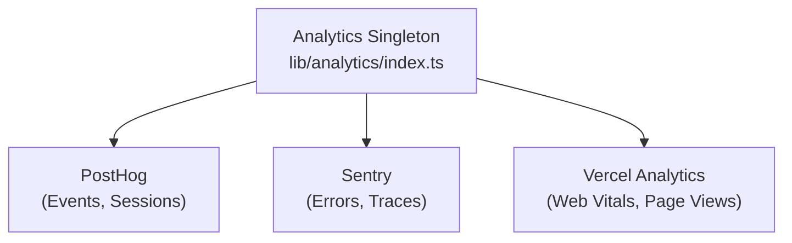

# Аналитическая система

Шаблон Ever Works интегрируется с **PostHog**, **Sentry** и **Vercel Analytics** для комплексного отслеживания событий, мониторинга ошибок, записи сеансов и анализа производительности.

## Архитектура



## Класс аналитики

Базовый класс `Analytics` в `lib/analytics/index.ts` представляет собой синглтон, который управляет инициализацией и отправкой событий между поставщиками:

```typescript
class Analytics {
  private static instance: Analytics;
  private initialized: boolean;
  private exceptionTrackingProvider: ExceptionTrackingProvider;

  static getInstance(): Analytics;
  init(): void;
  trackEvent(name: string, properties?: EventProperties): void;
  trackPageView(url: string): void;
  identify(userId: string, properties?: UserProperties): void;
  reset(): void;
}
```

### Разрешение поставщика отслеживания исключений

Система поддерживает гибкую настройку отслеживания исключений:

```typescript
type ExceptionTrackingProvider = 'sentry' | 'posthog' | 'both' | 'none';
```

Провайдер определяется путем проверки доступности:
1. Считайте значение конфигурации `EXCEPTION_TRACKING_PROVIDER` .
2. Убедитесь, что выбранный провайдер включен.
3. Вернитесь к доступной альтернативе, если основной не настроен.

## Интеграция PostHog

### Конфигурация

```bash
NEXT_PUBLIC_POSTHOG_KEY=phc_xxx
NEXT_PUBLIC_POSTHOG_HOST=https://us.i.posthog.com

# Optional
NEXT_PUBLIC_POSTHOG_DEBUG=false
NEXT_PUBLIC_POSTHOG_SESSION_RECORDING=true
NEXT_PUBLIC_POSTHOG_AUTO_CAPTURE=true
NEXT_PUBLIC_POSTHOG_SAMPLE_RATE=1.0
NEXT_PUBLIC_POSTHOG_SESSION_RECORDING_SAMPLE_RATE=0.1
NEXT_PUBLIC_POSTHOG_EXCEPTION_TRACKING=true
```

### API-сервис PostHog

Серверная служба, расположенная по адресу `lib/services/posthog-api.service.ts` , предоставляет данные административного анализа:

```typescript
class PostHogApiService {
  constructor(); // Reads from analyticsConfig

  isConfigured(): boolean;
  async getTotalPageViews(days?: number): Promise<number>;
  async getTopPages(days?: number): Promise<PageData[]>;
  async getEventCounts(eventName: string, days?: number): Promise<number>;
}
```

**Требуется для доступа к API на стороне сервера:**
```bash
POSTHOG_PERSONAL_API_KEY=phx_xxx
POSTHOG_PROJECT_ID=12345
```

### Перехватчик на стороне клиента

```typescript
import { useAnalytics } from '@/hooks/use-analytics';

const {
  trackEvent,      // (name: string, properties?: object) => void
  trackPageView,   // (url: string) => void
  identify,        // (userId: string, properties?: object) => void
} = useAnalytics();
```

### Хук геоаналитики

```typescript
import { useGeoAnalytics } from '@/hooks/use-geo-analytics';

const {
  geoData,         // Geographic analytics data
  isLoading,
} = useGeoAnalytics();
```

## Интеграция Sentry

### Конфигурация

```bash
NEXT_PUBLIC_SENTRY_DSN=https://xxx@sentry.io/xxx
SENTRY_AUTH_TOKEN=sntrys_xxx
SENTRY_ORG=your-org
SENTRY_PROJECT=your-project
NEXT_PUBLIC_SENTRY_EXCEPTION_TRACKING=true
```

Сентри обеспечивает:
- **Отслеживание ошибок** – Автоматический захват необработанных исключений.
- **Мониторинг производительности**. Отслеживание транзакций для маршрутов API и загрузки страниц.
- **Воспроизведение сеанса** – Дополнительная запись сеанса.

## Версель Аналитика

Vercel Analytics становится автоматически доступен при развертывании на Vercel:

```bash
# Enabled by default on Vercel deployments
NEXT_PUBLIC_VERCEL_ANALYTICS=true
```

Обеспечивает:
- **Web Vitals** – мониторинг основных веб-показателей (LCP, FID, CLS).
– **Просмотры страниц** – Автоматическое отслеживание просмотров страниц.
– **Статистика аудитории** – Географический анализ и анализ устройств.

## Панель административной аналитики

Панель администратора предоставляет агрегированную аналитику через крючок `useAdminStats` :

```typescript
import { useAdminStats } from '@/hooks/use-admin-stats';

const {
  stats,           // Dashboard statistics
  isLoading,
} = useAdminStats();
```

Хук `useDashboardStats` предоставляет более подробные метрики:

```typescript
import { useDashboardStats } from '@/hooks/use-dashboard-stats';

const {
  stats,           // { items, users, revenue, pageViews, ... }
  isLoading,
  refetch,
} = useDashboardStats();
```

## Отключение аналитики

Поставщики аналитики отключаются, если их конфигурация отсутствует. Код отслеживания не загружается, если не установлены соответствующие переменные среды. Это позволяет шаблону работать без какой-либо аналитики в разработке.
