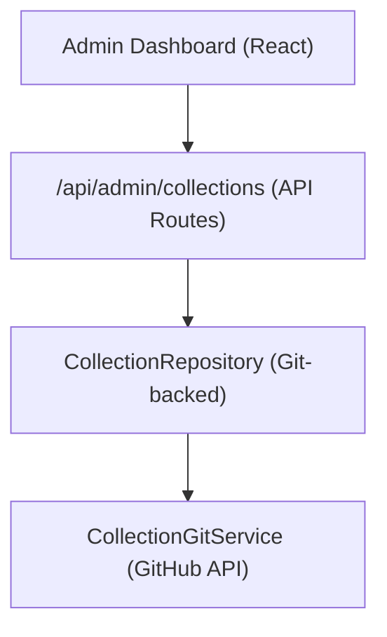

# Система коллекций

Коллекции позволяют администраторам выбирать группы элементов для отображения на сайте. Система хранит данные коллекции в репозитории CMS на базе Git и обеспечивает операции CRUD через панель администратора.

## Архитектура



Коллекции хранятся в виде файлов в репозитории CMS на базе Git (настроенном через `DATA_REPOSITORY` ), используя `CollectionGitService` для операций чтения/записи через API GitHub.

## Модель данных

```typescript
interface Collection {
  id: string;
  name: string;
  slug: string;
  description?: string;
  isActive: boolean;
  items: string[];          // Array of item slugs
  item_count: number;       // Computed from items array
  displayOrder?: number;
  created_at: string;
  updated_at: string;
}
```

## Репозиторий коллекций

Репозиторий, расположенный по адресу `lib/repositories/collection.repository.ts` , предоставляет:

```typescript
class CollectionRepository {
  async findAll(options?: CollectionListOptions): Promise<Collection[]>;
  async findById(id: string): Promise<Collection | null>;
  async findBySlug(slug: string): Promise<Collection | null>;
  async create(data: CreateCollectionRequest): Promise<Collection>;
  async update(id: string, data: UpdateCollectionRequest): Promise<Collection>;
  async delete(id: string): Promise<void>;
  async assignItems(id: string, itemSlugs: string[]): Promise<void>;
}
```

### Список опций

```typescript
interface CollectionListOptions {
  search?: string;           // Filter by name
  includeInactive?: boolean; // Include inactive collections
  sortBy?: 'name' | 'item_count' | 'created_at';
  sortOrder?: 'asc' | 'desc';
  page?: number;
  limit?: number;
}
```

## Администраторский крючок

```typescript
import { useAdminCollections } from '@/hooks/use-admin-collections';

const {
  collections,        // Collection[]
  total, page, totalPages, limit,
  isLoading, isSubmitting,
  createCollection,   // (data: CreateCollectionRequest) => Promise<boolean>
  updateCollection,   // (id: string, data: UpdateCollectionRequest) => Promise<boolean>
  deleteCollection,   // (id: string) => Promise<boolean>
  assignItems,        // (id: string, itemSlugs: string[]) => Promise<boolean>
  fetchAssignedItems, // (id: string) => Promise<Item[]>
  refetch, refreshData,
} = useAdminCollections({ page: 1, limit: 10, search: '' });
```

## Конечные точки API

| Метод | Конечная точка | Описание |
|--------|----------|-------------|
| ПОЛУЧИТЬ | `/api/admin/collections` | Коллекции списков (постраничные) |
| ПОСТ | `/api/admin/collections` | Создать новую коллекцию |
| ПУТЬ | `/api/admin/collections/:id` | Обновить коллекцию |
| УДАЛИТЬ | `/api/admin/collections/:id` | Удалить коллекцию |
| ПОЛУЧИТЬ | `/api/admin/collections/:id/items` | Получить назначенные элементы |
| ПОСТ | `/api/admin/collections/:id/items` | Добавить элементы в коллекцию |

## Отображение на стороне клиента

Хук `useCollectionsExists` проверяет, существуют ли какие-либо активные коллекции, используемые для условного рендеринга:

```typescript
import { useCollectionsExists } from '@/hooks/use-collections-exists';
const { exists, isLoading } = useCollectionsExists();
```

## Конфигурация

Для коллекций требуются следующие переменные среды:

```bash
DATA_REPOSITORY=https://github.com/owner/repo   # Git CMS repository
GH_TOKEN=ghp_xxx                                  # GitHub API token
GITHUB_BRANCH=main                                # Branch for collection data
```

`CollectionRepository` анализирует URL-адрес `DATA_REPOSITORY` для извлечения владельца GitHub и репозитория, а затем использует токен для аутентификации API.
