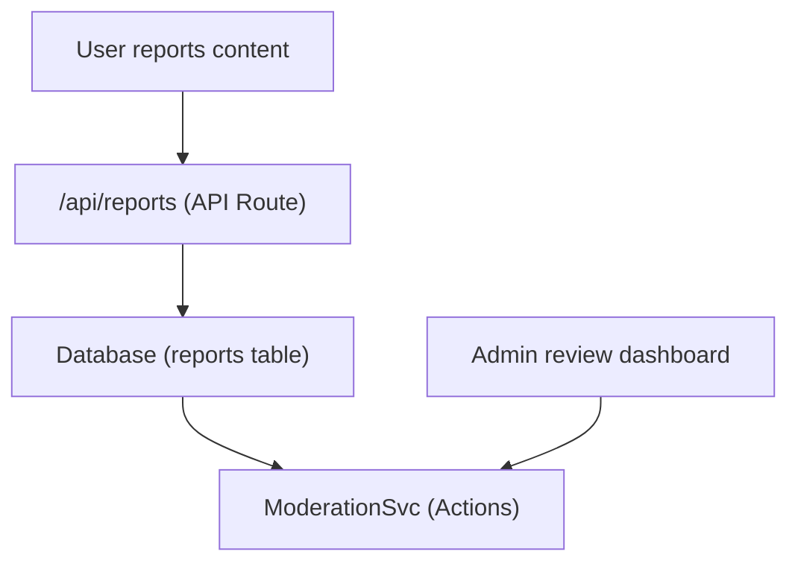

# Отчеты и модерация контента

Шаблон Ever Works включает в себя систему отчетности и модерации контента, которая позволяет пользователям отмечать недопустимый контент, а администраторам принимать меры в отношении элементов и комментариев, на которые поступила жалоба.

## Архитектура



## Типы контента

Система поддерживает отчеты о двух типах контента:

```typescript
enum ReportContentType {
  ITEM = 'item',
  COMMENT = 'comment',
}
```

## Служба модерации

Расположенный по адресу `lib/services/moderation.service.ts` , сервис обеспечивает действия модерации:

### Разрешение владельца контента

```typescript
async function getContentOwner(
  contentType: ReportContentTypeValues,
  contentId: string
): Promise<ContentOwnerResult>;
// Returns: { success: boolean, userId?: string, error?: string }
```

Определяет автора сообщаемого контента, просматривая комментарии через `getCommentById()` или элементы через `ItemRepository.findById()` .

### Действия модератора

| Действие | Описание | Эффект |
|--------|-------------|--------|
| **Удалить контент** | Удалить элемент или комментарий, о котором сообщили | Содержимое удалено, история записана |
| **Предупредить пользователя** | Увеличение количества предупреждений | Счетчик предупреждений увеличился |
| **Блокировать пользователя** | Временно заблокировать аккаунт | Доступ к аккаунту ограничен |
| **Заблокировать пользователя** | Заблокировать аккаунт навсегда | Аккаунт навсегда ограничен |
| **Закрыть отчет** | Пометить отчет как решенный без каких-либо действий | Отчет закрыт |

### Реализация действия

Каждое действие создает запись в истории модерации и может вызывать уведомления по электронной почте:

```typescript
// Example: Remove content
async function removeContent(
  contentType: ReportContentTypeValues,
  contentId: string,
  reportId: string,
  adminId: string
): Promise<ModerationResult>;
```

Служба делегирует:
- `deleteComment()` -- Для удаления комментария
- `ItemRepository` -- Для удаления элемента
- `createModerationHistory()` -- Для контрольного журнала
- `incrementWarningCount()` -- Для предупреждений пользователя
- `suspendUserQuery()` / `banUserQuery()` -- Для действий с учетной записью
- `EmailNotificationService` -- Для уведомлений по электронной почте для пользователей

## Администраторский крючок

```typescript
import { useAdminReports } from '@/hooks/use-admin-reports';

const {
  reports,           // Report[]
  total, page, totalPages,
  isLoading, isSubmitting,
  resolveReport,     // (id, action, reason?) => Promise<boolean>
  dismissReport,     // (id, reason?) => Promise<boolean>
  deleteReport,      // (id) => Promise<boolean>
  refetch, refreshData,
} = useAdminReports({ page: 1, limit: 10 });
```

## Рабочий процесс модерации

1. **Содержание пользовательских отчетов** – выбирает причину и отправляет отчет через API отчета.
2. **Уведомление администратора** — `NotificationService.createItemReportedNotification()` или `createCommentReportedNotification()` предупреждает администраторов.
3. **Просмотры администратором** – просмотр подробностей отчета на панели администратора.
4. **Администратор выполняет действие** – выбор: удалить контент, предупредить пользователя, приостановить, заблокировать или закрыть.
5. **История записана** – `createModerationHistory()` регистрирует действие с указанием идентификатора администратора, отметки времени и причины.
6. **Уведомление пользователя** – владельцу контента отправляется уведомление по электронной почте о предпринятом действии.

## Перечисление действий модерации

```typescript
enum ModerationAction {
  REMOVE_CONTENT = 'remove_content',
  WARN_USER = 'warn_user',
  SUSPEND_USER = 'suspend_user',
  BAN_USER = 'ban_user',
  DISMISS = 'dismiss',
}
```

## Конечные точки API

| Метод | Конечная точка | Описание |
|--------|----------|-------------|
| ПОСТ | `/api/reports` | Отправить новый отчет |
| ПОЛУЧИТЬ | `/api/admin/reports` | Список отчетов (администратор, с разбивкой на страницы) |
| ПОСТ | `/api/admin/reports/:id/resolve` | Разрешите отчет с помощью действия |
| ПОСТ | `/api/admin/reports/:id/dismiss` | Отклонить отчет |
| УДАЛИТЬ | `/api/admin/reports/:id` | Удалить отчет |

## Сопутствующая документация

- [Система уведомлений](./notifications.md) - Как доставляются уведомления об отчетах.
- [Голосование и комментарии](./voting-comments.md) -- Система комментариев, о которой можно сообщить
