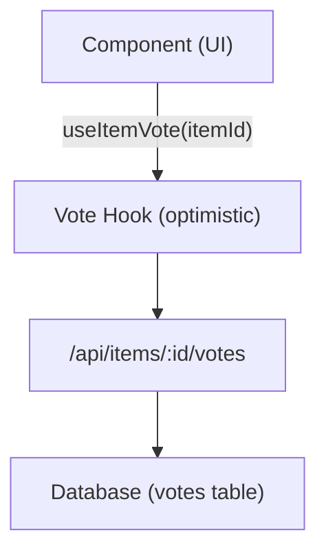

# Система голосования и комментариев

Шаблон Ever Works включает в себя полноценную систему голосования и комментирования, которая позволяет пользователям голосовать за или против элементов, оставлять отзывы с рейтингом в виде звезд и взаимодействовать с контентом. Обе системы используют оптимистичные обновления для мгновенной обратной связи с пользовательским интерфейсом.

## Система голосования

### Архитектура

В системе голосования используется модель голосования по каждому элементу, при которой каждый аутентифицированный пользователь может отдать один голос (за или против) за каждый элемент. Система отслеживает чистый подсчет голосов и голоса отдельных пользователей.



### хук useItemVote

```typescript
import { useItemVote } from '@/hooks/use-item-vote';

const {
  voteCount,       // number -- net vote count
  userVote,        // 'up' | 'down' | null
  isLoading,       // boolean
  handleVote,      // (type: 'up' | 'down') => void
  refreshVotes,    // () => void
} = useItemVote(itemId);
```

### Поведение при голосовании

| Текущее состояние | Действие | Результат |
|--------------|--------|--------|
| Нет голосования | Нажмите вверх | Проголосовать за (+1) |
| Нет голосования | Нажмите «Вниз» | Понижение (-1) |
| Проголосовали за | Нажмите вверх | Удалить голос (переключить) |
| Проголосовали за | Нажмите «Вниз» | Переключиться на отрицательный голос (-2 нетто) |
| Проголосовано отрицательно | Нажмите «Вниз» | Удалить голос (переключить) |
| Проголосовано отрицательно | Нажмите вверх | Переключиться на положительное голосование (+2 нетто) |

### Оптимистичные обновления

Перехватчик голосования реализует оптимистичные обновления с откатом:

1. **onMutate** — отмена исходящих запросов, снимок текущего состояния, применение оптимистического обновления.
2. **onSuccess** — замените оптимистичные данные ответом сервера.
3. **onError** — откат к моментальному снимку, отображение всплывающего сообщения об ошибке.

### Аутентификация

Неаутентифицированные пользователи, которые пытаются проголосовать, видят модал входа через `useLoginModal` :

```typescript
if (!user) {
  loginModal.onOpen('Please sign in to vote on this item');
  throw new Error('Authentication required');
}
```

### Управление кэшем

Утилита `useVoteCache` обеспечивает операции кеширования между компонентами:

```typescript
import { useVoteCache } from '@/hooks/use-item-vote';

const {
  invalidateAllVotes,     // () => void
  invalidateItemVotes,    // (itemId: string) => void
  clearVoteCache,         // () => void
  prefetchItemVotes,      // (itemId: string) => Promise<void>
} = useVoteCache();
```

## Система комментариев

### Архитектура

Комментарии поддерживают все операции CRUD со звездными рейтингами, модерацией и обновлениями в реальном времени.

### использовать крючок для комментариев

```typescript
import { useComments } from '@/hooks/use-comments';

const {
  comments,              // CommentWithUser[]
  isPending,
  createComment,         // ({ content, itemId, rating }) => Promise
  isCreating,
  updateComment,         // ({ commentId, content?, rating? }) => Promise
  isUpdating,
  deleteComment,         // (commentId) => Promise
  isDeleting,
  rateComment,           // ({ commentId, rating }) => void
  isRatingComment,
  updateCommentRating,   // ({ commentId, rating }) => void
  isUpdatingRating,
  commentRating,         // number
  isLoadingRating,
} = useComments(itemId);
```

### Модель данных комментариев

Каждый комментарий включает в себя:
- `id` -- Уникальный идентификатор
- `content` -- Текст комментария
- `rating` -- Дополнительный звездный рейтинг (1–5)
- `userId` -- Ссылка на автора
- `itemId` -- Связанный элемент
- `user` -- Заполненные данные пользователя (имя, адрес электронной почты, изображение)
- `createdAt` / `updatedAt` -- Метки времени

### Интеграция рейтингов

Комментарии и рейтинги тесно интегрированы:
- Создание комментария с рейтингом обновляет совокупный рейтинг элемента.
- Редактирование рейтинга комментария вызывает перерасчет.
- Запрос `["item-rating", itemId]` повторно извлекается после любой мутации комментария.

### Межкомпонентные события

Система комментариев отправляет пользовательские события DOM для межкомпонентной координации:

```typescript
const COMMENT_MUTATION_EVENT = "comment:mutated";
window.dispatchEvent(new CustomEvent(COMMENT_MUTATION_EVENT, { detail: comment }));
```

Другие компоненты могут прослушивать изменения комментариев без прямой связи с React Query.

### Модерация администратора

Хук `useAdminComments` обеспечивает управление комментариями на уровне администратора:

```typescript
import { useAdminComments } from '@/hooks/use-admin-comments';

const {
  comments,         // AdminCommentItem[]
  totalComments,
  totalPages,
  isDeleting,       // string | null (ID of comment being deleted)
  deleteComment,    // (id: string) => Promise<boolean>
} = useAdminComments({ page: 1, limit: 10, search: '' });
```

### Конечные точки API

| Метод | Конечная точка | Описание |
|--------|----------|-------------|
| ПОЛУЧИТЬ | `/api/items/:id/comments` | Получить комментарии к элементу |
| ПОСТ | `/api/items/:id/comments` | Создать новый комментарий |
| ПУТЬ | `/api/items/:id/comments/:commentId` | Обновить комментарий |
| УДАЛИТЬ | `/api/items/:id/comments/:commentId` | Удалить комментарий |
| ПОСТ | `/api/items/:id/comments/rating` | Оценить комментарий |
| ПУТЬ | `/api/items/:id/comments/rating` | Обновить рейтинг комментариев |
| ПОЛУЧИТЬ | `/api/items/:id/comments/rating` | Получить совокупный рейтинг |

## Интеграция флагов функций

И голосование, и комментарии учитывают флаги функций:

```typescript
const flags = getFeatureFlags();
// flags.ratings -- Controls star rating display
// flags.comments -- Controls comment section visibility
```

Если база данных не настроена (отсутствует `DATABASE_URL` ), эти функции автоматически отключаются.
