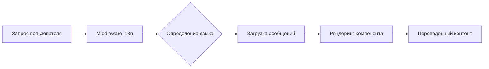

# Обзор Интернационализации

Ever Works создан с учётом интернационализации, поддерживая несколько языков через `next-intl`.

## 🌍 Поддерживаемые языки

Шаблон включает встроенную поддержку:

- 🇬🇧 **Английский** (en) – Язык по умолчанию
- 🇫🇷 **Французский** (fr)
- 🇪🇸 **Испанский** (es)
- 🇩🇪 **Немецкий** (de)
- 🇨🇳 **Китайский** (zh)
- 🇸🇦 **Арабский** (ar)
- 🇧🇬 **Болгарский** (bg)
- 🇳🇱 **Нидерландский** (nl)
- 🇮🇱 **Иврит** (he)
- 🇮🇹 **Итальянский** (it)
- 🇵🇱 **Польский** (pl)
- 🇵🇹 **Португальский** (pt)
- 🇷🇺 **Русский** (ru)

## Как это работает

### Локализация на основе URL

Ever Works использует определение языка на основе URL:

```
https://yoursite.com/en/about    → Английский
https://yoursite.com/fr/about    → Французский
https://yoursite.com/es/about    → Испанский
```

### Автоматическое определение языка

Система автоматически определяет:
1. Язык браузера пользователя
2. Перенаправляет на соответствующий языковой стандарт
3. Запоминает языковые предпочтения пользователя
4. Возвращает к языку по умолчанию (Английский)

## Архитектура переводов



## Файлы переводов

Переводы хранятся в JSON-файлах:

```
messages/
├── en.json    # Английский
├── fr.json    # Французский
├── es.json    # Испанский
├── de.json    # Немецкий
├── zh.json    # Китайский
└── ar.json    # Арабский
```

## Быстрый пример

```typescript
import { useTranslations } from 'next-intl';

export function MyComponent() {
  const t = useTranslations('common');

  return (
    <div>
      <h1>{t('welcome')}</h1>
      <p>{t('description')}</p>
    </div>
  );
}
```

## Возможности

### ✅ Полное покрытие переводов
- UI-компоненты
- Метки форм и сообщения валидации
- Шаблоны email
- Сообщения об ошибках
- SEO-метаданные

### ✅ Поддержка RTL
- Автоматический RTL-макет для арабского и иврита
- Зеркальные элементы UI
- Правильное выравнивание текста

### ✅ Форматирование дат и чисел
- Форматы дат для каждого языка
- Форматирование валют
- Форматирование чисел

### ✅ Склонение
- Автоматические формы множественного числа
- Правила для каждого языка

## Следующие шаги

- [Руководство по переводу →](./translation-guide) – Узнайте как добавлять и управлять переводами
- [Начало работы](/getting-started) – Настройте проект
- [Настройка](/guides/customization) – Персонализируйте сайт

## Нужна помощь?

Обратитесь на нашу [страницу поддержки](/advanced-guide/support) за помощью с интернационализацией.
