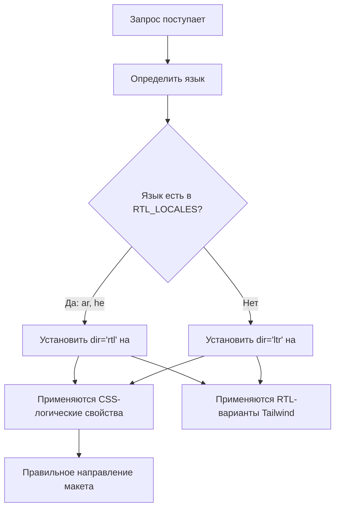

# Поддержка RTL (справа налево)

Шаблон полностью поддерживает языки с направлением текста справа налево (RTL), такие как арабский и иврит. Эта страница документирует работу определения RTL, применение направления макета и адаптацию компонентов к RTL-контекстам.

## Обзор архитектуры



## Исходные файлы

| Файл | Назначение |
|------|---------|
| `lib/constants.ts` | Определение списка RTL-языков |
| `app/layout.tsx` | Корневой макет с атрибутом `dir` |
| `components/language-switcher.tsx` | Карта языков с метаданными `isRTL` |

## Конфигурация RTL-языков

```typescript
export const RTL_LOCALES: readonly Locale[] = ['ar', 'he'] as const;
```

## Как применяется направление

### Определение в корневом макете

```typescript
export default async function RootLayout({ children }) {
  const locale = await getLocale();
  const dir = RTL_LOCALES.includes(locale as Locale) ? 'rtl' : 'ltr';

  return (
    <html lang={locale} dir={dir} suppressHydrationWarning>
      <body className={`${getFontClassNames(locale)} antialiased`}>
        {children}
      </body>
    </html>
  );
}
```

## CSS-стратегии для RTL

### 1. Логические CSS-свойства

| Физическое свойство | Логическое свойство | Значение LTR | Значение RTL |
|-------------------|-----------------|-------------|-------------|
| `margin-left` | `margin-inline-start` | Левый отступ | Правый отступ |
| `margin-right` | `margin-inline-end` | Правый отступ | Левый отступ |
| `padding-left` | `padding-inline-start` | Левый padding | Правый padding |
| `text-align: left` | `text-align: start` | По левому краю | По правому краю |
| `left` | `inset-inline-start` | Левая позиция | Правая позиция |

### 2. Поддержка RTL в Tailwind CSS

```html
<div class="ml-4 rtl:mr-4 rtl:ml-0">
  Контент с направленным отступом
</div>

<svg class="rtl:rotate-180">
  <path d="M1 9 4-4-4-4" />
</svg>
```

### 3. Логические утилиты Tailwind

```html
<div class="ps-4">  <!-- padding-inline-start: 1rem -->
<div class="pe-4">  <!-- padding-inline-end: 1rem -->
<div class="ms-4">  <!-- margin-inline-start: 1rem -->
<div class="me-4">  <!-- margin-inline-end: 1rem -->
```

## Типичные RTL-проблемы

| Проблема | Причина | Решение |
|-------|-------|-----|
| Неправильное выравнивание текста | Использование `text-left` вместо `text-start` | Использовать логические свойства |
| Иконки не отражены | Отсутствует `rtl:rotate-180` на направленных иконках | Добавить RTL-вариант |
| Отступ с неправильной стороны | Использование `ml-*` вместо `ms-*` | Использовать логические утилиты Tailwind |

## Добавление нового RTL-языка

1. **Добавить язык** в `LOCALES` в `lib/constants.ts`
2. **Добавить в `RTL_LOCALES`**
3. **Создать файл сообщений** в `messages/ur.json`
4. **Добавить запись в карту языков** в `components/language-switcher.tsx`
5. **Добавить SVG флага** в `public/flags/ur.svg`
6. **Тщательно протестировать макет** в RTL-режиме

## Лучшие практики

1. **Предпочитать логические CSS-свойства** физическим
2. **Использовать `dir="rtl"` на `<html>`** (уже обрабатывается корневым макетом)
3. **Тестировать с реальным арабским/ивритским контентом**, а не английским в RTL-режиме
4. **Не отражать декоративные изображения** или логотипы бренда
