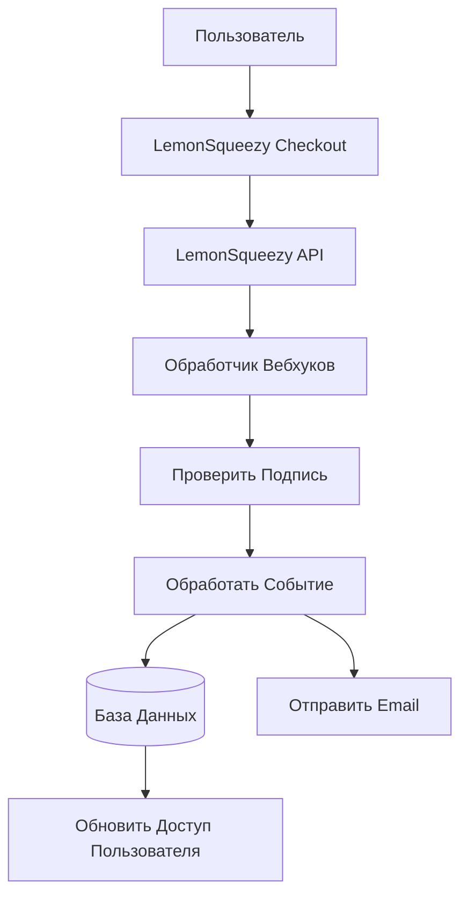

# Конфигурация LemonSqueezy

Это руководство объясняет, как настроить LemonSqueezy в качестве платёжного провайдера в приложении Ever Works.

## Обзор

LemonSqueezy — это платформа merchant of record, которая упрощает:

- 💰 Глобальные платежи с автоматическим соблюдением налоговых требований
- 🌍 Поддержку 135+ стран
- 📊 Встроенную защиту от мошенничества
- 🔄 Управление подписками
- 💳 Множество методов оплаты
- 📧 Автоматические email-квитанции

:::tip Почему LemonSqueezy?
LemonSqueezy действует как merchant of record, автоматически обрабатывая соответствие налоговым требованиям, НДС и налог с продаж. Это означает, что вам не нужно регистрироваться для уплаты налогов в разных странах.
:::

## Обязательные переменные окружения

Добавьте эти переменные в файл `.env.local`:

```env
# Конфигурация LemonSqueezy
LEMONSQUEEZY_API_KEY=your_api_key_here
LEMONSQUEEZY_WEBHOOK_SECRET=your_webhook_secret_here
LEMONSQUEEZY_STORE_ID=your_store_id_here

# ID продукта/варианта (опционально)
NEXT_PUBLIC_LEMONSQUEEZY_PRO_VARIANT_ID=variant_id_here
NEXT_PUBLIC_LEMONSQUEEZY_SPONSOR_VARIANT_ID=variant_id_here
```

## Настройка панели управления LemonSqueezy

### Шаг 1: Создайте магазин

1. Зарегистрируйтесь на [LemonSqueezy](https://lemonsqueezy.com)
2. Создайте новый магазин
3. Заполните настройки магазина (название, валюта и т.д.)
4. Скопируйте **ID магазина** из URL или настроек

### Шаг 2: Создайте продукты

1. Перейдите в **Продукты** → **Новый Продукт**
2. Создайте уровни ценообразования:

| Продукт | Цена | Тип | Описание |
|---------|------|-----|----------|
| **Pro план** | $10/мес | Подписка | Расширенные функции |
| **Спонсорский план** | $20 | Разовый | Премиум поддержка |

3. Для каждого продукта создайте **Варианты** с конкретными ценами
4. Скопируйте **ID варианта** для каждой ценовой опции

### Шаг 3: Получите API-ключ

1. Перейдите в **Настройки** → **API**
2. Создайте новый API-ключ
3. Скопируйте API-ключ (начинается с `ls_`)
4. Добавьте его в `.env.local` как `LEMONSQUEEZY_API_KEY`

### Шаг 4: Настройте вебхуки

1. Перейдите в **Настройки** → **Вебхуки**
2. Нажмите **Создать вебхук**
3. Настройте вебхук:
   - **URL**: `https://ваш-домен.com/api/lemonsqueezy/webhook`
   - **События**: Выберите все события подписки и заказа
   - **Секрет**: Сгенерируйте секретный ключ

4. Скопируйте **Секрет вебхука** и добавьте его в `.env.local`

#### Рекомендуемые события

Выберите эти события в конфигурации вебхука:

- ✅ `subscription_created` - Новая подписка
- ✅ `subscription_updated` - Изменения подписки
- ✅ `subscription_cancelled` - Отмена
- ✅ `subscription_payment_success` - Успешный платёж
- ✅ `subscription_payment_failed` - Неудачный платёж
- ✅ `subscription_trial_will_end` - Пробный период заканчивается
- ✅ `order_created` - Разовая покупка
- ✅ `order_refunded` - Обработан возврат

## Эндпоинт вебхука

Вебхук доступен по адресу: `/api/lemonsqueezy/webhook`

### Поддерживаемое сопоставление событий

| Событие LemonSqueezy | Внутреннее событие | Описание |
|---------------------|-------------------|----------|
| `subscription_created` | `SUBSCRIPTION_CREATED` | Создана новая подписка |
| `subscription_updated` | `SUBSCRIPTION_UPDATED` | Подписка обновлена |
| `subscription_cancelled` | `SUBSCRIPTION_CANCELLED` | Подписка отменена |
| `subscription_payment_success` | `SUBSCRIPTION_PAYMENT_SUCCEEDED` | Платёж успешен |
| `subscription_payment_failed` | `SUBSCRIPTION_PAYMENT_FAILED` | Платёж неудачен |
| `subscription_trial_will_end` | `SUBSCRIPTION_TRIAL_ENDING` | Пробный период скоро заканчивается |
| `order_created` | `PAYMENT_SUCCEEDED` | Разовый платёж |
| `order_refunded` | `REFUND_SUCCEEDED` | Обработан возврат |

## Реализация

### Архитектура платёжной системы



### Возможности

#### Безопасность

- ✅ Проверка подписи HMAC (SHA-256)
- ✅ Валидация секрета вебхука
- ✅ Комплексная обработка ошибок
- ✅ Журналирование запросов

#### Функциональность

- ✅ Управление жизненным циклом подписок
- ✅ Автоматическая обработка платежей
- ✅ Email-уведомления
- ✅ Синхронизация базы данных
- ✅ Мониторинг ошибок

## Пример использования

### Создать checkout

```typescript
import { LemonSqueezyProvider } from '@/lib/payment/providers/lemonsqueezy-provider';

const lsProvider = new LemonSqueezyProvider({
  apiKey: process.env.LEMONSQUEEZY_API_KEY!,
  storeId: process.env.LEMONSQUEEZY_STORE_ID!,
});

// Создать сессию checkout
const checkout = await lsProvider.createCheckout({
  variantId: 'variant_id_here',
  customerId: 'customer_id',
  redirectUrl: 'https://yoursite.com/success',
});

// Перенаправить пользователя на checkout.url
```

## Тестирование

### Тестовый режим

1. LemonSqueezy предоставляет тестовый режим для разработки
2. Используйте тестовые API-ключи (доступны в панели управления)
3. Тестируйте вебхуки с помощью инструмента тестирования вебхуков LemonSqueezy

### Локальное тестирование

```bash
# Используйте инструмент как ngrok для открытия локального сервера
ngrok http 3000

# Обновите URL вебхука в панели управления LemonSqueezy
https://your-ngrok-url.ngrok.io/api/lemonsqueezy/webhook
```

## Мониторинг

Все события вебхуков записываются в журнал:

- ✅ **Успех**: `✅ LemonSqueezy [event] handled successfully`
- ❌ **Ошибки**: `❌ Failed to handle [event]: [error details]`

Проверяйте журналы приложения для мониторинга активности вебхуков.

## Устранение неполадок

### Распространённые проблемы

**Проблема**: Ошибка "No signature provided"

- **Решение**: Убедитесь, что LemonSqueezy отправляет заголовок `x-signature`
- Проверьте конфигурацию вебхука в панели управления LemonSqueezy

**Проблема**: Ошибка "Invalid signature"

- **Решение**: Проверьте, что `LEMONSQUEEZY_WEBHOOK_SECRET` совпадает с секретом в LemonSqueezy
- Убедитесь, что URL вебхука правильно настроен

**Проблема**: Вебхук не получает события

- **Решение**: Убедитесь, что URL вебхука публично доступен
- Используйте ngrok для локального тестирования
- Проверьте журналы вебхуков LemonSqueezy

## Лучшие практики безопасности

1. **Только HTTPS**: Всегда используйте HTTPS для эндпоинтов вебхуков в продакшне
2. **Ротация секретов**: Регулярно ротируйте секреты вебхуков
3. **Мониторинг**: Мониторьте журналы вебхуков на предмет подозрительной активности
4. **Переменные окружения**: Никогда не коммитьте секреты в систему контроля версий
5. **Rate limiting**: Реализуйте rate limiting для продакшн-вебхуков
