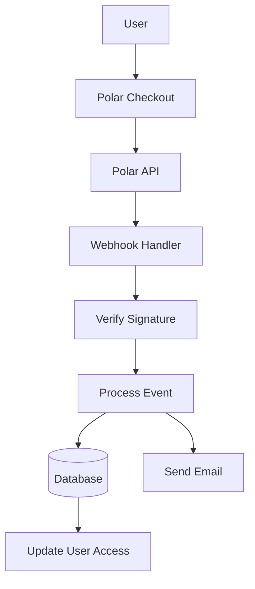

# Полярная конфигурация

В этом руководстве объясняется, как настроить Polar в качестве поставщика платежей в вашем приложении Ever Works.

## Обзор

Polar — это современная платежная платформа, предназначенная для разработчиков и авторов, которая предлагает:

- 💻 Удобный для разработчиков API и документация
- 🔄 Поддержка подписки и единоразового платежа
- 🐙 Интеграция GitHub для спонсорства
- 💰 Прозрачная структура ценообразования.
- 🔒 Безопасная обработка платежей
- 📊 Встроенная аналитика и отчетность

:::tip Почему Polar?
Polar создан специально для разработчиков и проектов с открытым исходным кодом и предлагает чистый API, отличную документацию и полную интеграцию с GitHub для спонсорства и монетизации.
:::

## Обязательные переменные среды

Добавьте эти переменные в ваш файл `.env.local` :

```env
# Polar Configuration
POLAR_API_KEY=your_polar_api_key_here
POLAR_WEBHOOK_SECRET=your_webhook_secret_here
POLAR_APP_URL=https://your-app-url.com

# Product IDs (optional)
NEXT_PUBLIC_POLAR_SUBSCRIPTION_PRODUCT_ID=product_id_here
NEXT_PUBLIC_POLAR_ONETIME_PRODUCT_ID=product_id_here
```

:::warning
Никогда не передавайте свои секретные ключи контролю версий. Сохраните `.env.local` в вашем `.gitignore` файле.
:::

## Настройка панели мониторинга Polar

### Шаг 1: Создайте свою учетную запись

1. Зарегистрируйтесь на сайте [Polar](https://polar.sh)
2. Завершите настройку учетной записи.
3. Подтвердите свой адрес электронной почты.

### Шаг 2. Создание продуктов

1. Перейдите в раздел **Продукты** → **Новый продукт**.
2. Создайте свои ценовые уровни:

| Продукт | Цена | Тип | Описание |
|---------|-------|------|-------------|
| **Про-план** | 10 долларов США в месяц | Подписка | Расширенные возможности |
| **Спонсорский план** | 20 долларов | Одноразовый | Премиум-поддержка |

3. Настройте параметры продукта:
   - Установить цены и цикл выставления счетов.
   - Добавить описания продуктов
   - Настройка уровней доступа
4. Скопируйте **Идентификатор продукта** для каждого продукта.

### Шаг 3. Получите ключ API

1. Откройте **Настройки** → **Ключи API**.
2. Создайте новый ключ API.
3. Скопируйте ключ API
4. Добавьте его в свой `.env.local` как `POLAR_API_KEY` .

:::tip
Polar предоставляет отдельные ключи для разработки и производства. Используйте тестовые ключи во время разработки.
:::

### Шаг 4. Настройте веб-перехватчики

1. Откройте **Настройки** → **Вебхуки**.
2. Нажмите **Создать вебхук**.
3. Настройте вебхук:
   - **URL**: `https://yourdomain.com/api/polar/webhook` - **События**: выберите все события оплаты и подписки.
   - **Секрет**: создать секретный ключ.

4. Скопируйте **секрет вебхука** и добавьте его в свой `.env.local` #### Рекомендуемые события

Выберите эти события в конфигурации веб-перехватчика:

- ✅ `payment.succeeded` - Успешная оплата
- ✅ `payment.failed` - Неудачная оплата
- ✅ `subscription.created` - Новая подписка
- ✅ `subscription.updated` - Изменения в подписке
- ✅ `subscription.cancelled` - Отмена
- ✅ `subscription.trial_will_end` - Окончание пробной версии
- ✅ `refund.created` - Возврат обработан

## Архитектура платежной системы



### Полярный провайдер

Провайдер Polar ( `lib/payment/lib/providers/polar-provider.ts` ) реализует:

- ✅ Управление клиентами
- ✅ Управление продуктами и ценами
- ✅ Жизненный цикл подписки
- ✅ Обработка платежей
- ✅ Обработка вебхуков
- ✅ Поддержка возврата средств

### API-маршруты

Доступны следующие маршруты API:

| Маршрут | Метод | Описание |
|-------|--------|-------------|
| `/api/polar/webhook` | ПОСТ | Управление веб-перехватчиками Polar |
| `/api/polar/subscription` | ПОСТ | Создать подписку |
| `/api/polar/subscription` | ПУТЬ | Обновить подписку |
| `/api/polar/subscription` | УДАЛИТЬ | Отменить подписку |
| `/api/polar/checkout` | ПОСТ | Создать сеанс оформления заказа |
| `/api/polar/payment` | ПОЛУЧИТЬ | Проверить статус платежа |

### Компоненты пользовательского интерфейса

В системе используются компоненты кассы Polar:

- `PolarCheckoutButton` – Компонент кнопки оформления заказа
- `PolarPaymentForm` - Форма оплаты с подтверждением
- Адаптивный дизайн для мобильных и настольных компьютеров.
- Поддержка нескольких способов оплаты

## Примеры использования

### Создать подписку

```typescript
import { PolarProvider } from '@/lib/payment/providers/polar-provider';

const configs = createProviderConfigs({
  apiKey: process.env.POLAR_API_KEY!,
  webhookSecret: process.env.POLAR_WEBHOOK_SECRET!,
  options: {
    appUrl: process.env.POLAR_APP_URL!
  }
});

const polarProvider = new PolarProvider(configs.polar);

const subscription = await polarProvider.createSubscription({
  customerId: 'customer_id',
  productId: 'product_id',
  paymentMethodId: 'payment_method_id',
  trialPeriodDays: 7
});
```

### Создайте сеанс оформления заказа

```typescript
const checkout = await polarProvider.createCheckout({
  productId: 'product_id_here',
  customerId: 'customer_id',
  successUrl: 'https://yoursite.com/success',
  cancelUrl: 'https://yoursite.com/cancel'
});

// Redirect user to checkout.url
```

### Используйте платежный компонент

```tsx
import { PolarCheckoutButton } from '@/lib/payment';

function PaymentPage() {
  return (
    <PolarCheckoutButton
      productId="product_id_here"
      amount={1000} // 10.00 USD in cents
      currency="usd"
      isSubscription={true}
      onSuccess={(paymentId) => {
        console.log('Payment succeeded:', paymentId);
        // Redirect to success page or update UI
      }}
      onError={(error) => {
        console.error('Payment error:', error);
        // Show error message to user
      }}
    />
  );
}
```

## Тестирование вашей интеграции

### Тестовый режим

1. **Используйте тестовые ключи API** (доступно на панели управления Polar).
2. **Используйте тестовые способы оплаты**:
   - Тестовые карты доступны на панели инструментов Polar.
   - Тестовый режим для всех потоков платежей

3. **Проверьте веб-перехватчики локально** с помощью такого инструмента, как ngrok:

   ``` баш
   нгрок http 3000
   ```

   Обновите URL-адрес веб-перехватчика в информационной панели Polar на URL-адрес ngrok.

### Тестирование вебхука

```bash
# Use ngrok to expose your local server
ngrok http 3000

# Update webhook URL in Polar dashboard
https://your-ngrok-url.ngrok.io/api/polar/webhook

# Trigger test events from Polar dashboard
```

## Обработка ошибок

Система автоматически обрабатывает распространенные ошибки:

| Тип ошибки | Обработка |
|------------|----------|
| Платеж отклонен | Удобное сообщение об ошибке |
| Проблемы с сетью | Логика автоматического повтора |
| Сбои вебхука | Зарегистрировано для проверки вручную |
| Ошибки проверки | Подсветка полей формы |
| Ошибки подписки | Очистить сообщения об ошибках |

## Лучшие практики безопасности

1. **Ключи API**:
   - Никогда не раскрывайте секретные ключи в клиентском коде.
   - Используйте переменные среды
   - Регулярно меняйте ключи

2. **Проверка вебхука**:
   - Всегда проверяйте подписи вебхуков.
   - Проверка данных о событии перед обработкой.
   - Используйте HTTPS для всех конечных точек веб-перехватчика.

3. **Платежные данные**:
   - Никогда не храните платежные реквизиты
   - Используйте безопасную обработку платежей Polar.
   - Внедрить правильную аутентификацию.

4. **Сеансы пользователя**:
   - Проверка аутентификации пользователя
   - Проверка разрешений пользователя
   - Регистрируйте все платежные действия

## Интеграция с GitHub

Polar предлагает бесшовную интеграцию с GitHub:

- **Спонсорство GitHub**: соедините Polar со спонсорами GitHub.
- **Доступ к хранилищу**: предоставление доступа на основе подписок.
- **Поддержка организации**: управление командными подписками.
- **Автоматический доступ**: автоматическое управление доступом.

### Настройка интеграции с GitHub

1. Откройте **Настройки** → **Интеграция** → **GitHub**.
2. Подключите свою учетную запись GitHub.
3. Настройте правила доступа к хранилищу.
4. Настройте автоматическое управление доступом.

## Зависимости

Необходимые пакеты (уже включены в Ever Works):

```json
{
  "@polar-sh/sdk": "^1.0.0"
}
```

## Устранение неполадок

### Распространенные проблемы

**Проблема**: Webhook не получает события.

- **Решение**: убедитесь, что URL-адрес веб-перехватчика общедоступен.
- Используйте ngrok для локального тестирования.
- Убедитесь, что секрет веб-перехватчика указан правильно.

**Проблема**: платеж не проходит автоматически

- **Решение**: проверьте консоль браузера на наличие ошибок.
- Убедитесь, что ключи API верны.
- Проверьте журналы панели управления Polar.

**Проблема**: подписка не обновляется.

- **Решение**. Убедитесь, что события веб-перехватчика настроены.
- Проверьте журналы обработчиков веб-перехватчиков.
- Убедитесь, что обновления базы данных работают.

**Проблема**: интеграция с GitHub не работает.

- **Решение**: проверьте подключение GitHub на панели управления Polar.
- Проверьте настройки доступа к хранилищу.
- Убедитесь, что предоставлены соответствующие разрешения.

## Сравнение: Polar и другие провайдеры

| Особенность | Полярный | Полоса | ЛимонныйСкуизи |
|---------|-------|--------|--------------|
| **В центре внимания разработчиков** | ✅ Отлично | ⚠️ Хорошо | ⚠️ Хорошо |
| **Интеграция с GitHub** | ✅ Родной | ❌ Нет | ❌ Нет |
| **Открытый исходный код** | ✅ Да | ⚠️ Ограниченная | ⚠️ Ограниченная |
| **Сложность настройки** | ✅ Простой | ⚠️ Умеренный | ✅ Простой |
| **Качество API** | ✅ Отлично | ✅ Отлично | ⚠️ Хорошо |
| **Налоговое соблюдение** | ⚠️ Руководство | ⚠️ Руководство | ✅ Автомат |
| **Лучше всего** | Разработчики, ОСС | Большой объем | Глобальные продажи |

## Следующие шаги

- [Конфигурация полосы](./stripe) - Альтернативный поставщик платежей
- [Конфигурация LemonSqueezy](./lemonsqueezy) - Альтернативный поставщик платежей
- [Обзор платежей](/pay) – Сравнение поставщиков платежных услуг
- [Переменные среды](/deployment/environment-variables) - Полная настройка среды.
- [Deployment](/deployment) – развертывание платежной интеграции.

## Ресурсы

- [Полярная документация](https://docs.polar.sh/)
- [Справочник по API](https://docs.polar.sh/api)
- [Руководство по веб-перехватчикам](https://docs.polar.sh/webhooks)
- [Интеграция GitHub](https://docs.polar.sh/integrations/github)

## Поддержка

Нужна помощь с интеграцией Polar? Посетите нашу [страницу поддержки](/advanced-guide/support) или присоединитесь к нашему сообществу.
